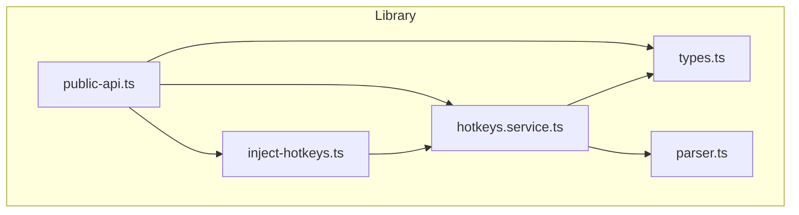
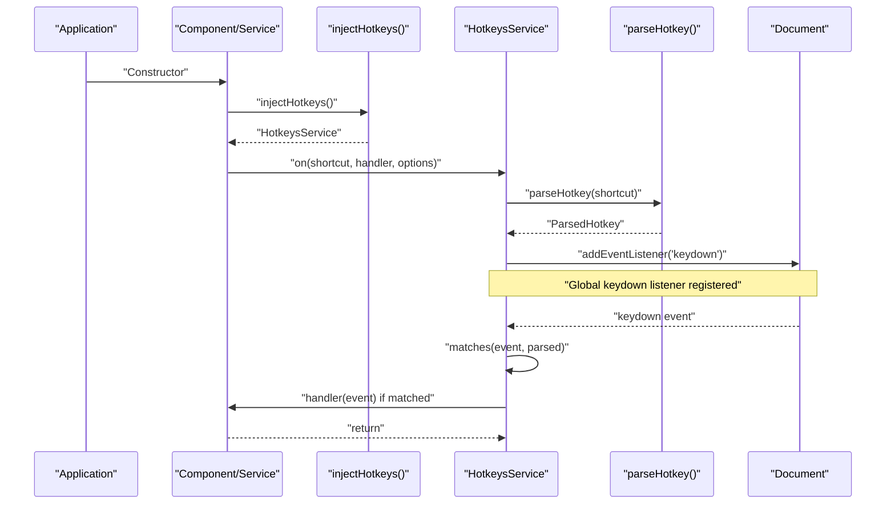
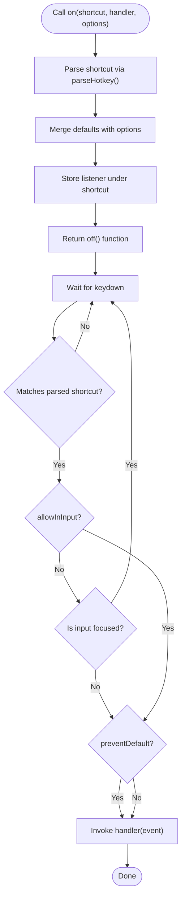
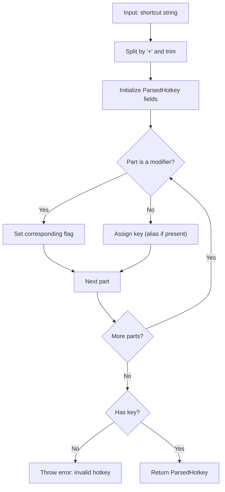
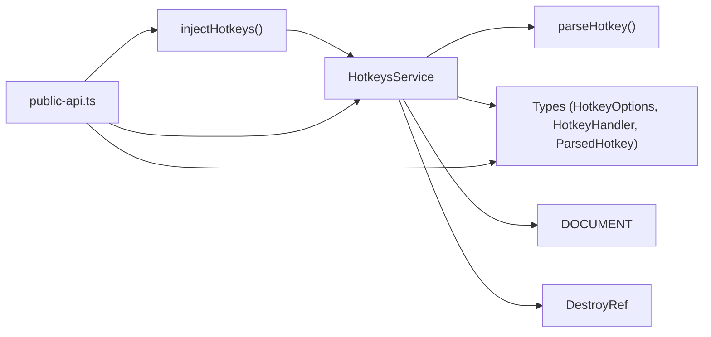

# API Reference

<cite>
**Referenced Files in This Document**
- [public-api.ts](file://projects/ngx-hotkeys/src/lib/public-api.ts)
- [inject-hotkeys.ts](file://projects/ngx-hotkeys/src/lib/inject-hotkeys.ts)
- [hotkeys.service.ts](file://projects/ngx-hotkeys/src/lib/hotkeys.service.ts)
- [types.ts](file://projects/ngx-hotkeys/src/lib/types.ts)
- [parser.ts](file://projects/ngx-hotkeys/src/lib/parser.ts)
- [app.component.ts](file://projects/demo-app/src/app/app.component.ts)
- [app.config.ts](file://projects/demo-app/src/app/app.config.ts)
- [EXAMPLE.md](file://EXAMPLE.md)
- [README.md](file://README.md)
- [package.json](file://projects/ngx-hotkeys/package.json)
</cite>

## Table of Contents
1. [Introduction](#introduction)
2. [Project Structure](#project-structure)
3. [Core Components](#core-components)
4. [Architecture Overview](#architecture-overview)
5. [Detailed Component Analysis](#detailed-component-analysis)
6. [Dependency Analysis](#dependency-analysis)
7. [Performance Considerations](#performance-considerations)
8. [Troubleshooting Guide](#troubleshooting-guide)
9. [Conclusion](#conclusion)
10. [Appendices](#appendices)

## Introduction
This document provides a comprehensive API reference for ngx-hotkeys, focusing on the public interfaces exposed by the library. It covers:
- The injectHotkeys() function and its return type
- The HotkeysService.on() method, including parameters, return values, behavior, and cleanup
- The HotkeyOptions interface and its configuration properties
- Complete type definitions for HotkeyHandler and other public types
- Extensive usage patterns and examples
- Parameter validation, error handling, and edge cases

The goal is to enable developers to integrate keyboard shortcuts into Angular applications with minimal boilerplate while understanding lifecycle, cleanup, and cross-platform behavior.

## Project Structure
The library exposes a small set of public APIs:
- A factory function injectHotkeys() that returns a HotkeysService instance
- The HotkeysService class with an on() method for registering hotkeys
- Public types: HotkeyOptions, HotkeyHandler, and ParsedHotkey
- A parser utility that validates and parses shortcut strings

**Diagram sources**
- [public-api.ts:1-4](file://projects/ngx-hotkeys/src/lib/public-api.ts#L1-L4)
- [inject-hotkeys.ts:1-7](file://projects/ngx-hotkeys/src/lib/inject-hotkeys.ts#L1-L7)
- [hotkeys.service.ts:1-114](file://projects/ngx-hotkeys/src/lib/hotkeys.service.ts#L1-L114)
- [types.ts:1-16](file://projects/ngx-hotkeys/src/lib/types.ts#L1-L16)
- [parser.ts:1-46](file://projects/ngx-hotkeys/src/lib/parser.ts#L1-L46)

**Section sources**
- [public-api.ts:1-4](file://projects/ngx-hotkeys/src/lib/public-api.ts#L1-L4)
- [package.json:1-31](file://projects/ngx-hotkeys/package.json#L1-L31)

## Core Components
This section documents the primary public APIs and their types.

- injectHotkeys()
  - Purpose: Provides a convenience function to obtain a HotkeysService instance within an Angular injection context.
  - Return type: HotkeysService
  - Typical usage: Call in a component constructor, service constructor, or within a function that runs in an injection context.

- HotkeysService.on(shortcut, handler, options?)
  - Purpose: Registers a keyboard shortcut listener.
  - Parameters:
    - shortcut: string — A parsed shortcut string (see Supported shortcuts below)
    - handler: HotkeyHandler — Callback invoked when the shortcut matches
    - options?: HotkeyOptions — Optional configuration
  - Returns: () => void — An off function to unregister the listener manually
  - Behavior:
    - Listeners are stored per shortcut and evaluated on keydown events
    - On component/service destroy, listeners are automatically cleaned up via Angular’s DestroyRef

- HotkeyOptions
  - preventDefault?: boolean — When true, calls event.preventDefault() before invoking the handler
  - allowInInput?: boolean — When true, triggers even when focus is in an input/textarea/select/contenteditable element

- HotkeyHandler
  - Type: (event: KeyboardEvent) => void — Receives the raw KeyboardEvent

- ParsedHotkey
  - key: string — The normalized key name
  - ctrl: boolean — True if Ctrl was specified
  - meta: boolean — True if Meta was specified
  - shift: boolean — True if Shift was specified
  - alt: boolean — True if Alt was specified
  - mod: boolean — True if the platform-dependent modifier was specified

Supported shortcuts (examples):
- mod+k, mod+s, esc, enter, shift+enter, alt+1, arrowup, arrowdown, arrowleft, arrowright
- mod maps to meta on macOS and ctrl on Windows/Linux

**Section sources**
- [inject-hotkeys.ts:4-6](file://projects/ngx-hotkeys/src/lib/inject-hotkeys.ts#L4-L6)
- [hotkeys.service.ts:36-60](file://projects/ngx-hotkeys/src/lib/hotkeys.service.ts#L36-L60)
- [types.ts:1-16](file://projects/ngx-hotkeys/src/lib/types.ts#L1-L16)
- [README.md:58-101](file://README.md#L58-L101)

## Architecture Overview
The library integrates with Angular’s DI and lifecycle hooks to manage global keydown events and shortcut matching.

**Diagram sources**
- [inject-hotkeys.ts:4-6](file://projects/ngx-hotkeys/src/lib/inject-hotkeys.ts#L4-L6)
- [hotkeys.service.ts:26-34](file://projects/ngx-hotkeys/src/lib/hotkeys.service.ts#L26-L34)
- [hotkeys.service.ts:36-60](file://projects/ngx-hotkeys/src/lib/hotkeys.service.ts#L36-L60)
- [parser.ts:12-45](file://projects/ngx-hotkeys/src/lib/parser.ts#L12-L45)

## Detailed Component Analysis

### injectHotkeys()
- Purpose: A thin wrapper around Angular’s inject() to obtain a HotkeysService instance.
- Return type: HotkeysService
- Usage patterns:
  - In a component constructor
  - In a service constructor
  - Within a function that runs in an injection context
- Notes:
  - Must be called within an Angular injection context
  - Returned instance is a singleton managed by Angular’s DI

**Section sources**
- [inject-hotkeys.ts:4-6](file://projects/ngx-hotkeys/src/lib/inject-hotkeys.ts#L4-L6)
- [README.md:60-62](file://README.md#L60-L62)

### HotkeysService.on()
- Parameters:
  - shortcut: string — A shortcut string parsed by parseHotkey()
  - handler: HotkeyHandler — Function invoked on match
  - options?: HotkeyOptions — Optional configuration
- Returns:
  - A cleanup function of type () => void
- Behavior:
  - Parses the shortcut and merges defaults
  - Stores the listener under the shortcut key
  - Evaluates all listeners on keydown
  - Skips input elements unless allowInInput is true
  - Optionally prevents default behavior via preventDefault
  - Automatically cleans up on component/service destroy via DestroyRef
- Cleanup:
  - Calling the returned off() function removes the listener immediately
  - Alternatively, rely on automatic cleanup on destroy

**Diagram sources**
- [hotkeys.service.ts:36-60](file://projects/ngx-hotkeys/src/lib/hotkeys.service.ts#L36-L60)
- [hotkeys.service.ts:62-76](file://projects/ngx-hotkeys/src/lib/hotkeys.service.ts#L62-L76)
- [hotkeys.service.ts:100-112](file://projects/ngx-hotkeys/src/lib/hotkeys.service.ts#L100-L112)

**Section sources**
- [hotkeys.service.ts:36-60](file://projects/ngx-hotkeys/src/lib/hotkeys.service.ts#L36-L60)
- [hotkeys.service.ts:62-76](file://projects/ngx-hotkeys/src/lib/hotkeys.service.ts#L62-L76)
- [hotkeys.service.ts:100-112](file://projects/ngx-hotkeys/src/lib/hotkeys.service.ts#L100-L112)
- [README.md:45-54](file://README.md#L45-L54)

### HotkeyOptions
- preventDefault?: boolean
  - Effect: Calls event.preventDefault() before invoking the handler
  - Use case: Override browser defaults (e.g., prevent saving dialog on mod+s)
- allowInInput?: boolean
  - Effect: Allows triggering even when focus is in an input/textarea/select/contenteditable
  - Use case: Global shortcuts that should work in forms

**Section sources**
- [types.ts:1-4](file://projects/ngx-hotkeys/src/lib/types.ts#L1-L4)
- [README.md:74-81](file://README.md#L74-L81)

### HotkeyHandler and ParsedHotkey
- HotkeyHandler
  - Signature: (event: KeyboardEvent) => void
  - Usage: Receives the KeyboardEvent for advanced handling (e.g., inspecting modifiers)
- ParsedHotkey
  - Fields: key, ctrl, meta, shift, alt, mod
  - Purpose: Internal representation of a parsed shortcut

**Section sources**
- [types.ts:6](file://projects/ngx-hotkeys/src/lib/types.ts#L6)
- [types.ts:8-15](file://projects/ngx-hotkeys/src/lib/types.ts#L8-L15)

### parseHotkey() and Validation
- Purpose: Validates and parses a shortcut string into a ParsedHotkey
- Validation:
  - Throws an error if no key is present in the shortcut
  - Aliases supported: esc -> escape, space -> single space, arrow keys mapped to arrowup/down/left/right
- Platform behavior:
  - mod resolves to meta on macOS and ctrl on Windows/Linux

**Diagram sources**
- [parser.ts:12-45](file://projects/ngx-hotkeys/src/lib/parser.ts#L12-L45)

**Section sources**
- [parser.ts:12-45](file://projects/ngx-hotkeys/src/lib/parser.ts#L12-L45)
- [README.md:85-101](file://README.md#L85-L101)

## Dependency Analysis
The library maintains low coupling and clear boundaries:
- HotkeysService depends on:
  - Angular core primitives (inject, PLATFORM_ID, DestroyRef)
  - DOM via DOCUMENT
  - Parser utility for shortcut parsing
  - Types module for shared interfaces and types
- Public exports are centralized in public-api.ts

**Diagram sources**
- [hotkeys.service.ts:1-114](file://projects/ngx-hotkeys/src/lib/hotkeys.service.ts#L1-L114)
- [inject-hotkeys.ts:1-7](file://projects/ngx-hotkeys/src/lib/inject-hotkeys.ts#L1-L7)
- [public-api.ts:1-4](file://projects/ngx-hotkeys/src/lib/public-api.ts#L1-L4)
- [types.ts:1-16](file://projects/ngx-hotkeys/src/lib/types.ts#L1-L16)
- [parser.ts:1-46](file://projects/ngx-hotkeys/src/lib/parser.ts#L1-L46)

**Section sources**
- [public-api.ts:1-4](file://projects/ngx-hotkeys/src/lib/public-api.ts#L1-L4)
- [hotkeys.service.ts:1-114](file://projects/ngx-hotkeys/src/lib/hotkeys.service.ts#L1-L114)

## Performance Considerations
- Event handling:
  - A single global keydown listener is attached on the document
  - Listeners are stored per shortcut string for efficient lookup
- Matching:
  - Early exit on mismatched keys
  - Platform-aware modifier resolution avoids unnecessary checks
- Memory:
  - Automatic cleanup via DestroyRef prevents memory leaks
  - Manual cleanup via returned off() function is O(1) removal

[No sources needed since this section provides general guidance]

## Troubleshooting Guide
Common issues and resolutions:
- Invalid shortcut syntax
  - Symptom: Error thrown indicating no key found
  - Cause: Shortcut string missing a key (e.g., only modifiers)
  - Resolution: Ensure the shortcut includes a valid key
  - Reference: [parser.ts:40-42](file://projects/ngx-hotkeys/src/lib/parser.ts#L40-L42)
- Shortcut not firing in inputs
  - Symptom: Handler does not run when typing
  - Cause: Default behavior blocks input focus
  - Resolution: Set allowInInput: true in options
  - Reference: [hotkeys.service.ts:62-76](file://projects/ngx-hotkeys/src/lib/hotkeys.service.ts#L62-L76)
- Browser default actions still occur
  - Symptom: Browser save dialog appears on mod+s
  - Cause: preventDefault not enabled
  - Resolution: Pass { preventDefault: true } in options
  - Reference: [hotkeys.service.ts:69-71](file://projects/ngx-hotkeys/src/lib/hotkeys.service.ts#L69-L71)
- Listener persists after component destroy
  - Symptom: Unexpected behavior after navigation
  - Cause: Manual cleanup not performed
  - Resolution: Call the returned off() function or rely on automatic cleanup
  - Reference: [hotkeys.service.ts:58-59](file://projects/ngx-hotkeys/src/lib/hotkeys.service.ts#L58-L59), [README.md:52-54](file://README.md#L52-L54)

**Section sources**
- [parser.ts:40-42](file://projects/ngx-hotkeys/src/lib/parser.ts#L40-L42)
- [hotkeys.service.ts:62-76](file://projects/ngx-hotkeys/src/lib/hotkeys.service.ts#L62-L76)
- [hotkeys.service.ts:69-71](file://projects/ngx-hotkeys/src/lib/hotkeys.service.ts#L69-L71)
- [hotkeys.service.ts:58-59](file://projects/ngx-hotkeys/src/lib/hotkeys.service.ts#L58-L59)
- [README.md:52-54](file://README.md#L52-L54)

## Conclusion
ngx-hotkeys offers a minimal, Angular-native solution for keyboard shortcuts:
- Use injectHotkeys() to obtain a HotkeysService instance
- Register shortcuts with HotkeysService.on(), leveraging HotkeyOptions for behavior control
- Rely on automatic cleanup or call the returned off() function for manual cleanup
- Benefit from robust parsing, platform-aware modifiers, and safe defaults

[No sources needed since this section summarizes without analyzing specific files]

## Appendices

### API Definitions and Examples

- injectHotkeys()
  - Definition: Function returning HotkeysService
  - Usage patterns:
    - Component constructor: [app.component.ts:12](file://projects/demo-app/src/app/app.component.ts#L12)
    - Service constructor: [EXAMPLE.md:52-53](file://EXAMPLE.md#L52-L53)
  - Notes: Must be called in an injection context

- HotkeysService.on(shortcut, handler, options?)
  - Parameters:
    - shortcut: string — e.g., 'mod+k', 'esc', 'shift+enter'
    - handler: HotkeyHandler — receives KeyboardEvent
    - options?: HotkeyOptions — optional configuration
  - Returns: () => void — off function for manual cleanup
  - Examples:
    - Basic registration: [app.component.ts:19-22](file://projects/demo-app/src/app/app.component.ts#L19-L22)
    - With preventDefault: [app.component.ts:38-40](file://projects/demo-app/src/app/app.component.ts#L38-L40)
    - Global shortcuts in inputs: [EXAMPLE.md:75](file://EXAMPLE.md#L75)
    - Manual cleanup: [README.md:47-49](file://README.md#L47-L49)
  - Behavior:
    - Automatic cleanup on destroy: [hotkeys.service.ts:30-33](file://projects/ngx-hotkeys/src/lib/hotkeys.service.ts#L30-L33)
    - Input focus handling: [hotkeys.service.ts:66-68](file://projects/ngx-hotkeys/src/lib/hotkeys.service.ts#L66-L68)

- HotkeyOptions
  - Properties:
    - preventDefault?: boolean — call event.preventDefault()
    - allowInInput?: boolean — trigger in inputs
  - Examples:
    - Prevent default: [app.component.ts:40](file://projects/demo-app/src/app/app.component.ts#L40)
    - Allow in inputs: [EXAMPLE.md:75](file://EXAMPLE.md#L75)

- HotkeyHandler
  - Type: (event: KeyboardEvent) => void
  - Usage: Access KeyboardEvent for advanced logic

- ParsedHotkey
  - Fields: key, ctrl, meta, shift, alt, mod
  - Reference: [types.ts:8-15](file://projects/ngx-hotkeys/src/lib/types.ts#L8-L15)

- Supported shortcuts
  - Examples: mod+k, mod+s, esc, enter, shift+enter, alt+1, arrowup, arrowdown, arrowleft, arrowright
  - Platform note: mod maps to meta on macOS and ctrl on Windows/Linux
  - Reference: [README.md:85-101](file://README.md#L85-L101)

**Section sources**
- [app.component.ts:12](file://projects/demo-app/src/app/app.component.ts#L12)
- [app.component.ts:19-22](file://projects/demo-app/src/app/app.component.ts#L19-L22)
- [app.component.ts:38-40](file://projects/demo-app/src/app/app.component.ts#L38-L40)
- [EXAMPLE.md:75](file://EXAMPLE.md#L75)
- [README.md:47-49](file://README.md#L47-L49)
- [hotkeys.service.ts:30-33](file://projects/ngx-hotkeys/src/lib/hotkeys.service.ts#L30-L33)
- [hotkeys.service.ts:66-68](file://projects/ngx-hotkeys/src/lib/hotkeys.service.ts#L66-L68)
- [types.ts:8-15](file://projects/ngx-hotkeys/src/lib/types.ts#L8-L15)
- [README.md:85-101](file://README.md#L85-L101)