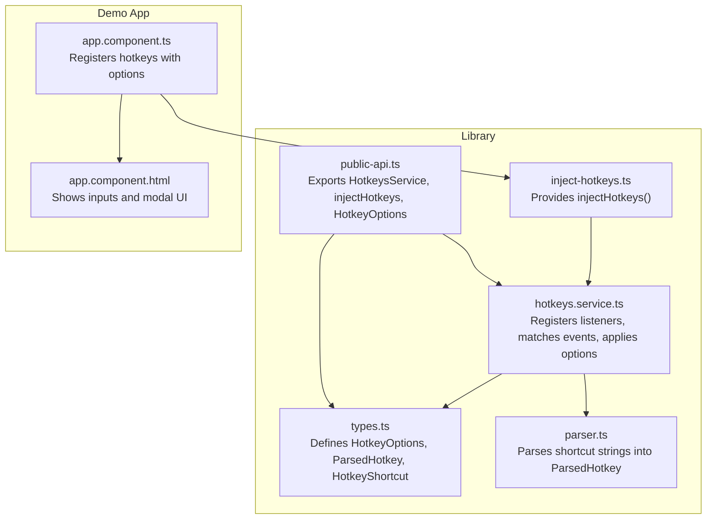
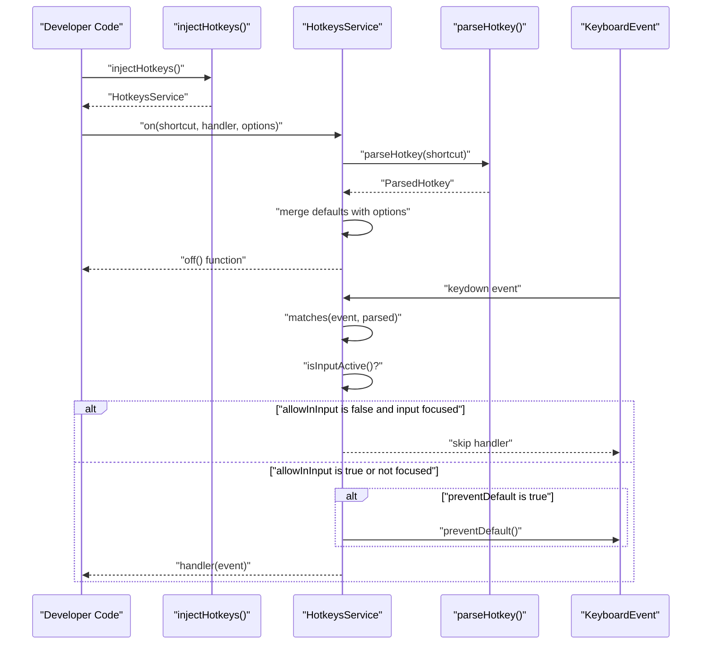
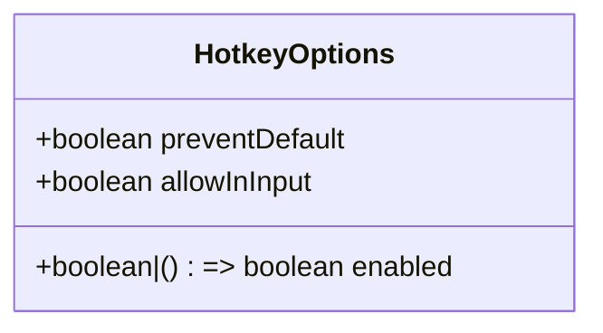
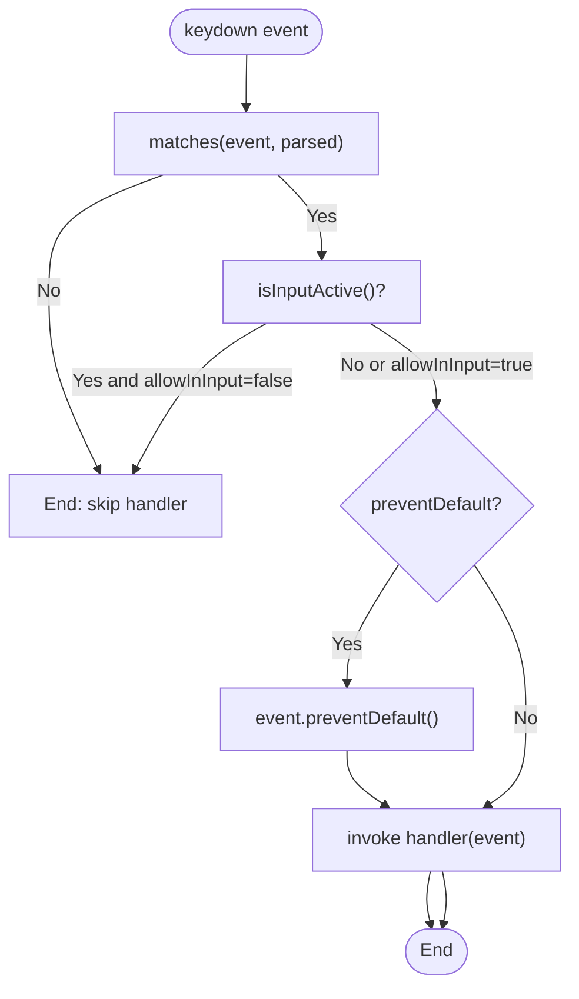
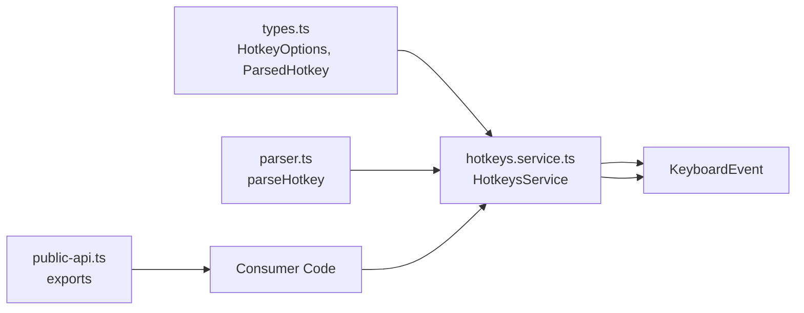

# Configuration Options

<cite>
**Referenced Files in This Document**
- [types.ts](file://projects/ngx-hotkeys/src/lib/types.ts)
- [hotkeys.service.ts](file://projects/ngx-hotkeys/src/lib/hotkeys.service.ts)
- [parser.ts](file://projects/ngx-hotkeys/src/lib/parser.ts)
- [inject-hotkeys.ts](file://projects/ngx-hotkeys/src/lib/inject-hotkeys.ts)
- [public-api.ts](file://projects/ngx-hotkeys/src/lib/public-api.ts)
- [README.md](file://README.md)
- [EXAMPLE.md](file://EXAMPLE.md)
- [app.component.ts](file://projects/demo-app/src/app/app.component.ts)
- [app.component.html](file://projects/demo-app/src/app/app.component.html)
</cite>

## Table of Contents
1. [Introduction](#introduction)
2. [Project Structure](#project-structure)
3. [Core Components](#core-components)
4. [Architecture Overview](#architecture-overview)
5. [Detailed Component Analysis](#detailed-component-analysis)
6. [Dependency Analysis](#dependency-analysis)
7. [Performance Considerations](#performance-considerations)
8. [Troubleshooting Guide](#troubleshooting-guide)
9. [Conclusion](#conclusion)

## Introduction
This document explains the HotkeyOptions interface and all configuration properties for the ngx-hotkeys library. It focuses on how to configure shortcut behavior using allowInInput and preventDefault, along with the default values and their effects. Practical examples illustrate different configuration combinations and their resulting behaviors, including how shortcuts interact with form inputs, textareas, and contenteditable elements. Guidance is provided for choosing the right options in common scenarios, plus troubleshooting tips and best practices for optimal user experience.

## Project Structure
The configuration logic centers around a small set of core files:
- HotkeyOptions interface and related types
- HotkeysService that registers and dispatches shortcuts
- Parser that interprets shortcut strings into structured keys and modifiers
- Public API exports for consumers
- Demo app showcasing usage and behavior

**Diagram sources**
- [types.ts:1-19](file://projects/ngx-hotkeys/src/lib/types.ts#L1-L19)
- [hotkeys.service.ts:1-114](file://projects/ngx-hotkeys/src/lib/hotkeys.service.ts#L1-L114)
- [parser.ts:1-46](file://projects/ngx-hotkeys/src/lib/parser.ts#L1-L46)
- [inject-hotkeys.ts:1-7](file://projects/ngx-hotkeys/src/lib/inject-hotkeys.ts#L1-L7)
- [public-api.ts:1-4](file://projects/ngx-hotkeys/src/lib/public-api.ts#L1-L4)
- [app.component.ts:1-43](file://projects/demo-app/src/app/app.component.ts#L1-L43)
- [app.component.html:1-36](file://projects/demo-app/src/app/app.component.html#L1-L36)

**Section sources**
- [types.ts:1-19](file://projects/ngx-hotkeys/src/lib/types.ts#L1-L19)
- [hotkeys.service.ts:1-114](file://projects/ngx-hotkeys/src/lib/hotkeys.service.ts#L1-L114)
- [parser.ts:1-46](file://projects/ngx-hotkeys/src/lib/parser.ts#L1-L46)
- [inject-hotkeys.ts:1-7](file://projects/ngx-hotkeys/src/lib/inject-hotkeys.ts#L1-L7)
- [public-api.ts:1-4](file://projects/ngx-hotkeys/src/lib/public-api.ts#L1-L4)
- [README.md:74-81](file://README.md#L74-L81)
- [EXAMPLE.md:72-77](file://EXAMPLE.md#L72-L77)

## Core Components
This section documents the HotkeyOptions interface and its properties, default values, and behavior.

- HotkeyOptions
  - preventDefault?: boolean
    - Purpose: When true, the service calls event.preventDefault() before invoking the handler. This prevents the browser’s default behavior for the key combination (for example, preventing the browser save dialog on mod+s).
    - Default: false
    - Effect: If false, the browser default behavior proceeds (for example, the save dialog may appear on mod+s). If true, the default behavior is suppressed.
    - Example usage: See [app.component.ts:38-40](file://projects/demo-app/src/app/app.component.ts#L38-L40) and [EXAMPLE.md:33-36](file://EXAMPLE.md#L33-L36).
  - allowInInput?: boolean
    - Purpose: When true, the shortcut triggers even while focus is in an input, textarea, select, or a contenteditable element. When false, shortcuts are ignored while typing in inputs.
    - Default: false
    - Effect: If false, the shortcut is skipped when an input-like element is focused. If true, the shortcut fires regardless of input focus.
    - Example usage: See [EXAMPLE.md:75](file://EXAMPLE.md#L75).
  - enabled?: boolean | (() => boolean)
    - Purpose: Controls whether a listener is active. Can be a boolean flag or a function returning a boolean. If false or returns false, the listener does not fire.
    - Default: Not defined in HotkeyOptions; handled by the service during registration.
    - Effect: Allows dynamic enabling/disabling of shortcuts based on runtime conditions.
    - Implementation note: The service merges defaults and options, so enabled is not part of the default options object. Consumers can pass it to control activation.

Behavior summary:
- Defaults are applied when options are omitted. The service merges provided options with defaults, ensuring predictable behavior.
- The service checks allowInInput against the currently focused element. If allowInInput is false and the active element is an input-like element, the shortcut is ignored.
- If preventDefault is true, event.preventDefault() is called before invoking the handler.

Practical examples:
- Prevent default behavior: [app.component.ts:38-40](file://projects/demo-app/src/app/app.component.ts#L38-L40), [EXAMPLE.md:33-36](file://EXAMPLE.md#L33-L36)
- Allow shortcuts in inputs: [EXAMPLE.md:75](file://EXAMPLE.md#L75)
- Ignore shortcuts in inputs (default): [app.component.html:20-24](file://projects/demo-app/src/app/app.component.html#L20-L24)

**Section sources**
- [types.ts:1-5](file://projects/ngx-hotkeys/src/lib/types.ts#L1-L5)
- [hotkeys.service.ts:13-16](file://projects/ngx-hotkeys/src/lib/hotkeys.service.ts#L13-L16)
- [hotkeys.service.ts:36-40](file://projects/ngx-hotkeys/src/lib/hotkeys.service.ts#L36-L40)
- [hotkeys.service.ts:62-76](file://projects/ngx-hotkeys/src/lib/hotkeys.service.ts#L62-L76)
- [hotkeys.service.ts:100-112](file://projects/ngx-hotkeys/src/lib/hotkeys.service.ts#L100-L112)
- [README.md:74-81](file://README.md#L74-L81)
- [EXAMPLE.md:33-36](file://EXAMPLE.md#L33-L36)
- [EXAMPLE.md:75](file://EXAMPLE.md#L75)

## Architecture Overview
The configuration flow begins when a consumer registers a shortcut with optional options. The service parses the shortcut, merges options with defaults, and stores the listener. On keydown events, the service evaluates whether to invoke the handler based on the current input focus and the preventDefault setting.

**Diagram sources**
- [inject-hotkeys.ts:1-7](file://projects/ngx-hotkeys/src/lib/inject-hotkeys.ts#L1-L7)
- [hotkeys.service.ts:18-34](file://projects/ngx-hotkeys/src/lib/hotkeys.service.ts#L18-L34)
- [hotkeys.service.ts:36-60](file://projects/ngx-hotkeys/src/lib/hotkeys.service.ts#L36-L60)
- [parser.ts:12-45](file://projects/ngx-hotkeys/src/lib/parser.ts#L12-L45)
- [hotkeys.service.ts:62-76](file://projects/ngx-hotkeys/src/lib/hotkeys.service.ts#L62-L76)
- [hotkeys.service.ts:100-112](file://projects/ngx-hotkeys/src/lib/hotkeys.service.ts#L100-L112)

## Detailed Component Analysis

### HotkeyOptions Interface
The HotkeyOptions interface defines the configuration surface for each shortcut listener.

- preventDefault
  - Controls whether event.preventDefault() is called before invoking the handler.
  - Default: false
  - Typical use: Suppress browser actions like saving or page navigation.
- allowInInput
  - Controls whether shortcuts fire while typing in inputs, textareas, selects, or contenteditable elements.
  - Default: false
  - Typical use: Allow global shortcuts even when editing text.
- enabled
  - Optional control for activation/deactivation of a listener.
  - Default: Not part of defaults; handled by the service during registration.

**Diagram sources**
- [types.ts:1-5](file://projects/ngx-hotkeys/src/lib/types.ts#L1-L5)

**Section sources**
- [types.ts:1-5](file://projects/ngx-hotkeys/src/lib/types.ts#L1-L5)
- [README.md:74-81](file://README.md#L74-L81)

### HotkeysService Behavior and Defaults
The service manages listeners and applies configuration at runtime.

- Default options
  - preventDefault: false
  - allowInInput: false
- Registration
  - Merges provided options with defaults to produce Required<HotkeyOptions>.
  - Stores listeners keyed by shortcut string.
- Event handling
  - Matches event against parsed shortcut.
  - Skips handlers when allowInInput is false and an input-like element is focused.
  - Calls event.preventDefault() when preventDefault is true.
  - Invokes the handler otherwise.

**Diagram sources**
- [hotkeys.service.ts:62-76](file://projects/ngx-hotkeys/src/lib/hotkeys.service.ts#L62-L76)
- [hotkeys.service.ts:100-112](file://projects/ngx-hotkeys/src/lib/hotkeys.service.ts#L100-L112)

**Section sources**
- [hotkeys.service.ts:13-16](file://projects/ngx-hotkeys/src/lib/hotkeys.service.ts#L13-L16)
- [hotkeys.service.ts:36-40](file://projects/ngx-hotkeys/src/lib/hotkeys.service.ts#L36-L40)
- [hotkeys.service.ts:62-76](file://projects/ngx-hotkeys/src/lib/hotkeys.service.ts#L62-L76)
- [hotkeys.service.ts:100-112](file://projects/ngx-hotkeys/src/lib/hotkeys.service.ts#L100-L112)

### Input Field Control
The service determines whether a shortcut should be ignored based on the currently focused element.

- Elements considered inputs:
  - input, textarea, select
  - contenteditable elements (when attribute equals "true")
- Behavior:
  - If allowInInput is false and the active element is an input-like element, the shortcut is ignored.
  - If allowInInput is true, shortcuts fire even when inputs are focused.

Practical example:
- Demo app shows an input field; pressing j while focused does not increment the counter by default. See [app.component.html:20-24](file://projects/demo-app/src/app/app.component.html#L20-L24).

**Section sources**
- [hotkeys.service.ts:100-112](file://projects/ngx-hotkeys/src/lib/hotkeys.service.ts#L100-L112)
- [app.component.html:20-24](file://projects/demo-app/src/app/app.component.html#L20-L24)

### Event Prevention and Browser Default Behavior
When preventDefault is true, the service calls event.preventDefault() before invoking the handler. This suppresses the browser’s default action for the key combination.

Examples:
- Preventing the browser save dialog on mod+s: [app.component.ts:38-40](file://projects/demo-app/src/app/app.component.ts#L38-L40), [EXAMPLE.md:33-36](file://EXAMPLE.md#L33-L36)

**Section sources**
- [hotkeys.service.ts:69-71](file://projects/ngx-hotkeys/src/lib/hotkeys.service.ts#L69-L71)
- [app.component.ts:38-40](file://projects/demo-app/src/app/app.component.ts#L38-L40)
- [EXAMPLE.md:33-36](file://EXAMPLE.md#L33-L36)

### Configuration Combinations and Behaviors
Below are representative combinations and their outcomes. These describe expected behavior based on the service logic and defaults.

- Default behavior (no options)
  - allowInInput: false
  - preventDefault: false
  - Outcome: Shortcuts are ignored while typing in inputs; browser default behavior proceeds.
  - Reference: [hotkeys.service.ts:13-16](file://projects/ngx-hotkeys/src/lib/hotkeys.service.ts#L13-L16), [hotkeys.service.ts:66-68](file://projects/ngx-hotkeys/src/lib/hotkeys.service.ts#L66-L68)

- Allow in inputs
  - allowInInput: true
  - preventDefault: false
  - Outcome: Shortcuts fire even when typing in inputs; browser default behavior proceeds.
  - Reference: [EXAMPLE.md:75](file://EXAMPLE.md#L75)

- Prevent default
  - allowInInput: false
  - preventDefault: true
  - Outcome: Shortcuts are ignored while typing in inputs; when triggered, browser default behavior is suppressed.
  - Reference: [hotkeys.service.ts:69-71](file://projects/ngx-hotkeys/src/lib/hotkeys.service.ts#L69-L71), [app.component.ts:38-40](file://projects/demo-app/src/app/app.component.ts#L38-L40)

- Both options enabled
  - allowInInput: true
  - preventDefault: true
  - Outcome: Shortcuts fire in inputs; browser default behavior is suppressed.
  - Reference: [EXAMPLE.md:75](file://EXAMPLE.md#L75), [hotkeys.service.ts:69-71](file://projects/ngx-hotkeys/src/lib/hotkeys.service.ts#L69-L71)

- Disabled listener
  - enabled: false or returns false
  - Outcome: Listener does not fire regardless of input focus or preventDefault setting.
  - Note: enabled is not part of the default options object; consumers can pass it to control activation.
  - Reference: [types.ts:4](file://projects/ngx-hotkeys/src/lib/types.ts#L4)

**Section sources**
- [hotkeys.service.ts:13-16](file://projects/ngx-hotkeys/src/lib/hotkeys.service.ts#L13-L16)
- [hotkeys.service.ts:36-40](file://projects/ngx-hotkeys/src/lib/hotkeys.service.ts#L36-L40)
- [hotkeys.service.ts:62-76](file://projects/ngx-hotkeys/src/lib/hotkeys.service.ts#L62-L76)
- [EXAMPLE.md:75](file://EXAMPLE.md#L75)
- [app.component.ts:38-40](file://projects/demo-app/src/app/app.component.ts#L38-L40)

### Common Use Cases and Recommendations
- Saving or submitting forms
  - Use preventDefault to suppress browser actions (for example, save dialog).
  - Keep allowInInput false to avoid accidental submissions while typing.
  - Reference: [app.component.ts:38-40](file://projects/demo-app/src/app/app.component.ts#L38-L40), [EXAMPLE.md:33-36](file://EXAMPLE.md#L33-L36)
- Global shortcuts in editors or overlays
  - Use allowInInput true to enable shortcuts while typing in inputs.
  - Consider preventDefault if the shortcut should not trigger browser defaults.
  - Reference: [EXAMPLE.md:75](file://EXAMPLE.md#L75)
- Modal navigation
  - Use simple keys like esc to close modals; avoid preventDefault unless suppressing browser defaults is desired.
  - Reference: [app.component.ts:24-27](file://projects/demo-app/src/app/app.component.ts#L24-L27)

**Section sources**
- [app.component.ts:24-40](file://projects/demo-app/src/app/app.component.ts#L24-L40)
- [EXAMPLE.md:33-36](file://EXAMPLE.md#L33-L36)
- [EXAMPLE.md:75](file://EXAMPLE.md#L75)

## Dependency Analysis
The configuration options flow through the service registration and runtime evaluation.

**Diagram sources**
- [types.ts:1-19](file://projects/ngx-hotkeys/src/lib/types.ts#L1-L19)
- [hotkeys.service.ts:1-114](file://projects/ngx-hotkeys/src/lib/hotkeys.service.ts#L1-L114)
- [parser.ts:1-46](file://projects/ngx-hotkeys/src/lib/parser.ts#L1-L46)
- [public-api.ts:1-4](file://projects/ngx-hotkeys/src/lib/public-api.ts#L1-L4)

**Section sources**
- [types.ts:1-19](file://projects/ngx-hotkeys/src/lib/types.ts#L1-L19)
- [hotkeys.service.ts:1-114](file://projects/ngx-hotkeys/src/lib/hotkeys.service.ts#L1-L114)
- [parser.ts:1-46](file://projects/ngx-hotkeys/src/lib/parser.ts#L1-L46)
- [public-api.ts:1-4](file://projects/ngx-hotkeys/src/lib/public-api.ts#L1-L4)

## Performance Considerations
- Event handling is O(n) over registered listeners per keydown. Keep the number of listeners reasonable for frequently used shortcuts.
- Using preventDefault has minimal overhead but can change browser behavior; apply only when necessary.
- allowInInput true increases the chance of shortcut firing while typing; consider UX trade-offs.

[No sources needed since this section provides general guidance]

## Troubleshooting Guide
- Shortcut does not fire in inputs
  - Cause: allowInInput is false by default.
  - Fix: Pass { allowInInput: true } when registering the shortcut.
  - Reference: [hotkeys.service.ts:66-68](file://projects/ngx-hotkeys/src/lib/hotkeys.service.ts#L66-L68), [EXAMPLE.md:75](file://EXAMPLE.md#L75)
- Shortcut still triggers while typing despite expectations
  - Cause: allowInInput true or enabled is not controlling activation.
  - Fix: Verify options and ensure enabled is true or returns true.
  - Reference: [types.ts:4](file://projects/ngx-hotkeys/src/lib/types.ts#L4)
- Browser default behavior still occurs
  - Cause: preventDefault is false by default.
  - Fix: Pass { preventDefault: true } to suppress default behavior.
  - Reference: [hotkeys.service.ts:69-71](file://projects/ngx-hotkeys/src/lib/hotkeys.service.ts#L69-L71), [app.component.ts:38-40](file://projects/demo-app/src/app/app.component.ts#L38-L40)
- Shortcut ignored unexpectedly
  - Cause: Input focus and allowInInput false.
  - Fix: Blur the input or pass { allowInInput: true }.
  - Reference: [hotkeys.service.ts:100-112](file://projects/ngx-hotkeys/src/lib/hotkeys.service.ts#L100-L112), [app.component.html:20-24](file://projects/demo-app/src/app/app.component.html#L20-L24)

**Section sources**
- [hotkeys.service.ts:66-68](file://projects/ngx-hotkeys/src/lib/hotkeys.service.ts#L66-L68)
- [hotkeys.service.ts:69-71](file://projects/ngx-hotkeys/src/lib/hotkeys.service.ts#L69-L71)
- [hotkeys.service.ts:100-112](file://projects/ngx-hotkeys/src/lib/hotkeys.service.ts#L100-L112)
- [types.ts:4](file://projects/ngx-hotkeys/src/lib/types.ts#L4)
- [app.component.html:20-24](file://projects/demo-app/src/app/app.component.html#L20-L24)
- [app.component.ts:38-40](file://projects/demo-app/src/app/app.component.ts#L38-L40)
- [EXAMPLE.md:75](file://EXAMPLE.md#L75)

## Conclusion
HotkeyOptions provides two primary controls: allowInInput to enable shortcuts in inputs and preventDefault to suppress browser defaults. Defaults ensure safe behavior by ignoring inputs and not preventing defaults. By combining these options thoughtfully, you can tailor shortcut behavior to your application’s UX needs. Use allowInInput for editor-style shortcuts and preventDefault for actions that must not trigger browser actions. Test with real inputs and focus states to confirm expected behavior.

[No sources needed since this section summarizes without analyzing specific files]