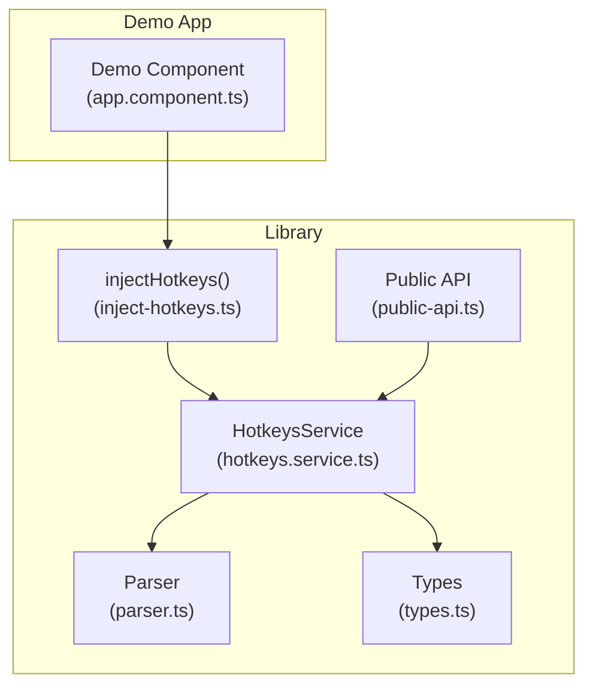
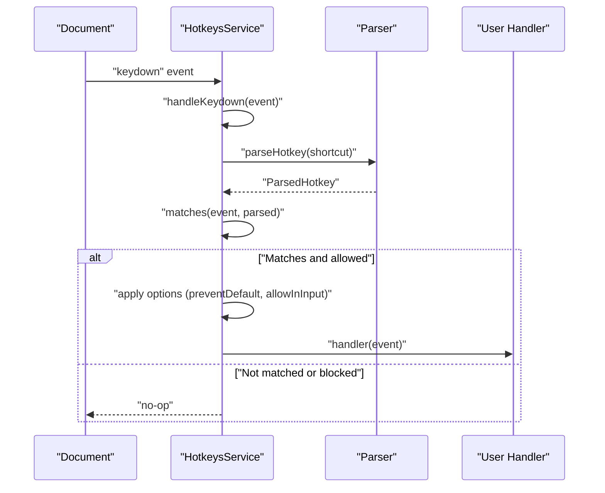
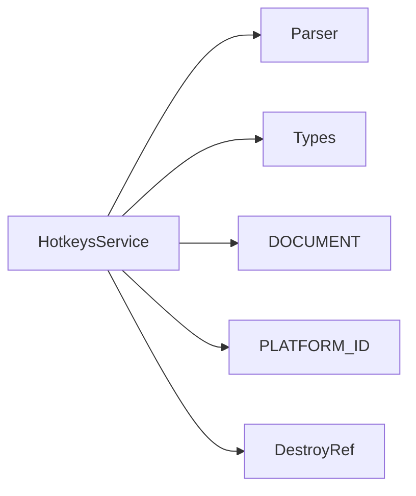

# HotkeysService Methods

<cite>
**Referenced Files in This Document**
- [hotkeys.service.ts](file://projects/ngx-hotkeys/src/lib/hotkeys.service.ts)
- [parser.ts](file://projects/ngx-hotkeys/src/lib/parser.ts)
- [types.ts](file://projects/ngx-hotkeys/src/lib/types.ts)
- [inject-hotkeys.ts](file://projects/ngx-hotkeys/src/lib/inject-hotkeys.ts)
- [public-api.ts](file://projects/ngx-hotkeys/src/lib/public-api.ts)
- [README.md](file://README.md)
- [EXAMPLE.md](file://EXAMPLE.md)
- [app.component.ts](file://projects/demo-app/src/app/app.component.ts)
</cite>

## Table of Contents
1. [Introduction](#introduction)
2. [Project Structure](#project-structure)
3. [Core Components](#core-components)
4. [Architecture Overview](#architecture-overview)
5. [Detailed Component Analysis](#detailed-component-analysis)
6. [Dependency Analysis](#dependency-analysis)
7. [Performance Considerations](#performance-considerations)
8. [Troubleshooting Guide](#troubleshooting-guide)
9. [Conclusion](#conclusion)
10. [Appendices](#appendices)

## Introduction
This document provides comprehensive documentation for the HotkeysService methods, with primary focus on the on() method, which is the core API for registering keyboard shortcuts. It explains the method signature, parameters, return value (cleanup function), behavior, shortcut string syntax, handler function contract, lifecycle and cleanup semantics, platform-specific behavior, and cross-browser considerations. Practical examples are included via file references to real usage patterns in the repository.

## Project Structure
The hotkeys library is organized into a small set of focused modules:
- HotkeysService: central service that listens to keydown events and dispatches registered handlers.
- Parser: parses shortcut strings into a normalized ParsedHotkey structure.
- Types: shared type definitions for handlers, options, and parsed keys.
- Injection helper: convenience function to obtain a HotkeysService instance in Angular DI.
- Public API: re-exports for external consumption.

**Diagram sources**
- [hotkeys.service.ts:1-114](file://projects/ngx-hotkeys/src/lib/hotkeys.service.ts#L1-L114)
- [parser.ts:1-46](file://projects/ngx-hotkeys/src/lib/parser.ts#L1-L46)
- [types.ts:1-16](file://projects/ngx-hotkeys/src/lib/types.ts#L1-L16)
- [inject-hotkeys.ts:1-7](file://projects/ngx-hotkeys/src/lib/inject-hotkeys.ts#L1-L7)
- [public-api.ts:1-4](file://projects/ngx-hotkeys/src/lib/public-api.ts#L1-L4)
- [app.component.ts:1-43](file://projects/demo-app/src/app/app.component.ts#L1-L43)

**Section sources**
- [hotkeys.service.ts:1-114](file://projects/ngx-hotkeys/src/lib/hotkeys.service.ts#L1-L114)
- [parser.ts:1-46](file://projects/ngx-hotkeys/src/lib/parser.ts#L1-L46)
- [types.ts:1-16](file://projects/ngx-hotkeys/src/lib/types.ts#L1-L16)
- [inject-hotkeys.ts:1-7](file://projects/ngx-hotkeys/src/lib/inject-hotkeys.ts#L1-L7)
- [public-api.ts:1-4](file://projects/ngx-hotkeys/src/lib/public-api.ts#L1-L4)
- [README.md:1-127](file://README.md#L1-L127)
- [EXAMPLE.md:1-77](file://EXAMPLE.md#L1-L77)
- [app.component.ts:1-43](file://projects/demo-app/src/app/app.component.ts#L1-L43)

## Core Components
- HotkeysService: Listens to global keydown events, matches them against registered shortcuts, and invokes handlers with optional behavior controls.
- Parser: Converts a shortcut string into a normalized structure with modifiers and key.
- Types: Defines HotkeyHandler, HotkeyOptions, and ParsedHotkey shapes.
- injectHotkeys: Angular DI helper to obtain a HotkeysService instance.

Key responsibilities:
- Event subscription and unsubscription lifecycle.
- Shortcut parsing and matching logic.
- Handler invocation with KeyboardEvent and optional prevention of default browser behavior.
- Automatic cleanup on component/service destruction.

**Section sources**
- [hotkeys.service.ts:18-34](file://projects/ngx-hotkeys/src/lib/hotkeys.service.ts#L18-L34)
- [parser.ts:12-45](file://projects/ngx-hotkeys/src/lib/parser.ts#L12-L45)
- [types.ts:1-16](file://projects/ngx-hotkeys/src/lib/types.ts#L1-L16)
- [inject-hotkeys.ts:4-6](file://projects/ngx-hotkeys/src/lib/inject-hotkeys.ts#L4-L6)

## Architecture Overview
The service subscribes to the document’s keydown event during construction and unsubscribes on destroy. Registered listeners are stored per shortcut string and evaluated on each keydown. Matching considers modifiers and the active element context.

**Diagram sources**
- [hotkeys.service.ts:62-76](file://projects/ngx-hotkeys/src/lib/hotkeys.service.ts#L62-L76)
- [parser.ts:12-45](file://projects/ngx-hotkeys/src/lib/parser.ts#L12-L45)

**Section sources**
- [hotkeys.service.ts:26-34](file://projects/ngx-hotkeys/src/lib/hotkeys.service.ts#L26-L34)
- [hotkeys.service.ts:62-98](file://projects/ngx-hotkeys/src/lib/hotkeys.service.ts#L62-L98)

## Detailed Component Analysis

### HotkeysService.on(shortcut, handler, options?)
The on() method is the primary API for registering a keyboard shortcut. It parses the shortcut string, merges options with defaults, stores the listener, and returns a cleanup function.

Method signature summary:
- Parameters:
  - shortcut: string
  - handler: (event: KeyboardEvent) => void
  - options?: HotkeyOptions
- Returns: () => void (a cleanup function)
- Behavior:
  - Parses shortcut into a normalized structure.
  - Merges options with defaults.
  - Stores the listener under the shortcut key.
  - Returns a function that removes the listener and cleans up the shortcut entry if empty.
  - Registers an onDestroy callback to auto-clean on component/service teardown.

Shortcut string syntax:
- Tokens separated by '+'.
- Supported tokens:
  - Keys: alphabetic characters, digits, special keys (e.g., escape, space, arrow keys).
  - Modifiers: ctrl, alt, shift, meta, mod.
- Special alias mapping:
  - Alias entries normalize common variants (e.g., space, arrow directions).
- Examples (see usage references):
  - Single key: "esc", "j"
  - Modifier combinations: "mod+k", "shift+enter", "ctrl+alt+1"
  - Platform-aware "mod" resolves to meta on macOS and ctrl elsewhere.

Handler function contract:
- Receives KeyboardEvent.
- Return type is void.
- Can optionally call event.preventDefault() if desired.

Options:
- preventDefault?: boolean — when true, calls event.preventDefault() before invoking handler.
- allowInInput?: boolean — when true, allows triggering even when an input-like element is focused.

Cleanup function:
- Removes the specific listener from the internal registry.
- If the shortcut has no remaining listeners after removal, deletes the shortcut entry.
- Also registers an onDestroy callback so the listener is removed when the owning Angular context is destroyed.

Lifecycle and memory management:
- Subscribes to keydown at construction if running in a browser platform.
- Automatically unsubscribes on destroy via DestroyRef.
- Automatically removes individual listeners on destroy via onDestroy callbacks.
- No manual unsubscribe required for global behavior; however, the returned cleanup function can be used for targeted removal.

Platform-specific behavior:
- "mod" modifier maps to meta on macOS and ctrl on Windows/Linux.
- The matching logic compares event.key with the parsed key (case-insensitive).
- The isInputActive() check prevents firing in input-like elements unless allowInInput is true.

Cross-browser compatibility:
- Uses standard KeyboardEvent properties (key, ctrlKey, metaKey, shiftKey, altKey).
- Relies on navigator.platform for macOS detection.
- Works across modern browsers that support these APIs.

Examples (by reference):
- Basic registration in a component: [app.component.ts:18-41](file://projects/demo-app/src/app/app.component.ts#L18-L41)
- Using preventDefault: [app.component.ts:38-40](file://projects/demo-app/src/app/app.component.ts#L38-L40)
- Global shortcuts that work in inputs: [EXAMPLE.md:74-76](file://EXAMPLE.md#L74-L76)
- Manual cleanup: [README.md:45-50](file://README.md#L45-L50)

**Section sources**
- [hotkeys.service.ts:36-60](file://projects/ngx-hotkeys/src/lib/hotkeys.service.ts#L36-L60)
- [hotkeys.service.ts:13-16](file://projects/ngx-hotkeys/src/lib/hotkeys.service.ts#L13-L16)
- [parser.ts:12-45](file://projects/ngx-hotkeys/src/lib/parser.ts#L12-L45)
- [types.ts:1-16](file://projects/ngx-hotkeys/src/lib/types.ts#L1-L16)
- [README.md:45-55](file://README.md#L45-L55)
- [EXAMPLE.md:74-76](file://EXAMPLE.md#L74-L76)
- [app.component.ts:18-41](file://projects/demo-app/src/app/app.component.ts#L18-L41)

### Shortcut String Syntax and Parsing
The parser splits the shortcut by "+" and interprets each token:
- Modifiers: ctrl, alt, shift, meta, mod.
- Key: any remaining token; aliases normalize common names.
- Error condition: if no key is present after parsing, throws an error indicating an invalid hotkey.

Supported keys and aliases:
- Keys include letters, digits, and special names (e.g., escape, space, arrowup, arrowdown, arrowleft, arrowright).
- Aliases normalize common variants.

Examples (by reference):
- Single key: "esc", "j"
- Arrow keys: "arrowup", "arrowdown", "arrowleft", "arrowright"
- Space: "space"
- Modifier combinations: "mod+k", "shift+enter", "ctrl+alt+1"

Edge cases:
- Missing key: throws an error.
- Unknown modifier or key: treated as a key if not recognized as a modifier.

**Section sources**
- [parser.ts:12-45](file://projects/ngx-hotkeys/src/lib/parser.ts#L12-L45)
- [README.md:85-101](file://README.md#L85-L101)
- [EXAMPLE.md:74-76](file://EXAMPLE.md#L74-L76)

### Handler Function Signature and Invocation
- Signature: (event: KeyboardEvent) => void
- Invocation occurs when a keydown matches the parsed shortcut and passes input-element checks.
- Options influence behavior:
  - preventDefault: calls event.preventDefault() before invoking handler.
  - allowInInput: overrides input-element blocking.

Examples (by reference):
- Handler receiving KeyboardEvent: [app.component.ts:38-40](file://projects/demo-app/src/app/app.component.ts#L38-L40)
- Prevent default behavior: [app.component.ts:38-40](file://projects/demo-app/src/app/app.component.ts#L38-L40)

**Section sources**
- [types.ts:6](file://projects/ngx-hotkeys/src/lib/types.ts#L6)
- [hotkeys.service.ts:69-72](file://projects/ngx-hotkeys/src/lib/hotkeys.service.ts#L69-L72)
- [hotkeys.service.ts:100-112](file://projects/ngx-hotkeys/src/lib/hotkeys.service.ts#L100-L112)

### Cleanup and Lifecycle Semantics
Automatic cleanup:
- On destroy, the service removes its keydown listener.
- On destroy, all registered listeners are removed via onDestroy callbacks.

Manual cleanup:
- The returned off() function removes a single listener.
- If removing the last listener for a shortcut, the shortcut entry is deleted.

Usage patterns:
- Manual removal: [README.md:45-50](file://README.md#L45-L50)
- Global shortcuts in inputs: [EXAMPLE.md:74-76](file://EXAMPLE.md#L74-L76)

**Section sources**
- [hotkeys.service.ts:26-34](file://projects/ngx-hotkeys/src/lib/hotkeys.service.ts#L26-L34)
- [hotkeys.service.ts:45-58](file://projects/ngx-hotkeys/src/lib/hotkeys.service.ts#L45-L58)
- [README.md:52-55](file://README.md#L52-L55)

### Platform-Specific Behavior and Cross-Browser Notes
- "mod" resolves to meta on macOS and ctrl on Windows/Linux.
- Matching is case-insensitive for the key portion.
- Input-element detection includes input, textarea, select, and contenteditable=true.
- Uses standard KeyboardEvent properties; compatible with modern browsers.

**Section sources**
- [hotkeys.service.ts:83-98](file://projects/ngx-hotkeys/src/lib/hotkeys.service.ts#L83-L98)
- [hotkeys.service.ts:100-112](file://projects/ngx-hotkeys/src/lib/hotkeys.service.ts#L100-L112)
- [README.md:100](file://README.md#L100)

## Dependency Analysis
The service depends on Angular DI for document, platform identification, and destroy ref. It delegates parsing to the parser module and uses shared types.

**Diagram sources**
- [hotkeys.service.ts:1-6](file://projects/ngx-hotkeys/src/lib/hotkeys.service.ts#L1-L6)
- [parser.ts:1-2](file://projects/ngx-hotkeys/src/lib/parser.ts#L1-L2)
- [types.ts:1-16](file://projects/ngx-hotkeys/src/lib/types.ts#L1-L16)

**Section sources**
- [hotkeys.service.ts:1-6](file://projects/ngx-hotkeys/src/lib/hotkeys.service.ts#L1-L6)

## Performance Considerations
- Single global keydown listener minimizes overhead.
- O(n) scan over registered shortcuts per keydown; acceptable for typical usage.
- Avoid excessive registrations; reuse handlers when possible.
- Consider allowInInput only when necessary to avoid unintended triggers in forms.

## Troubleshooting Guide
Common issues and resolutions:
- Invalid shortcut syntax:
  - Cause: missing key token.
  - Resolution: ensure a valid key is present; the parser throws an error if not.
  - Reference: [parser.ts:40-42](file://projects/ngx-hotkeys/src/lib/parser.ts#L40-L42)
- Shortcut not firing in inputs:
  - Cause: default behavior blocks firing while input-like element is focused.
  - Resolution: pass { allowInInput: true } to on().
  - Reference: [hotkeys.service.ts:66-68](file://projects/ngx-hotkeys/src/lib/hotkeys.service.ts#L66-L68), [EXAMPLE.md:74-76](file://EXAMPLE.md#L74-L76)
- Browser default action still occurs:
  - Cause: preventDefault not enabled.
  - Resolution: pass { preventDefault: true } to on().
  - Reference: [hotkeys.service.ts:69-71](file://projects/ngx-hotkeys/src/lib/hotkeys.service.ts#L69-L71), [app.component.ts:38-40](file://projects/demo-app/src/app/app.component.ts#L38-L40)
- Shortcut not removed:
  - Cause: not calling the returned cleanup function or not using Angular destroy lifecycle.
  - Resolution: call off() or rely on onDestroy; verify listener was removed.
  - Reference: [hotkeys.service.ts:45-58](file://projects/ngx-hotkeys/src/lib/hotkeys.service.ts#L45-L58), [README.md:45-50](file://README.md#L45-L50)

**Section sources**
- [parser.ts:40-42](file://projects/ngx-hotkeys/src/lib/parser.ts#L40-L42)
- [hotkeys.service.ts:66-71](file://projects/ngx-hotkeys/src/lib/hotkeys.service.ts#L66-L71)
- [hotkeys.service.ts:45-58](file://projects/ngx-hotkeys/src/lib/hotkeys.service.ts#L45-L58)
- [README.md:45-50](file://README.md#L45-L50)
- [EXAMPLE.md:74-76](file://EXAMPLE.md#L74-L76)

## Conclusion
HotkeysService.on() provides a concise, powerful API for registering keyboard shortcuts with minimal boilerplate. Its design emphasizes simplicity, platform awareness, and safe lifecycle management. By understanding shortcut syntax, handler contracts, and options, developers can reliably implement global and scoped keyboard interactions across browsers and platforms.

## Appendices

### API Summary
- injectHotkeys(): returns HotkeysService.
- HotkeysService.on(shortcut, handler, options?): registers a shortcut and returns a cleanup function.
- HotkeyOptions: preventDefault, allowInInput.
- HotkeyHandler: (event: KeyboardEvent) => void.

**Section sources**
- [inject-hotkeys.ts:4-6](file://projects/ngx-hotkeys/src/lib/inject-hotkeys.ts#L4-L6)
- [hotkeys.service.ts:36](file://projects/ngx-hotkeys/src/lib/hotkeys.service.ts#L36)
- [types.ts:1-16](file://projects/ngx-hotkeys/src/lib/types.ts#L1-L16)
- [README.md:58-81](file://README.md#L58-L81)