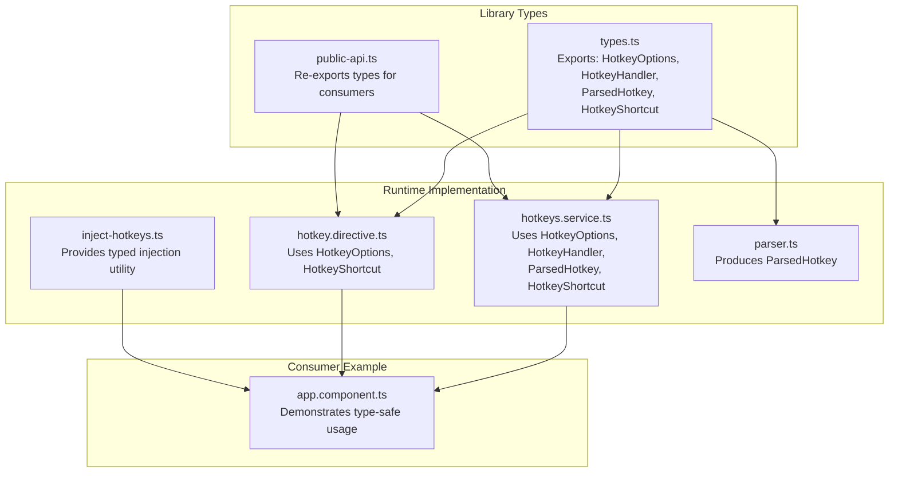
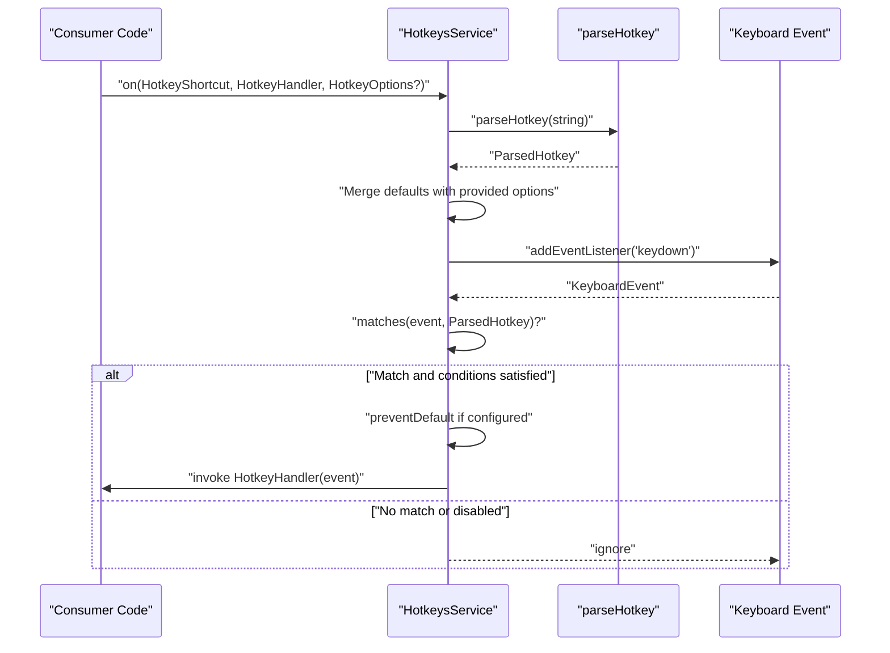
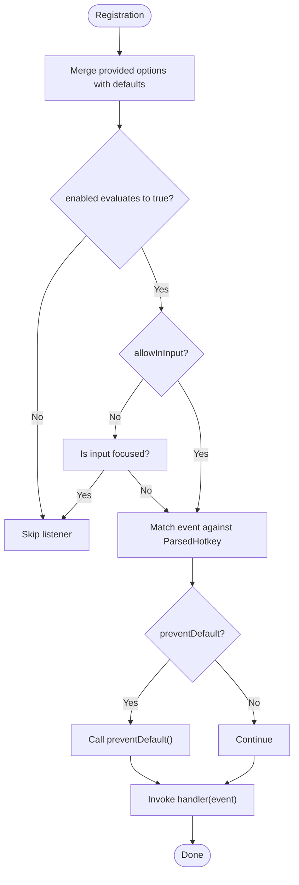
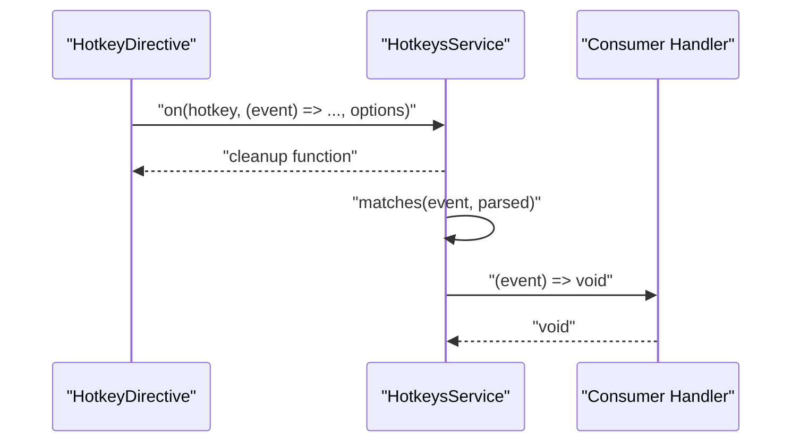
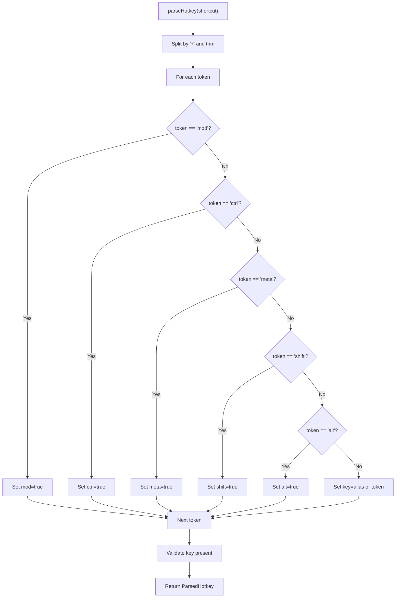
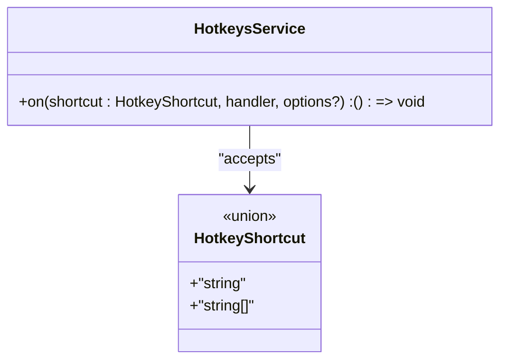
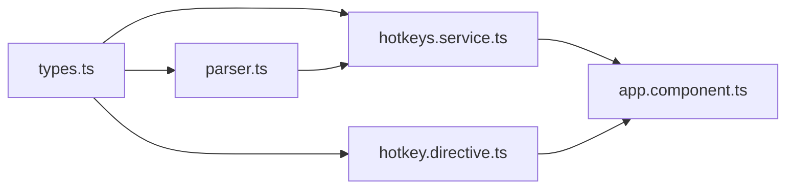

# Type Definitions

<cite>
**Referenced Files in This Document**
- [types.ts](file://projects/ngx-hotkeys/src/lib/types.ts)
- [public-api.ts](file://projects/ngx-hotkeys/src/lib/public-api.ts)
- [hotkeys.service.ts](file://projects/ngx-hotkeys/src/lib/hotkeys.service.ts)
- [hotkey.directive.ts](file://projects/ngx-hotkeys/src/lib/hotkey.directive.ts)
- [inject-hotkeys.ts](file://projects/ngx-hotkeys/src/lib/inject-hotkeys.ts)
- [parser.ts](file://projects/ngx-hotkeys/src/lib/parser.ts)
- [package.json](file://projects/ngx-hotkeys/package.json)
- [package.json](file://package.json)
- [tsconfig.json](file://tsconfig.json)
- [app.component.ts](file://projects/demo-app/src/app/app.component.ts)
</cite>

## Table of Contents
1. [Introduction](#introduction)
2. [Project Structure](#project-structure)
3. [Core Components](#core-components)
4. [Architecture Overview](#architecture-overview)
5. [Detailed Component Analysis](#detailed-component-analysis)
6. [Dependency Analysis](#dependency-analysis)
7. [Performance Considerations](#performance-considerations)
8. [Troubleshooting Guide](#troubleshooting-guide)
9. [Conclusion](#conclusion)
10. [Appendices](#appendices)

## Introduction
This document provides comprehensive documentation for the TypeScript type definitions in the ngx-hotkeys library. It focuses on the HotkeyHandler function signature type, the HotkeyOptions interface for configuration, and related types such as HotkeyShortcut and ParsedHotkey. It explains how these types enforce type safety, improve developer experience, and map to runtime behavior. Guidance is included for extending and customizing types for advanced use cases, along with examples of type-safe implementations and patterns. Compatibility across Angular and TypeScript versions is addressed based on the repository’s configuration.

## Project Structure
The type definitions live in the library’s source under the lib directory. They are exported via the public API and consumed by the service and directive implementations. The demo application demonstrates real-world usage patterns.

**Diagram sources**
- [types.ts:1-19](file://projects/ngx-hotkeys/src/lib/types.ts#L1-L19)
- [public-api.ts:1-5](file://projects/ngx-hotkeys/src/lib/public-api.ts#L1-L5)
- [hotkeys.service.ts:1-138](file://projects/ngx-hotkeys/src/lib/hotkeys.service.ts#L1-L138)
- [hotkey.directive.ts:1-58](file://projects/ngx-hotkeys/src/lib/hotkey.directive.ts#L1-L58)
- [inject-hotkeys.ts:1-7](file://projects/ngx-hotkeys/src/lib/inject-hotkeys.ts#L1-L7)
- [parser.ts:1-46](file://projects/ngx-hotkeys/src/lib/parser.ts#L1-L46)
- [app.component.ts:1-63](file://projects/demo-app/src/app/app.component.ts#L1-L63)

**Section sources**
- [types.ts:1-19](file://projects/ngx-hotkeys/src/lib/types.ts#L1-L19)
- [public-api.ts:1-5](file://projects/ngx-hotkeys/src/lib/public-api.ts#L1-L5)
- [hotkeys.service.ts:1-138](file://projects/ngx-hotkeys/src/lib/hotkeys.service.ts#L1-L138)
- [hotkey.directive.ts:1-58](file://projects/ngx-hotkeys/src/lib/hotkey.directive.ts#L1-L58)
- [inject-hotkeys.ts:1-7](file://projects/ngx-hotkeys/src/lib/inject-hotkeys.ts#L1-L7)
- [parser.ts:1-46](file://projects/ngx-hotkeys/src/lib/parser.ts#L1-L46)
- [app.component.ts:1-63](file://projects/demo-app/src/app/app.component.ts#L1-L63)

## Core Components
This section documents each exported type and its role in the library.

- HotkeyOptions
  - Purpose: Encapsulates configuration for a hotkey listener.
  - Fields:
    - preventDefault?: boolean — Whether to call preventDefault on the keyboard event when the hotkey triggers.
    - allowInInput?: boolean — Whether to allow the hotkey to trigger while an input-like element is focused.
    - enabled?: boolean | (() => boolean) — Enables or disables the listener dynamically; can be a boolean or a function returning a boolean.
  - Usage: Passed to the service’s registration method and merged with defaults.

- HotkeyHandler
  - Purpose: Defines the function signature for a hotkey handler.
  - Signature: (event: KeyboardEvent) => void
  - Usage: Provided as the second argument to the service’s registration method and emitted by the directive.

- ParsedHotkey
  - Purpose: Represents a normalized, parsed representation of a shortcut string.
  - Fields:
    - key: string — The normalized key identifier.
    - ctrl: boolean — Whether Ctrl is required.
    - meta: boolean — Whether Meta (Cmd/Ctrl) is required.
    - shift: boolean — Whether Shift is required.
    - alt: boolean — Whether Alt is required.
    - mod: boolean — Platform-specific modifier flag (resolved during parsing).
  - Usage: Produced by the parser and used by the service to match incoming events.

- HotkeyShortcut
  - Purpose: Union type representing a single shortcut string or an array of shortcut strings.
  - Variants: string | string[]
  - Usage: Accepted by the service’s registration method to support multiple shortcuts.

How these types enhance developer experience:
- Strong typing prevents invalid option keys and ensures handlers receive the correct event type.
- HotkeyShortcut allows ergonomic usage of either a single or multiple shortcuts.
- ParsedHotkey centralizes normalization and platform-aware modifier resolution, reducing errors in matching logic.

**Section sources**
- [types.ts:1-19](file://projects/ngx-hotkeys/src/lib/types.ts#L1-L19)
- [hotkeys.service.ts:14-22](file://projects/ngx-hotkeys/src/lib/hotkeys.service.ts#L14-L22)
- [parser.ts:12-45](file://projects/ngx-hotkeys/src/lib/parser.ts#L12-L45)

## Architecture Overview
The type system underpins the runtime behavior of the hotkey subsystem. Types are used at compile-time to ensure correctness, while runtime logic enforces behavior such as event matching, platform-specific modifiers, and lifecycle cleanup.

**Diagram sources**
- [hotkeys.service.ts:42-100](file://projects/ngx-hotkeys/src/lib/hotkeys.service.ts#L42-L100)
- [parser.ts:12-45](file://projects/ngx-hotkeys/src/lib/parser.ts#L12-L45)
- [types.ts:1-19](file://projects/ngx-hotkeys/src/lib/types.ts#L1-L19)

## Detailed Component Analysis

### HotkeyOptions and Defaults
- Defaults are applied at registration time, ensuring consistent behavior when options are partially provided.
- The enabled option supports both static booleans and dynamic functions, enabling runtime toggling.

**Diagram sources**
- [hotkeys.service.ts:14-22](file://projects/ngx-hotkeys/src/lib/hotkeys.service.ts#L14-L22)
- [hotkeys.service.ts:57-81](file://projects/ngx-hotkeys/src/lib/hotkeys.service.ts#L57-L81)
- [hotkeys.service.ts:83-100](file://projects/ngx-hotkeys/src/lib/hotkeys.service.ts#L83-L100)

**Section sources**
- [hotkeys.service.ts:14-22](file://projects/ngx-hotkeys/src/lib/hotkeys.service.ts#L14-L22)
- [hotkeys.service.ts:57-81](file://projects/ngx-hotkeys/src/lib/hotkeys.service.ts#L57-L81)
- [hotkeys.service.ts:83-100](file://projects/ngx-hotkeys/src/lib/hotkeys.service.ts#L83-L100)

### HotkeyHandler Type Safety
- Handlers receive a KeyboardEvent, enabling safe access to event.key and modifier states.
- The directive emits the raw event to subscribers, preserving type fidelity.

**Diagram sources**
- [hotkey.directive.ts:42-50](file://projects/ngx-hotkeys/src/lib/hotkey.directive.ts#L42-L50)
- [hotkeys.service.ts:42-55](file://projects/ngx-hotkeys/src/lib/hotkeys.service.ts#L42-L55)
- [types.ts:7](file://projects/ngx-hotkeys/src/lib/types.ts#L7)

**Section sources**
- [hotkey.directive.ts:42-50](file://projects/ngx-hotkeys/src/lib/hotkey.directive.ts#L42-L50)
- [hotkeys.service.ts:42-55](file://projects/ngx-hotkeys/src/lib/hotkeys.service.ts#L42-L55)
- [types.ts:7](file://projects/ngx-hotkeys/src/lib/types.ts#L7)

### ParsedHotkey Normalization and Platform Logic
- The parser normalizes aliases and splits the shortcut string into tokens.
- Platform detection influences whether mod resolves to meta or ctrl.
- Runtime matching compares normalized key and modifier states.

**Diagram sources**
- [parser.ts:12-45](file://projects/ngx-hotkeys/src/lib/parser.ts#L12-L45)
- [hotkeys.service.ts:102-122](file://projects/ngx-hotkeys/src/lib/hotkeys.service.ts#L102-L122)

**Section sources**
- [parser.ts:12-45](file://projects/ngx-hotkeys/src/lib/parser.ts#L12-L45)
- [hotkeys.service.ts:102-122](file://projects/ngx-hotkeys/src/lib/hotkeys.service.ts#L102-L122)

### HotkeyShortcut Usage Patterns
- Single shortcut: string
- Multiple shortcuts: string[]
- The service internally normalizes to an array for consistent processing.

**Diagram sources**
- [types.ts:18](file://projects/ngx-hotkeys/src/lib/types.ts#L18)
- [hotkeys.service.ts:42-55](file://projects/ngx-hotkeys/src/lib/hotkeys.service.ts#L42-L55)

**Section sources**
- [types.ts:18](file://projects/ngx-hotkeys/src/lib/types.ts#L18)
- [hotkeys.service.ts:42-55](file://projects/ngx-hotkeys/src/lib/hotkeys.service.ts#L42-L55)

### Public API Exposure
- The public API re-exports HotkeyOptions and HotkeyShortcut for consumer convenience.
- Consumers can import types directly from the package entry.

**Section sources**
- [public-api.ts:1-5](file://projects/ngx-hotkeys/src/lib/public-api.ts#L1-L5)

## Dependency Analysis
The type definitions are consumed by the service and directive, and the parser produces ParsedHotkey instances used by the service’s matching logic.

**Diagram sources**
- [types.ts:1-19](file://projects/ngx-hotkeys/src/lib/types.ts#L1-L19)
- [hotkeys.service.ts:1-138](file://projects/ngx-hotkeys/src/lib/hotkeys.service.ts#L1-L138)
- [hotkey.directive.ts:1-58](file://projects/ngx-hotkeys/src/lib/hotkey.directive.ts#L1-L58)
- [parser.ts:1-46](file://projects/ngx-hotkeys/src/lib/parser.ts#L1-L46)
- [app.component.ts:1-63](file://projects/demo-app/src/app/app.component.ts#L1-L63)

**Section sources**
- [types.ts:1-19](file://projects/ngx-hotkeys/src/lib/types.ts#L1-L19)
- [hotkeys.service.ts:1-138](file://projects/ngx-hotkeys/src/lib/hotkeys.service.ts#L1-L138)
- [hotkey.directive.ts:1-58](file://projects/ngx-hotkeys/src/lib/hotkey.directive.ts#L1-L58)
- [parser.ts:1-46](file://projects/ngx-hotkeys/src/lib/parser.ts#L1-L46)
- [app.component.ts:1-63](file://projects/demo-app/src/app/app.component.ts#L1-L63)

## Performance Considerations
- Using HotkeyOptions.enabled as a function allows disabling listeners conditionally without re-registering, minimizing overhead.
- Merging defaults once per registration avoids repeated checks at runtime.
- Platform detection occurs once per match; keep handler logic efficient to avoid blocking the UI thread.

[No sources needed since this section provides general guidance]

## Troubleshooting Guide
Common type-related issues and resolutions:
- Invalid shortcut string
  - Symptom: An error is thrown indicating no key was found after parsing.
  - Cause: Shortcut string did not contain a valid key token.
  - Resolution: Ensure the shortcut includes a valid key (e.g., letters, arrows, space, escape).
  - Evidence: Parser validates presence of a key and throws an error otherwise.
  
- Unexpected handler event type
  - Symptom: Type checker reports mismatched event type.
  - Cause: Incorrect handler signature.
  - Resolution: Use HotkeyHandler which expects (event: KeyboardEvent) => void.

- Options not taking effect
  - Symptom: preventDefault or allowInInput behavior does not match expectations.
  - Cause: Options not passed or incorrect default behavior.
  - Resolution: Pass HotkeyOptions explicitly; note defaults differ from boolean-only assumptions.

- Dynamic enablement not working
  - Symptom: enabled function not evaluated.
  - Cause: Not using a function or returning unexpected value.
  - Resolution: Provide a function that returns a boolean reflecting desired state.

**Section sources**
- [parser.ts:40-42](file://projects/ngx-hotkeys/src/lib/parser.ts#L40-L42)
- [types.ts:7](file://projects/ngx-hotkeys/src/lib/types.ts#L7)
- [hotkeys.service.ts:14-18](file://projects/ngx-hotkeys/src/lib/hotkeys.service.ts#L14-L18)
- [hotkeys.service.ts:20-22](file://projects/ngx-hotkeys/src/lib/hotkeys.service.ts#L20-L22)

## Conclusion
The ngx-hotkeys library’s type definitions provide strong guarantees around handler signatures, configuration options, shortcut representation, and parsed key normalization. Together with the runtime service and directive, they deliver a type-safe, ergonomic API for registering and managing keyboard shortcuts. The types map directly to observable runtime behavior, including platform-aware modifier handling, input focus gating, and event prevention.

[No sources needed since this section summarizes without analyzing specific files]

## Appendices

### Type-Safe Usage Patterns
- Service registration with multiple shortcuts:
  - Use HotkeyShortcut to accept either a single string or an array of strings.
  - Provide HotkeyHandler for the second argument.
  - Pass HotkeyOptions for optional behavior like preventDefault and allowInInput.
  - Reference: [hotkeys.service.ts:42-55](file://projects/ngx-hotkeys/src/lib/hotkeys.service.ts#L42-L55), [types.ts:18](file://projects/ngx-hotkeys/src/lib/types.ts#L18), [types.ts:7](file://projects/ngx-hotkeys/src/lib/types.ts#L7), [types.ts:1-5](file://projects/ngx-hotkeys/src/lib/types.ts#L1-L5)

- Directive-based hotkeys:
  - Bind hotkey input to a HotkeyShortcut.
  - Use outputs to receive KeyboardEvent in a type-safe manner.
  - Reference: [hotkey.directive.ts:21-26](file://projects/ngx-hotkeys/src/lib/hotkey.directive.ts#L21-L26), [hotkey.directive.ts:48-50](file://projects/ngx-hotkeys/src/lib/hotkey.directive.ts#L48-L50)

- Platform-aware modifiers:
  - Use the mod token; it resolves to meta on macOS and ctrl elsewhere.
  - Reference: [parser.ts:12-45](file://projects/ngx-hotkeys/src/lib/parser.ts#L12-L45), [hotkeys.service.ts:107-114](file://projects/ngx-hotkeys/src/lib/hotkeys.service.ts#L107-L114)

- Extending types for advanced use cases:
  - To add stricter constraints, define a narrower union for HotkeyShortcut (e.g., only specific strings).
  - To customize handler behavior, wrap HotkeyHandler with a domain-specific signature while preserving KeyboardEvent access.
  - To refine options, create a derived interface extending HotkeyOptions with additional fields and merge defaults accordingly.
  - References: [types.ts:1-19](file://projects/ngx-hotkeys/src/lib/types.ts#L1-L19), [hotkeys.service.ts:14-18](file://projects/ngx-hotkeys/src/lib/hotkeys.service.ts#L14-L18)

### Angular and TypeScript Compatibility
- Angular peer dependencies require version 17 or higher.
- TypeScript compiler version 5.x is used in this workspace.
- Target and module are set to ES2022, aligning with modern Angular toolchains.
- Strict compiler options are enabled, improving type safety across the codebase.

**Section sources**
- [package.json:22-25](file://projects/ngx-hotkeys/package.json#L22-L25)
- [package.json:36](file://package.json#L36)
- [tsconfig.json:17-23](file://tsconfig.json#L17-L23)
- [tsconfig.json:6-10](file://tsconfig.json#L6-L10)