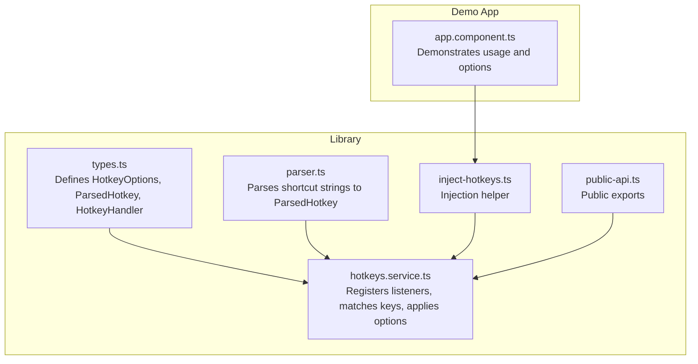
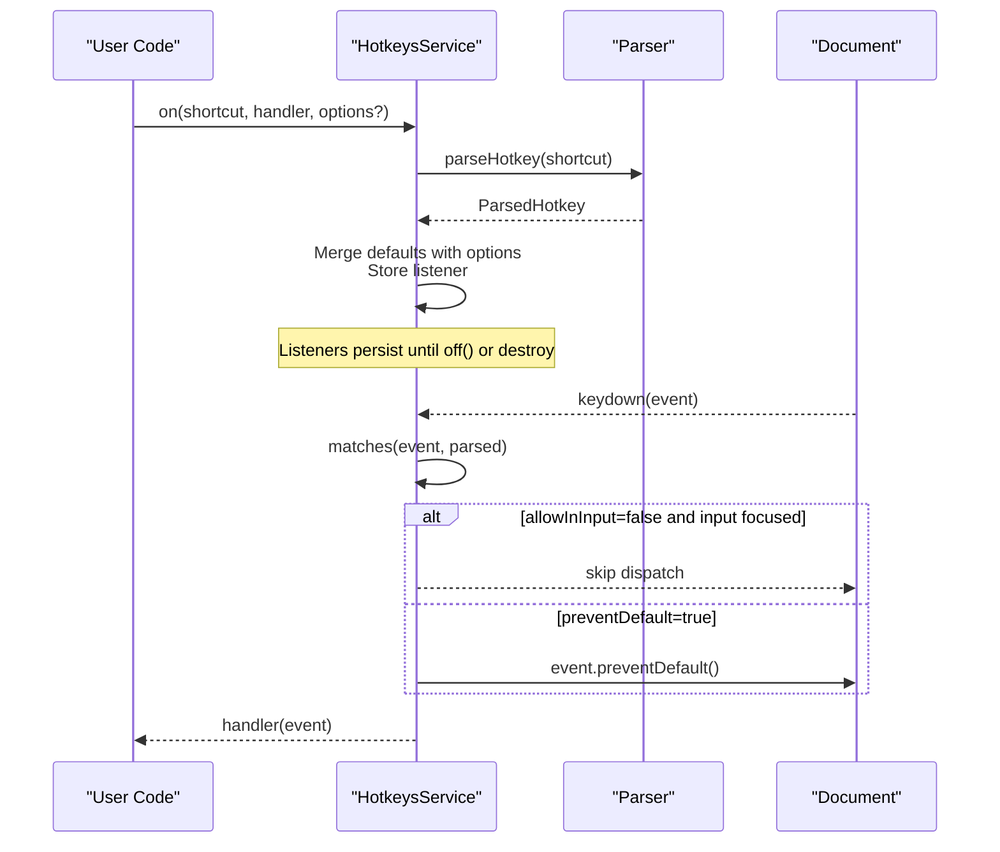
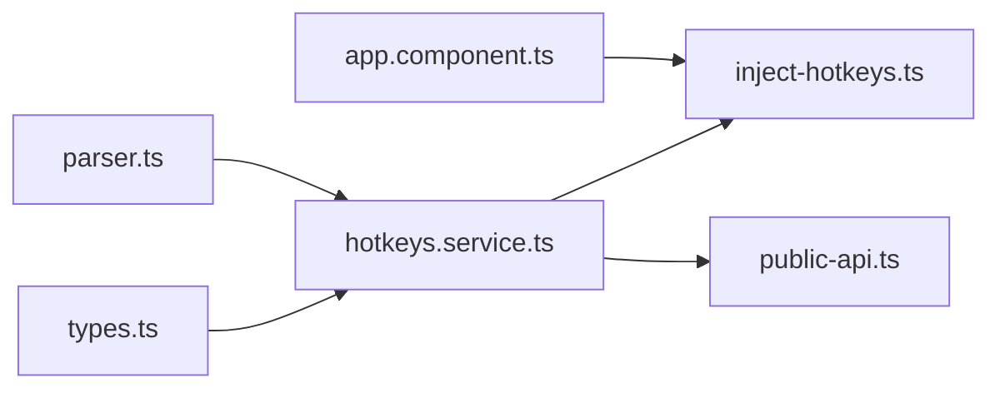

# Configuration & Options

<cite>
**Referenced Files in This Document**
- [types.ts](file://projects/ngx-hotkeys/src/lib/types.ts)
- [hotkeys.service.ts](file://projects/ngx-hotkeys/src/lib/hotkeys.service.ts)
- [parser.ts](file://projects/ngx-hotkeys/src/lib/parser.ts)
- [inject-hotkeys.ts](file://projects/ngx-hotkeys/src/lib/inject-hotkeys.ts)
- [public-api.ts](file://projects/ngx-hotkeys/src/lib/public-api.ts)
- [README.md](file://README.md)
- [EXAMPLE.md](file://EXAMPLE.md)
- [app.component.ts](file://projects/demo-app/src/app/app.component.ts)
</cite>

## Table of Contents
1. [Introduction](#introduction)
2. [Project Structure](#project-structure)
3. [Core Components](#core-components)
4. [Architecture Overview](#architecture-overview)
5. [Detailed Component Analysis](#detailed-component-analysis)
6. [Dependency Analysis](#dependency-analysis)
7. [Performance Considerations](#performance-considerations)
8. [Troubleshooting Guide](#troubleshooting-guide)
9. [Conclusion](#conclusion)

## Introduction
This document explains the configuration options and customization features of ngx-hotkeys, focusing on the HotkeyOptions interface and how it affects hotkey behavior. It covers default settings, override mechanisms, cross-platform behavior, advanced scenarios (conditional registration, dynamic changes, runtime updates), and performance implications. Practical examples are referenced from the demo application and examples documentation.

## Project Structure
The configuration system centers around a small set of core files:
- Types define the HotkeyOptions interface and related types.
- The service implements hotkey registration, matching, and dispatch with configurable behavior.
- The parser converts human-readable shortcuts into internal structures.
- Public API exports expose the service and injection helper.
- Examples and demos demonstrate usage patterns and option combinations.

**Diagram sources**
- [types.ts:1-16](file://projects/ngx-hotkeys/src/lib/types.ts#L1-L16)
- [hotkeys.service.ts:1-114](file://projects/ngx-hotkeys/src/lib/hotkeys.service.ts#L1-L114)
- [parser.ts:1-46](file://projects/ngx-hotkeys/src/lib/parser.ts#L1-L46)
- [inject-hotkeys.ts:1-7](file://projects/ngx-hotkeys/src/lib/inject-hotkeys.ts#L1-L7)
- [public-api.ts:1-4](file://projects/ngx-hotkeys/src/lib/public-api.ts#L1-L4)
- [app.component.ts:1-43](file://projects/demo-app/src/app/app.component.ts#L1-L43)

**Section sources**
- [types.ts:1-16](file://projects/ngx-hotkeys/src/lib/types.ts#L1-L16)
- [hotkeys.service.ts:1-114](file://projects/ngx-hotkeys/src/lib/hotkeys.service.ts#L1-L114)
- [parser.ts:1-46](file://projects/ngx-hotkeys/src/lib/parser.ts#L1-L46)
- [inject-hotkeys.ts:1-7](file://projects/ngx-hotkeys/src/lib/inject-hotkeys.ts#L1-L7)
- [public-api.ts:1-4](file://projects/ngx-hotkeys/src/lib/public-api.ts#L1-L4)
- [README.md:58-82](file://README.md#L58-L82)
- [EXAMPLE.md:72-77](file://EXAMPLE.md#L72-L77)
- [app.component.ts:18-41](file://projects/demo-app/src/app/app.component.ts#L18-L41)

## Core Components
- HotkeyOptions interface: Controls whether to prevent default browser behavior and whether to trigger while typing in inputs.
- HotkeysService: Central registry and dispatcher for hotkeys, applying options during matching and dispatch.
- Parser: Converts shortcut strings into a normalized ParsedHotkey structure.
- Injection helper: Provides a convenient way to obtain the service instance.

Key behaviors:
- Default options are applied when none are provided.
- Options are merged per listener, allowing per-listener overrides.
- Cross-platform modifier mapping is handled internally for the mod modifier.

**Section sources**
- [types.ts:1-16](file://projects/ngx-hotkeys/src/lib/types.ts#L1-L16)
- [hotkeys.service.ts:13-16](file://projects/ngx-hotkeys/src/lib/hotkeys.service.ts#L13-L16)
- [hotkeys.service.ts:36-60](file://projects/ngx-hotkeys/src/lib/hotkeys.service.ts#L36-L60)
- [parser.ts:12-45](file://projects/ngx-hotkeys/src/lib/parser.ts#L12-L45)
- [inject-hotkeys.ts:4-6](file://projects/ngx-hotkeys/src/lib/inject-hotkeys.ts#L4-L6)

## Architecture Overview
The configuration pipeline:
1. Registration: Users call on() with a shortcut, handler, and optional HotkeyOptions.
2. Parsing: The shortcut string is parsed into a normalized ParsedHotkey.
3. Storage: The listener (parsed structure, handler, and resolved options) is stored under the shortcut key.
4. Matching: On each keydown, the service checks if the event matches any registered listener.
5. Option application: Options are applied during dispatch (preventDefault, allowInInput).

**Diagram sources**
- [hotkeys.service.ts:36-76](file://projects/ngx-hotkeys/src/lib/hotkeys.service.ts#L36-L76)
- [parser.ts:12-45](file://projects/ngx-hotkeys/src/lib/parser.ts#L12-L45)
- [types.ts:1-16](file://projects/ngx-hotkeys/src/lib/types.ts#L1-L16)

## Detailed Component Analysis

### HotkeyOptions Interface
- preventDefault: When true, prevents the browser’s default action for the matched key combination.
- allowInInput: When true, allows the hotkey to trigger even when focus is in an input/textarea/select/contenteditable element.

Defaults:
- preventDefault: false
- allowInInput: false

Behavioral effects:
- preventDefault: Useful for overriding browser actions (e.g., saving, navigation) to implement custom behavior.
- allowInInput: Useful for global shortcuts that should still work while typing (e.g., submit on Enter).

Override mechanism:
- Options passed to on() are merged with defaults per listener, so each listener can independently control behavior.

Cross-platform behavior:
- The mod modifier maps to meta on macOS and ctrl on Windows/Linux. This influences how modifiers are matched.

Examples from repository:
- Prevent default for a save action.
- Allow triggering in inputs for a submit action.

**Section sources**
- [types.ts:1-16](file://projects/ngx-hotkeys/src/lib/types.ts#L1-L16)
- [hotkeys.service.ts:13-16](file://projects/ngx-hotkeys/src/lib/hotkeys.service.ts#L13-L16)
- [hotkeys.service.ts:38](file://projects/ngx-hotkeys/src/lib/hotkeys.service.ts#L38)
- [README.md:74-81](file://README.md#L74-L81)
- [EXAMPLE.md:33-36](file://EXAMPLE.md#L33-L36)
- [EXAMPLE.md:75](file://EXAMPLE.md#L75)
- [app.component.ts:38-40](file://projects/demo-app/src/app/app.component.ts#L38-L40)

### HotkeysService Internals
- Listener storage: Map of shortcut to array of listeners, each with parsed structure, handler, and resolved options.
- Event handling: Single keydown listener attached to the document; iterates registered listeners to find matches.
- Matching logic: Compares normalized key and modifier states, including platform-aware mod mapping.
- Input detection: Determines if focus is in an input-like element or contenteditable.

Option application during dispatch:
- If allowInInput is false and input is focused, skip dispatch.
- If preventDefault is true, call event.preventDefault() before invoking the handler.

Cleanup:
- Automatic cleanup on destroy via DestroyRef; manual removal via returned off() function.

**Section sources**
- [hotkeys.service.ts:7-11](file://projects/ngx-hotkeys/src/lib/hotkeys.service.ts#L7-L11)
- [hotkeys.service.ts:26-34](file://projects/ngx-hotkeys/src/lib/hotkeys.service.ts#L26-L34)
- [hotkeys.service.ts:36-60](file://projects/ngx-hotkeys/src/lib/hotkeys.service.ts#L36-L60)
- [hotkeys.service.ts:62-76](file://projects/ngx-hotkeys/src/lib/hotkeys.service.ts#L62-L76)
- [hotkeys.service.ts:78-98](file://projects/ngx-hotkeys/src/lib/hotkeys.service.ts#L78-L98)
- [hotkeys.service.ts:100-112](file://projects/ngx-hotkeys/src/lib/hotkeys.service.ts#L100-L112)

### Parser Behavior
- Normalizes keys and aliases (e.g., escape, space, arrow keys).
- Supports modifiers: mod, ctrl, meta, shift, alt.
- Throws on invalid input if no key is present.

Implications for configuration:
- Shortcut syntax determines how modifiers are interpreted; ensure correct syntax to achieve desired behavior.

**Section sources**
- [parser.ts:3-10](file://projects/ngx-hotkeys/src/lib/parser.ts#L3-L10)
- [parser.ts:12-45](file://projects/ngx-hotkeys/src/lib/parser.ts#L12-L45)

### Cross-Platform Modifier Mapping
- The mod modifier resolves to meta on macOS and ctrl on Windows/Linux.
- Matching logic accounts for this difference when comparing expected vs. actual modifier states.

Practical impact:
- Using mod ensures consistent behavior across platforms without hardcoding platform-specific modifiers.

**Section sources**
- [hotkeys.service.ts:83-88](file://projects/ngx-hotkeys/src/lib/hotkeys.service.ts#L83-L88)
- [README.md:100](file://README.md#L100)

### Advanced Configuration Scenarios

#### Conditional Hotkey Registration
- Register different handlers for the same shortcut with different options to achieve conditional behavior.
- Use allowInInput selectively to enable global shortcuts while typing.

Example references:
- Global submit in inputs.
- Different handlers for the same shortcut with distinct options.

**Section sources**
- [EXAMPLE.md:75](file://EXAMPLE.md#L75)
- [app.component.ts:18-41](file://projects/demo-app/src/app/app.component.ts#L18-L41)

#### Dynamic Option Changes
- Options are stored per listener and applied at dispatch time.
- To change behavior dynamically, re-register the listener with updated options or remove and add a new one.

Note: The service does not expose a method to update existing options; re-registration is the intended pattern.

**Section sources**
- [hotkeys.service.ts:36-60](file://projects/ngx-hotkeys/src/lib/hotkeys.service.ts#L36-L60)

#### Runtime Configuration Updates
- Remove a listener via the returned off() function.
- Re-add with updated options to reflect runtime changes.

**Section sources**
- [hotkeys.service.ts:45-59](file://projects/ngx-hotkeys/src/lib/hotkeys.service.ts#L45-L59)

### Example Combinations and Effects
Below are representative scenarios derived from the repository examples. These illustrate how option combinations influence behavior without reproducing code.

- preventDefault: true, allowInInput: false
  - Effect: Prevents default browser action; does not trigger while typing in inputs.
  - Example reference: Save action with preventDefault.

- preventDefault: false, allowInInput: true
  - Effect: Allows default browser action; triggers even while typing in inputs.
  - Example reference: Submit action in inputs.

- preventDefault: false, allowInInput: false
  - Effect: Allows default browser action; does not trigger while typing in inputs.
  - Example reference: General navigation and counting actions.

- preventDefault: true, allowInInput: true
  - Effect: Prevents default browser action; triggers even while typing in inputs.
  - Use case: Overriding browser save dialog while typing.

**Section sources**
- [README.md:74-81](file://README.md#L74-L81)
- [EXAMPLE.md:33-36](file://EXAMPLE.md#L33-L36)
- [EXAMPLE.md:75](file://EXAMPLE.md#L75)
- [app.component.ts:38-40](file://projects/demo-app/src/app/app.component.ts#L38-L40)

## Dependency Analysis
- HotkeysService depends on:
  - Types for type safety.
  - Parser for shortcut parsing.
  - Platform detection and DOM access for cross-platform behavior and event handling.
- Public API exposes the service and injection helper for external consumption.
- Demo app demonstrates usage patterns and option combinations.

**Diagram sources**
- [types.ts:1-16](file://projects/ngx-hotkeys/src/lib/types.ts#L1-L16)
- [hotkeys.service.ts:1-6](file://projects/ngx-hotkeys/src/lib/hotkeys.service.ts#L1-L6)
- [parser.ts:1-2](file://projects/ngx-hotkeys/src/lib/parser.ts#L1-L2)
- [inject-hotkeys.ts:1-7](file://projects/ngx-hotkeys/src/lib/inject-hotkeys.ts#L1-L7)
- [public-api.ts:1-4](file://projects/ngx-hotkeys/src/lib/public-api.ts#L1-L4)
- [app.component.ts:1-2](file://projects/demo-app/src/app/app.component.ts#L1-L2)

**Section sources**
- [hotkeys.service.ts:1-6](file://projects/ngx-hotkeys/src/lib/hotkeys.service.ts#L1-L6)
- [public-api.ts:1-4](file://projects/ngx-hotkeys/src/lib/public-api.ts#L1-L4)

## Performance Considerations
- Single event listener: The service attaches one keydown listener to the document, minimizing overhead.
- Per-event iteration: On each keydown, the service iterates over registered listeners. Keep the number of listeners reasonable for frequent hotkeys.
- Option evaluation cost: Minimal; consists of simple boolean checks and DOM focus detection.
- Cross-platform modifier mapping: One-time computation per event based on navigator.platform.
- Cleanup: Automatic cleanup on destroy avoids memory leaks; manual off() removes listeners immediately.

Best practices:
- Limit the total number of registered hotkeys to reduce iteration cost.
- Prefer allowInInput only when necessary to avoid unintended triggers.
- Use preventDefault judiciously to avoid interfering with essential browser actions.
- Group related hotkeys under the same shortcut when possible to minimize duplication.

[No sources needed since this section provides general guidance]

## Troubleshooting Guide
Common issues and resolutions:
- Hotkey not firing while typing:
  - Cause: allowInInput is false by default.
  - Fix: Pass { allowInInput: true } when registering.
  - Reference: [EXAMPLE.md:75](file://EXAMPLE.md#L75)

- Browser default action still occurs:
  - Cause: preventDefault is false by default.
  - Fix: Pass { preventDefault: true } when registering.
  - Reference: [README.md:74-81](file://README.md#L74-L81), [EXAMPLE.md:33-36](file://EXAMPLE.md#L33-L36)

- Hotkey fires on desktop but not on mobile:
  - Cause: Not applicable; the library targets desktop keyboard events.
  - Recommendation: Use touch gestures or contextual UI controls for mobile.

- Hotkey conflicts with browser shortcuts:
  - Cause: preventDefault is false by default.
  - Fix: Pass { preventDefault: true } to override defaults.
  - Reference: [app.component.ts:38-40](file://projects/demo-app/src/app/app.component.ts#L38-L40)

- Memory leaks or unexpected behavior after navigation:
  - Cause: Missing cleanup.
  - Fix: Ensure automatic cleanup via component/service lifecycle or call off() manually.
  - Reference: [README.md:52-54](file://README.md#L52-L54)

**Section sources**
- [EXAMPLE.md:75](file://EXAMPLE.md#L75)
- [README.md:74-81](file://README.md#L74-L81)
- [README.md:52-54](file://README.md#L52-L54)
- [app.component.ts:38-40](file://projects/demo-app/src/app/app.component.ts#L38-L40)

## Conclusion
ngx-hotkeys provides a minimal yet powerful configuration model centered on HotkeyOptions. Defaults are conservative (no preventDefault, no input bypass), ensuring safe behavior out of the box. Options can be customized per listener to meet diverse UX needs, including cross-platform modifier support and input-focused shortcuts. For optimal performance, keep listener counts manageable and apply options thoughtfully. The examples in the repository demonstrate practical combinations and cleanup patterns.