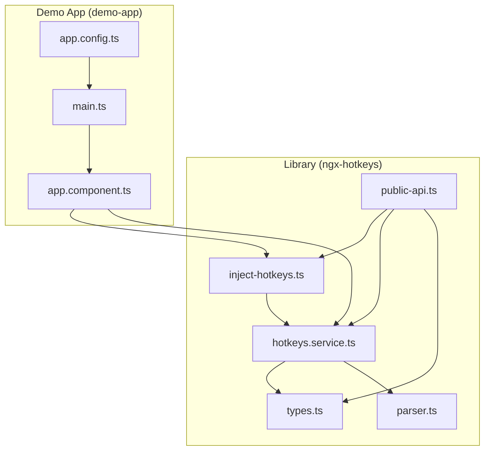
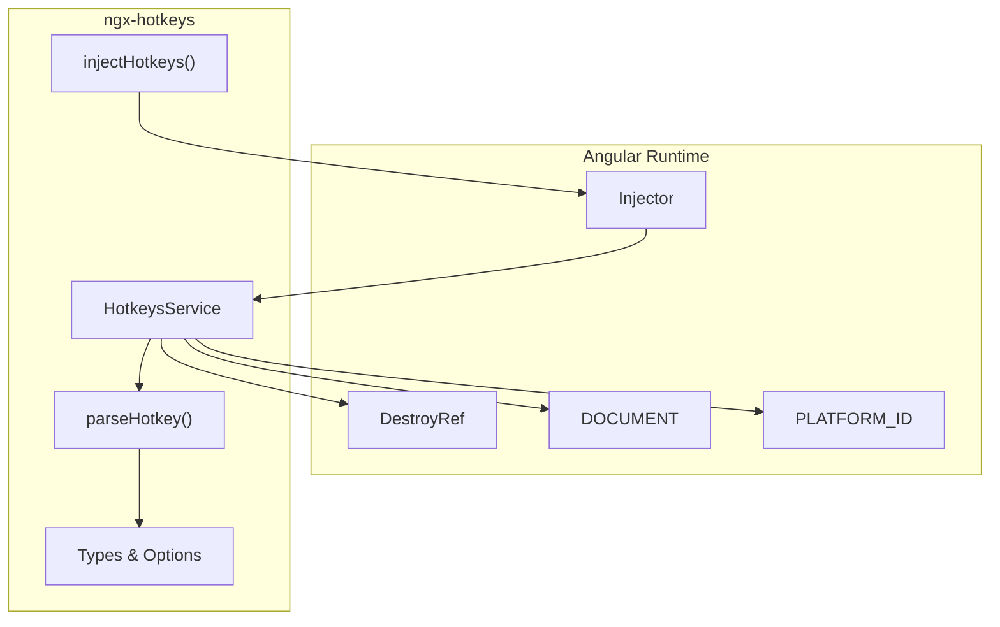
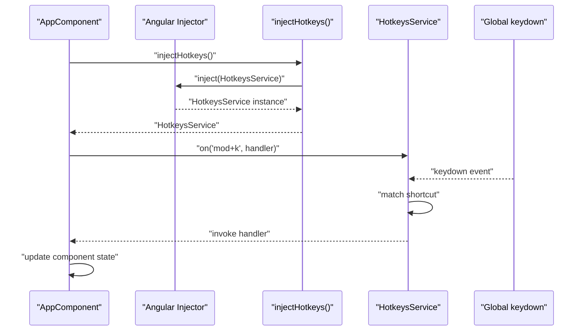
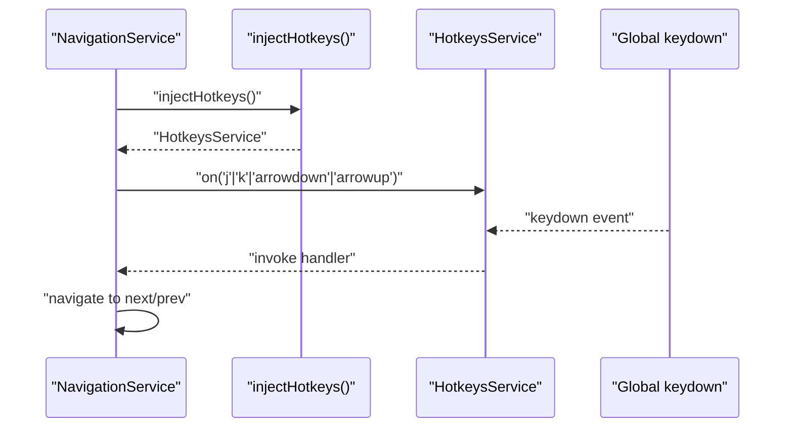
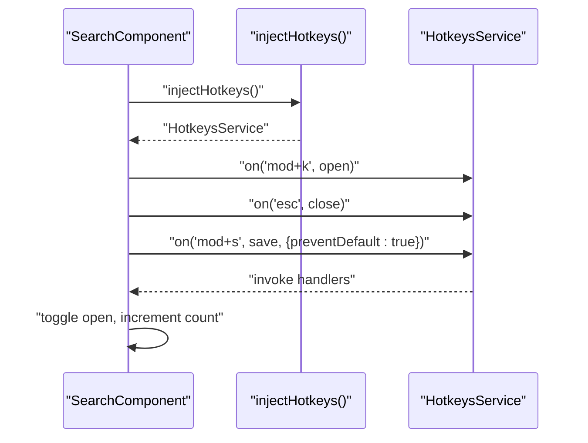
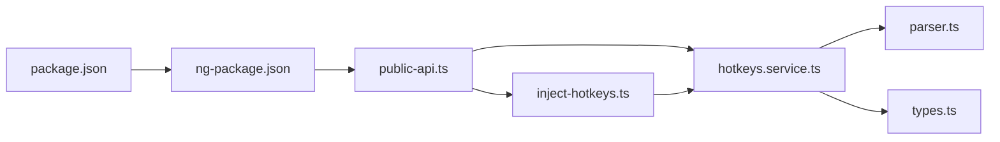

# Angular Integration

<cite>
**Referenced Files in This Document**
- [inject-hotkeys.ts](file://projects/ngx-hotkeys/src/lib/inject-hotkeys.ts)
- [hotkeys.service.ts](file://projects/ngx-hotkeys/src/lib/hotkeys.service.ts)
- [types.ts](file://projects/ngx-hotkeys/src/lib/types.ts)
- [parser.ts](file://projects/ngx-hotkeys/src/lib/parser.ts)
- [public-api.ts](file://projects/ngx-hotkeys/src/lib/public-api.ts)
- [app.component.ts](file://projects/demo-app/src/app/app.component.ts)
- [app.config.ts](file://projects/demo-app/src/app/app.config.ts)
- [main.ts](file://projects/demo-app/src/main.ts)
- [README.md](file://README.md)
- [EXAMPLE.md](file://EXAMPLE.md)
- [package.json](file://projects/ngx-hotkeys/package.json)
- [ng-package.json](file://projects/ngx-hotkeys/ng-package.json)
</cite>

## Table of Contents
1. [Introduction](#introduction)
2. [Project Structure](#project-structure)
3. [Core Components](#core-components)
4. [Architecture Overview](#architecture-overview)
5. [Detailed Component Analysis](#detailed-component-analysis)
6. [Dependency Analysis](#dependency-analysis)
7. [Performance Considerations](#performance-considerations)
8. [Troubleshooting Guide](#troubleshooting-guide)
9. [Conclusion](#conclusion)
10. [Appendices](#appendices)

## Introduction
This document explains Angular integration patterns for ngx-hotkeys, focusing on the injectHotkeys() helper and the singleton HotkeysService architecture. It covers how the library integrates with Angular’s dependency injection system, including standalone component support, and how DestroyRef enables automatic cleanup to prevent memory leaks. It also describes how the service integrates with Angular’s change detection and lifecycle management, and provides practical examples for component injection, service usage, and standalone component scenarios.

## Project Structure
The project is organized into two main areas:
- Library: The ngx-hotkeys package under projects/ngx-hotkeys, containing the core service, helper, types, and parser.
- Demo application: A minimal Angular standalone app under projects/demo-app demonstrating usage patterns.

**Diagram sources**
- [inject-hotkeys.ts:1-7](file://projects/ngx-hotkeys/src/lib/inject-hotkeys.ts#L1-L7)
- [hotkeys.service.ts:1-114](file://projects/ngx-hotkeys/src/lib/hotkeys.service.ts#L1-L114)
- [types.ts:1-16](file://projects/ngx-hotkeys/src/lib/types.ts#L1-L16)
- [parser.ts:1-46](file://projects/ngx-hotkeys/src/lib/parser.ts#L1-L46)
- [public-api.ts:1-4](file://projects/ngx-hotkeys/src/lib/public-api.ts#L1-L4)
- [app.component.ts:1-43](file://projects/demo-app/src/app/app.component.ts#L1-L43)
- [app.config.ts:1-6](file://projects/demo-app/src/app/app.config.ts#L1-L6)
- [main.ts:1-7](file://projects/demo-app/src/main.ts#L1-L7)

**Section sources**
- [package.json:1-31](file://projects/ngx-hotkeys/package.json#L1-L31)
- [ng-package.json:1-8](file://projects/ngx-hotkeys/ng-package.json#L1-L8)

## Core Components
- HotkeysService: Singleton service registered with providedIn: 'root'. It listens to global keydown events, parses shortcuts, and dispatches handlers while respecting options like preventDefault and allowInInput. It uses DestroyRef for automatic cleanup.
- injectHotkeys(): Helper that returns the singleton HotkeysService instance via Angular’s inject() within an injection context.
- Types and Parser: Define HotkeyOptions and ParsedHotkey, and parse human-friendly shortcut strings into normalized structures.

Key integration points:
- Angular DI: HotkeysService is provided in root, enabling injectHotkeys() to resolve the singleton anywhere an injection context exists.
- Standalone components: The demo app demonstrates standalone components using injectHotkeys() in constructors.
- DestroyRef: Ensures event listeners and per-listener cleanup functions are removed on component/service destruction.

**Section sources**
- [hotkeys.service.ts:18-34](file://projects/ngx-hotkeys/src/lib/hotkeys.service.ts#L18-L34)
- [inject-hotkeys.ts:4-6](file://projects/ngx-hotkeys/src/lib/inject-hotkeys.ts#L4-L6)
- [types.ts:1-16](file://projects/ngx-hotkeys/src/lib/types.ts#L1-L16)
- [parser.ts:12-45](file://projects/ngx-hotkeys/src/lib/parser.ts#L12-L45)

## Architecture Overview
The library follows an Angular-native architecture:
- Singleton service pattern with providedIn: 'root'
- Minimal boilerplate via injectHotkeys()
- Automatic lifecycle-aware cleanup via DestroyRef
- Zero external dependencies beyond Angular core and common

**Diagram sources**
- [hotkeys.service.ts:1-114](file://projects/ngx-hotkeys/src/lib/hotkeys.service.ts#L1-L114)
- [inject-hotkeys.ts:1-7](file://projects/ngx-hotkeys/src/lib/inject-hotkeys.ts#L1-L7)
- [parser.ts:1-46](file://projects/ngx-hotkeys/src/lib/parser.ts#L1-L46)
- [types.ts:1-16](file://projects/ngx-hotkeys/src/lib/types.ts#L1-L16)

## Detailed Component Analysis

### injectHotkeys() Helper
Purpose:
- Provides a concise way to obtain the singleton HotkeysService instance within an injection context.
- Encapsulates the underlying inject(HotkeysService) call, simplifying consumer code.

Behavior:
- Must be called within an Angular injection context (constructor, component field initializer, or runInInjectionContext).
- Returns the singleton HotkeysService instance.

Integration:
- Used in standalone components and services to access the global hotkey registry.

**Section sources**
- [inject-hotkeys.ts:4-6](file://projects/ngx-hotkeys/src/lib/inject-hotkeys.ts#L4-L6)
- [README.md:60-63](file://README.md#L60-L63)

### HotkeysService Singleton Architecture
Singleton registration:
- providedIn: 'root' ensures a single HotkeysService instance shared across the application.

Lifecycle and cleanup:
- On construction, registers a global keydown listener when running in a browser platform.
- Uses DestroyRef to:
  - Remove the global keydown listener on application destroy.
  - Register per-listener cleanup functions so individual listeners are removed when their off() function is invoked or when the owning component/service is destroyed.

Keyboard handling:
- Parses shortcuts via parseHotkey().
- Matches against KeyboardEvent modifiers and keys, considering platform differences (mod maps to meta on macOS, ctrl on others).
- Respects options:
  - preventDefault: calls event.preventDefault() when matched.
  - allowInInput: allows triggering even when focus is in inputs/textareas/select/contenteditable.

Change detection:
- The service itself does not rely on Angular’s reactive streams; it operates via DOM events and manual cleanup hooks. Consumers should update component state within handlers; Angular change detection will pick up state changes triggered by those handlers.

**Section sources**
- [hotkeys.service.ts:18-34](file://projects/ngx-hotkeys/src/lib/hotkeys.service.ts#L18-L34)
- [hotkeys.service.ts:36-60](file://projects/ngx-hotkeys/src/lib/hotkeys.service.ts#L36-L60)
- [hotkeys.service.ts:62-98](file://projects/ngx-hotkeys/src/lib/hotkeys.service.ts#L62-L98)
- [hotkeys.service.ts:100-112](file://projects/ngx-hotkeys/src/lib/hotkeys.service.ts#L100-L112)

### Parser and Types
Parser:
- Converts shortcut strings (e.g., mod+k, shift+enter) into a normalized ParsedHotkey structure.
- Supports aliases like esc, space, and arrow keys.
- Throws on invalid input if no key is present.

Types:
- HotkeyOptions: controls preventDefault and allowInInput.
- HotkeyHandler: callback signature for hotkey events.
- ParsedHotkey: normalized representation of a shortcut.

**Section sources**
- [parser.ts:12-45](file://projects/ngx-hotkeys/src/lib/parser.ts#L12-L45)
- [types.ts:1-16](file://projects/ngx-hotkeys/src/lib/types.ts#L1-L16)

### Public API Export
Exports:
- HotkeysService
- injectHotkeys
- HotkeyOptions

This enables consumers to import from 'ngx-hotkeys' directly.

**Section sources**
- [public-api.ts:1-4](file://projects/ngx-hotkeys/src/lib/public-api.ts#L1-L4)

### Integration with Angular’s Dependency Injection and Standalone Components
Standalone component usage:
- The demo app shows a standalone component using injectHotkeys() in its constructor to register global hotkeys.
- The component updates local state in response to hotkey events; Angular change detection handles UI updates.

Service usage:
- Services can also use injectHotkeys() to register application-wide hotkeys, leveraging the singleton behavior.

DestroyRef integration:
- The service registers a global keydown listener during construction.
- It also registers onDestroy callbacks for both the global listener and per-listener cleanup functions, preventing memory leaks when components/services are destroyed.

**Section sources**
- [app.component.ts:11-42](file://projects/demo-app/src/app/app.component.ts#L11-L42)
- [hotkeys.service.ts:22-34](file://projects/ngx-hotkeys/src/lib/hotkeys.service.ts#L22-L34)
- [hotkeys.service.ts:58-59](file://projects/ngx-hotkeys/src/lib/hotkeys.service.ts#L58-L59)
- [README.md:52-55](file://README.md#L52-L55)

### Practical Integration Patterns

#### Component Injection Pattern
- Use injectHotkeys() in a component constructor to register hotkeys scoped to that component.
- Handlers can update component-bound state; Angular change detection will reflect changes.

**Diagram sources**
- [app.component.ts:18-41](file://projects/demo-app/src/app/app.component.ts#L18-L41)
- [inject-hotkeys.ts:4-6](file://projects/ngx-hotkeys/src/lib/inject-hotkeys.ts#L4-L6)
- [hotkeys.service.ts:36-76](file://projects/ngx-hotkeys/src/lib/hotkeys.service.ts#L36-L76)

**Section sources**
- [app.component.ts:18-41](file://projects/demo-app/src/app/app.component.ts#L18-L41)
- [README.md:19-43](file://README.md#L19-L43)

#### Service Usage Pattern
- Register global hotkeys from within a root-provided service using injectHotkeys().
- Ideal for cross-cutting navigation or application-wide actions.

**Diagram sources**
- [EXAMPLE.md:45-69](file://EXAMPLE.md#L45-L69)
- [inject-hotkeys.ts:4-6](file://projects/ngx-hotkeys/src/lib/inject-hotkeys.ts#L4-L6)
- [hotkeys.service.ts:36-76](file://projects/ngx-hotkeys/src/lib/hotkeys.service.ts#L36-L76)

**Section sources**
- [EXAMPLE.md:45-69](file://EXAMPLE.md#L45-L69)

#### Standalone Component Scenario
- Demonstrates standalone components registering hotkeys without importing additional modules.
- The component toggles visibility and updates counters in response to hotkeys.

**Diagram sources**
- [EXAMPLE.md:3-43](file://EXAMPLE.md#L3-L43)
- [inject-hotkeys.ts:4-6](file://projects/ngx-hotkeys/src/lib/inject-hotkeys.ts#L4-L6)
- [hotkeys.service.ts:36-76](file://projects/ngx-hotkeys/src/lib/hotkeys.service.ts#L36-L76)

**Section sources**
- [EXAMPLE.md:3-43](file://EXAMPLE.md#L3-L43)

## Dependency Analysis
External peer dependencies:
- @angular/core and @angular/common (>=17.0.0) are declared as peerDependencies.

Internal dependencies:
- HotkeysService depends on:
  - DOCUMENT for attaching/removing global listeners
  - PLATFORM_ID to guard browser-only behavior
  - DestroyRef for lifecycle cleanup
  - Parser and Types for shortcut parsing and option handling

Build packaging:
- ng-packagr configured to export from public-api.ts into dist/ngx-hotkeys.

**Diagram sources**
- [package.json:22-28](file://projects/ngx-hotkeys/package.json#L22-L28)
- [ng-package.json:4-6](file://projects/ngx-hotkeys/ng-package.json#L4-L6)
- [public-api.ts:1-4](file://projects/ngx-hotkeys/src/lib/public-api.ts#L1-L4)
- [hotkeys.service.ts:1-114](file://projects/ngx-hotkeys/src/lib/hotkeys.service.ts#L1-L114)
- [inject-hotkeys.ts:1-7](file://projects/ngx-hotkeys/src/lib/inject-hotkeys.ts#L1-L7)
- [parser.ts:1-46](file://projects/ngx-hotkeys/src/lib/parser.ts#L1-L46)
- [types.ts:1-16](file://projects/ngx-hotkeys/src/lib/types.ts#L1-L16)

**Section sources**
- [package.json:22-28](file://projects/ngx-hotkeys/package.json#L22-L28)
- [ng-package.json:4-6](file://projects/ngx-hotkeys/ng-package.json#L4-L6)

## Performance Considerations
- Event listener overhead: There is a single global keydown listener attached by the singleton service. Matching is O(N) over active listeners; typical applications register a small number of hotkeys, keeping this negligible.
- Platform checks: Browser-only behavior is guarded by isPlatformBrowser, avoiding unnecessary work on the server.
- Prevent default: Using preventDefault only when necessary reduces interference with browser defaults.
- Input handling: allowInInput can be used to enable hotkeys in inputs when needed, otherwise input focus avoids triggering hotkeys.

[No sources needed since this section provides general guidance]

## Troubleshooting Guide
Common issues and resolutions:
- No effect when typing in inputs:
  - Ensure allowInInput is set to true for the hotkey if intended to work in inputs.
- Hotkeys not firing:
  - Verify the shortcut string is valid and contains a key (parser throws on invalid input).
  - Confirm preventDefault is not interfering with desired browser behavior.
- Memory leaks:
  - Listeners are automatically cleaned up via DestroyRef. If using manual off() functions, ensure they are called when appropriate.
- Standalone components not receiving hotkeys:
  - Ensure injectHotkeys() is called within an injection context (constructor or field initializer).
- Cross-platform modifier keys:
  - mod maps to meta on macOS and ctrl on Windows/Linux; confirm expectations for target platforms.

**Section sources**
- [hotkeys.service.ts:62-98](file://projects/ngx-hotkeys/src/lib/hotkeys.service.ts#L62-L98)
- [parser.ts:40-42](file://projects/ngx-hotkeys/src/lib/parser.ts#L40-L42)
- [README.md:74-81](file://README.md#L74-L81)

## Conclusion
ngx-hotkeys provides a streamlined Angular integration through a singleton HotkeysService and a simple injectHotkeys() helper. The library leverages Angular’s DI and DestroyRef to minimize boilerplate and prevent memory leaks. It supports standalone components and services, integrates seamlessly with Angular’s change detection, and offers straightforward APIs for registering and managing keyboard shortcuts.

[No sources needed since this section summarizes without analyzing specific files]

## Appendices

### API Reference Summary
- injectHotkeys(): Returns the singleton HotkeysService instance.
- HotkeysService.on(shortcut, handler, options?): Registers a hotkey listener; returns an off() function to remove it.
- HotkeyOptions: preventDefault and allowInInput.

**Section sources**
- [README.md:60-81](file://README.md#L60-L81)
- [public-api.ts:1-4](file://projects/ngx-hotkeys/src/lib/public-api.ts#L1-L4)