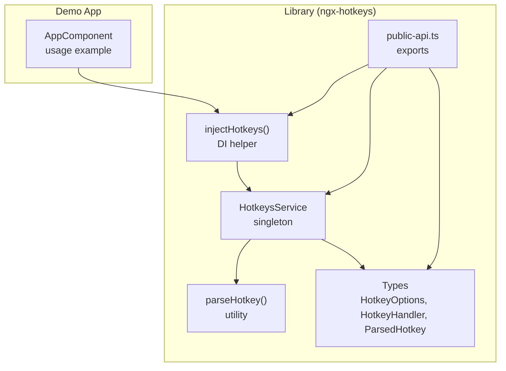
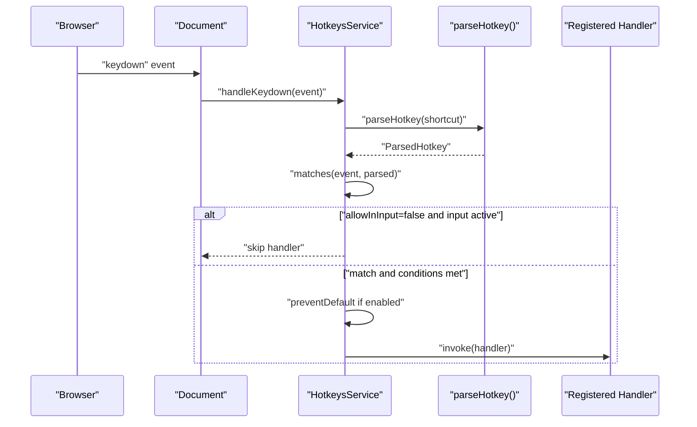
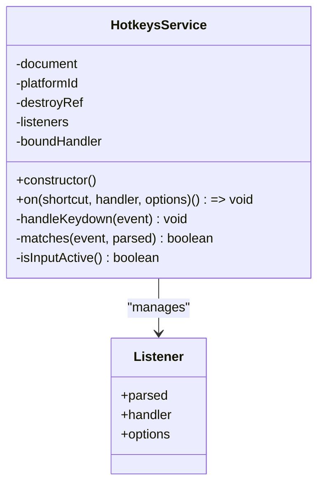
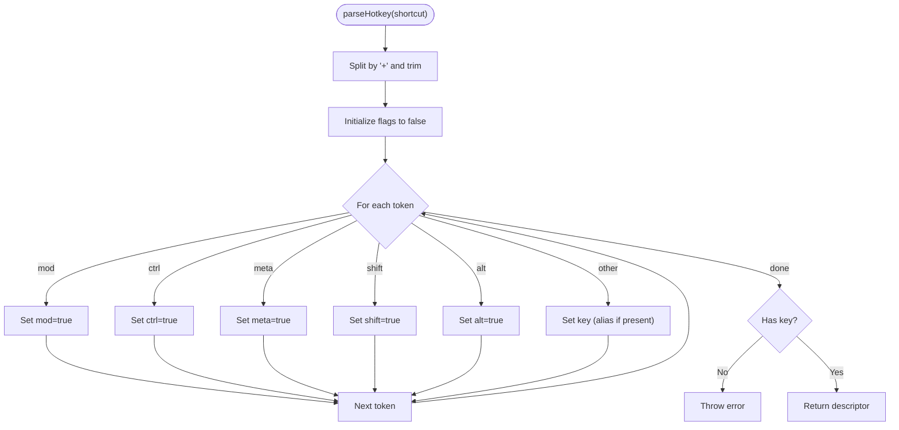
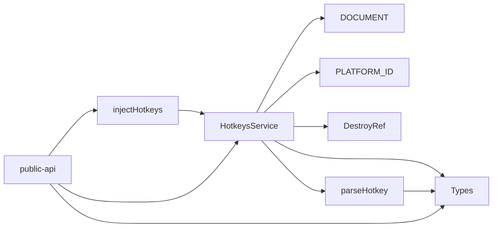

# Core Concepts

<cite>
**Referenced Files in This Document**
- [hotkeys.service.ts](file://projects/ngx-hotkeys/src/lib/hotkeys.service.ts)
- [inject-hotkeys.ts](file://projects/ngx-hotkeys/src/lib/inject-hotkeys.ts)
- [parser.ts](file://projects/ngx-hotkeys/src/lib/parser.ts)
- [types.ts](file://projects/ngx-hotkeys/src/lib/types.ts)
- [public-api.ts](file://projects/ngx-hotkeys/src/lib/public-api.ts)
- [app.component.ts](file://projects/demo-app/src/app/app.component.ts)
- [README.md](file://README.md)
- [EXAMPLE.md](file://EXAMPLE.md)
- [package.json](file://projects/ngx-hotkeys/package.json)
</cite>

## Table of Contents
1. [Introduction](#introduction)
2. [Project Structure](#project-structure)
3. [Core Components](#core-components)
4. [Architecture Overview](#architecture-overview)
5. [Detailed Component Analysis](#detailed-component-analysis)
6. [Dependency Analysis](#dependency-analysis)
7. [Performance Considerations](#performance-considerations)
8. [Troubleshooting Guide](#troubleshooting-guide)
9. [Conclusion](#conclusion)

## Introduction
This document explains the fundamental concepts behind ngx-hotkeys, focusing on Angular integration patterns, the singleton service architecture, event-driven keyboard handling, cross-platform modifier key mapping, input field controls, event prevention, automatic cleanup, and internal architecture. It also includes conceptual diagrams that show how keyboard events flow through the system to handler execution.

## Project Structure
The library is organized into a small set of focused modules:
- A singleton service that listens for global keydown events and dispatches handlers.
- A helper for injecting the service via Angular’s DI.
- A parser utility that converts human-friendly shortcut strings into normalized descriptors.
- A minimal type system defining options and handler signatures.
- A public API re-export for convenient imports.
- A demo application showcasing usage patterns.

**Diagram sources**
- [hotkeys.service.ts:18-34](file://projects/ngx-hotkeys/src/lib/hotkeys.service.ts#L18-L34)
- [inject-hotkeys.ts:4-6](file://projects/ngx-hotkeys/src/lib/inject-hotkeys.ts#L4-L6)
- [parser.ts:12-45](file://projects/ngx-hotkeys/src/lib/parser.ts#L12-L45)
- [types.ts:1-16](file://projects/ngx-hotkeys/src/lib/types.ts#L1-L16)
- [public-api.ts:1-4](file://projects/ngx-hotkeys/src/lib/public-api.ts#L1-L4)
- [app.component.ts:11-42](file://projects/demo-app/src/app/app.component.ts#L11-L42)

**Section sources**
- [package.json:1-31](file://projects/ngx-hotkeys/package.json#L1-L31)
- [README.md:1-127](file://README.md#L1-L127)

## Core Components
- HotkeysService: Singleton service registered in the root injector. It attaches a global keydown listener, manages a registry of listeners keyed by shortcut string, and executes handlers when a matching shortcut is detected. It supports automatic cleanup via Angular’s DestroyRef and cross-platform modifier mapping.
- injectHotkeys(): Angular DI helper that returns the singleton HotkeysService instance.
- parseHotkey(): Utility that parses a shortcut string into a normalized descriptor including modifiers and key.
- Types: Minimal type definitions for options, handler signature, and parsed shortcut structure.
- Public API: Re-exports for convenient imports.

Key behaviors:
- Event-driven keyboard handling: Listens to keydown globally and iterates registered listeners.
- Cross-platform modifier mapping: Uses navigator.platform to detect macOS and map “mod” to meta on macOS and ctrl on Windows/Linux.
- Input field control: Respects allowInInput option to decide whether to trigger in inputs/textareas/select/contenteditable.
- Event prevention: Honors preventDefault option to call event.preventDefault().
- Automatic cleanup: Registers onDestroy callbacks so listeners are removed when the owning injection context is destroyed.

**Section sources**
- [hotkeys.service.ts:18-34](file://projects/ngx-hotkeys/src/lib/hotkeys.service.ts#L18-L34)
- [hotkeys.service.ts:36-60](file://projects/ngx-hotkeys/src/lib/hotkeys.service.ts#L36-L60)
- [hotkeys.service.ts:62-98](file://projects/ngx-hotkeys/src/lib/hotkeys.service.ts#L62-L98)
- [hotkeys.service.ts:100-112](file://projects/ngx-hotkeys/src/lib/hotkeys.service.ts#L100-L112)
- [inject-hotkeys.ts:4-6](file://projects/ngx-hotkeys/src/lib/inject-hotkeys.ts#L4-L6)
- [parser.ts:12-45](file://projects/ngx-hotkeys/src/lib/parser.ts#L12-L45)
- [types.ts:1-16](file://projects/ngx-hotkeys/src/lib/types.ts#L1-L16)
- [public-api.ts:1-4](file://projects/ngx-hotkeys/src/lib/public-api.ts#L1-L4)

## Architecture Overview
The runtime architecture centers on a single HotkeysService instance that:
- Subscribes to keydown events during construction.
- Maintains a map of shortcut strings to arrays of listeners.
- Matches incoming KeyboardEvents against parsed shortcuts.
- Applies input filtering and event prevention rules.
- Invokes handlers and cleans up on destruction.

**Diagram sources**
- [hotkeys.service.ts:26-34](file://projects/ngx-hotkeys/src/lib/hotkeys.service.ts#L26-L34)
- [hotkeys.service.ts:62-98](file://projects/ngx-hotkeys/src/lib/hotkeys.service.ts#L62-L98)
- [parser.ts:12-45](file://projects/ngx-hotkeys/src/lib/parser.ts#L12-L45)

## Detailed Component Analysis

### HotkeysService
Responsibilities:
- Global keydown subscription and unsubscription.
- Listener registration and removal.
- Shortcut parsing and matching.
- Cross-platform modifier resolution.
- Input focus gating and event prevention.
- Automatic cleanup via DestroyRef.

Implementation highlights:
- Singleton via providedIn: 'root'.
- Constructor attaches listener only in browser platforms.
- on() returns an off() function that deregisters the listener and registers it for onDestroy cleanup.
- matches() compares normalized key and modifier states, including macOS vs Windows/Linux mapping for “mod”.
- isInputActive() checks active element tag and contenteditable attribute.
- handleKeydown() iterates all listeners and invokes matching ones.

**Diagram sources**
- [hotkeys.service.ts:7-11](file://projects/ngx-hotkeys/src/lib/hotkeys.service.ts#L7-L11)
- [hotkeys.service.ts:18-34](file://projects/ngx-hotkeys/src/lib/hotkeys.service.ts#L18-L34)
- [hotkeys.service.ts:36-60](file://projects/ngx-hotkeys/src/lib/hotkeys.service.ts#L36-L60)
- [hotkeys.service.ts:62-98](file://projects/ngx-hotkeys/src/lib/hotkeys.service.ts#L62-L98)
- [hotkeys.service.ts:100-112](file://projects/ngx-hotkeys/src/lib/hotkeys.service.ts#L100-L112)

**Section sources**
- [hotkeys.service.ts:18-34](file://projects/ngx-hotkeys/src/lib/hotkeys.service.ts#L18-L34)
- [hotkeys.service.ts:36-60](file://projects/ngx-hotkeys/src/lib/hotkeys.service.ts#L36-L60)
- [hotkeys.service.ts:62-98](file://projects/ngx-hotkeys/src/lib/hotkeys.service.ts#L62-L98)
- [hotkeys.service.ts:100-112](file://projects/ngx-hotkeys/src/lib/hotkeys.service.ts#L100-L112)

### injectHotkeys()
Purpose:
- Provides a concise way to inject the singleton HotkeysService within Angular’s DI context.

Usage:
- Called in constructors, component fields, or runInInjectionContext blocks.

**Section sources**
- [inject-hotkeys.ts:4-6](file://projects/ngx-hotkeys/src/lib/inject-hotkeys.ts#L4-L6)

### Parser Utility (parseHotkey)
Purpose:
- Converts a shortcut string into a normalized descriptor with boolean flags for modifiers and a lowercase key.

Behavior:
- Splits the string by "+" and trims tokens.
- Recognizes modifiers: ctrl, meta, shift, alt, mod.
- Supports aliases for special keys.
- Throws an error if no key is present.

**Diagram sources**
- [parser.ts:12-45](file://projects/ngx-hotkeys/src/lib/parser.ts#L12-L45)

**Section sources**
- [parser.ts:12-45](file://projects/ngx-hotkeys/src/lib/parser.ts#L12-L45)

### Types
Defines:
- HotkeyOptions: preventDefault and allowInInput flags.
- HotkeyHandler: callback signature receiving KeyboardEvent.
- ParsedHotkey: normalized descriptor with key and modifier flags.

**Section sources**
- [types.ts:1-16](file://projects/ngx-hotkeys/src/lib/types.ts#L1-L16)

### Public API
Exports:
- HotkeysService
- injectHotkeys
- HotkeyOptions

**Section sources**
- [public-api.ts:1-4](file://projects/ngx-hotkeys/src/lib/public-api.ts#L1-L4)

### Demo Usage Patterns
The demo demonstrates:
- Registering shortcuts in a component constructor.
- Using “mod” to map to platform-appropriate modifier.
- Triggering handlers with preventDefault to suppress browser defaults.
- Returning an off() function to manually unregister.

**Section sources**
- [app.component.ts:11-42](file://projects/demo-app/src/app/app.component.ts#L11-L42)
- [README.md:17-50](file://README.md#L17-L50)
- [EXAMPLE.md:3-43](file://EXAMPLE.md#L3-L43)

## Dependency Analysis
Internal dependencies:
- HotkeysService depends on:
  - Angular core primitives (inject, PLATFORM_ID, DestroyRef).
  - DOM APIs (DOCUMENT, addEventListener/removeEventListener).
  - Parser utility for shortcut parsing.
  - Types for option and descriptor shapes.
- injectHotkeys depends on HotkeysService.
- Parser depends on Types.
- Public API re-exports depend on the above.

External peer dependencies:
- @angular/common >= 17
- @angular/core >= 17

**Diagram sources**
- [hotkeys.service.ts:1-6](file://projects/ngx-hotkeys/src/lib/hotkeys.service.ts#L1-L6)
- [parser.ts](file://projects/ngx-hotkeys/src/lib/parser.ts#L1)
- [types.ts:1-16](file://projects/ngx-hotkeys/src/lib/types.ts#L1-L16)
- [public-api.ts:1-4](file://projects/ngx-hotkeys/src/lib/public-api.ts#L1-L4)
- [package.json:22-28](file://projects/ngx-hotkeys/package.json#L22-L28)

**Section sources**
- [package.json:22-28](file://projects/ngx-hotkeys/package.json#L22-L28)

## Performance Considerations
- Single global listener: Reduces overhead compared to per-element listeners.
- O(n) iteration over listeners per keydown: Efficient for typical small sets of hotkeys.
- Early exit on non-matching keys: Avoids unnecessary comparisons.
- Minimal allocations: Uses a Map keyed by shortcut string and arrays of listeners.
- Platform guard: Avoids attaching listeners on non-browser platforms.

[No sources needed since this section provides general guidance]

## Troubleshooting Guide
Common issues and resolutions:
- Shortcut not firing in inputs:
  - Ensure allowInInput is set to true when registering the listener.
  - The service checks the active element and skips handlers by default if typing.
- “mod” resolves incorrectly on Linux:
  - “mod” maps to meta on macOS and ctrl on Windows/Linux. On Linux, meta is often mapped to the Windows/Super key; behavior depends on OS/browser.
- Handler not invoked:
  - Verify the shortcut string is valid and contains a key.
  - Confirm preventDefault is not needed for your use case.
- Memory leaks:
  - The service registers onDestroy callbacks for each listener. Manual off() also deregisters and registers onDestroy.
- Preventing browser defaults:
  - Set preventDefault to true when registering to call event.preventDefault().

**Section sources**
- [hotkeys.service.ts:62-76](file://projects/ngx-hotkeys/src/lib/hotkeys.service.ts#L62-L76)
- [hotkeys.service.ts:100-112](file://projects/ngx-hotkeys/src/lib/hotkeys.service.ts#L100-L112)
- [README.md:74-81](file://README.md#L74-L81)
- [EXAMPLE.md:72-77](file://EXAMPLE.md#L72-L77)

## Conclusion
ngx-hotkeys provides a concise, Angular-native solution for keyboard shortcuts:
- Angular integration via a DI helper and a singleton service.
- Event-driven handling with robust cross-platform modifier support.
- Practical controls for input field behavior and event prevention.
- Automatic cleanup to prevent memory leaks.
- Clean internal architecture with a small, focused parser and minimal type system.

[No sources needed since this section summarizes without analyzing specific files]