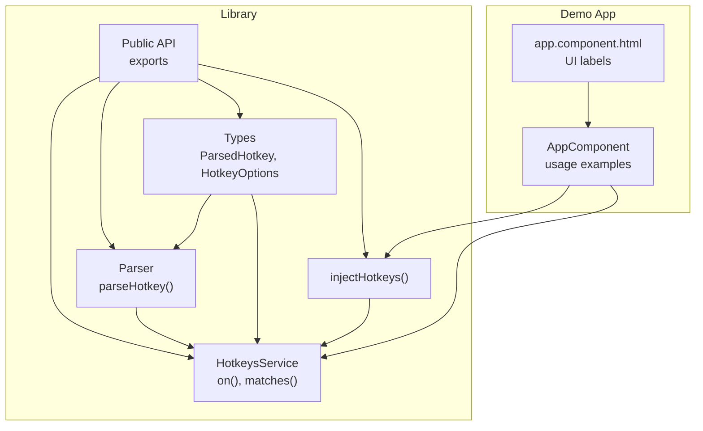
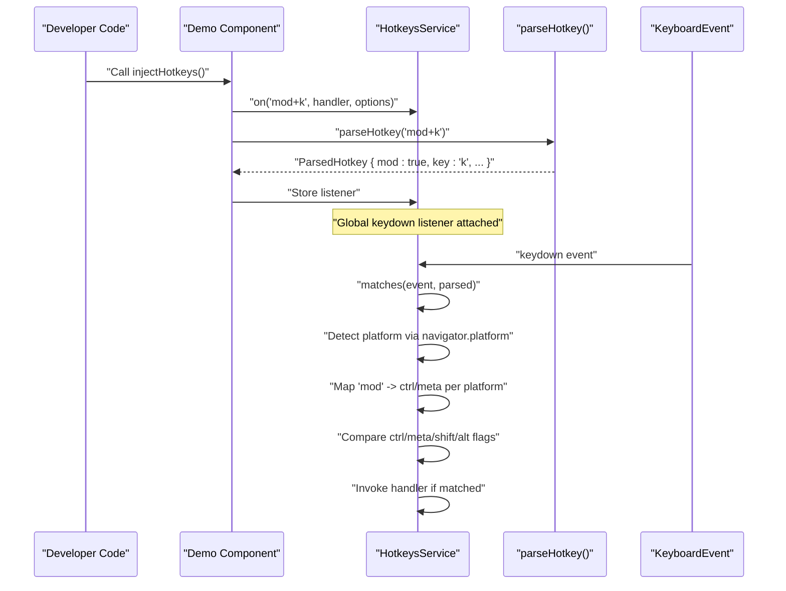
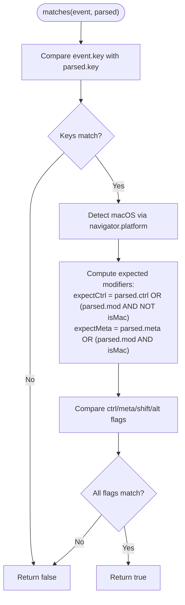
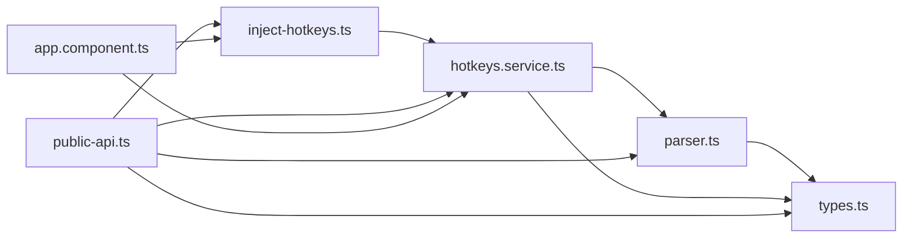

# Cross-Platform Support

<cite>
**Referenced Files in This Document**
- [hotkeys.service.ts](file://projects/ngx-hotkeys/src/lib/hotkeys.service.ts)
- [parser.ts](file://projects/ngx-hotkeys/src/lib/parser.ts)
- [types.ts](file://projects/ngx-hotkeys/src/lib/types.ts)
- [inject-hotkeys.ts](file://projects/ngx-hotkeys/src/lib/inject-hotkeys.ts)
- [public-api.ts](file://projects/ngx-hotkeys/src/lib/public-api.ts)
- [app.component.ts](file://projects/demo-app/src/app/app.component.ts)
- [app.component.html](file://projects/demo-app/src/app/app.component.html)
- [README.md](file://README.md)
</cite>

## Table of Contents
1. [Introduction](#introduction)
2. [Project Structure](#project-structure)
3. [Core Components](#core-components)
4. [Architecture Overview](#architecture-overview)
5. [Detailed Component Analysis](#detailed-component-analysis)
6. [Dependency Analysis](#dependency-analysis)
7. [Performance Considerations](#performance-considerations)
8. [Troubleshooting Guide](#troubleshooting-guide)
9. [Conclusion](#conclusion)

## Introduction
This document explains the cross-platform modifier key support system implemented in the library. It focuses on:
- Automatic macOS vs Windows/Linux detection using navigator.platform
- The 'mod' keyword that maps to Ctrl on Windows/Linux and Cmd on macOS
- Modifier key mapping logic in the matches() method
- Platform-specific behavior differences and how they are abstracted
- Fallback mechanisms and edge cases in platform detection
- Examples demonstrating consistent shortcut behavior across operating systems

## Project Structure
The library is organized around a small set of focused modules:
- Parser: Converts human-readable shortcut strings into normalized descriptors
- Service: Registers listeners, detects platform, and evaluates matches
- Types: Defines the shape of parsed shortcuts and options
- Injection helper: Provides a convenience function to obtain the service
- Public API: Exports the service, injection helper, and options type

**Diagram sources**
- [hotkeys.service.ts:1-114](file://projects/ngx-hotkeys/src/lib/hotkeys.service.ts#L1-L114)
- [parser.ts:1-46](file://projects/ngx-hotkeys/src/lib/parser.ts#L1-L46)
- [types.ts:1-16](file://projects/ngx-hotkeys/src/lib/types.ts#L1-L16)
- [inject-hotkeys.ts:1-7](file://projects/ngx-hotkeys/src/lib/inject-hotkeys.ts#L1-L7)
- [public-api.ts:1-4](file://projects/ngx-hotkeys/src/lib/public-api.ts#L1-L4)
- [app.component.ts:1-43](file://projects/demo-app/src/app/app.component.ts#L1-L43)
- [app.component.html:1-36](file://projects/demo-app/src/app/app.component.html#L1-L36)

**Section sources**
- [hotkeys.service.ts:1-114](file://projects/ngx-hotkeys/src/lib/hotkeys.service.ts#L1-L114)
- [parser.ts:1-46](file://projects/ngx-hotkeys/src/lib/parser.ts#L1-L46)
- [types.ts:1-16](file://projects/ngx-hotkeys/src/lib/types.ts#L1-L16)
- [inject-hotkeys.ts:1-7](file://projects/ngx-hotkeys/src/lib/inject-hotkeys.ts#L1-L7)
- [public-api.ts:1-4](file://projects/ngx-hotkeys/src/lib/public-api.ts#L1-L4)
- [app.component.ts:1-43](file://projects/demo-app/src/app/app.component.ts#L1-L43)
- [app.component.html:1-36](file://projects/demo-app/src/app/app.component.html#L1-L36)
- [README.md:85-101](file://README.md#L85-L101)

## Core Components
- HotkeysService: Central orchestrator that registers listeners, attaches a global keydown handler, and evaluates whether an event matches a parsed shortcut. It performs platform detection and applies the 'mod' mapping logic during matching.
- Parser: Tokenizes shortcut strings and sets flags for modifiers and the target key, including the 'mod' flag.
- Types: Defines ParsedHotkey (with boolean flags for ctrl/meta/shift/alt/mod and the target key) and HotkeyOptions (allowInInput, preventDefault).
- injectHotkeys: Angular injection helper returning the service instance.
- Public API: Re-exports the service, injection helper, and options type for external consumption.

Key responsibilities:
- Platform detection via navigator.platform
- 'mod' normalization to either ctrl or meta depending on platform
- Event-driven matching and handler invocation
- Input focus gating and default prevention options

**Section sources**
- [hotkeys.service.ts:1-114](file://projects/ngx-hotkeys/src/lib/hotkeys.service.ts#L1-L114)
- [parser.ts:1-46](file://projects/ngx-hotkeys/src/lib/parser.ts#L1-L46)
- [types.ts:1-16](file://projects/ngx-hotkeys/src/lib/types.ts#L1-L16)
- [inject-hotkeys.ts:1-7](file://projects/ngx-hotkeys/src/lib/inject-hotkeys.ts#L1-L7)
- [public-api.ts:1-4](file://projects/ngx-hotkeys/src/lib/public-api.ts#L1-L4)

## Architecture Overview
The runtime flow for registering and evaluating shortcuts:

**Diagram sources**
- [app.component.ts:18-41](file://projects/demo-app/src/app/app.component.ts#L18-L41)
- [hotkeys.service.ts:36-98](file://projects/ngx-hotkeys/src/lib/hotkeys.service.ts#L36-L98)
- [parser.ts:12-45](file://projects/ngx-hotkeys/src/lib/parser.ts#L12-L45)

## Detailed Component Analysis

### Platform Detection and 'mod' Mapping
- Platform detection: The service checks navigator.platform to determine if the OS is macOS. This value is used to decide whether 'mod' maps to meta (Cmd) or ctrl (Ctrl).
- 'mod' keyword: The parser recognizes 'mod' and sets the mod flag on the ParsedHotkey. During matching, the service converts this logical 'mod' into the appropriate physical modifier:
  - On macOS: meta (Cmd)
  - On Windows/Linux: ctrl (Ctrl)
- The mapping is encapsulated in the matches() method, ensuring consumers never need to branch by platform.

**Diagram sources**
- [hotkeys.service.ts:78-98](file://projects/ngx-hotkeys/src/lib/hotkeys.service.ts#L78-L98)

**Section sources**
- [hotkeys.service.ts:83-95](file://projects/ngx-hotkeys/src/lib/hotkeys.service.ts#L83-L95)
- [parser.ts:24-38](file://projects/ngx-hotkeys/src/lib/parser.ts#L24-L38)
- [README.md:89-90](file://README.md#L89-L90)

### Modifier Key Mapping Logic in matches()
The matches() method enforces the following rules:
- Key comparison is case-insensitive
- 'mod' is resolved to either ctrl or meta based on platform
- Additional modifiers (ctrl/meta/shift/alt) are compared directly against the event flags
- Only when all expected flags align does the match succeed

This ensures that 'mod+k' behaves consistently across platforms while honoring the developer’s intent encoded in the shortcut string.

**Section sources**
- [hotkeys.service.ts:78-98](file://projects/ngx-hotkeys/src/lib/hotkeys.service.ts#L78-L98)

### Parser Behavior and Edge Cases
- The parser tokenizes the shortcut string by splitting on '+' and trims whitespace
- Recognized tokens:
  - Modifiers: 'ctrl', 'meta', 'shift', 'alt'
  - Special key aliases: 'esc' → 'escape', 'space' → ' ', directional aliases mapped to their canonical names
  - The remaining token is treated as the target key
- Error handling:
  - Throws when no key is found after parsing
- Edge cases:
  - Unknown tokens are treated as literal keys
  - Presence of 'mod' sets the logical flag regardless of platform

**Section sources**
- [parser.ts:12-45](file://projects/ngx-hotkeys/src/lib/parser.ts#L12-L45)

### Input Focus and Default Prevention Options
- Input focus gating: By default, shortcuts are ignored when an input-like element is focused. This can be overridden via allowInInput option.
- Default prevention: When preventDefault is enabled, the service calls event.preventDefault() before invoking the handler.

These options provide predictable behavior in forms and editable content while allowing explicit overrides.

**Section sources**
- [hotkeys.service.ts:62-76](file://projects/ngx-hotkeys/src/lib/hotkeys.service.ts#L62-L76)
- [types.ts:1-16](file://projects/ngx-hotkeys/src/lib/types.ts#L1-L16)

### Example Usage Across Platforms
The demo demonstrates cross-platform shortcuts:
- 'mod+k': Opens a search modal (maps to Cmd on macOS, Ctrl on Windows/Linux)
- 'esc': Closes the modal
- 'j': Increments a counter
- 'shift+enter': Triggers a message
- 'mod+s': Saves and prevents the browser’s default save dialog

These examples illustrate how the same shortcut string yields the intended behavior on each OS without developer intervention.

**Section sources**
- [app.component.ts:18-41](file://projects/demo-app/src/app/app.component.ts#L18-L41)
- [app.component.html:11-17](file://projects/demo-app/src/app/app.component.html#L11-L17)
- [README.md:89-90](file://README.md#L89-L90)

## Dependency Analysis
The library maintains low coupling and clear boundaries:
- Parser depends only on Types
- Service depends on Parser, Types, and Angular DI primitives
- Public API re-exports are minimal and stable
- Demo app depends on the public API surface

**Diagram sources**
- [hotkeys.service.ts:1-114](file://projects/ngx-hotkeys/src/lib/hotkeys.service.ts#L1-L114)
- [parser.ts:1-46](file://projects/ngx-hotkeys/src/lib/parser.ts#L1-L46)
- [types.ts:1-16](file://projects/ngx-hotkeys/src/lib/types.ts#L1-L16)
- [inject-hotkeys.ts:1-7](file://projects/ngx-hotkeys/src/lib/inject-hotkeys.ts#L1-L7)
- [public-api.ts:1-4](file://projects/ngx-hotkeys/src/lib/public-api.ts#L1-L4)
- [app.component.ts:1-43](file://projects/demo-app/src/app/app.component.ts#L1-L43)

**Section sources**
- [hotkeys.service.ts:1-114](file://projects/ngx-hotkeys/src/lib/hotkeys.service.ts#L1-L114)
- [parser.ts:1-46](file://projects/ngx-hotkeys/src/lib/parser.ts#L1-L46)
- [types.ts:1-16](file://projects/ngx-hotkeys/src/lib/types.ts#L1-L16)
- [inject-hotkeys.ts:1-7](file://projects/ngx-hotkeys/src/lib/inject-hotkeys.ts#L1-L7)
- [public-api.ts:1-4](file://projects/ngx-hotkeys/src/lib/public-api.ts#L1-L4)
- [app.component.ts:1-43](file://projects/demo-app/src/app/app.component.ts#L1-L43)

## Performance Considerations
- Single global keydown listener: The service attaches one listener and iterates registered listeners per event, keeping overhead predictable
- Early exits: Matching short-circuits on key mismatch and on any flag mismatch
- Minimal allocations: Parsing produces a small object reused per match
- Avoid unnecessary work: Platform detection occurs only during matching, not on every keystroke

[No sources needed since this section provides general guidance]

## Troubleshooting Guide
Common issues and resolutions:
- Shortcut not triggering on macOS:
  - Verify the shortcut uses 'mod' so it resolves to meta (Cmd)
  - Confirm the key is correct and not shadowed by the browser or OS
- Shortcut firing in input fields:
  - Add { allowInInput: true } to override the default behavior
- Preventing default actions:
  - Use { preventDefault: true } to suppress browser defaults (e.g., save dialogs)
- Invalid shortcut syntax:
  - Ensure the string contains a valid key (parser throws if none is found)
- Edge case: navigator.platform availability:
  - The detection uses navigator.platform; in environments without it, the service falls back to a non-macOS interpretation. If targeting such environments, test thoroughly

**Section sources**
- [hotkeys.service.ts:62-76](file://projects/ngx-hotkeys/src/lib/hotkeys.service.ts#L62-L76)
- [hotkeys.service.ts:83-95](file://projects/ngx-hotkeys/src/lib/hotkeys.service.ts#L83-L95)
- [parser.ts:40-42](file://projects/ngx-hotkeys/src/lib/parser.ts#L40-L42)

## Conclusion
The library abstracts cross-platform modifier differences behind a simple 'mod' keyword and a unified API. Developers write once using 'mod' and rely on the service to resolve the correct physical modifier per OS. The design keeps platform logic centralized, reduces boilerplate, and preserves flexibility through options for input focus and default prevention.