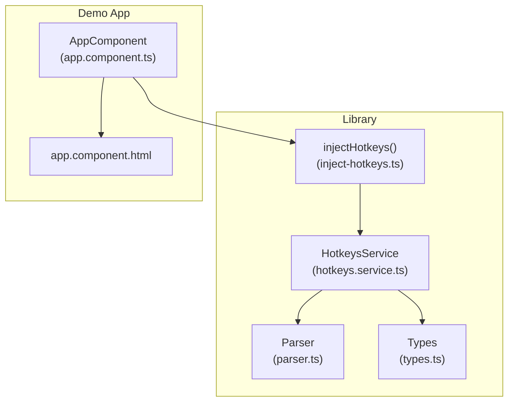
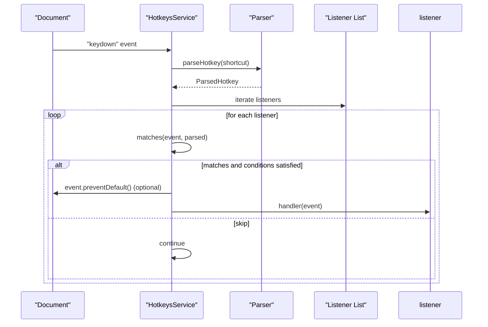
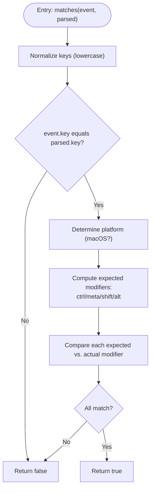
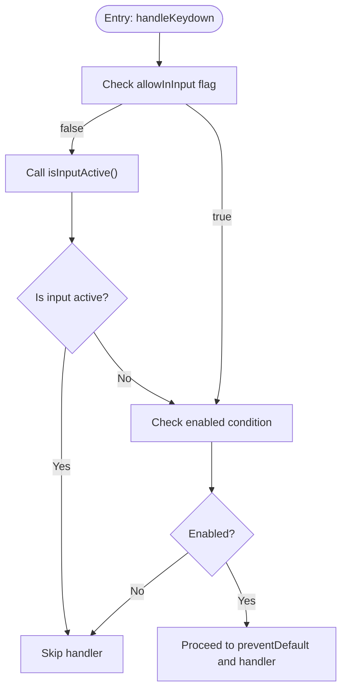
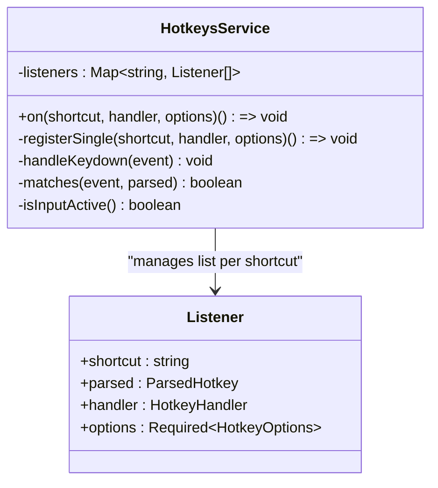
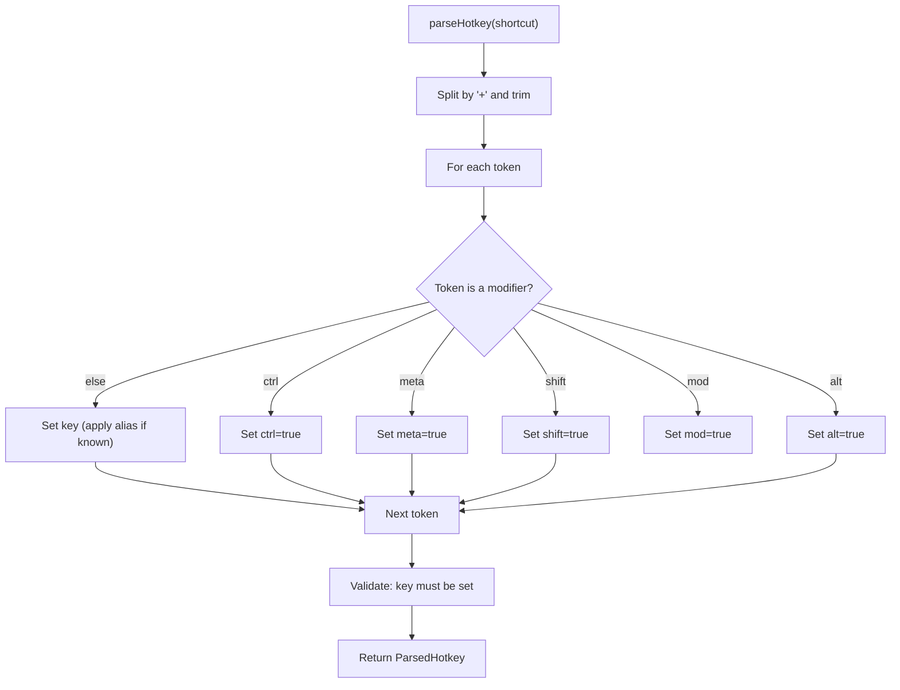
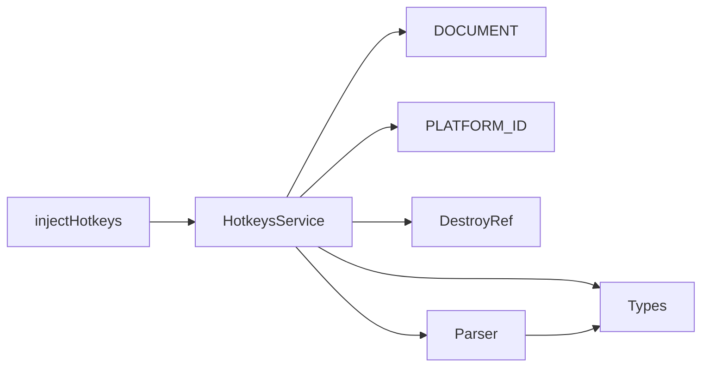

# Event Management

<cite>
**Referenced Files in This Document**
- [hotkeys.service.ts](file://projects/ngx-hotkeys/src/lib/hotkeys.service.ts)
- [parser.ts](file://projects/ngx-hotkeys/src/lib/parser.ts)
- [types.ts](file://projects/ngx-hotkeys/src/lib/types.ts)
- [inject-hotkeys.ts](file://projects/ngx-hotkeys/src/lib/inject-hotkeys.ts)
- [app.component.ts](file://projects/demo-app/src/app/app.component.ts)
- [app.component.html](file://projects/demo-app/src/app/app.component.html)
- [EXAMPLE.md](file://EXAMPLE.md)
- [README.md](file://README.md)
</cite>

## Table of Contents
1. [Introduction](#introduction)
2. [Project Structure](#project-structure)
3. [Core Components](#core-components)
4. [Architecture Overview](#architecture-overview)
5. [Detailed Component Analysis](#detailed-component-analysis)
6. [Dependency Analysis](#dependency-analysis)
7. [Performance Considerations](#performance-considerations)
8. [Troubleshooting Guide](#troubleshooting-guide)
9. [Conclusion](#conclusion)
10. [Appendices](#appendices)

## Introduction
This document explains the event management system for keyboard shortcuts in the Angular library. It focuses on how keydown events are captured, parsed, matched against configured shortcuts, and dispatched to handlers. It also covers input field control, modifier key handling across platforms, browser default behavior management via preventDefault, and the listener registry that supports multiple handlers for the same shortcut.

## Project Structure
The event management system lives in the ngx-hotkeys library module. The core runtime is implemented in a single service that registers a global keydown listener, parses shortcut strings, and dispatches events to registered handlers. The demo application illustrates practical usage patterns.

**Diagram sources**
- [hotkeys.service.ts:1-138](file://projects/ngx-hotkeys/src/lib/hotkeys.service.ts#L1-L138)
- [parser.ts:1-46](file://projects/ngx-hotkeys/src/lib/parser.ts#L1-L46)
- [types.ts:1-19](file://projects/ngx-hotkeys/src/lib/types.ts#L1-L19)
- [inject-hotkeys.ts:1-7](file://projects/ngx-hotkeys/src/lib/inject-hotkeys.ts#L1-L7)
- [app.component.ts:1-43](file://projects/demo-app/src/app/app.component.ts#L1-L43)
- [app.component.html:1-36](file://projects/demo-app/src/app/app.component.html#L1-L36)

**Section sources**
- [hotkeys.service.ts:1-138](file://projects/ngx-hotkeys/src/lib/hotkeys.service.ts#L1-L138)
- [parser.ts:1-46](file://projects/ngx-hotkeys/src/lib/parser.ts#L1-L46)
- [types.ts:1-19](file://projects/ngx-hotkeys/src/lib/types.ts#L1-L19)
- [inject-hotkeys.ts:1-7](file://projects/ngx-hotkeys/src/lib/inject-hotkeys.ts#L1-L7)
- [app.component.ts:1-43](file://projects/demo-app/src/app/app.component.ts#L1-L43)
- [app.component.html:1-36](file://projects/demo-app/src/app/app.component.html#L1-L36)

## Core Components
- HotkeysService: Registers a global keydown listener, manages a listener registry, parses shortcuts, matches events, and dispatches to handlers. It supports preventDefault, input field control, and dynamic enablement.
- Parser: Parses a human-friendly shortcut string into a normalized structure with modifiers and key.
- Types: Defines the handler signature, options, and parsed shortcut shape.
- injectHotkeys: Provides a convenience injector for obtaining the service instance.

Key responsibilities:
- Capture keydown events once globally.
- Parse each shortcut into a structured representation.
- Match incoming KeyboardEvent against parsed shortcuts considering modifiers and platform differences.
- Respect allowInInput and enabled options.
- Optionally call preventDefault on the event.
- Dispatch to all registered handlers for a given shortcut.

**Section sources**
- [hotkeys.service.ts:24-138](file://projects/ngx-hotkeys/src/lib/hotkeys.service.ts#L24-L138)
- [parser.ts:12-46](file://projects/ngx-hotkeys/src/lib/parser.ts#L12-L46)
- [types.ts:1-19](file://projects/ngx-hotkeys/src/lib/types.ts#L1-L19)
- [inject-hotkeys.ts:4-6](file://projects/ngx-hotkeys/src/lib/inject-hotkeys.ts#L4-L6)

## Architecture Overview
The system listens to keydown events at the document level and iterates through all registered listeners. For each listener, it checks whether the event matches the parsed shortcut. If so, it applies options (allowInInput, enabled) and decides whether to call preventDefault before invoking the handler.

**Diagram sources**
- [hotkeys.service.ts:83-100](file://projects/ngx-hotkeys/src/lib/hotkeys.service.ts#L83-L100)
- [hotkeys.service.ts:102-122](file://projects/ngx-hotkeys/src/lib/hotkeys.service.ts#L102-L122)
- [parser.ts:12-46](file://projects/ngx-hotkeys/src/lib/parser.ts#L12-L46)

## Detailed Component Analysis

### KeyboardEvent Handling Architecture
- Global listener: The service attaches a single keydown listener to the document during construction in the browser platform. It removes the listener on destroy to prevent memory leaks.
- Handler pipeline: On each keydown, the service loops through all registered listeners and evaluates each match.

Behavioral highlights:
- Single capture: Only one listener is attached to the document.
- Iterative dispatch: Multiple handlers can be invoked for the same shortcut because the service maintains a list per shortcut.
- Platform-aware modifiers: The matching logic accounts for macOS vs. Windows/Linux differences for the “mod” modifier.

**Section sources**
- [hotkeys.service.ts:32-40](file://projects/ngx-hotkeys/src/lib/hotkeys.service.ts#L32-L40)
- [hotkeys.service.ts:83-100](file://projects/ngx-hotkeys/src/lib/hotkeys.service.ts#L83-L100)

### Event Matching Algorithm (matches)
The matching algorithm compares the incoming KeyboardEvent against a parsed shortcut definition. It performs two stages:

1. Key comparison:
   - Compares normalized keys (case-insensitive) between the event and the parsed shortcut.

2. Modifier validation:
   - Determines expected modifiers based on platform and parsed shortcut:
     - ctrl: expected when parsed.ctrl is true OR parsed.mod is true and platform is not macOS.
     - meta: expected when parsed.meta is true OR parsed.mod is true and platform is macOS.
     - shift: expected when parsed.shift is true.
     - alt: expected when parsed.alt is true.
   - Compares each expected modifier with the corresponding event key state.

**Diagram sources**
- [hotkeys.service.ts:102-122](file://projects/ngx-hotkeys/src/lib/hotkeys.service.ts#L102-L122)

**Section sources**
- [hotkeys.service.ts:102-122](file://projects/ngx-hotkeys/src/lib/hotkeys.service.ts#L102-L122)

### Input Field Control Mechanisms
- allowInInput option: When set to false (default), the service skips handlers if the active element is an input-like control (input, textarea, select) or contenteditable.
- isInputActive detection: The service checks the currently focused element’s tag and contenteditable attribute to decide whether to ignore the shortcut.

**Diagram sources**
- [hotkeys.service.ts:83-100](file://projects/ngx-hotkeys/src/lib/hotkeys.service.ts#L83-L100)
- [hotkeys.service.ts:124-136](file://projects/ngx-hotkeys/src/lib/hotkeys.service.ts#L124-L136)

**Section sources**
- [hotkeys.service.ts:83-100](file://projects/ngx-hotkeys/src/lib/hotkeys.service.ts#L83-L100)
- [hotkeys.service.ts:124-136](file://projects/ngx-hotkeys/src/lib/hotkeys.service.ts#L124-L136)

### preventDefault() and Browser Default Behavior Management
- preventDefault option: When true, the service calls event.preventDefault() before invoking the handler. This allows intercepting browser defaults (e.g., saving dialog on mod+s).
- Event propagation: The service does not stop propagation; it simply calls preventDefault when configured. Handlers receive the event and can themselves call preventDefault or stopPropagation if desired.

Common use cases:
- Intercepting browser save dialog with mod+s.
- Suppressing form submission on Enter in specific contexts.

**Section sources**
- [hotkeys.service.ts:93-96](file://projects/ngx-hotkeys/src/lib/hotkeys.service.ts#L93-L96)
- [README.md:77-81](file://README.md#L77-L81)

### Event Bubbling and Propagation Handling
- The service does not call event.stopPropagation().
- Handlers receive the event and can manage propagation themselves if needed.
- This preserves standard DOM behavior while allowing interception of default actions.

**Section sources**
- [hotkeys.service.ts:93-96](file://projects/ngx-hotkeys/src/lib/hotkeys.service.ts#L93-L96)

### Listener Registry and Multiple Handlers
- Registration model: The service stores a list of listeners per shortcut string. Multiple handlers can be registered for the same shortcut.
- Unregistration: Each registration returns an off function. Calling it removes the specific listener from the list. If the list becomes empty, the shortcut key is removed from the registry.
- Automatic cleanup: When used inside components/services with Angular’s DestroyRef, listeners are removed on destroy.

**Diagram sources**
- [hotkeys.service.ts:7-12](file://projects/ngx-hotkeys/src/lib/hotkeys.service.ts#L7-L12)
- [hotkeys.service.ts:42-81](file://projects/ngx-hotkeys/src/lib/hotkeys.service.ts#L42-L81)

**Section sources**
- [hotkeys.service.ts:29-81](file://projects/ngx-hotkeys/src/lib/hotkeys.service.ts#L29-L81)

### Shortcut Parsing and Aliases
- parseHotkey converts a shortcut string into a normalized structure:
  - Splits by "+" and trims tokens.
  - Recognizes modifiers: ctrl, meta, shift, alt, mod.
  - Recognizes aliases for special keys (e.g., escape, space, arrow keys).
  - Throws an error if no key is present.

**Diagram sources**
- [parser.ts:12-46](file://projects/ngx-hotkeys/src/lib/parser.ts#L12-L46)

**Section sources**
- [parser.ts:12-46](file://projects/ngx-hotkeys/src/lib/parser.ts#L12-L46)

### Practical Usage Patterns and Examples
- Basic usage in a component:
  - Register shortcuts like mod+k, esc, j, shift+enter.
  - Use preventDefault to intercept browser actions (e.g., mod+s).
- Working in inputs:
  - Use allowInInput: true to trigger shortcuts even when typing.
- Manual unregistration:
  - Store the off function returned by on() and call it to remove a listener.
- Automatic cleanup:
  - When used inside components/services, listeners are removed on destroy.

Examples in the repository:
- Component-level registration and preventDefault usage.
- Global shortcuts that work in inputs.
- Unregistering listeners manually.

**Section sources**
- [app.component.ts:18-41](file://projects/demo-app/src/app/app.component.ts#L18-L41)
- [app.component.html:20-24](file://projects/demo-app/src/app/app.component.html#L20-L24)
- [EXAMPLE.md:72-77](file://EXAMPLE.md#L72-L77)
- [README.md:45-54](file://README.md#L45-L54)

## Dependency Analysis
- HotkeysService depends on:
  - DOCUMENT and PLATFORM_ID for attaching/removing the listener.
  - DestroyRef for automatic cleanup.
  - Parser for shortcut parsing.
  - Types for type safety.
- Parser depends on Types for the ParsedHotkey interface.
- injectHotkeys is a thin wrapper around Angular’s inject to obtain HotkeysService.

**Diagram sources**
- [hotkeys.service.ts:1-5](file://projects/ngx-hotkeys/src/lib/hotkeys.service.ts#L1-L5)
- [inject-hotkeys.ts:4-6](file://projects/ngx-hotkeys/src/lib/inject-hotkeys.ts#L4-L6)
- [parser.ts:1-2](file://projects/ngx-hotkeys/src/lib/parser.ts#L1-L2)

**Section sources**
- [hotkeys.service.ts:1-5](file://projects/ngx-hotkeys/src/lib/hotkeys.service.ts#L1-L5)
- [parser.ts:1-2](file://projects/ngx-hotkeys/src/lib/parser.ts#L1-L2)
- [inject-hotkeys.ts:4-6](file://projects/ngx-hotkeys/src/lib/inject-hotkeys.ts#L4-L6)

## Performance Considerations
- Single global listener: Minimizes overhead by avoiding multiple listeners.
- O(n) iteration per keydown: For each event, the service iterates through all registered listeners. This is efficient for typical small sets of shortcuts.
- Early exits: Matching short-circuits on key mismatch and modifier mismatches.
- Platform detection: Determined once per match; negligible cost.
- Memory safety: Automatic cleanup via DestroyRef prevents leaks.

[No sources needed since this section provides general guidance]

## Troubleshooting Guide
- Shortcut not firing:
  - Verify the shortcut string is valid and contains a key.
  - Confirm the platform modifier mapping: mod maps to meta on macOS and ctrl elsewhere.
  - Check enabled option and that the handler is not skipped due to allowInInput and active input focus.
- Interfering with browser defaults:
  - Use preventDefault: true to intercept defaults (e.g., save dialog).
- Conflicts with input fields:
  - Use allowInInput: true to allow shortcuts while typing.
- Multiple handlers not firing:
  - Ensure separate registrations for the same shortcut; the service stores a list per shortcut.
- Cleanup issues:
  - Use the returned off function or rely on automatic cleanup in components/services.

**Section sources**
- [parser.ts:40-42](file://projects/ngx-hotkeys/src/lib/parser.ts#L40-L42)
- [hotkeys.service.ts:102-122](file://projects/ngx-hotkeys/src/lib/hotkeys.service.ts#L102-L122)
- [hotkeys.service.ts:83-100](file://projects/ngx-hotkeys/src/lib/hotkeys.service.ts#L83-L100)
- [README.md:77-81](file://README.md#L77-L81)

## Conclusion
The event management system provides a concise, Angular-native way to register keyboard shortcuts with robust matching, platform-aware modifiers, and flexible options for input handling and default behavior. Its single global listener, listener registry, and automatic cleanup make it suitable for a wide range of applications, from simple hotkeys to complex UI overlays.

[No sources needed since this section summarizes without analyzing specific files]

## Appendices

### API Summary
- HotkeysService.on(shortcut, handler, options?): Registers a shortcut with optional options and returns an off function.
- HotkeyOptions:
  - preventDefault: boolean — call event.preventDefault() on match.
  - allowInInput: boolean — allow triggering in input fields.
  - enabled: boolean | (() => boolean) — dynamic enable/disable.
- ParsedHotkey:
  - key: string — normalized key.
  - ctrl, meta, shift, alt, mod: booleans — modifiers.

**Section sources**
- [types.ts:1-19](file://projects/ngx-hotkeys/src/lib/types.ts#L1-L19)
- [README.md:64-81](file://README.md#L64-L81)