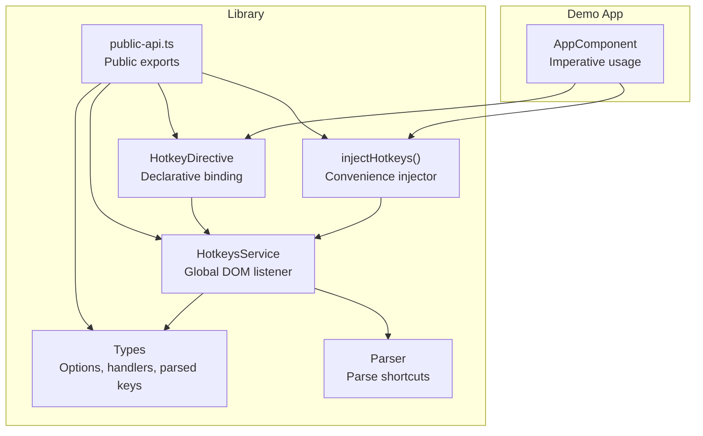
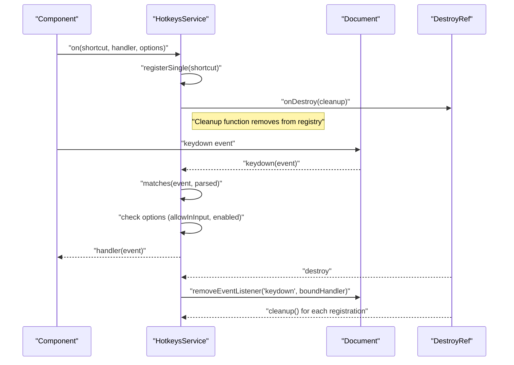
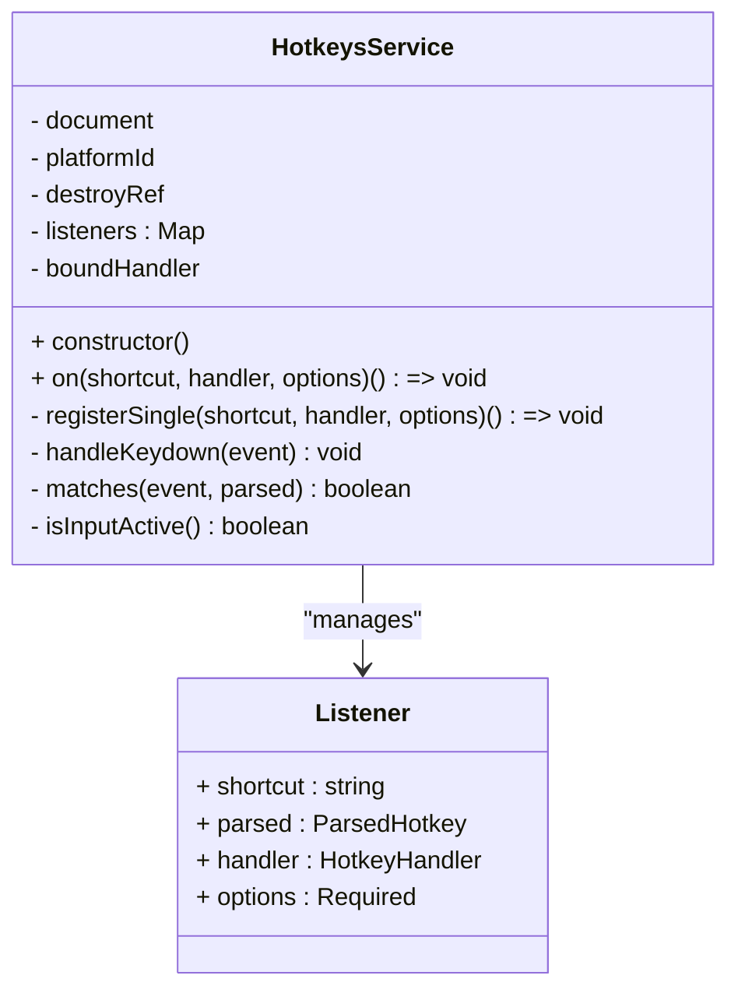
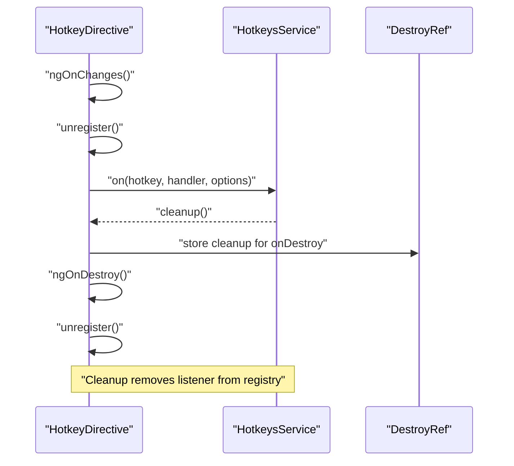
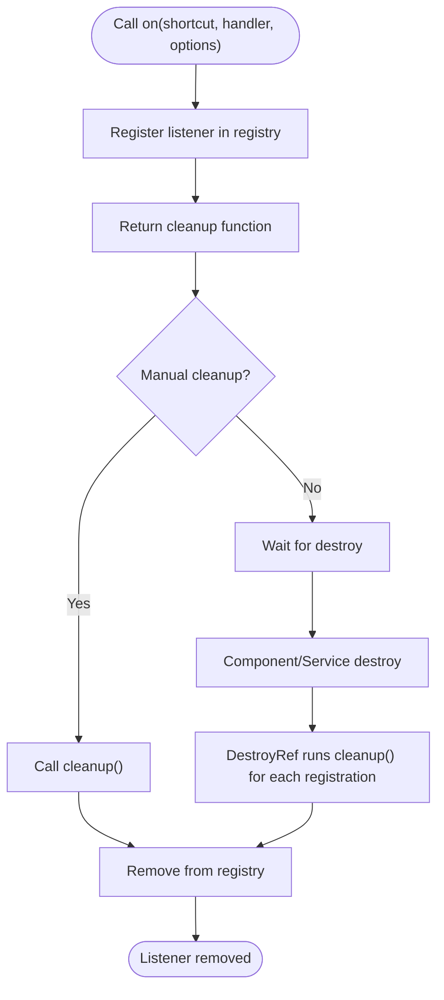
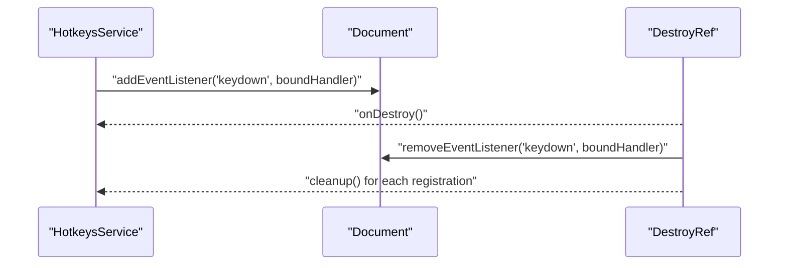
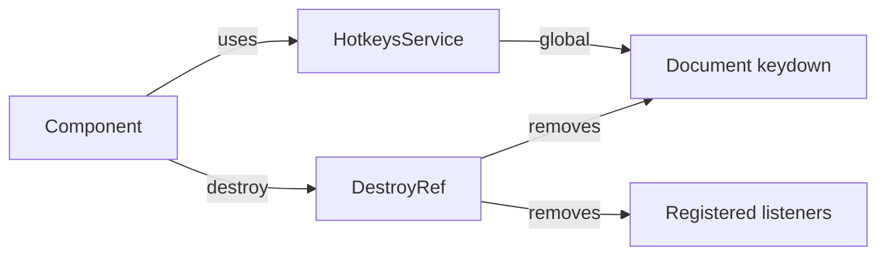
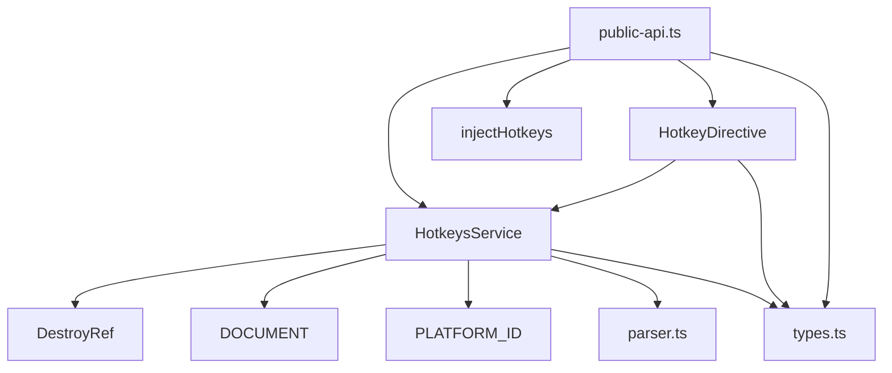

# Lifecycle Management

<cite>
**Referenced Files in This Document**
- [hotkeys.service.ts](file://projects/ngx-hotkeys/src/lib/hotkeys.service.ts)
- [hotkey.directive.ts](file://projects/ngx-hotkeys/src/lib/hotkey.directive.ts)
- [inject-hotkeys.ts](file://projects/ngx-hotkeys/src/lib/inject-hotkeys.ts)
- [types.ts](file://projects/ngx-hotkeys/src/lib/types.ts)
- [parser.ts](file://projects/ngx-hotkeys/src/lib/parser.ts)
- [public-api.ts](file://projects/ngx-hotkeys/src/lib/public-api.ts)
- [app.component.ts](file://projects/demo-app/src/app/app.component.ts)
- [README.md](file://README.md)
- [package.json](file://projects/ngx-hotkeys/package.json)
</cite>

## Table of Contents
1. [Introduction](#introduction)
2. [Project Structure](#project-structure)
3. [Core Components](#core-components)
4. [Architecture Overview](#architecture-overview)
5. [Detailed Component Analysis](#detailed-component-analysis)
6. [Dependency Analysis](#dependency-analysis)
7. [Performance Considerations](#performance-considerations)
8. [Troubleshooting Guide](#troubleshooting-guide)
9. [Conclusion](#conclusion)

## Introduction
This document explains the lifecycle management and cleanup mechanisms in the ngx-hotkeys library. It covers how listeners are automatically removed when components are destroyed, how manual unregistration works via the cleanup function returned by the on() method, and how DOM event listeners are managed during service initialization and teardown. It also documents best practices for preventing memory leaks in long-running applications and demonstrates the relationship between component lifecycles and global keyboard event handling.

## Project Structure
The library is organized around a root-scoped service that manages global keyboard events and a directive that binds hotkeys declaratively. Public APIs expose the service and a convenience injector. The demo app illustrates usage patterns.

**Diagram sources**
- [hotkeys.service.ts:24-40](file://projects/ngx-hotkeys/src/lib/hotkeys.service.ts#L24-L40)
- [hotkey.directive.ts:13-58](file://projects/ngx-hotkeys/src/lib/hotkey.directive.ts#L13-L58)
- [inject-hotkeys.ts:4-6](file://projects/ngx-hotkeys/src/lib/inject-hotkeys.ts#L4-L6)
- [types.ts:1-19](file://projects/ngx-hotkeys/src/lib/types.ts#L1-L19)
- [parser.ts:12-45](file://projects/ngx-hotkeys/src/lib/parser.ts#L12-L45)
- [public-api.ts:1-5](file://projects/ngx-hotkeys/src/lib/public-api.ts#L1-L5)
- [app.component.ts:11-53](file://projects/demo-app/src/app/app.component.ts#L11-L53)

**Section sources**
- [public-api.ts:1-5](file://projects/ngx-hotkeys/src/lib/public-api.ts#L1-L5)
- [package.json:22-29](file://projects/ngx-hotkeys/package.json#L22-L29)

## Core Components
- HotkeysService: Root-scoped service that registers a single global DOM keydown listener and dispatches events to registered hotkey handlers. It integrates with Angular’s DestroyRef to auto-clean up listeners on component/service destruction.
- HotkeyDirective: Declarative directive that binds hotkeys to DOM elements and ensures cleanup on component destroy.
- injectHotkeys: Convenience injector returning the HotkeysService instance.
- Types and Parser: Define hotkey options, handler signatures, and parsing logic for shortcut strings.

Key lifecycle behaviors:
- Global DOM listener is attached in the service constructor when running in the browser.
- Each registration returns a cleanup function that removes the listener from the service’s internal registry.
- DestroyRef is used to register both the global DOM listener removal and individual registrations for automatic cleanup.
- The directive implements OnChanges and OnDestroy to register/unregister on changes and destroy.

**Section sources**
- [hotkeys.service.ts:24-40](file://projects/ngx-hotkeys/src/lib/hotkeys.service.ts#L24-L40)
- [hotkeys.service.ts:42-81](file://projects/ngx-hotkeys/src/lib/hotkeys.service.ts#L42-L81)
- [hotkey.directive.ts:17-58](file://projects/ngx-hotkeys/src/lib/hotkey.directive.ts#L17-L58)
- [inject-hotkeys.ts:4-6](file://projects/ngx-hotkeys/src/lib/inject-hotkeys.ts#L4-L6)
- [types.ts:1-19](file://projects/ngx-hotkeys/src/lib/types.ts#L1-L19)
- [parser.ts:12-45](file://projects/ngx-hotkeys/src/lib/parser.ts#L12-L45)

## Architecture Overview
The service maintains a registry of listeners keyed by shortcut string. Each call to on() registers one or more shortcuts and returns a cleanup function. The service constructor attaches a single global keydown listener to the document. When a keydown event occurs, the service iterates through its registry and invokes matching handlers, respecting options like preventDefault, allowInInput, and dynamic enabled checks.

**Diagram sources**
- [hotkeys.service.ts:32-40](file://projects/ngx-hotkeys/src/lib/hotkeys.service.ts#L32-L40)
- [hotkeys.service.ts:42-81](file://projects/ngx-hotkeys/src/lib/hotkeys.service.ts#L42-L81)
- [hotkeys.service.ts:83-100](file://projects/ngx-hotkeys/src/lib/hotkeys.service.ts#L83-L100)

## Detailed Component Analysis

### HotkeysService Lifecycle and Cleanup
- Global listener setup: The service constructor attaches a single keydown listener to the document when running in the browser. It stores a bound handler and registers a DestroyRef callback to remove the listener on destroy.
- Registration: The on() method accepts a single shortcut or an array of shortcuts. For each shortcut, it parses the shortcut, merges default options, and registers a listener. It returns a cleanup function that removes the listener from the registry.
- Automatic cleanup: Each registration also registers its cleanup function with DestroyRef so that when the component or service is destroyed, all associated listeners are removed automatically.
- Event handling: The handleKeydown method iterates through the registry, checks whether the event matches the parsed shortcut, respects allowInInput and enabled conditions, and optionally prevents default behavior before invoking the handler.

**Diagram sources**
- [hotkeys.service.ts:25-138](file://projects/ngx-hotkeys/src/lib/hotkeys.service.ts#L25-L138)
- [types.ts:1-5](file://projects/ngx-hotkeys/src/lib/types.ts#L1-L5)

**Section sources**
- [hotkeys.service.ts:24-40](file://projects/ngx-hotkeys/src/lib/hotkeys.service.ts#L24-L40)
- [hotkeys.service.ts:42-81](file://projects/ngx-hotkeys/src/lib/hotkeys.service.ts#L42-L81)
- [hotkeys.service.ts:83-136](file://projects/ngx-hotkeys/src/lib/hotkeys.service.ts#L83-L136)

### HotkeyDirective Lifecycle and Cleanup
- Registration on change: The directive registers a listener whenever inputs change (OnChanges). It unregisters any existing listener first to avoid duplicates.
- Destruction cleanup: OnDestroy triggers unregister to remove the listener and clear the cleanup reference.
- Emission: When a matching keydown event occurs, the directive emits a hotkeyTriggered event carrying the KeyboardEvent.

**Diagram sources**
- [hotkey.directive.ts:28-56](file://projects/ngx-hotkeys/src/lib/hotkey.directive.ts#L28-L56)
- [hotkeys.service.ts:42-81](file://projects/ngx-hotkeys/src/lib/hotkeys.service.ts#L42-L81)

**Section sources**
- [hotkey.directive.ts:17-58](file://projects/ngx-hotkeys/src/lib/hotkey.directive.ts#L17-L58)

### Manual Unregistration Pattern
- The on() method returns a cleanup function that removes the listener from the registry. Calling this function immediately unregisters the listener.
- The demo app demonstrates registering multiple shortcuts and relying on automatic cleanup on component destroy.

**Diagram sources**
- [hotkeys.service.ts:42-81](file://projects/ngx-hotkeys/src/lib/hotkeys.service.ts#L42-L81)
- [app.component.ts:19-53](file://projects/demo-app/src/app/app.component.ts#L19-L53)

**Section sources**
- [hotkeys.service.ts:42-81](file://projects/ngx-hotkeys/src/lib/hotkeys.service.ts#L42-L81)
- [README.md:59-68](file://README.md#L59-L68)
- [app.component.ts:19-53](file://projects/demo-app/src/app/app.component.ts#L19-L53)

### Service Initialization and Teardown
- Initialization: The service constructor checks the platform and attaches a single keydown listener to the document. It stores a bound handler and registers a DestroyRef callback to remove the listener on destroy.
- Teardown: On destroy, the service removes the global keydown listener. Additionally, each registration’s cleanup function is executed via DestroyRef, removing the listener from the registry.

**Diagram sources**
- [hotkeys.service.ts:32-40](file://projects/ngx-hotkeys/src/lib/hotkeys.service.ts#L32-L40)

**Section sources**
- [hotkeys.service.ts:32-40](file://projects/ngx-hotkeys/src/lib/hotkeys.service.ts#L32-L40)

### Relationship Between Component Lifecycles and Global Keyboard Event Handling
- Global listener: A single keydown listener is attached to the document at service level, ensuring efficient handling of all hotkeys regardless of component boundaries.
- Component-level cleanup: DestroyRef ensures that both the global listener and all component-scoped registrations are removed when the component or service is destroyed.
- Directive lifecycle: The directive registers/unregisters on changes and destroy, aligning with component lifecycle semantics.

**Diagram sources**
- [hotkeys.service.ts:32-40](file://projects/ngx-hotkeys/src/lib/hotkeys.service.ts#L32-L40)
- [hotkey.directive.ts:33-35](file://projects/ngx-hotkeys/src/lib/hotkey.directive.ts#L33-L35)

**Section sources**
- [hotkeys.service.ts:32-40](file://projects/ngx-hotkeys/src/lib/hotkeys.service.ts#L32-L40)
- [hotkey.directive.ts:33-35](file://projects/ngx-hotkeys/src/lib/hotkey.directive.ts#L33-L35)

## Dependency Analysis
- HotkeysService depends on Angular’s DestroyRef, DOCUMENT, and PLATFORM_ID to manage lifecycle and attach the global listener. It also depends on the parser and types for shortcut parsing and option handling.
- HotkeyDirective depends on HotkeysService and implements lifecycle hooks to manage registration and cleanup.
- Public API re-exports expose the service, injector, directive, and types.

**Diagram sources**
- [hotkeys.service.ts:1-6](file://projects/ngx-hotkeys/src/lib/hotkeys.service.ts#L1-L6)
- [hotkey.directive.ts:1-11](file://projects/ngx-hotkeys/src/lib/hotkey.directive.ts#L1-L11)
- [public-api.ts:1-5](file://projects/ngx-hotkeys/src/lib/public-api.ts#L1-L5)

**Section sources**
- [hotkeys.service.ts:1-6](file://projects/ngx-hotkeys/src/lib/hotkeys.service.ts#L1-L6)
- [hotkey.directive.ts:1-11](file://projects/ngx-hotkeys/src/lib/hotkey.directive.ts#L1-L11)
- [public-api.ts:1-5](file://projects/ngx-hotkeys/src/lib/public-api.ts#L1-L5)

## Performance Considerations
- Single global listener: The service uses one global keydown listener to minimize overhead and reduce the number of event listeners across the application.
- Efficient registry: Listeners are stored in a Map keyed by shortcut string, enabling fast lookup and removal.
- Minimal allocations: Parsing and matching are straightforward and avoid unnecessary object creation during event handling.
- Conditional execution: Options allow skipping handlers when inputs are focused or when disabled, reducing unnecessary work.

[No sources needed since this section provides general guidance]

## Troubleshooting Guide
Common pitfalls and remedies:
- Forgetting to call the cleanup function: If you store the cleanup function but never call it, the listener remains registered. Always call the returned function when you need immediate removal.
- Duplicate registrations: If a component re-registers without unregistering first, multiple handlers can be invoked. The directive’s ngOnChanges and OnDestroy ensure proper cleanup, but if you bypass it, call unregister before re-registering.
- Global listener not removed: Ensure the service is injected within an Angular context that supports DestroyRef. In non-browser environments, the listener is not attached, but in browser contexts, the service removes it on destroy.
- Enabled option misuse: Using a function that always returns false disables the handler. Verify the enabled function’s logic and ensure it reflects the intended state.
- Input focus behavior: If a handler should not trigger while typing, set allowInInput to false. Otherwise, it may fire unexpectedly in input fields.

**Section sources**
- [hotkeys.service.ts:42-81](file://projects/ngx-hotkeys/src/lib/hotkeys.service.ts#L42-L81)
- [hotkey.directive.ts:28-56](file://projects/ngx-hotkeys/src/lib/hotkey.directive.ts#L28-L56)
- [types.ts:1-5](file://projects/ngx-hotkeys/src/lib/types.ts#L1-L5)

## Conclusion
The ngx-hotkeys library provides robust lifecycle management for keyboard shortcuts:
- A single global DOM listener is attached at service initialization and removed on destroy.
- Each registration returns a cleanup function for manual unregistration.
- DestroyRef is used to automatically clean up both the global listener and individual registrations when components or services are destroyed.
- The directive integrates seamlessly with component lifecycles, ensuring listeners are registered on changes and cleaned up on destroy.
These mechanisms prevent memory leaks and support reliable behavior in long-running applications.