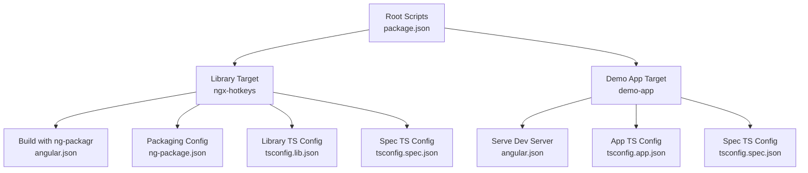
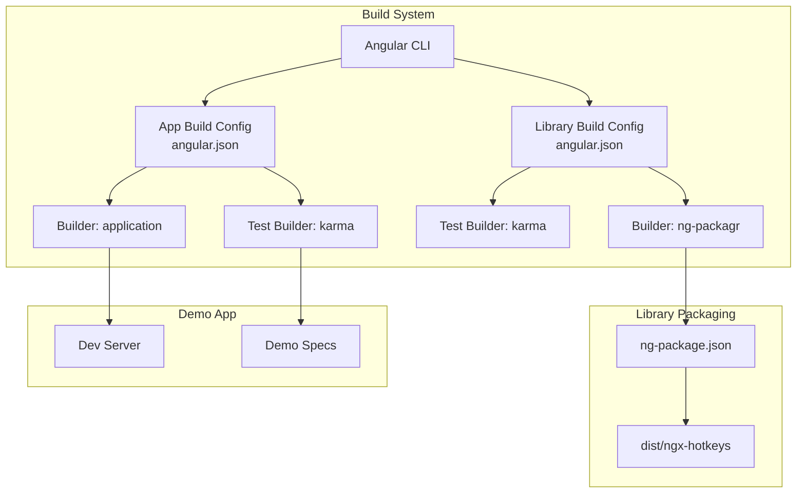
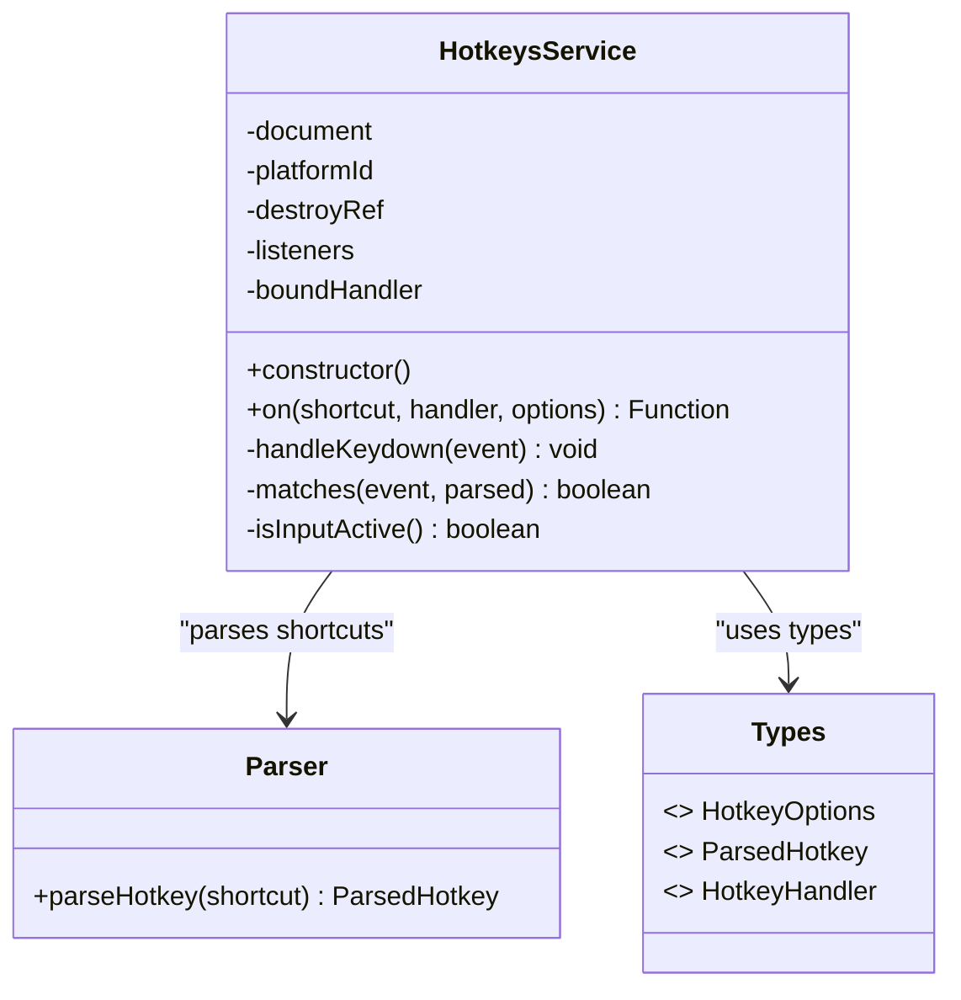
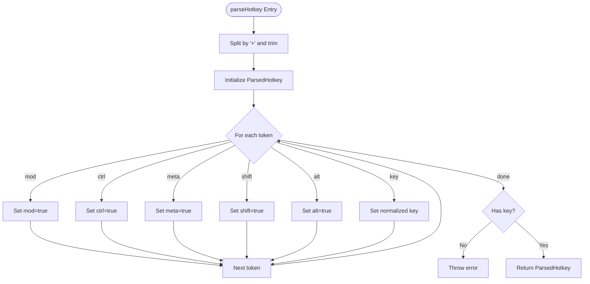
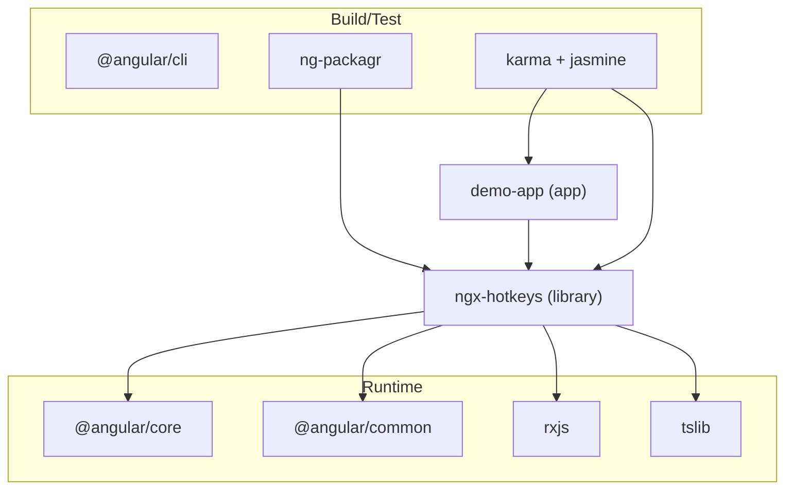

# Development & Testing

<cite>
**Referenced Files in This Document**
- [package.json](file://package.json)
- [angular.json](file://angular.json)
- [projects/ngx-hotkeys/package.json](file://projects/ngx-hotkeys/package.json)
- [projects/ngx-hotkeys/ng-package.json](file://projects/ngx-hotkeys/ng-package.json)
- [projects/ngx-hotkeys/tsconfig.lib.json](file://projects/ngx-hotkeys/tsconfig.lib.json)
- [projects/ngx-hotkeys/tsconfig.spec.json](file://projects/ngx-hotkeys/tsconfig.spec.json)
- [projects/ngx-hotkeys/src/lib/public-api.ts](file://projects/ngx-hotkeys/src/lib/public-api.ts)
- [projects/ngx-hotkeys/src/lib/hotkeys.service.ts](file://projects/ngx-hotkeys/src/lib/hotkeys.service.ts)
- [projects/ngx-hotkeys/src/lib/inject-hotkeys.ts](file://projects/ngx-hotkeys/src/lib/inject-hotkeys.ts)
- [projects/ngx-hotkeys/src/lib/parser.ts](file://projects/ngx-hotkeys/src/lib/parser.ts)
- [projects/ngx-hotkeys/src/lib/types.ts](file://projects/ngx-hotkeys/src/lib/types.ts)
- [projects/demo-app/tsconfig.app.json](file://projects/demo-app/tsconfig.app.json)
- [projects/demo-app/tsconfig.spec.json](file://projects/demo-app/tsconfig.spec.json)
- [projects/demo-app/src/app/app.component.ts](file://projects/demo-app/src/app/app.component.ts)
</cite>

## Table of Contents
1. [Introduction](#introduction)
2. [Project Structure](#project-structure)
3. [Core Components](#core-components)
4. [Architecture Overview](#architecture-overview)
5. [Detailed Component Analysis](#detailed-component-analysis)
6. [Dependency Analysis](#dependency-analysis)
7. [Performance Considerations](#performance-considerations)
8. [Testing Strategies](#testing-strategies)
9. [Debugging Techniques](#debugging-techniques)
10. [Contributing Guidelines](#contributing-guidelines)
11. [Extending the Library](#extending-the-library)
12. [Troubleshooting Guide](#troubleshooting-guide)
13. [Conclusion](#conclusion)

## Introduction
This document provides comprehensive development and testing guidance for ngx-hotkeys. It covers local development setup, build system architecture using Angular CLI and ng-packagr, testing strategies (unit, integration, and end-to-end), keyboard event mocking utilities, contribution guidelines, debugging techniques for hotkey functionality, and extension guidance for adding new features.

## Project Structure
The repository follows an Angular workspace layout with two main projects:
- Library project: ngx-hotkeys (Angular library built with ng-packagr)
- Demo application: demo-app (Angular application showcasing library usage)

Key characteristics:
- Root scripts define build, watch, and test commands scoped to the library target.
- Angular CLI configuration defines separate architect builders for library and application targets.
- Library packaging configuration specifies the destination and entry file for distribution.
- TypeScript configurations isolate library and spec builds with strict compiler options.

**Diagram sources**
- [package.json:5-10](file://package.json#L5-L10)
- [angular.json:6-38](file://angular.json#L6-L38)
- [angular.json:39-132](file://angular.json#L39-L132)
- [projects/ngx-hotkeys/ng-package.json:1-8](file://projects/ngx-hotkeys/ng-package.json#L1-L8)
- [projects/ngx-hotkeys/tsconfig.lib.json:1-18](file://projects/ngx-hotkeys/tsconfig.lib.json#L1-L18)
- [projects/ngx-hotkeys/tsconfig.spec.json:1-14](file://projects/ngx-hotkeys/tsconfig.spec.json#L1-L14)
- [projects/demo-app/tsconfig.app.json:1-15](file://projects/demo-app/tsconfig.app.json#L1-L15)
- [projects/demo-app/tsconfig.spec.json:1-15](file://projects/demo-app/tsconfig.spec.json#L1-L15)

**Section sources**
- [package.json:5-10](file://package.json#L5-L10)
- [angular.json:6-38](file://angular.json#L6-L38)
- [angular.json:39-132](file://angular.json#L39-L132)
- [projects/ngx-hotkeys/ng-package.json:1-8](file://projects/ngx-hotkeys/ng-package.json#L1-L8)
- [projects/ngx-hotkeys/tsconfig.lib.json:1-18](file://projects/ngx-hotkeys/tsconfig.lib.json#L1-L18)
- [projects/ngx-hotkeys/tsconfig.spec.json:1-14](file://projects/ngx-hotkeys/tsconfig.spec.json#L1-L14)
- [projects/demo-app/tsconfig.app.json:1-15](file://projects/demo-app/tsconfig.app.json#L1-L15)
- [projects/demo-app/tsconfig.spec.json:1-15](file://projects/demo-app/tsconfig.spec.json#L1-L15)

## Core Components
The library exposes three primary artifacts via the public API:
- HotkeysService: central service managing global keyboard event listeners and dispatching handlers.
- injectHotkeys: convenience injector for accessing the service.
- HotkeyOptions and related types: configuration and typing for hotkey behavior.

Implementation highlights:
- Event binding occurs only in browser platforms and is cleaned up on destroy.
- Keyboard matching accounts for OS-specific modifier semantics (mod vs meta/ctrl).
- Options allow preventing default behavior and controlling input field handling.

**Section sources**
- [projects/ngx-hotkeys/src/lib/public-api.ts:1-4](file://projects/ngx-hotkeys/src/lib/public-api.ts#L1-L4)
- [projects/ngx-hotkeys/src/lib/hotkeys.service.ts:18-114](file://projects/ngx-hotkeys/src/lib/hotkeys.service.ts#L18-L114)
- [projects/ngx-hotkeys/src/lib/inject-hotkeys.ts:1-7](file://projects/ngx-hotkeys/src/lib/inject-hotkeys.ts#L1-L7)
- [projects/ngx-hotkeys/src/lib/types.ts:1-16](file://projects/ngx-hotkeys/src/lib/types.ts#L1-L16)

## Architecture Overview
The build system leverages Angular CLI with distinct builders:
- Library build: ng-packagr builder configured in angular.json for the ngx-hotkeys target.
- Application build: application builder for demo-app with dev-server support.
- Test builds: karma-based builders for both library and demo app specs.

**Diagram sources**
- [angular.json:11-38](file://angular.json#L11-L38)
- [angular.json:49-130](file://angular.json#L49-L130)
- [projects/ngx-hotkeys/ng-package.json:1-8](file://projects/ngx-hotkeys/ng-package.json#L1-L8)

**Section sources**
- [angular.json:11-38](file://angular.json#L11-L38)
- [angular.json:49-130](file://angular.json#L49-L130)
- [projects/ngx-hotkeys/ng-package.json:1-8](file://projects/ngx-hotkeys/ng-package.json#L1-L8)

## Detailed Component Analysis

### HotkeysService
Responsibilities:
- Registers hotkey listeners with associated handlers and options.
- Matches incoming KeyboardEvents against parsed hotkey definitions.
- Controls default behavior and input field handling based on options.
- Manages lifecycle cleanup on component destruction.

Processing logic:
- Listeners are stored per shortcut and executed on keydown.
- Matching considers OS-specific modifiers (mod maps to meta on macOS, ctrl otherwise).
- Input element detection includes contenteditable elements.

**Diagram sources**
- [projects/ngx-hotkeys/src/lib/hotkeys.service.ts:18-114](file://projects/ngx-hotkeys/src/lib/hotkeys.service.ts#L18-L114)
- [projects/ngx-hotkeys/src/lib/parser.ts:12-46](file://projects/ngx-hotkeys/src/lib/parser.ts#L12-L46)
- [projects/ngx-hotkeys/src/lib/types.ts:1-16](file://projects/ngx-hotkeys/src/lib/types.ts#L1-L16)

**Section sources**
- [projects/ngx-hotkeys/src/lib/hotkeys.service.ts:18-114](file://projects/ngx-hotkeys/src/lib/hotkeys.service.ts#L18-L114)
- [projects/ngx-hotkeys/src/lib/parser.ts:12-46](file://projects/ngx-hotkeys/src/lib/parser.ts#L12-L46)
- [projects/ngx-hotkeys/src/lib/types.ts:1-16](file://projects/ngx-hotkeys/src/lib/types.ts#L1-L16)

### Parser
Responsibilities:
- Parses human-readable hotkey strings into structured ParsedHotkey objects.
- Normalizes aliases (e.g., escape, space, arrow keys).
- Enforces presence of a base key.

Behavior:
- Splits input by '+' and trims tokens.
- Recognizes modifier flags: mod, ctrl, meta, shift, alt.
- Throws on invalid input if no key is found.

**Diagram sources**
- [projects/ngx-hotkeys/src/lib/parser.ts:12-46](file://projects/ngx-hotkeys/src/lib/parser.ts#L12-L46)

**Section sources**
- [projects/ngx-hotkeys/src/lib/parser.ts:12-46](file://projects/ngx-hotkeys/src/lib/parser.ts#L12-L46)

### Public API and Injection
- public-api.ts re-exports the service, injection helper, and types for consumers.
- injectHotkeys provides a concise way to obtain the service instance.

**Section sources**
- [projects/ngx-hotkeys/src/lib/public-api.ts:1-4](file://projects/ngx-hotkeys/src/lib/public-api.ts#L1-L4)
- [projects/ngx-hotkeys/src/lib/inject-hotkeys.ts:1-7](file://projects/ngx-hotkeys/src/lib/inject-hotkeys.ts#L1-L7)

### Demo App Integration
The demo app demonstrates practical usage of the library:
- Subscribes to multiple hotkeys with varying combinations.
- Uses preventDefault option to intercept browser defaults.
- Toggles UI state based on hotkey triggers.

**Section sources**
- [projects/demo-app/src/app/app.component.ts:18-41](file://projects/demo-app/src/app/app.component.ts#L18-L41)

## Dependency Analysis
External dependencies and peer dependencies:
- Angular core libraries and RxJS are runtime dependencies.
- ng-packagr is used for library bundling.
- Karma and Jasmine are used for testing.
- Peer dependencies require Angular >= 17.0.0.

Build-time and runtime relationships:
- Library target depends on Angular core and tslib.
- Demo app consumes the library via import and showcases hotkey usage.

**Diagram sources**
- [package.json:11-37](file://package.json#L11-L37)
- [projects/ngx-hotkeys/package.json:22-29](file://projects/ngx-hotkeys/package.json#L22-L29)

**Section sources**
- [package.json:11-37](file://package.json#L11-L37)
- [projects/ngx-hotkeys/package.json:22-29](file://projects/ngx-hotkeys/package.json#L22-L29)

## Performance Considerations
- Event listener registration is guarded by platform checks to avoid SSR issues.
- Cleanup on destroy prevents memory leaks from accumulating listeners.
- Strict TypeScript configuration improves type safety and reduces runtime errors.
- Production builds enable optimizations and output hashing for demo-app.

[No sources needed since this section provides general guidance]

## Testing Strategies

### Unit Tests
- Library unit tests use Karma and Jasmine with a dedicated spec TS config.
- Test coverage and HTML reporter are configured via Karma options.
- Spec TS config extends the root TS config and includes Jasmine types.

Recommended approach:
- Mock KeyboardEvent for precise assertions on key, modifiers, and default prevention.
- Verify listener registration and removal via returned off functions.
- Test OS-specific modifier behavior (mod vs meta/ctrl) across environments.

**Section sources**
- [angular.json:27-36](file://angular.json#L27-L36)
- [angular.json:112-130](file://angular.json#L112-L130)
- [projects/ngx-hotkeys/tsconfig.spec.json:1-14](file://projects/ngx-hotkeys/tsconfig.spec.json#L1-L14)
- [projects/demo-app/tsconfig.spec.json:1-15](file://projects/demo-app/tsconfig.spec.json#L1-L15)

### Integration Tests
- Use the demo app to validate end-to-end hotkey behavior in a real Angular app.
- Simulate keyboard events programmatically in tests to trigger handlers.
- Confirm preventDefault and allowInInput options produce expected outcomes.

**Section sources**
- [projects/demo-app/src/app/app.component.ts:18-41](file://projects/demo-app/src/app/app.component.ts#L18-L41)

### End-to-End Testing
- Not explicitly configured in the provided files.
- Recommended approach: use a framework like Cypress or Protractor to simulate user interactions and verify UI updates.

[No sources needed since this section provides general guidance]

## Debugging Techniques

Common issues and resolutions:
- Hotkeys not firing in inputs: adjust allowInInput option to permit handlers during input focus.
- Modifiers not recognized on macOS: rely on the mod alias which maps to meta on macOS; ensure shortcuts use mod consistently.
- Prevent default not working: confirm preventDefault is set in options and that the handler runs before browser defaults.
- Memory leaks: verify that returned off functions are called when components are destroyed.

Debug workflow:
- Log parsed hotkey objects to inspect normalization and modifier flags.
- Add console logs inside handlers to trace execution order.
- Use browser devtools to inspect active element and KeyboardEvent properties.

**Section sources**
- [projects/ngx-hotkeys/src/lib/hotkeys.service.ts:62-114](file://projects/ngx-hotkeys/src/lib/hotkeys.service.ts#L62-L114)
- [projects/ngx-hotkeys/src/lib/parser.ts:12-46](file://projects/ngx-hotkeys/src/lib/parser.ts#L12-L46)

## Contributing Guidelines

### Local Development Setup
- Install dependencies: run the standard installation command for the workspace.
- Build the library: use the build script to compile the library target.
- Watch mode: use the watch script to rebuild on changes.
- Run tests: use the test script to execute library specs.

Commands summary:
- Build: [package.json:6](file://package.json#L6)
- Production build: [package.json:7](file://package.json#L7)
- Watch: [package.json:8](file://package.json#L8)
- Test: [package.json:9](file://package.json#L9)

### Development Server
- Serve the demo app using the Angular dev server with development configuration.
- Access the demo app at the default port exposed by the dev server.

**Section sources**
- [package.json:5-10](file://package.json#L5-L10)
- [angular.json:94-105](file://angular.json#L94-L105)

### Code Style and Linting
- Not explicitly configured in the provided files.
- Recommended: adopt Angular CLI defaults and enforce consistent formatting with prettier or similar.

[No sources needed since this section provides general guidance]

### Pull Request Process
- Fork and branch from the default branch.
- Include tests covering new or changed functionality.
- Keep commits focused and documented.
- Reference related issues and update CHANGELOG entries as appropriate.

[No sources needed since this section provides general guidance]

## Extending the Library

### Adding New Features
- Define new types or options in types.ts and export them via public-api.ts.
- Extend parser.ts to support new syntax or aliases.
- Update HotkeysService methods to handle new behaviors while preserving backward compatibility.
- Add unit tests for new parsing and matching logic.

### Publishing Distribution
- Ensure ng-package.json entryFile points to public-api.ts.
- Verify sideEffects flag is set appropriately for tree-shaking.
- Build with production configuration and publish to npm.

**Section sources**
- [projects/ngx-hotkeys/src/lib/public-api.ts:1-4](file://projects/ngx-hotkeys/src/lib/public-api.ts#L1-L4)
- [projects/ngx-hotkeys/ng-package.json:4-6](file://projects/ngx-hotkeys/ng-package.json#L4-L6)
- [projects/ngx-hotkeys/package.json:29](file://projects/ngx-hotkeys/package.json#L29)

## Troubleshooting Guide

Common problems and fixes:
- Keyboard events not captured: verify the service is instantiated in a browser context and that the document is available.
- Handlers not removed: ensure returned off functions are invoked on component destroy.
- Incorrect modifier behavior: confirm whether mod should map to meta (macOS) or ctrl (non-macOS).

Diagnostic steps:
- Inspect activeElement to confirm input focus behavior.
- Log KeyboardEvent properties (key, ctrlKey, metaKey, shiftKey, altKey).
- Validate parsed hotkey structure and modifier flags.

**Section sources**
- [projects/ngx-hotkeys/src/lib/hotkeys.service.ts:26-34](file://projects/ngx-hotkeys/src/lib/hotkeys.service.ts#L26-L34)
- [projects/ngx-hotkeys/src/lib/hotkeys.service.ts:100-112](file://projects/ngx-hotkeys/src/lib/hotkeys.service.ts#L100-L112)

## Conclusion
This guide outlined the development and testing workflow for ngx-hotkeys, including build configuration, testing strategies, debugging techniques, and extension practices. By following the provided scripts, configurations, and recommended patterns, contributors can efficiently develop, validate, and extend the library while maintaining high-quality standards.