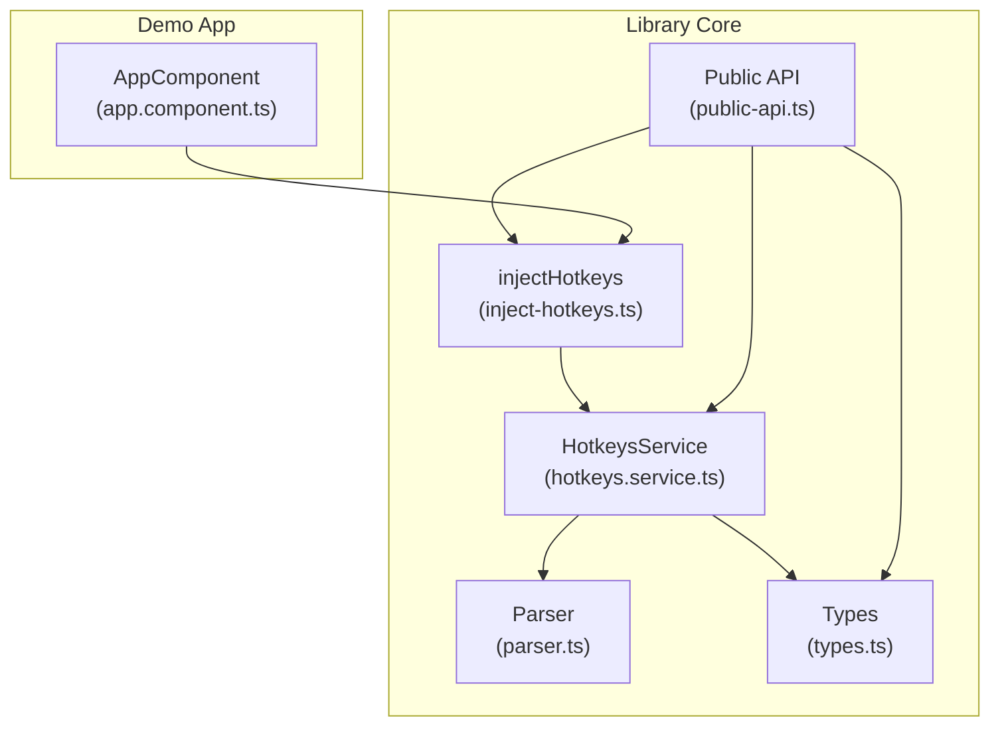
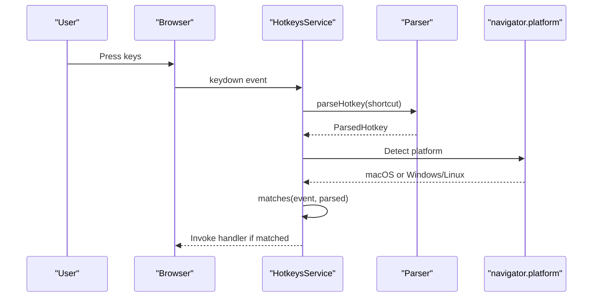
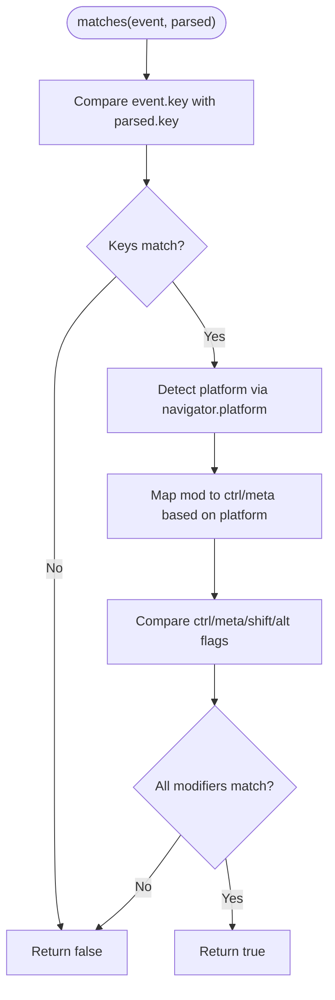
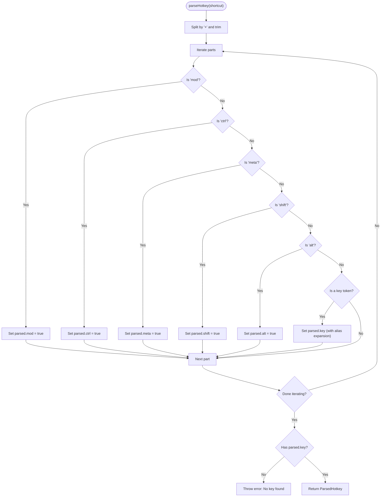
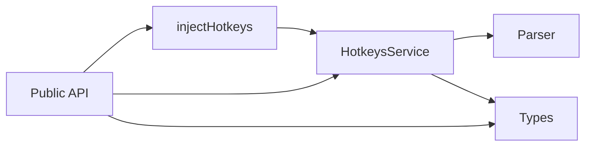

# Cross-Platform Modifier Support

<cite>
**Referenced Files in This Document**
- [hotkeys.service.ts](file://projects/ngx-hotkeys/src/lib/hotkeys.service.ts)
- [parser.ts](file://projects/ngx-hotkeys/src/lib/parser.ts)
- [types.ts](file://projects/ngx-hotkeys/src/lib/types.ts)
- [inject-hotkeys.ts](file://projects/ngx-hotkeys/src/lib/inject-hotkeys.ts)
- [public-api.ts](file://projects/ngx-hotkeys/src/lib/public-api.ts)
- [app.component.ts](file://projects/demo-app/src/app/app.component.ts)
- [README.md](file://README.md)
- [EXAMPLE.md](file://EXAMPLE.md)
</cite>

## Table of Contents
1. [Introduction](#introduction)
2. [Project Structure](#project-structure)
3. [Core Components](#core-components)
4. [Architecture Overview](#architecture-overview)
5. [Detailed Component Analysis](#detailed-component-analysis)
6. [Dependency Analysis](#dependency-analysis)
7. [Performance Considerations](#performance-considerations)
8. [Troubleshooting Guide](#troubleshooting-guide)
9. [Conclusion](#conclusion)

## Introduction
This document explains the cross-platform modifier support functionality in the ngx-hotkeys library. It focuses on how the library automatically detects the operating system and maps the `mod` keyword to the appropriate modifier key (Ctrl on Windows/Linux, Cmd on macOS). The documentation covers the automatic macOS vs Windows/Linux detection system using navigator.platform, the behavior of the `mod` keyword, modifier key detection logic, the matches() method implementation, and practical examples for cross-platform shortcut definitions and testing strategies.

## Project Structure
The ngx-hotkeys library consists of several core files that implement cross-platform modifier support:

- hotkeys.service.ts: Implements the main HotkeysService, including the matches() method that performs cross-platform modifier detection.
- parser.ts: Parses shortcut strings into a structured ParsedHotkey object, recognizing modifiers like mod, ctrl, meta, shift, alt.
- types.ts: Defines the ParsedHotkey interface and related types.
- inject-hotkeys.ts: Provides a convenience injection function for accessing HotkeysService.
- public-api.ts: Exports the public API surface of the library.

**Diagram sources**
- [hotkeys.service.ts:1-114](file://projects/ngx-hotkeys/src/lib/hotkeys.service.ts#L1-L114)
- [parser.ts:1-46](file://projects/ngx-hotkeys/src/lib/parser.ts#L1-L46)
- [types.ts:1-16](file://projects/ngx-hotkeys/src/lib/types.ts#L1-L16)
- [inject-hotkeys.ts:1-7](file://projects/ngx-hotkeys/src/lib/inject-hotkeys.ts#L1-L7)
- [public-api.ts:1-4](file://projects/ngx-hotkeys/src/lib/public-api.ts#L1-L4)
- [app.component.ts:1-43](file://projects/demo-app/src/app/app.component.ts#L1-L43)

**Section sources**
- [hotkeys.service.ts:1-114](file://projects/ngx-hotkeys/src/lib/hotkeys.service.ts#L1-L114)
- [parser.ts:1-46](file://projects/ngx-hotkeys/src/lib/parser.ts#L1-L46)
- [types.ts:1-16](file://projects/ngx-hotkeys/src/lib/types.ts#L1-L16)
- [inject-hotkeys.ts:1-7](file://projects/ngx-hotkeys/src/lib/inject-hotkeys.ts#L1-L7)
- [public-api.ts:1-4](file://projects/ngx-hotkeys/src/lib/public-api.ts#L1-L4)

## Core Components
This section documents the core components responsible for cross-platform modifier support:

- ParsedHotkey interface: Defines the structure of parsed shortcuts, including boolean flags for ctrl, meta, shift, alt, and mod.
- Parser: Converts shortcut strings into ParsedHotkey objects, recognizing modifiers and aliases.
- HotkeysService: Manages keyboard event listeners and implements the matches() method for cross-platform modifier detection.

Key capabilities:
- Automatic OS detection using navigator.platform to determine macOS vs Windows/Linux.
- The mod keyword maps to Ctrl on Windows/Linux and Meta/Cmd on macOS.
- Platform-aware comparison of modifier keys during event matching.

**Section sources**
- [types.ts:8-15](file://projects/ngx-hotkeys/src/lib/types.ts#L8-L15)
- [parser.ts:12-45](file://projects/ngx-hotkeys/src/lib/parser.ts#L12-L45)
- [hotkeys.service.ts:78-98](file://projects/ngx-hotkeys/src/lib/hotkeys.service.ts#L78-L98)

## Architecture Overview
The cross-platform modifier support architecture centers around the HotkeysService, which:
- Registers global keydown listeners in the browser environment.
- Parses shortcut strings into ParsedHotkey objects.
- Compares incoming KeyboardEvents against parsed shortcuts, applying platform-specific logic for the mod keyword.

**Diagram sources**
- [hotkeys.service.ts:62-98](file://projects/ngx-hotkeys/src/lib/hotkeys.service.ts#L62-L98)
- [parser.ts:12-45](file://projects/ngx-hotkeys/src/lib/parser.ts#L12-L45)

## Detailed Component Analysis

### HotkeysService.matches() Method
The matches() method implements the core cross-platform logic:
- Extracts the platform using navigator.platform.
- Maps mod to either ctrl or meta depending on the platform.
- Compares the event's modifier keys against the parsed shortcut's requirements.

**Diagram sources**
- [hotkeys.service.ts:78-98](file://projects/ngx-hotkeys/src/lib/hotkeys.service.ts#L78-L98)

**Section sources**
- [hotkeys.service.ts:78-98](file://projects/ngx-hotkeys/src/lib/hotkeys.service.ts#L78-L98)

### Parser Behavior and Shortcut Parsing
The parser recognizes modifiers and aliases:
- Recognizes mod, ctrl, meta, shift, alt as modifiers.
- Assigns the remaining token as the key, with alias expansion for common keys.
- Throws an error if no key is found.

**Diagram sources**
- [parser.ts:12-45](file://projects/ngx-hotkeys/src/lib/parser.ts#L12-L45)

**Section sources**
- [parser.ts:12-45](file://projects/ngx-hotkeys/src/lib/parser.ts#L12-L45)

### Cross-Platform Modifier Mapping
The library maps the mod keyword to platform-specific modifiers:
- On macOS: mod maps to meta (Cmd).
- On Windows/Linux: mod maps to ctrl (Ctrl).

This mapping ensures consistent behavior across platforms while respecting native conventions.

**Section sources**
- [hotkeys.service.ts:83-88](file://projects/ngx-hotkeys/src/lib/hotkeys.service.ts#L83-L88)

### Practical Examples and Testing Strategies
The demo application demonstrates cross-platform shortcut definitions:
- Using mod+k to open a search overlay.
- Using esc to close the modal.
- Using j to increment a counter.
- Using shift+enter for a specific action.
- Using mod+s with preventDefault to intercept the browser's save dialog.

Testing strategies:
- Test on macOS with Cmd key combinations.
- Test on Windows/Linux with Ctrl key combinations.
- Verify that shortcuts still work when typing in inputs by enabling allowInInput.
- Confirm that preventDefault prevents browser defaults for intercepted shortcuts.

**Section sources**
- [app.component.ts:18-41](file://projects/demo-app/src/app/app.component.ts#L18-L41)
- [README.md:85-101](file://README.md#L85-L101)
- [EXAMPLE.md:22-36](file://EXAMPLE.md#L22-L36)

## Dependency Analysis
The library maintains low coupling and clear responsibilities:
- HotkeysService depends on the parser and types.
- injectHotkeys provides a simple DI accessor for HotkeysService.
- Public API exports ensure consumers access only intended symbols.

**Diagram sources**
- [hotkeys.service.ts:1-114](file://projects/ngx-hotkeys/src/lib/hotkeys.service.ts#L1-L114)
- [parser.ts:1-46](file://projects/ngx-hotkeys/src/lib/parser.ts#L1-L46)
- [types.ts:1-16](file://projects/ngx-hotkeys/src/lib/types.ts#L1-L16)
- [inject-hotkeys.ts:1-7](file://projects/ngx-hotkeys/src/lib/inject-hotkeys.ts#L1-L7)
- [public-api.ts:1-4](file://projects/ngx-hotkeys/src/lib/public-api.ts#L1-L4)

**Section sources**
- [hotkeys.service.ts:1-114](file://projects/ngx-hotkeys/src/lib/hotkeys.service.ts#L1-L114)
- [parser.ts:1-46](file://projects/ngx-hotkeys/src/lib/parser.ts#L1-L46)
- [types.ts:1-16](file://projects/ngx-hotkeys/src/lib/types.ts#L1-L16)
- [inject-hotkeys.ts:1-7](file://projects/ngx-hotkeys/src/lib/inject-hotkeys.ts#L1-L7)
- [public-api.ts:1-4](file://projects/ngx-hotkeys/src/lib/public-api.ts#L1-L4)

## Performance Considerations
- Event listener registration occurs only in the browser environment, avoiding unnecessary overhead on the server side.
- The matches() method performs a straightforward comparison of event properties and computed expectations, minimizing computational cost.
- Listeners are automatically cleaned up when their owning injection context is destroyed, preventing memory leaks.

## Troubleshooting Guide
Common issues and resolutions:
- Shortcuts not triggering on macOS or Windows/Linux:
  - Ensure the shortcut uses mod for cross-platform compatibility.
  - Verify that the platform detection logic is functioning (navigator.platform is available in the browser).
- PreventDefault not working:
  - Confirm that preventDefault is set in HotkeyOptions for the specific shortcut.
  - Ensure the handler is invoked; shortcuts that fail to match will not trigger the handler.
- Shortcuts firing while typing in inputs:
  - By default, shortcuts are ignored when focus is in input/textarea/select or contenteditable elements.
  - Use allowInInput: true to override this behavior when necessary.
- Invalid shortcut syntax:
  - The parser throws an error if no key is found after parsing.
  - Ensure the shortcut string contains a valid key token.

**Section sources**
- [hotkeys.service.ts:62-76](file://projects/ngx-hotkeys/src/lib/hotkeys.service.ts#L62-L76)
- [hotkeys.service.ts:100-112](file://projects/ngx-hotkeys/src/lib/hotkeys.service.ts#L100-L112)
- [parser.ts:40-42](file://projects/ngx-hotkeys/src/lib/parser.ts#L40-L42)

## Conclusion
The ngx-hotkeys library provides robust cross-platform modifier support by automatically detecting the operating system and mapping the mod keyword to the appropriate modifier key. The matches() method implements platform-aware modifier comparisons, while the parser handles shortcut string parsing and validation. The demo application illustrates practical usage patterns, and the troubleshooting guide addresses common issues. Together, these components enable developers to define intuitive, platform-consistent keyboard shortcuts with minimal effort.