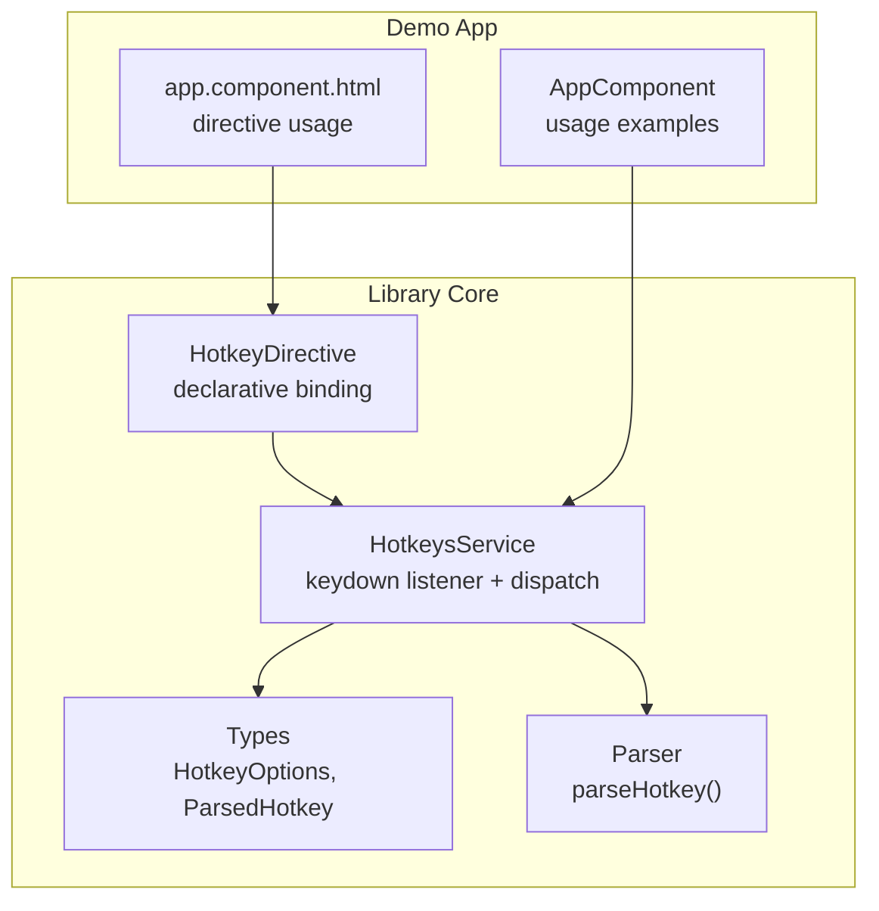
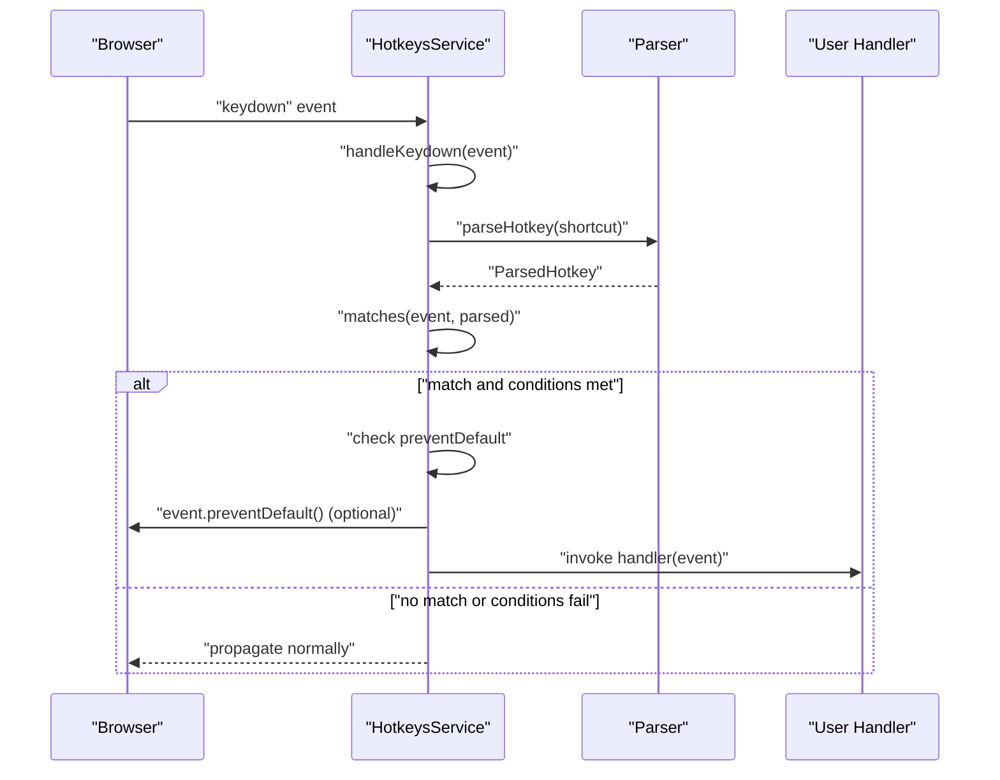
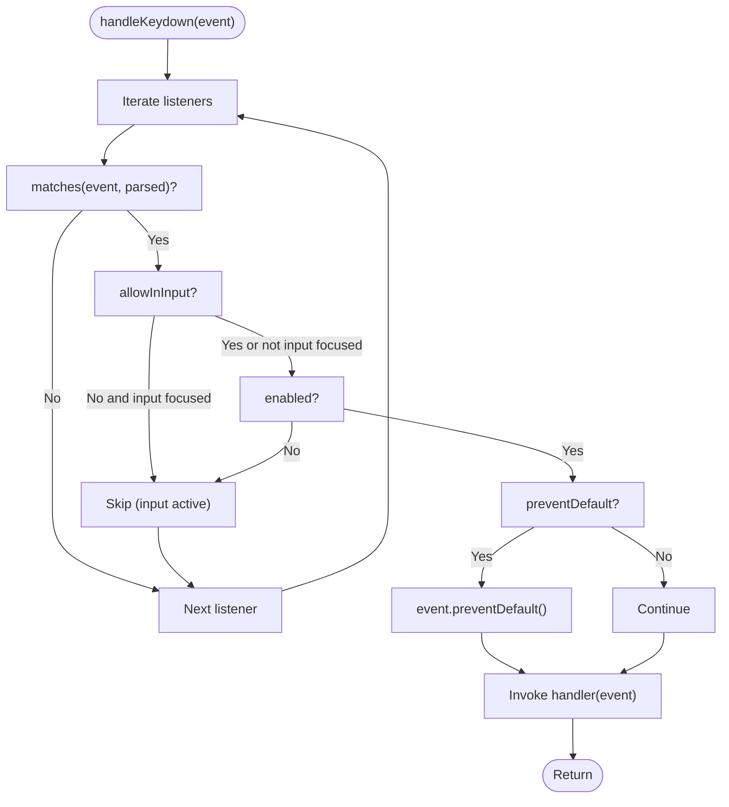
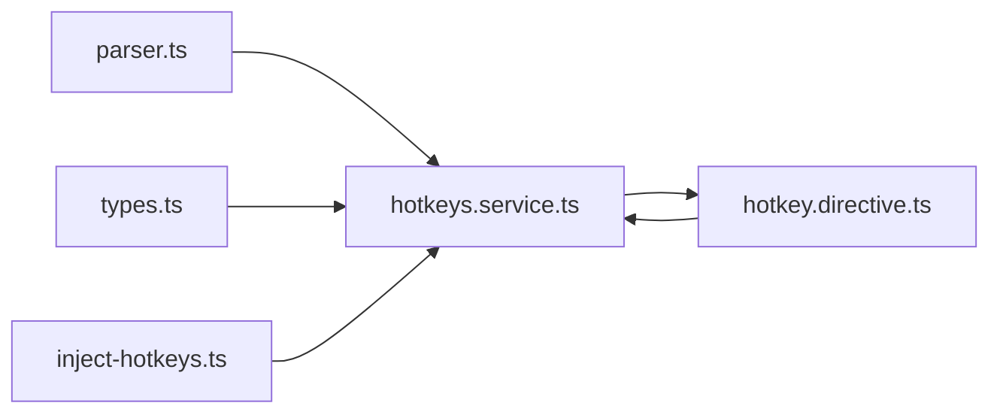

# Event Prevention & Default Behavior

<cite>
**Referenced Files in This Document**
- [hotkeys.service.ts](file://projects/ngx-hotkeys/src/lib/hotkeys.service.ts)
- [hotkey.directive.ts](file://projects/ngx-hotkeys/src/lib/hotkey.directive.ts)
- [types.ts](file://projects/ngx-hotkeys/src/lib/types.ts)
- [parser.ts](file://projects/ngx-hotkeys/src/lib/parser.ts)
- [inject-hotkeys.ts](file://projects/ngx-hotkeys/src/lib/inject-hotkeys.ts)
- [app.component.ts](file://projects/demo-app/src/app/app.component.ts)
- [app.component.html](file://projects/demo-app/src/app/app.component.html)
- [README.md](file://README.md)
- [EXAMPLE.md](file://EXAMPLE.md)
</cite>

## Table of Contents
1. [Introduction](#introduction)
2. [Project Structure](#project-structure)
3. [Core Components](#core-components)
4. [Architecture Overview](#architecture-overview)
5. [Detailed Component Analysis](#detailed-component-analysis)
6. [Dependency Analysis](#dependency-analysis)
7. [Performance Considerations](#performance-considerations)
8. [Troubleshooting Guide](#troubleshooting-guide)
9. [Conclusion](#conclusion)

## Introduction
This document explains how event prevention and default behavior are managed in the ngx-hotkeys library. It focuses on the preventDefault option, the handleKeydown() method implementation, and how these mechanisms control browser default actions for keyboard shortcuts. It also covers the relationship between event prevention and browser-specific behaviors such as page refresh, form submission, and navigation shortcuts, and provides practical guidelines for appropriate usage.

## Project Structure
The library consists of a service-based API and a directive-based API that both expose the preventDefault option. The service listens to global keydown events and dispatches handlers based on parsed shortcuts. The directive binds shortcuts declaratively and forwards events to templates while respecting the same options.

**Diagram sources**
- [hotkeys.service.ts:24-40](file://projects/ngx-hotkeys/src/lib/hotkeys.service.ts#L24-L40)
- [hotkey.directive.ts:13-35](file://projects/ngx-hotkeys/src/lib/hotkey.directive.ts#L13-L35)
- [types.ts:1-19](file://projects/ngx-hotkeys/src/lib/types.ts#L1-L19)
- [parser.ts:12-45](file://projects/ngx-hotkeys/src/lib/parser.ts#L12-L45)
- [app.component.ts:11-62](file://projects/demo-app/src/app/app.component.ts#L11-L62)
- [app.component.html:25-57](file://projects/demo-app/src/app/app.component.html#L25-L57)

**Section sources**
- [hotkeys.service.ts:24-40](file://projects/ngx-hotkeys/src/lib/hotkeys.service.ts#L24-L40)
- [hotkey.directive.ts:13-35](file://projects/ngx-hotkeys/src/lib/hotkey.directive.ts#L13-L35)
- [types.ts:1-19](file://projects/ngx-hotkeys/src/lib/types.ts#L1-L19)
- [parser.ts:12-45](file://projects/ngx-hotkeys/src/lib/parser.ts#L12-L45)
- [app.component.ts:11-62](file://projects/demo-app/src/app/app.component.ts#L11-L62)
- [app.component.html:25-57](file://projects/demo-app/src/app/app.component.html#L25-L57)

## Core Components
- HotkeysService: Registers global keydown listeners, parses shortcuts, and invokes handlers. It respects preventDefault, allowInInput, and enabled options.
- HotkeyDirective: Declarative wrapper around the service, forwarding inputs to the service and emitting events to templates.
- Types: Defines HotkeyOptions, including preventDefault, allowInInput, and enabled.
- Parser: Parses human-readable shortcut strings into normalized ParsedHotkey objects.

Key behaviors:
- preventDefault controls whether event.preventDefault() is called before invoking the handler.
- allowInInput controls whether shortcuts trigger while typing in inputs, textareas, selects, or contenteditable elements.
- enabled allows dynamic enabling/disabling of shortcuts via boolean or function.

**Section sources**
- [hotkeys.service.ts:14-22](file://projects/ngx-hotkeys/src/lib/hotkeys.service.ts#L14-L22)
- [hotkeys.service.ts:83-100](file://projects/ngx-hotkeys/src/lib/hotkeys.service.ts#L83-L100)
- [hotkey.directive.ts:42-50](file://projects/ngx-hotkeys/src/lib/hotkey.directive.ts#L42-L50)
- [types.ts:1-5](file://projects/ngx-hotkeys/src/lib/types.ts#L1-L5)
- [parser.ts:12-45](file://projects/ngx-hotkeys/src/lib/parser.ts#L12-L45)

## Architecture Overview
The library installs a single global keydown listener and iterates through registered listeners to find matches. When a match occurs, it checks conditions and optionally calls event.preventDefault() before invoking the handler.

**Diagram sources**
- [hotkeys.service.ts:32-40](file://projects/ngx-hotkeys/src/lib/hotkeys.service.ts#L32-L40)
- [hotkeys.service.ts:83-100](file://projects/ngx-hotkeys/src/lib/hotkeys.service.ts#L83-L100)
- [parser.ts:12-45](file://projects/ngx-hotkeys/src/lib/parser.ts#L12-L45)

## Detailed Component Analysis

### Event Prevention Mechanism
The preventDefault option is honored during the keydown dispatch loop. When a listener’s preventDefault flag is true, the service calls event.preventDefault() before invoking the handler. This prevents the browser’s default behavior associated with the key combination.

Implementation highlights:
- Default options include preventDefault: false.
- The decision to call preventDefault happens inside handleKeydown() before invoking the handler.
- The directive forwards hotkeyPreventDefault to the service via HotkeyOptions.

Practical examples from the demo:
- Preventing the browser save dialog with mod+s by setting preventDefault: true.
- Using the directive with [hotkeyPreventDefault]="true" to suppress default behavior for a button.

**Section sources**
- [hotkeys.service.ts:14-18](file://projects/ngx-hotkeys/src/lib/hotkeys.service.ts#L14-L18)
- [hotkeys.service.ts:93-96](file://projects/ngx-hotkeys/src/lib/hotkeys.service.ts#L93-L96)
- [hotkey.directive.ts:42-46](file://projects/ngx-hotkeys/src/lib/hotkey.directive.ts#L42-L46)
- [app.component.ts:46-52](file://projects/demo-app/src/app/app.component.ts#L46-L52)
- [app.component.html:40](file://projects/demo-app/src/app/app.component.html#L40)
- [README.md:36](file://README.md#L36)
- [EXAMPLE.md:33-36](file://EXAMPLE.md#L33-L36)

### handleKeydown() Method Implementation
The handleKeydown() method orchestrates:
- Iterating through all registered listeners.
- Checking if the event matches the parsed shortcut.
- Respecting allowInInput and enabled conditions.
- Calling event.preventDefault() when configured.
- Invoking the handler with the original event.

**Diagram sources**
- [hotkeys.service.ts:83-100](file://projects/ngx-hotkeys/src/lib/hotkeys.service.ts#L83-L100)
- [hotkeys.service.ts:102-122](file://projects/ngx-hotkeys/src/lib/hotkeys.service.ts#L102-L122)
- [hotkeys.service.ts:124-136](file://projects/ngx-hotkeys/src/lib/hotkeys.service.ts#L124-L136)

**Section sources**
- [hotkeys.service.ts:83-100](file://projects/ngx-hotkeys/src/lib/hotkeys.service.ts#L83-L100)
- [hotkeys.service.ts:102-122](file://projects/ngx-hotkeys/src/lib/hotkeys.service.ts#L102-L122)
- [hotkeys.service.ts:124-136](file://projects/ngx-hotkeys/src/lib/hotkeys.service.ts#L124-L136)

### Relationship Between Event Prevention and Browser Defaults
- Page refresh: The demo demonstrates preventing the browser save dialog with mod+s. Without preventDefault, pressing mod+s would typically open the browser’s native save dialog.
- Form submission: While not explicitly shown in the demo, the same mechanism applies to shortcuts that would submit forms via Enter in inputs. Setting preventDefault can suppress the default submission behavior.
- Navigation shortcuts: Shortcuts like Escape or custom navigation keys can be prevented from triggering browser-level navigation or focus behaviors when preventDefault is enabled.

Guidelines:
- Use preventDefault when a shortcut is intended to be consumed entirely by your application logic.
- Avoid preventDefault when you want to preserve browser-level behaviors (e.g., native shortcuts for accessibility or OS integration).

**Section sources**
- [app.component.ts:46-52](file://projects/demo-app/src/app/app.component.ts#L46-L52)
- [app.component.html:17](file://projects/demo-app/src/app/app.component.html#L17)
- [README.md:36](file://README.md#L36)
- [EXAMPLE.md:33-36](file://EXAMPLE.md#L33-L36)

### Practical Scenarios and Guidelines
- Use preventDefault when:
  - Intercepting browser dialogs (e.g., mod+s to save).
  - Preventing form submission or page reload triggers.
  - Implementing custom navigation within the app.
- Avoid preventDefault when:
  - You want to allow browser-level shortcuts to function (e.g., Escape for closing modals).
  - The shortcut is meant to complement, not replace, browser behavior.

Examples from the demo:
- Service API with preventDefault for mod+s.
- Directive API with [hotkeyPreventDefault]="true" for a button.

**Section sources**
- [app.component.ts:46-52](file://projects/demo-app/src/app/app.component.ts#L46-L52)
- [app.component.html:40](file://projects/demo-app/src/app/app.component.html#L40)
- [README.md:36](file://README.md#L36)
- [EXAMPLE.md:33-36](file://EXAMPLE.md#L33-L36)

## Dependency Analysis
The service depends on the parser for shortcut parsing and on DOM APIs for event handling. The directive depends on the service and exposes inputs that map to HotkeyOptions.

**Diagram sources**
- [parser.ts:12-45](file://projects/ngx-hotkeys/src/lib/parser.ts#L12-L45)
- [hotkeys.service.ts:5-6](file://projects/ngx-hotkeys/src/lib/hotkeys.service.ts#L5-L6)
- [types.ts:1-19](file://projects/ngx-hotkeys/src/lib/types.ts#L1-L19)
- [hotkey.directive.ts:10-11](file://projects/ngx-hotkeys/src/lib/hotkey.directive.ts#L10-L11)
- [inject-hotkeys.ts:1-6](file://projects/ngx-hotkeys/src/lib/inject-hotkeys.ts#L1-L6)

**Section sources**
- [hotkeys.service.ts:5-6](file://projects/ngx-hotkeys/src/lib/hotkeys.service.ts#L5-L6)
- [hotkey.directive.ts:10-11](file://projects/ngx-hotkeys/src/lib/hotkey.directive.ts#L10-L11)
- [parser.ts:12-45](file://projects/ngx-hotkeys/src/lib/parser.ts#L12-L45)
- [types.ts:1-19](file://projects/ngx-hotkeys/src/lib/types.ts#L1-L19)
- [inject-hotkeys.ts:1-6](file://projects/ngx-hotkeys/src/lib/inject-hotkeys.ts#L1-L6)

## Performance Considerations
- Single global listener: The service attaches one keydown listener and iterates through registered listeners. This minimizes overhead compared to per-element listeners.
- Early exits: Conditions such as allowInInput and enabled short-circuit evaluation to avoid unnecessary work.
- Parsing cost: Shortcut parsing occurs once per registration; runtime matching relies on simple property comparisons.

[No sources needed since this section provides general guidance]

## Troubleshooting Guide
Common issues and resolutions:
- Shortcut not firing in inputs:
  - Ensure allowInInput is set to true when you want shortcuts to trigger while typing.
- Shortcut still triggers in inputs:
  - Verify allowInInput is false (default) and that the input element is focused.
- preventDefault not taking effect:
  - Confirm preventDefault is set to true either in the service API options or via the directive’s hotkeyPreventDefault input.
- Conflicts with browser defaults:
  - If a shortcut opens a modal or performs an action, consider enabling preventDefault to avoid unintended browser behaviors (e.g., save dialog, navigation).
- Dynamic enablement:
  - Use the enabled option (boolean or function) to conditionally enable or disable shortcuts based on application state.

**Section sources**
- [hotkeys.service.ts:87-96](file://projects/ngx-hotkeys/src/lib/hotkeys.service.ts#L87-L96)
- [hotkeys.service.ts:124-136](file://projects/ngx-hotkeys/src/lib/hotkeys.service.ts#L124-L136)
- [hotkey.directive.ts:42-46](file://projects/ngx-hotkeys/src/lib/hotkey.directive.ts#L42-L46)
- [app.component.html:62-64](file://projects/demo-app/src/app/app.component.html#L62-L64)

## Conclusion
The ngx-hotkeys library provides precise control over event prevention through the preventDefault option. The handleKeydown() method centralizes matching logic and default behavior suppression, while the directive API offers a declarative way to apply these options. By thoughtfully applying preventDefault, developers can intercept browser defaults for shortcuts while preserving them when necessary, avoiding conflicts and ensuring predictable user experiences.