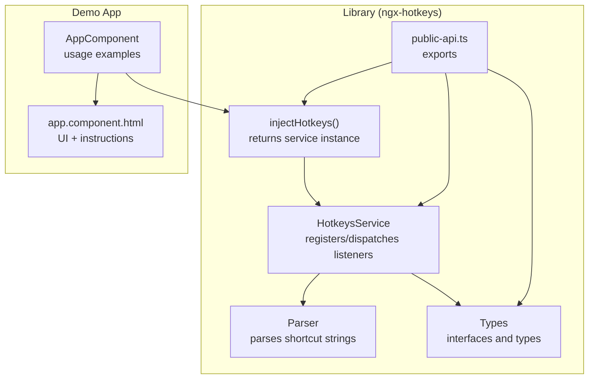
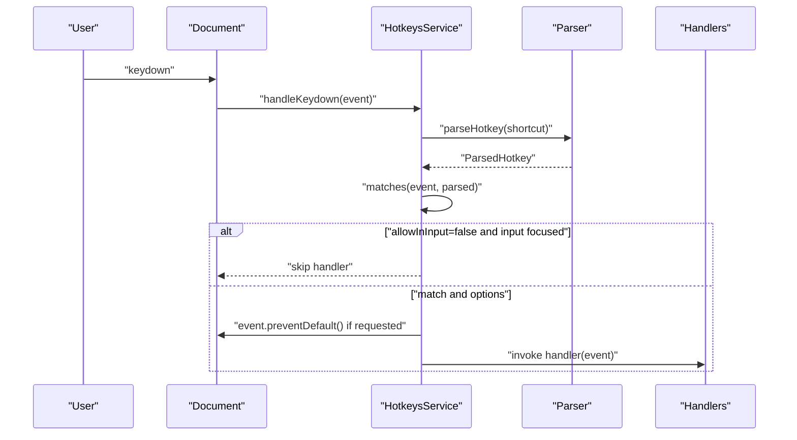
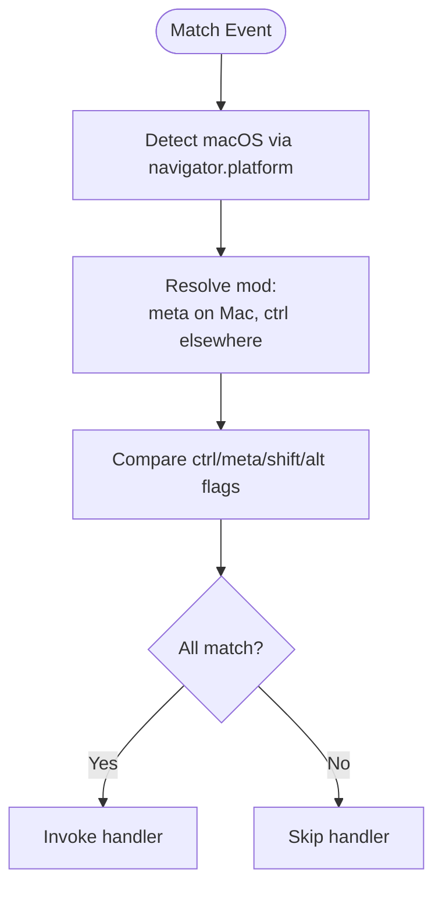
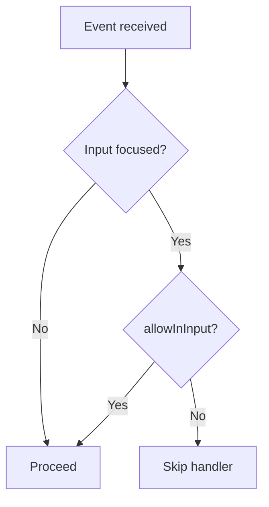
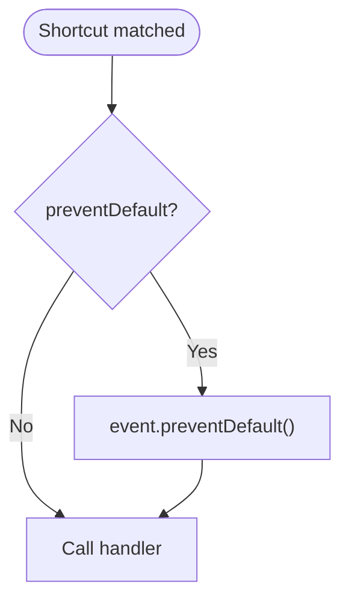
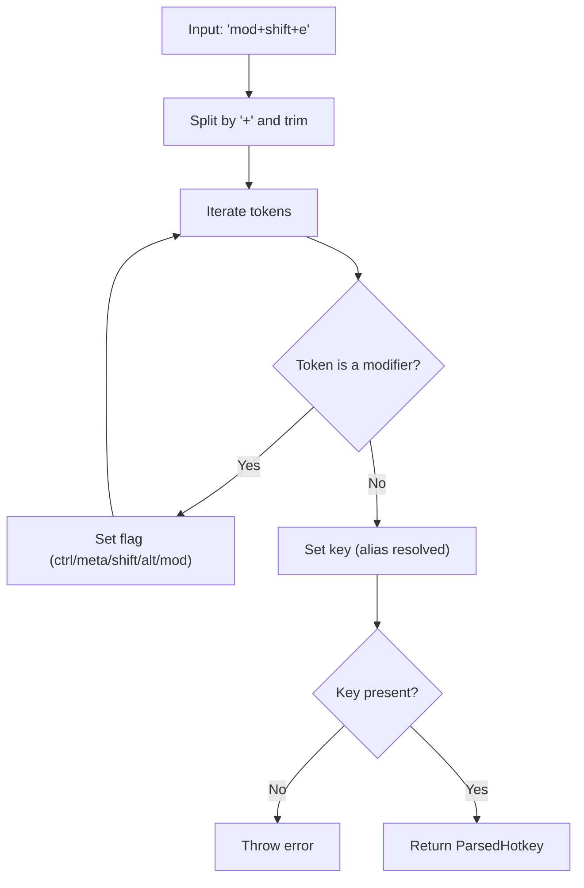
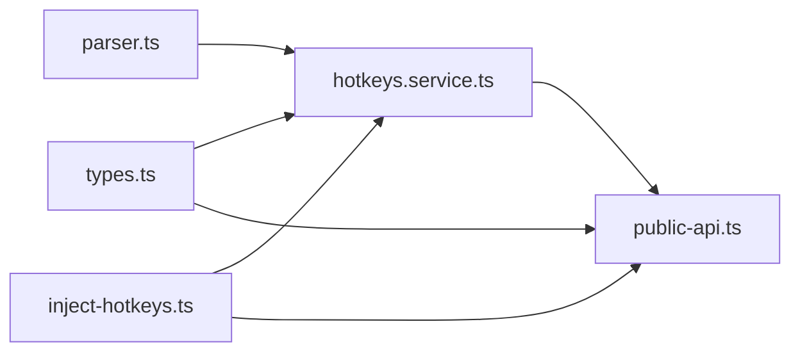

# Features & Functionality

<cite>
**Referenced Files in This Document**
- [hotkeys.service.ts](file://projects/ngx-hotkeys/src/lib/hotkeys.service.ts)
- [parser.ts](file://projects/ngx-hotkeys/src/lib/parser.ts)
- [types.ts](file://projects/ngx-hotkeys/src/lib/types.ts)
- [inject-hotkeys.ts](file://projects/ngx-hotkeys/src/lib/inject-hotkeys.ts)
- [public-api.ts](file://projects/ngx-hotkeys/src/lib/public-api.ts)
- [README.md](file://README.md)
- [EXAMPLE.md](file://EXAMPLE.md)
- [app.component.ts](file://projects/demo-app/src/app/app.component.ts)
- [app.component.html](file://projects/demo-app/src/app/app.component.html)
- [package.json](file://projects/ngx-hotkeys/package.json)
</cite>

## Table of Contents
1. [Introduction](#introduction)
2. [Project Structure](#project-structure)
3. [Core Components](#core-components)
4. [Architecture Overview](#architecture-overview)
5. [Detailed Component Analysis](#detailed-component-analysis)
6. [Dependency Analysis](#dependency-analysis)
7. [Performance Considerations](#performance-considerations)
8. [Troubleshooting Guide](#troubleshooting-guide)
9. [Conclusion](#conclusion)
10. [Appendices](#appendices)

## Introduction
ngx-hotkeys is a minimal, Angular-native keyboard shortcut library designed for zero-boilerplate usage. It enables registering shortcuts in a single line, supports cross-platform modifiers, controls behavior in form inputs, prevents browser defaults when needed, and automatically cleans up to avoid memory leaks. This document explains all features and functionality with practical examples and best practices.

## Project Structure
The library is organized into a small set of focused modules:
- HotkeysService: central listener and dispatcher
- Parser: parses shortcut strings into normalized descriptors
- Types: shared interfaces and types
- Injection helper: convenience function to obtain the service
- Public API: re-exports for consumers
- Demo app: demonstrates usage in a real component

**Diagram sources**
- [hotkeys.service.ts:18-34](file://projects/ngx-hotkeys/src/lib/hotkeys.service.ts#L18-L34)
- [parser.ts:12-45](file://projects/ngx-hotkeys/src/lib/parser.ts#L12-L45)
- [types.ts:1-16](file://projects/ngx-hotkeys/src/lib/types.ts#L1-L16)
- [inject-hotkeys.ts:4-6](file://projects/ngx-hotkeys/src/lib/inject-hotkeys.ts#L4-L6)
- [public-api.ts:1-4](file://projects/ngx-hotkeys/src/lib/public-api.ts#L1-L4)
- [app.component.ts:11-42](file://projects/demo-app/src/app/app.component.ts#L11-L42)
- [app.component.html:1-36](file://projects/demo-app/src/app/app.component.html#L1-L36)

**Section sources**
- [package.json:1-31](file://projects/ngx-hotkeys/package.json#L1-L31)
- [public-api.ts:1-4](file://projects/ngx-hotkeys/src/lib/public-api.ts#L1-L4)

## Core Components
- HotkeysService
  - Registers shortcuts via on(shortcut, handler, options?)
  - Automatically attaches a global keydown listener in the browser
  - Matches events against parsed shortcuts and platform-specific modifiers
  - Supports preventDefault and allowInInput options
  - Returns an off() function for manual unregistration
  - Hooks into Angular’s DestroyRef to auto-clean on component/service teardown
- Parser
  - Splits shortcut strings by "+" and normalizes tokens
  - Recognizes modifier keywords and special key aliases
  - Throws on invalid input (no key found)
- Types
  - HotkeyOptions: preventDefault, allowInInput
  - ParsedHotkey: normalized descriptor with boolean flags
  - HotkeyHandler: callback signature
- injectHotkeys
  - Convenience injector returning the service instance
- public-api
  - Exports the service, injector, and types for consumers

**Section sources**
- [hotkeys.service.ts:18-60](file://projects/ngx-hotkeys/src/lib/hotkeys.service.ts#L18-L60)
- [parser.ts:12-45](file://projects/ngx-hotkeys/src/lib/parser.ts#L12-L45)
- [types.ts:1-16](file://projects/ngx-hotkeys/src/lib/types.ts#L1-L16)
- [inject-hotkeys.ts:4-6](file://projects/ngx-hotkeys/src/lib/inject-hotkeys.ts#L4-L6)
- [public-api.ts:1-4](file://projects/ngx-hotkeys/src/lib/public-api.ts#L1-L4)

## Architecture Overview
The runtime architecture centers on a single global keydown listener that dispatches to registered handlers. Parsing happens once per registration; matching occurs on every keydown with platform-aware modifier resolution.

**Diagram sources**
- [hotkeys.service.ts:26-76](file://projects/ngx-hotkeys/src/lib/hotkeys.service.ts#L26-L76)
- [parser.ts:12-45](file://projects/ngx-hotkeys/src/lib/parser.ts#L12-L45)

## Detailed Component Analysis

### Shortcut Registration and Management
- One-line registration
  - Register a shortcut with on(shortcut, handler, options?)
  - Returns an off() function to manually unregister
- Manual unregistration
  - Call returned off() to remove a specific listener
- Automatic cleanup
  - Listeners self-remove on component/service destruction via Angular DestroyRef

Practical examples
- Basic registration and manual unregistration
  - See [app.component.ts:18-42](file://projects/demo-app/src/app/app.component.ts#L18-L42)
- Prevent default behavior
  - See [app.component.ts:38-41](file://projects/demo-app/src/app/app.component.ts#L38-L41)
- Options usage
  - See [README.md:45-50](file://README.md#L45-L50) and [EXAMPLE.md:72-77](file://EXAMPLE.md#L72-L77)

Best practices
- Prefer the returned off() function for precise control
- Rely on automatic cleanup when used inside Angular components/services
- Keep handler logic fast and side-effect-free

**Section sources**
- [hotkeys.service.ts:36-60](file://projects/ngx-hotkeys/src/lib/hotkeys.service.ts#L36-L60)
- [README.md:45-55](file://README.md#L45-L55)
- [EXAMPLE.md:72-77](file://EXAMPLE.md#L72-L77)
- [app.component.ts:18-42](file://projects/demo-app/src/app/app.component.ts#L18-L42)

### Cross-Platform Modifier Support
- Platform detection
  - Uses navigator.platform to detect macOS
- Automatic mapping
  - mod maps to meta on macOS and ctrl on Windows/Linux
- Modifier flags
  - ctrl, meta, shift, alt, and mod are recognized during parsing and matching

Practical examples
- macOS vs Windows/Linux behavior
  - See [README.md:85-101](file://README.md#L85-L101)
- Demo usage
  - See [app.component.ts:19-22](file://projects/demo-app/src/app/app.component.ts#L19-L22)

Flow of modifier resolution

**Diagram sources**
- [hotkeys.service.ts:78-98](file://projects/ngx-hotkeys/src/lib/hotkeys.service.ts#L78-L98)

**Section sources**
- [hotkeys.service.ts:78-98](file://projects/ngx-hotkeys/src/lib/hotkeys.service.ts#L78-L98)
- [README.md:85-101](file://README.md#L85-L101)

### Input Field Control Options
- allowInInput option
  - When true, triggers handlers even if a form input is focused
  - Default is false, so shortcuts are ignored while typing by default
- Input detection
  - Checks active element tag names and contenteditable attribute

Practical examples
- Ignore shortcuts in inputs by default
  - See [app.component.html:20-24](file://projects/demo-app/src/app/app.component.html#L20-L24)
- Force shortcuts to work in inputs
  - See [EXAMPLE.md:72-77](file://EXAMPLE.md#L72-L77)

Behavior flow

**Diagram sources**
- [hotkeys.service.ts:62-76](file://projects/ngx-hotkeys/src/lib/hotkeys.service.ts#L62-L76)
- [hotkeys.service.ts:100-112](file://projects/ngx-hotkeys/src/lib/hotkeys.service.ts#L100-L112)

**Section sources**
- [hotkeys.service.ts:62-76](file://projects/ngx-hotkeys/src/lib/hotkeys.service.ts#L62-L76)
- [hotkeys.service.ts:100-112](file://projects/ngx-hotkeys/src/lib/hotkeys.service.ts#L100-L112)
- [EXAMPLE.md:72-77](file://EXAMPLE.md#L72-L77)
- [app.component.html:20-24](file://projects/demo-app/src/app/app.component.html#L20-L24)

### Event Prevention and Browser Default Behavior
- preventDefault option
  - When true, calls event.preventDefault() before invoking the handler
- Typical use cases
  - Intercept browser shortcuts (e.g., save dialog) or suppress page scroll behavior

Practical examples
- Prevent default for save action
  - See [app.component.ts:38-41](file://projects/demo-app/src/app/app.component.ts#L38-L41)
- Documentation reference
  - See [README.md:74-81](file://README.md#L74-L81)

Flowchart

**Diagram sources**
- [hotkeys.service.ts:62-76](file://projects/ngx-hotkeys/src/lib/hotkeys.service.ts#L62-L76)

**Section sources**
- [hotkeys.service.ts:62-76](file://projects/ngx-hotkeys/src/lib/hotkeys.service.ts#L62-L76)
- [README.md:74-81](file://README.md#L74-L81)
- [app.component.ts:38-41](file://projects/demo-app/src/app/app.component.ts#L38-L41)

### Automatic Cleanup and Memory Leak Prevention
- Global listener lifecycle
  - Attaches on construction in the browser
  - Removes on destroy via DestroyRef
- Per-listener lifecycle
  - off() removes a single listener
  - onDestroy hook ensures off() runs on container destruction
- Zero boilerplate
  - No manual detach required when used in Angular DI contexts

Practical examples
- Automatic cleanup in components/services
  - See [README.md:52-55](file://README.md#L52-L55)
- Implementation hooks
  - See [hotkeys.service.ts:26-34](file://projects/ngx-hotkeys/src/lib/hotkeys.service.ts#L26-L34)
  - See [hotkeys.service.ts:58-60](file://projects/ngx-hotkeys/src/lib/hotkeys.service.ts#L58-L60)

**Section sources**
- [hotkeys.service.ts:26-34](file://projects/ngx-hotkeys/src/lib/hotkeys.service.ts#L26-L34)
- [hotkeys.service.ts:58-60](file://projects/ngx-hotkeys/src/lib/hotkeys.service.ts#L58-L60)
- [README.md:52-55](file://README.md#L52-L55)

### Supported Shortcut Syntax
- Modifiers
  - ctrl, meta, shift, alt, mod
- Keys
  - Named keys: escape, space, arrowup, arrowdown, arrowleft, arrowright
  - Case-insensitive; spaces trimmed around tokens
- Combinations
  - Join tokens with "+", e.g., "shift+enter", "alt+1", "mod+s"

Practical examples
- Supported shortcuts list
  - See [README.md:85-101](file://README.md#L85-L101)
- Demo usage
  - See [app.component.ts:19-37](file://projects/demo-app/src/app/app.component.ts#L19-L37)

Parsing flow

**Diagram sources**
- [parser.ts:12-45](file://projects/ngx-hotkeys/src/lib/parser.ts#L12-L45)

**Section sources**
- [parser.ts:3-10](file://projects/ngx-hotkeys/src/lib/parser.ts#L3-L10)
- [parser.ts:12-45](file://projects/ngx-hotkeys/src/lib/parser.ts#L12-L45)
- [README.md:85-101](file://README.md#L85-L101)
- [app.component.ts:19-37](file://projects/demo-app/src/app/app.component.ts#L19-L37)

### Practical Examples and Real-World Use Cases
- Open search modal with mod+k
  - See [app.component.ts:19-22](file://projects/demo-app/src/app/app.component.ts#L19-L22)
- Close modal with esc
  - See [app.component.ts:24-27](file://projects/demo-app/src/app/app.component.ts#L24-L27)
- Increment counter with j
  - See [app.component.ts:29-32](file://projects/demo-app/src/app/app.component.ts#L29-L32)
- Shift+Enter message
  - See [app.component.ts:34-36](file://projects/demo-app/src/app/app.component.ts#L34-L36)
- Save shortcut preventing browser dialog
  - See [app.component.ts:38-41](file://projects/demo-app/src/app/app.component.ts#L38-L41)
- Global shortcuts that work in inputs
  - See [EXAMPLE.md:72-77](file://EXAMPLE.md#L72-L77)
- Standalone component and service usage
  - See [EXAMPLE.md:3-43](file://EXAMPLE.md#L3-L43) and [EXAMPLE.md:45-70](file://EXAMPLE.md#L45-L70)

**Section sources**
- [app.component.ts:18-42](file://projects/demo-app/src/app/app.component.ts#L18-L42)
- [app.component.html:9-18](file://projects/demo-app/src/app/app.component.html#L9-L18)
- [EXAMPLE.md:3-43](file://EXAMPLE.md#L3-L43)
- [EXAMPLE.md:45-70](file://EXAMPLE.md#L45-L70)
- [EXAMPLE.md:72-77](file://EXAMPLE.md#L72-L77)

## Dependency Analysis
- Internal dependencies
  - HotkeysService depends on Parser and Types
  - injectHotkeys returns HotkeysService
  - public-api re-exports are the primary consumer-facing API
- External dependencies
  - Peer dependencies: Angular core and common >= 17
  - Side effects: none

**Diagram sources**
- [hotkeys.service.ts:1-6](file://projects/ngx-hotkeys/src/lib/hotkeys.service.ts#L1-L6)
- [parser.ts:1-2](file://projects/ngx-hotkeys/src/lib/parser.ts#L1-L2)
- [types.ts:1-6](file://projects/ngx-hotkeys/src/lib/types.ts#L1-L6)
- [inject-hotkeys.ts:1-6](file://projects/ngx-hotkeys/src/lib/inject-hotkeys.ts#L1-L6)
- [public-api.ts:1-4](file://projects/ngx-hotkeys/src/lib/public-api.ts#L1-L4)

**Section sources**
- [package.json:22-29](file://projects/ngx-hotkeys/package.json#L22-L29)
- [public-api.ts:1-4](file://projects/ngx-hotkeys/src/lib/public-api.ts#L1-L4)

## Performance Considerations
- Single global listener
  - Minimizes overhead by listening once and dispatching to registered handlers
- Efficient matching
  - Early exit on key mismatch; short-circuit comparison of modifier flags
- Minimal allocations
  - Reuses bound handler and avoids per-listener closures
- Best practices
  - Keep handlers lightweight; defer heavy work to microtasks or async streams
  - Avoid registering excessive shortcuts; group related actions under fewer hotkeys
  - Use preventDefault judiciously to avoid interfering with essential browser behaviors

[No sources needed since this section provides general guidance]

## Troubleshooting Guide
- Shortcut not triggering
  - Verify the key is present after parsing; an error is thrown if no key is found
  - Confirm platform modifier mapping: mod resolves to meta on macOS and ctrl elsewhere
  - Check allowInInput if the focus is inside an input/textarea/select/contenteditable
- Conflicts with browser defaults
  - Set preventDefault: true to suppress default behavior
- Memory leaks or stale listeners
  - Ensure usage within Angular DI contexts so onDestroy cleanup applies
  - Manually call off() when registering outside DI lifecycles
- Inputs intercepting shortcuts unexpectedly
  - Set allowInInput: true to enable shortcuts while typing

**Section sources**
- [parser.ts:40-42](file://projects/ngx-hotkeys/src/lib/parser.ts#L40-L42)
- [hotkeys.service.ts:78-98](file://projects/ngx-hotkeys/src/lib/hotkeys.service.ts#L78-L98)
- [hotkeys.service.ts:62-76](file://projects/ngx-hotkeys/src/lib/hotkeys.service.ts#L62-L76)
- [README.md:52-55](file://README.md#L52-L55)

## Conclusion
ngx-hotkeys delivers a concise, robust solution for keyboard shortcuts in Angular applications. Its one-line registration, cross-platform modifier handling, input-aware behavior, and automatic cleanup make it suitable for a wide range of UI and productivity features. By following the best practices outlined here, you can implement reliable, performant keyboard interactions with minimal code.

[No sources needed since this section summarizes without analyzing specific files]

## Appendices

### API Reference Summary
- injectHotkeys()
  - Returns HotkeysService
- HotkeysService.on(shortcut, handler, options?)
  - Returns off(): removes the listener
- HotkeyOptions
  - preventDefault: boolean
  - allowInInput: boolean
- Supported tokens
  - Modifiers: ctrl, meta, shift, alt, mod
  - Keys: escape, space, arrowup, arrowdown, arrowleft, arrowright, plus named keys
  - Combinations: "mod+key", "shift+enter", "alt+1", etc.

**Section sources**
- [inject-hotkeys.ts:4-6](file://projects/ngx-hotkeys/src/lib/inject-hotkeys.ts#L4-L6)
- [hotkeys.service.ts:36-60](file://projects/ngx-hotkeys/src/lib/hotkeys.service.ts#L36-L60)
- [types.ts:1-16](file://projects/ngx-hotkeys/src/lib/types.ts#L1-L16)
- [README.md:74-101](file://README.md#L74-L101)