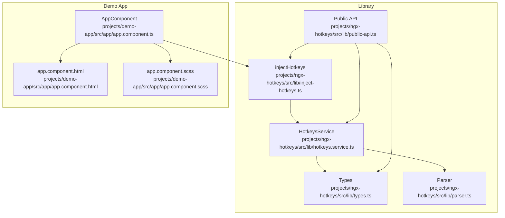
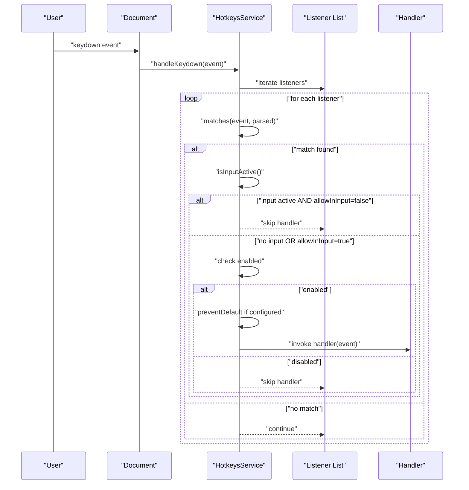
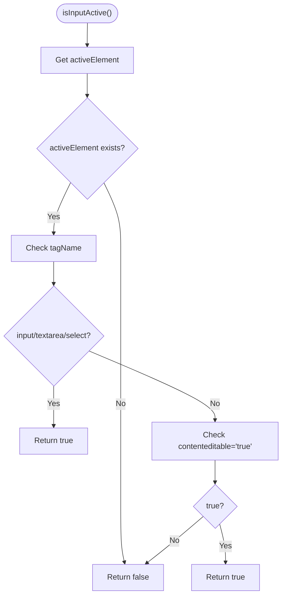
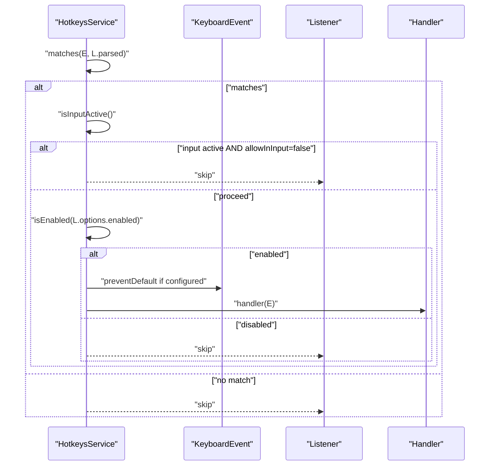
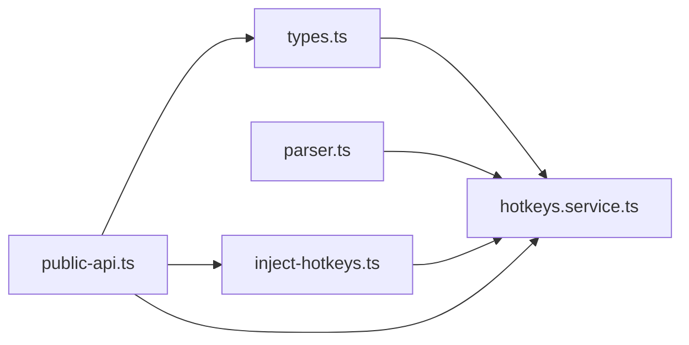

# Input Field Control

<cite>
**Referenced Files in This Document**
- [hotkeys.service.ts](file://projects/ngx-hotkeys/src/lib/hotkeys.service.ts)
- [types.ts](file://projects/ngx-hotkeys/src/lib/types.ts)
- [parser.ts](file://projects/ngx-hotkeys/src/lib/parser.ts)
- [inject-hotkeys.ts](file://projects/ngx-hotkeys/src/lib/inject-hotkeys.ts)
- [public-api.ts](file://projects/ngx-hotkeys/src/lib/public-api.ts)
- [README.md](file://README.md)
- [EXAMPLE.md](file://EXAMPLE.md)
- [app.component.ts](file://projects/demo-app/src/app/app.component.ts)
- [app.component.html](file://projects/demo-app/src/app/app.component.html)
- [app.component.scss](file://projects/demo-app/src/app/app.component.scss)
</cite>

## Table of Contents
1. [Introduction](#introduction)
2. [Project Structure](#project-structure)
3. [Core Components](#core-components)
4. [Architecture Overview](#architecture-overview)
5. [Detailed Component Analysis](#detailed-component-analysis)
6. [Dependency Analysis](#dependency-analysis)
7. [Performance Considerations](#performance-considerations)
8. [Troubleshooting Guide](#troubleshooting-guide)
9. [Conclusion](#conclusion)

## Introduction
This document explains the input field control functionality in the hotkey library, focusing on how shortcuts behave when users are interacting with input elements. It covers the allowInInput option, the isInputActive() detection mechanism, and how these two features interact to control shortcut execution during user input.

## Project Structure
The hotkey library consists of a small set of focused modules:
- Service that registers and dispatches keyboard shortcuts
- Type definitions for options and handlers
- Parser that converts human-readable shortcut strings into structured descriptors
- Injection helper for convenient service access
- Public API exports for consumers
- Demo application showcasing basic usage and input behavior

**Diagram sources**
- [hotkeys.service.ts:1-138](file://projects/ngx-hotkeys/src/lib/hotkeys.service.ts#L1-L138)
- [types.ts:1-19](file://projects/ngx-hotkeys/src/lib/types.ts#L1-L19)
- [parser.ts:1-46](file://projects/ngx-hotkeys/src/lib/parser.ts#L1-L46)
- [inject-hotkeys.ts:1-7](file://projects/ngx-hotkeys/src/lib/inject-hotkeys.ts#L1-L7)
- [public-api.ts:1-4](file://projects/ngx-hotkeys/src/lib/public-api.ts#L1-L4)
- [app.component.ts:1-43](file://projects/demo-app/src/app/app.component.ts#L1-L43)
- [app.component.html:1-36](file://projects/demo-app/src/app/app.component.html#L1-L36)
- [app.component.scss:1-72](file://projects/demo-app/src/app/app.component.scss#L1-L72)

**Section sources**
- [hotkeys.service.ts:1-138](file://projects/ngx-hotkeys/src/lib/hotkeys.service.ts#L1-L138)
- [types.ts:1-19](file://projects/ngx-hotkeys/src/lib/types.ts#L1-L19)
- [parser.ts:1-46](file://projects/ngx-hotkeys/src/lib/parser.ts#L1-L46)
- [inject-hotkeys.ts:1-7](file://projects/ngx-hotkeys/src/lib/inject-hotkeys.ts#L1-L7)
- [public-api.ts:1-4](file://projects/ngx-hotkeys/src/lib/public-api.ts#L1-L4)
- [README.md:1-127](file://README.md#L1-L127)
- [EXAMPLE.md:1-77](file://EXAMPLE.md#L1-L77)
- [app.component.ts:1-43](file://projects/demo-app/src/app/app.component.ts#L1-L43)
- [app.component.html:1-36](file://projects/demo-app/src/app/app.component.html#L1-L36)
- [app.component.scss:1-72](file://projects/demo-app/src/app/app.component.scss#L1-L72)

## Core Components
- HotkeysService: Central orchestrator for registering shortcuts, parsing keys, matching events, and invoking handlers. It includes input field detection and the allowInInput option.
- Types: Defines HotkeyOptions (including allowInInput), HotkeyHandler, ParsedHotkey, and HotkeyShortcut.
- Parser: Converts shortcut strings (e.g., "mod+k") into structured descriptors used for matching.
- injectHotkeys: Convenience injection helper for accessing the service.
- Public API: Exports the service, injection helper, and types for consumers.

Key behaviors:
- Default behavior: Shortcuts are ignored when an input element is focused unless allowInInput is explicitly enabled.
- Input detection: Checks activeElement tag names and contenteditable attributes to decide if input is active.
- Event filtering: Applies preventDefault and enabled conditions after input checks.

**Section sources**
- [hotkeys.service.ts:14-18](file://projects/ngx-hotkeys/src/lib/hotkeys.service.ts#L14-L18)
- [hotkeys.service.ts:83-100](file://projects/ngx-hotkeys/src/lib/hotkeys.service.ts#L83-L100)
- [hotkeys.service.ts:124-136](file://projects/ngx-hotkeys/src/lib/hotkeys.service.ts#L124-L136)
- [types.ts:1-5](file://projects/ngx-hotkeys/src/lib/types.ts#L1-L5)
- [parser.ts:12-45](file://projects/ngx-hotkeys/src/lib/parser.ts#L12-L45)
- [inject-hotkeys.ts:1-7](file://projects/ngx-hotkeys/src/lib/inject-hotkeys.ts#L1-L7)
- [public-api.ts:1-4](file://projects/ngx-hotkeys/src/lib/public-api.ts#L1-L4)

## Architecture Overview
The hotkey system listens to global keydown events, parses incoming shortcuts, and dispatches to registered handlers. Input field control sits between event matching and handler invocation.

**Diagram sources**
- [hotkeys.service.ts:83-100](file://projects/ngx-hotkeys/src/lib/hotkeys.service.ts#L83-L100)
- [hotkeys.service.ts:124-136](file://projects/ngx-hotkeys/src/lib/hotkeys.service.ts#L124-L136)

## Detailed Component Analysis

### allowInInput Option
- Purpose: Controls whether a shortcut triggers while an input element is focused.
- Default: false (shortcuts are ignored in inputs).
- Effect: When true, the input detection check is bypassed for that listener.

Practical usage patterns:
- Disable in inputs for editing operations: keep allowInInput at default (false) so typing remains uninterrupted.
- Enable in inputs for search or submission: set allowInInput to true to allow shortcuts like "mod+enter" to submit forms while typing.

Behavioral implications:
- allowInInput does not override the enabled condition; disabled listeners are skipped regardless of input state.
- allowInInput does not override preventDefault; if preventDefault is configured, it still applies.

**Section sources**
- [types.ts:1-5](file://projects/ngx-hotkeys/src/lib/types.ts#L1-L5)
- [hotkeys.service.ts:14-18](file://projects/ngx-hotkeys/src/lib/hotkeys.service.ts#L14-L18)
- [hotkeys.service.ts:87-89](file://projects/ngx-hotkeys/src/lib/hotkeys.service.ts#L87-L89)
- [EXAMPLE.md:72-77](file://EXAMPLE.md#L72-L77)

### isInputActive() Detection Mechanism
The method determines if a user is currently typing in an input field or contenteditable area.

Detection logic:
- Active element must exist.
- Tag names considered inputs: input, textarea, select.
- Contenteditable divs are detected by checking the contenteditable attribute for "true".
- Other elements (e.g., buttons, spans) are not considered inputs.

Edge cases:
- If no element has focus, input is considered inactive.
- contenteditable="true" requires an exact string match; other truthy values are not recognized.
- Elements inside shadow DOM or iframe contexts are not checked by this method.

**Diagram sources**
- [hotkeys.service.ts:124-136](file://projects/ngx-hotkeys/src/lib/hotkeys.service.ts#L124-L136)

**Section sources**
- [hotkeys.service.ts:124-136](file://projects/ngx-hotkeys/src/lib/hotkeys.service.ts#L124-L136)

### Interaction Between Input Detection and Shortcut Execution
The execution pipeline integrates input detection with other conditions:

1. Match detection: The event is compared against the parsed shortcut descriptor.
2. Input check: If the listener disallows input and input is active, skip the handler.
3. Enabled check: If the listener is disabled, skip the handler.
4. Prevent default: Optionally call event.preventDefault().
5. Handler invocation: Execute the registered handler.

**Diagram sources**
- [hotkeys.service.ts:83-100](file://projects/ngx-hotkeys/src/lib/hotkeys.service.ts#L83-L100)
- [hotkeys.service.ts:124-136](file://projects/ngx-hotkeys/src/lib/hotkeys.service.ts#L124-L136)

**Section sources**
- [hotkeys.service.ts:83-100](file://projects/ngx-hotkeys/src/lib/hotkeys.service.ts#L83-L100)
- [hotkeys.service.ts:124-136](file://projects/ngx-hotkeys/src/lib/hotkeys.service.ts#L124-L136)

### Practical Scenarios and Examples

#### Scenario 1: Disabling Shortcuts While Editing Text Inputs
- Goal: Allow free typing without triggering application shortcuts.
- Implementation: Use default allowInInput (false). Shortcuts are ignored when an input is focused.
- Evidence: The demo app includes an input field; pressing "j" while focused does not increment the counter by default.

References:
- [app.component.html:20-24](file://projects/demo-app/src/app/app.component.html#L20-L24)
- [app.component.ts:18-42](file://projects/demo-app/src/app/app.component.ts#L18-L42)

#### Scenario 2: Enabling Shortcuts for Search Functionality
- Goal: Allow shortcuts like opening a search overlay while typing.
- Implementation: Register the listener with allowInInput set to true.
- Evidence: The example demonstrates enabling a shortcut to submit while in an input.

References:
- [EXAMPLE.md:72-77](file://EXAMPLE.md#L72-L77)

#### Scenario 3: Handling Various Input Types
- Regular inputs: Detected by tag name.
- Textareas and selects: Also detected by tag name.
- Contenteditable divs: Detected by contenteditable attribute.
- Best practice: Prefer explicit allowInInput for contenteditable areas to ensure consistent behavior.

References:
- [hotkeys.service.ts:128-135](file://projects/ngx-hotkeys/src/lib/hotkeys.service.ts#L128-L135)

### Edge Cases and Best Practices
Edge cases:
- No active element: Treats as not input active.
- contenteditable mismatch: Only "true" is recognized; other values are ignored.
- Shadow DOM and iframes: Not covered by this detection method.
- Dynamic focus changes: Ensure handlers are registered appropriately for components that manage focus transitions.

Best practices:
- Use allowInInput selectively for critical actions (e.g., search, submit) to avoid disrupting typing.
- Combine with preventDefault when necessary to suppress browser defaults (e.g., form submission).
- Keep enabled conditions dynamic if shortcuts should be toggled based on context.
- Test across platforms (Windows/Linux vs macOS) since modifier behavior differs.

**Section sources**
- [hotkeys.service.ts:124-136](file://projects/ngx-hotkeys/src/lib/hotkeys.service.ts#L124-L136)
- [types.ts:1-5](file://projects/ngx-hotkeys/src/lib/types.ts#L1-L5)
- [README.md:74-81](file://README.md#L74-L81)

## Dependency Analysis
The service depends on types and parser for shortcut parsing and matching. The injection helper simplifies service access. Public API re-exports expose the service, injection helper, and types.

**Diagram sources**
- [hotkeys.service.ts:1-138](file://projects/ngx-hotkeys/src/lib/hotkeys.service.ts#L1-L138)
- [types.ts:1-19](file://projects/ngx-hotkeys/src/lib/types.ts#L1-L19)
- [parser.ts:1-46](file://projects/ngx-hotkeys/src/lib/parser.ts#L1-L46)
- [inject-hotkeys.ts:1-7](file://projects/ngx-hotkeys/src/lib/inject-hotkeys.ts#L1-L7)
- [public-api.ts:1-4](file://projects/ngx-hotkeys/src/lib/public-api.ts#L1-L4)

**Section sources**
- [hotkeys.service.ts:1-138](file://projects/ngx-hotkeys/src/lib/hotkeys.service.ts#L1-L138)
- [types.ts:1-19](file://projects/ngx-hotkeys/src/lib/types.ts#L1-L19)
- [parser.ts:1-46](file://projects/ngx-hotkeys/src/lib/parser.ts#L1-L46)
- [inject-hotkeys.ts:1-7](file://projects/ngx-hotkeys/src/lib/inject-hotkeys.ts#L1-L7)
- [public-api.ts:1-4](file://projects/ngx-hotkeys/src/lib/public-api.ts#L1-L4)

## Performance Considerations
- Event listener: A single global keydown listener is attached and removed on destroy to avoid memory leaks.
- Matching cost: Parsing and matching are lightweight; input detection is O(1) with minimal DOM queries.
- Listener iteration: Iterates over registered listeners; keep the number reasonable for performance-sensitive applications.

[No sources needed since this section provides general guidance]

## Troubleshooting Guide
Common issues and resolutions:
- Shortcuts not firing in inputs: Verify allowInInput is set to true for the listener.
- Contenteditable not recognized: Ensure the contenteditable attribute is set to "true".
- Disabled listeners still trigger: Confirm the enabled option is not returning true unexpectedly.
- Browser default behavior: Use preventDefault in options to suppress defaults like form submission.

**Section sources**
- [hotkeys.service.ts:83-100](file://projects/ngx-hotkeys/src/lib/hotkeys.service.ts#L83-L100)
- [hotkeys.service.ts:124-136](file://projects/ngx-hotkeys/src/lib/hotkeys.service.ts#L124-L136)
- [types.ts:1-5](file://projects/ngx-hotkeys/src/lib/types.ts#L1-L5)

## Conclusion
The input field control mechanism provides precise control over when shortcuts execute. By combining the allowInInput option with the isInputActive() detector, developers can tailor shortcut behavior to match user expectations—disabling shortcuts during editing while enabling them for specialized actions like search or submission.