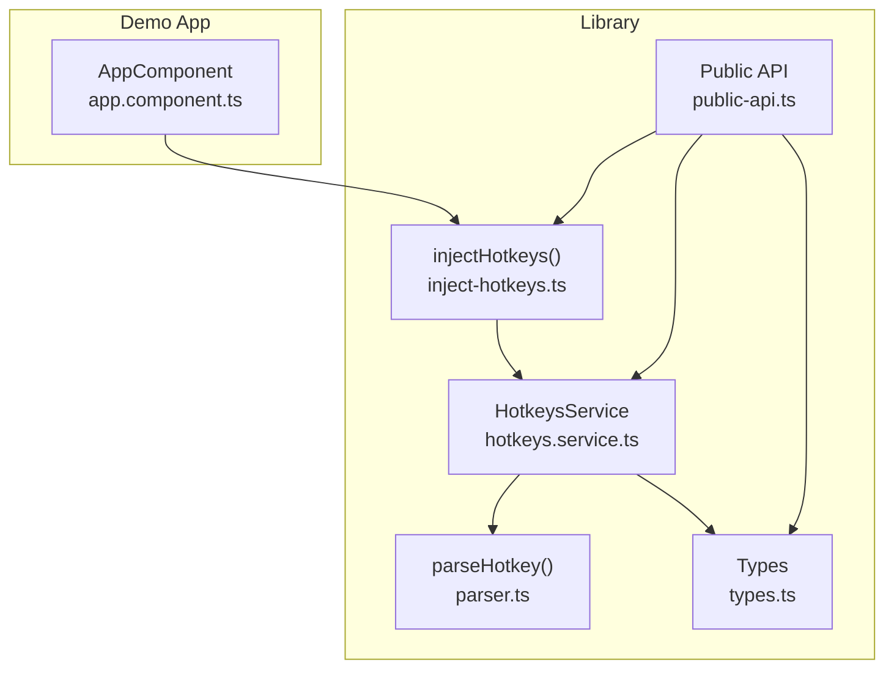
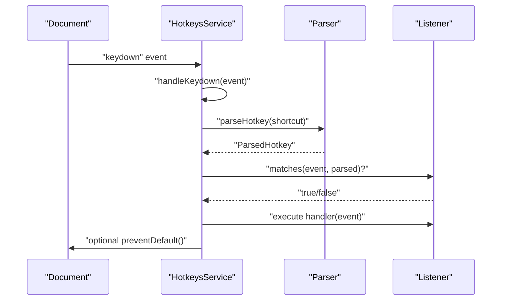
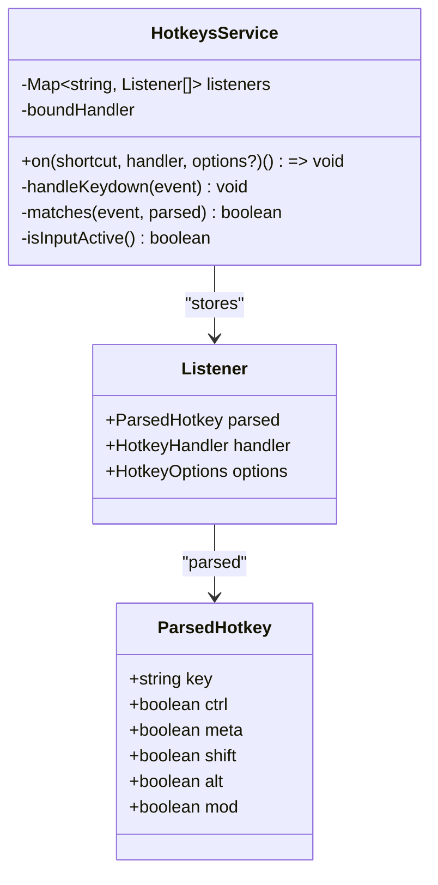
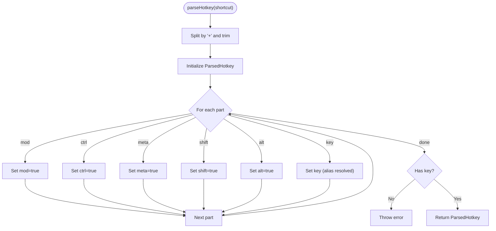
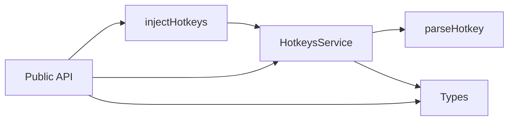

# Shortcut Registration & Management

<cite>
**Referenced Files in This Document**
- [hotkeys.service.ts](file://projects/ngx-hotkeys/src/lib/hotkeys.service.ts)
- [inject-hotkeys.ts](file://projects/ngx-hotkeys/src/lib/inject-hotkeys.ts)
- [parser.ts](file://projects/ngx-hotkeys/src/lib/parser.ts)
- [types.ts](file://projects/ngx-hotkeys/src/lib/types.ts)
- [public-api.ts](file://projects/ngx-hotkeys/src/lib/public-api.ts)
- [README.md](file://README.md)
- [EXAMPLE.md](file://EXAMPLE.md)
- [app.component.ts](file://projects/demo-app/src/app/app.component.ts)
</cite>

## Table of Contents
1. [Introduction](#introduction)
2. [Project Structure](#project-structure)
3. [Core Components](#core-components)
4. [Architecture Overview](#architecture-overview)
5. [Detailed Component Analysis](#detailed-component-analysis)
6. [Dependency Analysis](#dependency-analysis)
7. [Performance Considerations](#performance-considerations)
8. [Troubleshooting Guide](#troubleshooting-guide)
9. [Conclusion](#conclusion)

## Introduction
This document explains the shortcut registration and management functionality provided by the library. It focuses on the one-line registration pattern using the hotkeys.on('shortcut', handler) method, manual unregistration via the returned cleanup function, automatic cleanup behavior, and memory leak prevention. It also details the listener registry system, internal storage of shortcuts, practical usage scenarios, and performance considerations for managing large numbers of shortcuts.

## Project Structure
The library is organized into a small set of focused modules:
- Hotkeys service: central listener registry and keyboard event handling
- Injection helper: convenience function to obtain the service instance
- Parser: converts human-readable shortcut strings into structured descriptors
- Types: shared interfaces and types used across the library
- Public API: re-exports for external consumption

**Diagram sources**
- [hotkeys.service.ts:1-114](file://projects/ngx-hotkeys/src/lib/hotkeys.service.ts#L1-L114)
- [inject-hotkeys.ts:1-7](file://projects/ngx-hotkeys/src/lib/inject-hotkeys.ts#L1-L7)
- [parser.ts:1-46](file://projects/ngx-hotkeys/src/lib/parser.ts#L1-L46)
- [types.ts:1-16](file://projects/ngx-hotkeys/src/lib/types.ts#L1-L16)
- [public-api.ts:1-4](file://projects/ngx-hotkeys/src/lib/public-api.ts#L1-L4)
- [app.component.ts:1-43](file://projects/demo-app/src/app/app.component.ts#L1-L43)

**Section sources**
- [hotkeys.service.ts:1-114](file://projects/ngx-hotkeys/src/lib/hotkeys.service.ts#L1-L114)
- [inject-hotkeys.ts:1-7](file://projects/ngx-hotkeys/src/lib/inject-hotkeys.ts#L1-L7)
- [parser.ts:1-46](file://projects/ngx-hotkeys/src/lib/parser.ts#L1-L46)
- [types.ts:1-16](file://projects/ngx-hotkeys/src/lib/types.ts#L1-L16)
- [public-api.ts:1-4](file://projects/ngx-hotkeys/src/lib/public-api.ts#L1-L4)
- [README.md:1-127](file://README.md#L1-L127)
- [EXAMPLE.md:1-77](file://EXAMPLE.md#L1-L77)
- [app.component.ts:1-43](file://projects/demo-app/src/app/app.component.ts#L1-L43)

## Core Components
- HotkeysService: registers shortcuts, stores listeners, handles keydown events, and cleans up on destroy.
- injectHotkeys(): returns the HotkeysService instance for use in components/services.
- parseHotkey(): transforms a shortcut string into a structured descriptor with modifiers and key.
- Types: HotkeyOptions and HotkeyHandler define the registration API surface.

Key responsibilities:
- One-line registration: hotkeys.on('shortcut', handler, options?)
- Manual unregistration: store the returned cleanup function and call it when needed.
- Automatic cleanup: listeners are removed when the hosting injection context is destroyed.
- Memory leak prevention: the service removes DOM listeners and prunes empty shortcut entries.

**Section sources**
- [hotkeys.service.ts:18-114](file://projects/ngx-hotkeys/src/lib/hotkeys.service.ts#L18-L114)
- [inject-hotkeys.ts:1-7](file://projects/ngx-hotkeys/src/lib/inject-hotkeys.ts#L1-L7)
- [parser.ts:12-46](file://projects/ngx-hotkeys/src/lib/parser.ts#L12-L46)
- [types.ts:1-16](file://projects/ngx-hotkeys/src/lib/types.ts#L1-L16)
- [README.md:45-56](file://README.md#L45-L56)

## Architecture Overview
The system listens to global keydown events and dispatches them to registered handlers based on parsed shortcut descriptors. Listeners are grouped by shortcut string and executed in order during each keydown event.

**Diagram sources**
- [hotkeys.service.ts:62-98](file://projects/ngx-hotkeys/src/lib/hotkeys.service.ts#L62-L98)
- [parser.ts:12-46](file://projects/ngx-hotkeys/src/lib/parser.ts#L12-L46)

## Detailed Component Analysis

### HotkeysService: Registration, Matching, and Cleanup
- Registration: hotkeys.on('shortcut', handler, options?) returns a cleanup function.
- Storage: listeners are stored in a Map keyed by shortcut string; each entry holds an array of listeners with parsed descriptors and options.
- Matching: matches compares the active key against the parsed key and modifier flags, accounting for platform differences (mod maps to meta on macOS, ctrl otherwise).
- Execution: when a match occurs, optional input filtering and preventDefault behavior are applied before invoking the handler.
- Cleanup:
  - Manual: calling the returned function removes the specific listener from the array and deletes the shortcut entry if empty.
  - Automatic: the service registers onDestroy hooks so that listeners are removed when the hosting injection context is destroyed; the service itself also removes the global keydown listener on destroy.

**Diagram sources**
- [hotkeys.service.ts:7-11](file://projects/ngx-hotkeys/src/lib/hotkeys.service.ts#L7-L11)
- [hotkeys.service.ts:13-16](file://projects/ngx-hotkeys/src/lib/hotkeys.service.ts#L13-L16)
- [hotkeys.service.ts:36-60](file://projects/ngx-hotkeys/src/lib/hotkeys.service.ts#L36-L60)
- [hotkeys.service.ts:62-98](file://projects/ngx-hotkeys/src/lib/hotkeys.service.ts#L62-L98)
- [types.ts:8-15](file://projects/ngx-hotkeys/src/lib/types.ts#L8-L15)

**Section sources**
- [hotkeys.service.ts:18-114](file://projects/ngx-hotkeys/src/lib/hotkeys.service.ts#L18-L114)

### Parser: Shortcut String to Descriptor
- Converts a shortcut string into a ParsedHotkey with normalized key and boolean flags for modifiers.
- Supports aliases for common keys and recognizes special tokens like mod, ctrl, meta, shift, alt.
- Throws an error if no key is present.

**Diagram sources**
- [parser.ts:12-46](file://projects/ngx-hotkeys/src/lib/parser.ts#L12-L46)

**Section sources**
- [parser.ts:1-46](file://projects/ngx-hotkeys/src/lib/parser.ts#L1-L46)

### Options and Handler Types
- HotkeyOptions: controls preventDefault and allowInInput behavior.
- HotkeyHandler: callback signature invoked with the KeyboardEvent.

**Section sources**
- [types.ts:1-16](file://projects/ngx-hotkeys/src/lib/types.ts#L1-L16)

### Practical Registration Scenarios and Best Practices
- One-line registration: register shortcuts inline in constructors or initialization blocks.
- Manual unregistration: store the returned cleanup function and call it when the feature is disabled or the component is destroyed.
- Automatic cleanup: rely on Angular’s DestroyRef to remove listeners when the hosting context is destroyed.
- Global shortcuts in inputs: use allowInInput to enable triggers while typing.
- Prevent default behavior: use preventDefault to suppress browser defaults for specific shortcuts.

Examples in the demo app and examples:
- Basic registration with multiple shortcuts and a handler that updates component state.
- Using preventDefault to intercept save actions.
- Registering in a service for global navigation shortcuts.
- Enabling shortcuts to work inside inputs with allowInInput.

**Section sources**
- [README.md:17-56](file://README.md#L17-L56)
- [EXAMPLE.md:1-77](file://EXAMPLE.md#L1-L77)
- [app.component.ts:18-41](file://projects/demo-app/src/app/app.component.ts#L18-L41)

## Dependency Analysis
The service depends on Angular primitives and the parser. The public API re-exports the service, injection helper, and types for external consumption.

**Diagram sources**
- [hotkeys.service.ts:1-6](file://projects/ngx-hotkeys/src/lib/hotkeys.service.ts#L1-L6)
- [inject-hotkeys.ts:1-7](file://projects/ngx-hotkeys/src/lib/inject-hotkeys.ts#L1-L7)
- [public-api.ts:1-4](file://projects/ngx-hotkeys/src/lib/public-api.ts#L1-L4)

**Section sources**
- [hotkeys.service.ts:1-6](file://projects/ngx-hotkeys/src/lib/hotkeys.service.ts#L1-L6)
- [public-api.ts:1-4](file://projects/ngx-hotkeys/src/lib/public-api.ts#L1-L4)

## Performance Considerations
- Event handling cost: Each keydown event iterates over all registered listeners. For large numbers of shortcuts, consider grouping related shortcuts under a single handler or reducing the total number of registrations.
- Platform detection: The matching logic accounts for platform differences (mod vs meta/ctrl) without heavy computation.
- Input filtering: allowInInput toggles whether shortcuts fire while editing; disabling it avoids unnecessary handler invocations.
- Memory footprint: Listeners are stored per shortcut string; removing unused shortcuts reduces memory overhead.
- Batched updates: Prefer registering shortcuts once during initialization rather than repeatedly toggling registrations.

[No sources needed since this section provides general guidance]

## Troubleshooting Guide
Common issues and resolutions:
- Shortcut not firing:
  - Verify the shortcut string is valid and contains a key.
  - Confirm preventDefault is not needed for the browser action you want to override.
  - Check allowInInput if the target element is an input/textarea/contenteditable.
- Shortcut fires unexpectedly in inputs:
  - Remove allowInInput or adjust the handler logic to guard against input contexts.
- Memory leaks or stale listeners:
  - Ensure manual cleanup is performed by calling the returned function when the feature is disabled.
  - Rely on automatic cleanup by using the service within a component/service with Angular’s DestroyRef.
- Platform-specific behavior:
  - Remember that mod maps to meta on macOS and ctrl on other platforms.

**Section sources**
- [hotkeys.service.ts:62-112](file://projects/ngx-hotkeys/src/lib/hotkeys.service.ts#L62-L112)
- [parser.ts:40-42](file://projects/ngx-hotkeys/src/lib/parser.ts#L40-L42)
- [README.md:52-56](file://README.md#L52-L56)

## Conclusion
The library provides a concise, Angular-native way to manage keyboard shortcuts. The one-line registration pattern simplifies adoption, while the returned cleanup function enables precise control over lifecycle. Automatic cleanup via Angular’s DestroyRef prevents memory leaks, and the internal listener registry ensures efficient matching and execution. For large-scale applications, carefully manage the number of registered shortcuts and leverage grouping strategies to optimize performance.