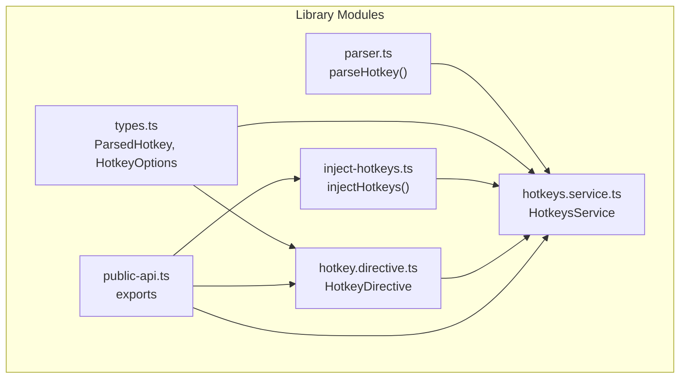
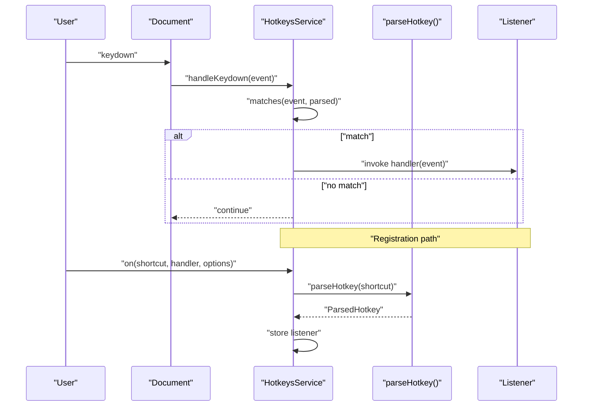
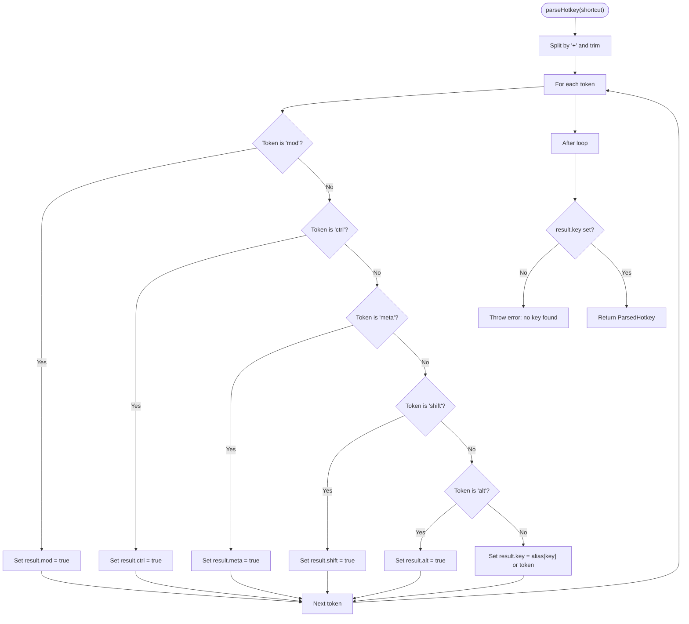
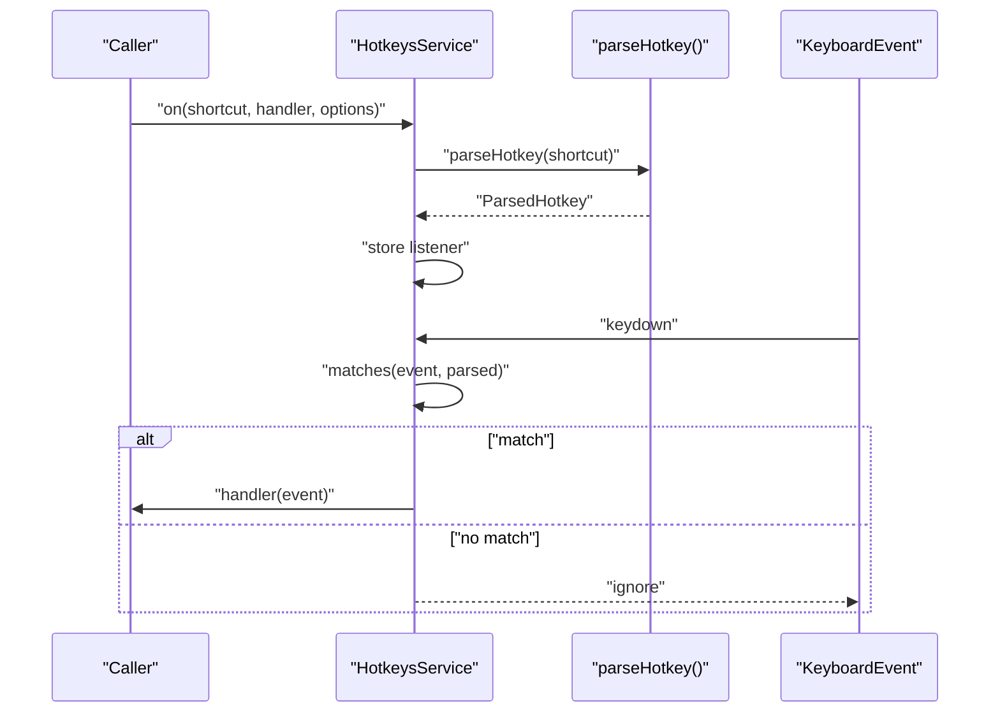
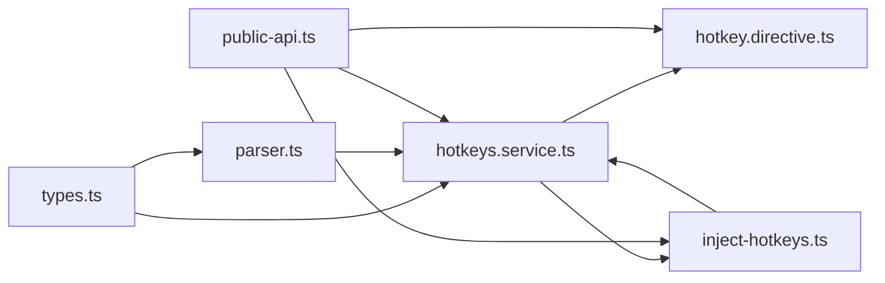

# Shortcut Syntax & Supported Keys

<cite>
**Referenced Files in This Document**
- [parser.ts](file://projects/ngx-hotkeys/src/lib/parser.ts)
- [types.ts](file://projects/ngx-hotkeys/src/lib/types.ts)
- [hotkeys.service.ts](file://projects/ngx-hotkeys/src/lib/hotkeys.service.ts)
- [hotkey.directive.ts](file://projects/ngx-hotkeys/src/lib/hotkey.directive.ts)
- [inject-hotkeys.ts](file://projects/ngx-hotkeys/src/lib/inject-hotkeys.ts)
- [public-api.ts](file://projects/ngx-hotkeys/src/lib/public-api.ts)
- [README.md](file://README.md)
- [EXAMPLE.md](file://EXAMPLE.md)
</cite>

## Table of Contents
1. [Introduction](#introduction)
2. [Project Structure](#project-structure)
3. [Core Components](#core-components)
4. [Architecture Overview](#architecture-overview)
5. [Detailed Component Analysis](#detailed-component-analysis)
6. [Dependency Analysis](#dependency-analysis)
7. [Performance Considerations](#performance-considerations)
8. [Troubleshooting Guide](#troubleshooting-guide)
9. [Conclusion](#conclusion)

## Introduction
This document explains the shortcut syntax and supported key definitions for the ngx-hotkeys library. It focuses on how shortcut strings are parsed into structured objects, the modifiers supported (including the cross-platform 'mod' shorthand), and the normalization of key names. It also covers special key names for non-alphabetic characters, function keys, arrow keys, and navigation keys, along with examples, limitations, and troubleshooting guidance.

## Project Structure
The hotkey parsing and runtime logic are implemented in a small set of focused modules:
- Parser: converts shortcut strings into normalized ParsedHotkey objects
- Types: defines the ParsedHotkey interface and related types
- Service: registers listeners, matches events against parsed shortcuts, and handles platform differences
- Directive: declarative binding for templates
- Injection helper: convenience function to obtain the service instance

**Diagram sources**
- [parser.ts:12-45](file://projects/ngx-hotkeys/src/lib/parser.ts#L12-L45)
- [types.ts:9-18](file://projects/ngx-hotkeys/src/lib/types.ts#L9-L18)
- [hotkeys.service.ts:42-81](file://projects/ngx-hotkeys/src/lib/hotkeys.service.ts#L42-L81)
- [hotkey.directive.ts:17-57](file://projects/ngx-hotkeys/src/lib/hotkey.directive.ts#L17-L57)
- [inject-hotkeys.ts:4-6](file://projects/ngx-hotkeys/src/lib/inject-hotkeys.ts#L4-L6)
- [public-api.ts:1-5](file://projects/ngx-hotkeys/src/lib/public-api.ts#L1-L5)

**Section sources**
- [parser.ts:1-46](file://projects/ngx-hotkeys/src/lib/parser.ts#L1-L46)
- [types.ts:1-19](file://projects/ngx-hotkeys/src/lib/types.ts#L1-L19)
- [hotkeys.service.ts:1-138](file://projects/ngx-hotkeys/src/lib/hotkeys.service.ts#L1-L138)
- [hotkey.directive.ts:1-58](file://projects/ngx-hotkeys/src/lib/hotkey.directive.ts#L1-L58)
- [inject-hotkeys.ts:1-7](file://projects/ngx-hotkeys/src/lib/inject-hotkeys.ts#L1-L7)
- [public-api.ts:1-5](file://projects/ngx-hotkeys/src/lib/public-api.ts#L1-L5)

## Core Components
- ParsedHotkey: the normalized representation of a shortcut, including the key and modifier flags
- parseHotkey(): transforms a shortcut string into a ParsedHotkey
- HotkeysService: registers listeners, matches KeyboardEvents against parsed shortcuts, and applies platform-aware modifier semantics
- HotkeyDirective: declarative binding that forwards to HotkeysService
- injectHotkeys(): convenience DI accessor for the service

Key capabilities:
- Cross-platform 'mod' shorthand maps to meta on macOS and ctrl on Windows/Linux
- Modifier flags: ctrl, alt, shift, meta, and mod
- Key normalization via aliases for common names
- Event filtering based on input focus and options

**Section sources**
- [types.ts:9-18](file://projects/ngx-hotkeys/src/lib/types.ts#L9-L18)
- [parser.ts:12-45](file://projects/ngx-hotkeys/src/lib/parser.ts#L12-L45)
- [hotkeys.service.ts:57-81](file://projects/ngx-hotkeys/src/lib/hotkeys.service.ts#L57-L81)
- [hotkey.directive.ts:17-57](file://projects/ngx-hotkeys/src/lib/hotkey.directive.ts#L17-L57)
- [inject-hotkeys.ts:4-6](file://projects/ngx-hotkeys/src/lib/inject-hotkeys.ts#L4-L6)

## Architecture Overview
The system parses shortcut strings into ParsedHotkey objects and stores them with handlers. On keydown, the service checks whether the pressed key and modifiers match the parsed shortcut, applying platform-aware modifier semantics.

**Diagram sources**
- [hotkeys.service.ts:83-122](file://projects/ngx-hotkeys/src/lib/hotkeys.service.ts#L83-L122)
- [parser.ts:12-45](file://projects/ngx-hotkeys/src/lib/parser.ts#L12-L45)

## Detailed Component Analysis

### parseHotkey() Function
Purpose:
- Split the shortcut string by '+' and normalize each token
- Recognize modifier tokens and set flags
- Resolve the base key, including alias normalization
- Enforce that a key is present

Processing logic:
- Lowercase and trim each token
- Iterate tokens:
  - If token equals a modifier, set the corresponding flag
  - Otherwise treat as key; resolve aliases or keep as-is
- Throw an error if no key was found

Key alias normalization:
- Special aliases are mapped to canonical names (e.g., 'space' to a space character, 'arrowup' to 'arrowup', etc.)

**Diagram sources**
- [parser.ts:12-45](file://projects/ngx-hotkeys/src/lib/parser.ts#L12-L45)

**Section sources**
- [parser.ts:12-45](file://projects/ngx-hotkeys/src/lib/parser.ts#L12-L45)
- [types.ts:9-18](file://projects/ngx-hotkeys/src/lib/types.ts#L9-L18)

### Supported Modifiers and 'mod' Shorthand
Modifiers recognized:
- ctrl
- alt
- shift
- meta
- mod

Behavior:
- 'mod' is platform-aware:
  - On macOS, 'mod' maps to meta
  - On Windows/Linux, 'mod' maps to ctrl
- The service compares against event.ctrlKey, event.metaKey, event.shiftKey, and event.altKey accordingly

Normalization:
- Tokens are lowercased and trimmed before comparison
- 'mod' is treated as a single modifier regardless of case

**Section sources**
- [hotkeys.service.ts:102-122](file://projects/ngx-hotkeys/src/lib/hotkeys.service.ts#L102-L122)
- [parser.ts:24-38](file://projects/ngx-hotkeys/src/lib/parser.ts#L24-L38)

### Key Aliases and Normalization
Supported aliases:
- 'esc' -> 'escape'
- 'space' -> a space character
- 'arrowup' -> 'arrowup'
- 'arrowdown' -> 'arrowdown'
- 'arrowleft' -> 'arrowleft'
- 'arrowright' -> 'arrowright'

Normalization rules:
- Shortcut strings are lowercased before parsing
- Tokens are trimmed to remove whitespace
- Non-modifier tokens are treated as the base key; if an alias exists, it is resolved; otherwise the literal token is used

Supported keys:
- Alphabetic characters: case-insensitive
- Numeric characters: digits
- Special characters: punctuation and symbols
- Function keys: e.g., 'f1' through 'f12' (supported by the underlying KeyboardEvent.key semantics)
- Navigation keys: arrows and others covered by aliases

Note: The library does not define explicit aliases for function keys beyond 'arrow*' entries; however, function keys are supported because the base key is taken as the unaliased token.

**Section sources**
- [parser.ts:3-10](file://projects/ngx-hotkeys/src/lib/parser.ts#L3-L10)
- [parser.ts:35-37](file://projects/ngx-hotkeys/src/lib/parser.ts#L35-L37)
- [README.md:150-166](file://README.md#L150-L166)

### Registration and Matching Flow
Registration:
- HotkeysService.on() accepts a single shortcut string or an array of strings
- Each shortcut is parsed into a ParsedHotkey
- Listeners are stored and cleaned up on component/service destruction

Matching:
- On keydown, the service checks if the pressed key matches the parsed key (case-insensitive)
- Platform-aware modifier evaluation:
  - expectCtrl = parsed.ctrl OR (parsed.mod AND NOT macOS)
  - expectMeta = parsed.meta OR (parsed.mod AND macOS)
  - expectShift = parsed.shift
  - expectAlt = parsed.alt
- If any expected modifier differs from the event, the match fails

**Diagram sources**
- [hotkeys.service.ts:42-81](file://projects/ngx-hotkeys/src/lib/hotkeys.service.ts#L42-L81)
- [hotkeys.service.ts:83-122](file://projects/ngx-hotkeys/src/lib/hotkeys.service.ts#L83-L122)
- [parser.ts:12-45](file://projects/ngx-hotkeys/src/lib/parser.ts#L12-L45)

**Section sources**
- [hotkeys.service.ts:42-81](file://projects/ngx-hotkeys/src/lib/hotkeys.service.ts#L42-L81)
- [hotkeys.service.ts:83-122](file://projects/ngx-hotkeys/src/lib/hotkeys.service.ts#L83-L122)

### Declarative Binding (Directive)
HotkeyDirective provides a declarative way to bind shortcuts in templates:
- Inputs: hotkey (required), hotkeyEnabled, hotkeyPreventDefault, hotkeyAllowInInput
- Output: hotkeyTriggered emits the KeyboardEvent when matched
- Internally forwards to HotkeysService.on()

Lifecycle:
- Registers on ngOnChanges
- Unregisters on ngOnDestroy

**Section sources**
- [hotkey.directive.ts:17-57](file://projects/ngx-hotkeys/src/lib/hotkey.directive.ts#L17-L57)

## Dependency Analysis
The modules are loosely coupled:
- parser.ts depends on types.ts for ParsedHotkey
- hotkeys.service.ts depends on parser.ts and types.ts
- hotkey.directive.ts depends on hotkeys.service.ts and types.ts
- inject-hotkeys.ts depends on hotkeys.service.ts
- public-api.ts re-exports the public API

**Diagram sources**
- [parser.ts:1](file://projects/ngx-hotkeys/src/lib/parser.ts#L1)
- [types.ts:1](file://projects/ngx-hotkeys/src/lib/types.ts#L1)
- [hotkeys.service.ts:4](file://projects/ngx-hotkeys/src/lib/hotkeys.service.ts#L4)
- [hotkey.directive.ts:10](file://projects/ngx-hotkeys/src/lib/hotkey.directive.ts#L10)
- [inject-hotkeys.ts:2](file://projects/ngx-hotkeys/src/lib/inject-hotkeys.ts#L2)
- [public-api.ts:1-5](file://projects/ngx-hotkeys/src/lib/public-api.ts#L1-L5)

**Section sources**
- [parser.ts:1](file://projects/ngx-hotkeys/src/lib/parser.ts#L1)
- [types.ts:1](file://projects/ngx-hotkeys/src/lib/types.ts#L1)
- [hotkeys.service.ts:4](file://projects/ngx-hotkeys/src/lib/hotkeys.service.ts#L4)
- [hotkey.directive.ts:10](file://projects/ngx-hotkeys/src/lib/hotkey.directive.ts#L10)
- [inject-hotkeys.ts:2](file://projects/ngx-hotkeys/src/lib/inject-hotkeys.ts#L2)
- [public-api.ts:1-5](file://projects/ngx-hotkeys/src/lib/public-api.ts#L1-L5)

## Performance Considerations
- Parsing cost: O(n) over the number of tokens in the shortcut string
- Matching cost: O(L) over the number of registered listeners, where each listener performs constant-time comparisons
- Memory: Each listener adds minimal overhead; cleanup occurs on destroy
- Recommendations:
  - Prefer concise shortcut strings (fewer tokens)
  - Avoid excessive listeners in hot paths
  - Use the enabled option to disable shortcuts when not needed

[No sources needed since this section provides general guidance]

## Troubleshooting Guide
Common issues and resolutions:
- No key found error:
  - Cause: Shortcut string contains no valid key token
  - Resolution: Ensure at least one non-modifier token remains as the key
  - Reference: [parser.ts:40-42](file://projects/ngx-hotkeys/src/lib/parser.ts#L40-L42)

- 'mod' not triggering on macOS:
  - Cause: Expectation of meta vs ctrl
  - Resolution: Confirm platform; 'mod' maps to meta on macOS and ctrl on Windows/Linux
  - Reference: [hotkeys.service.ts:107-112](file://projects/ngx-hotkeys/src/lib/hotkeys.service.ts#L107-L112)

- Shortcut triggers while typing:
  - Cause: Default behavior allows input activation
  - Resolution: Set allowInInput: true to permit triggers in inputs; otherwise, avoid input focus
  - Reference: [hotkeys.service.ts:87-89](file://projects/ngx-hotkeys/src/lib/hotkeys.service.ts#L87-L89)

- Shortcut not firing:
  - Verify the key token is recognized; non-alias tokens are used literally
  - Ensure modifiers align with platform expectations
  - Confirm the handler is registered and not disabled
  - Reference: [parser.ts:35-37](file://projects/ngx-hotkeys/src/lib/parser.ts#L35-L37), [hotkeys.service.ts:102-122](file://projects/ngx-hotkeys/src/lib/hotkeys.service.ts#L102-L122)

- Function keys not working:
  - The library does not define explicit aliases for function keys; rely on the underlying KeyboardEvent.key semantics
  - Reference: [parser.ts:3-10](file://projects/ngx-hotkeys/src/lib/parser.ts#L3-L10)

**Section sources**
- [parser.ts:40-42](file://projects/ngx-hotkeys/src/lib/parser.ts#L40-L42)
- [hotkeys.service.ts:87-89](file://projects/ngx-hotkeys/src/lib/hotkeys.service.ts#L87-L89)
- [hotkeys.service.ts:107-112](file://projects/ngx-hotkeys/src/lib/hotkeys.service.ts#L107-L112)
- [parser.ts:35-37](file://projects/ngx-hotkeys/src/lib/parser.ts#L35-L37)

## Conclusion
The ngx-hotkeys library provides a concise and robust shortcut syntax with platform-aware 'mod' support, modifier flags, and key alias normalization. The parseHotkey() function converts shortcut strings into structured ParsedHotkey objects, enabling efficient matching during keydown events. By understanding the supported keys, modifier semantics, and normalization rules, developers can reliably compose shortcuts for diverse platforms and use cases.