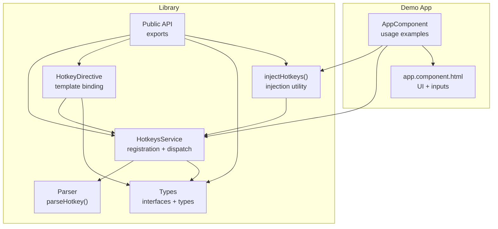
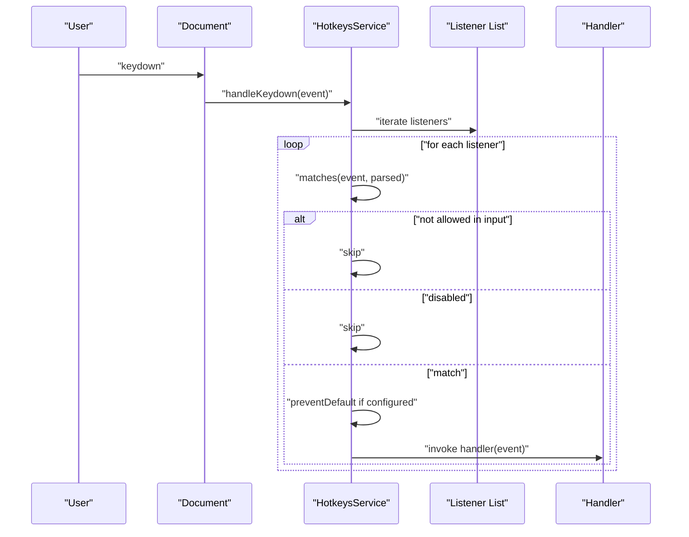
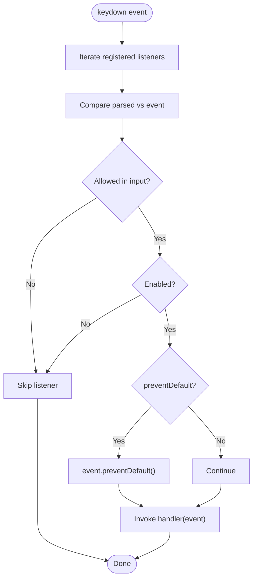
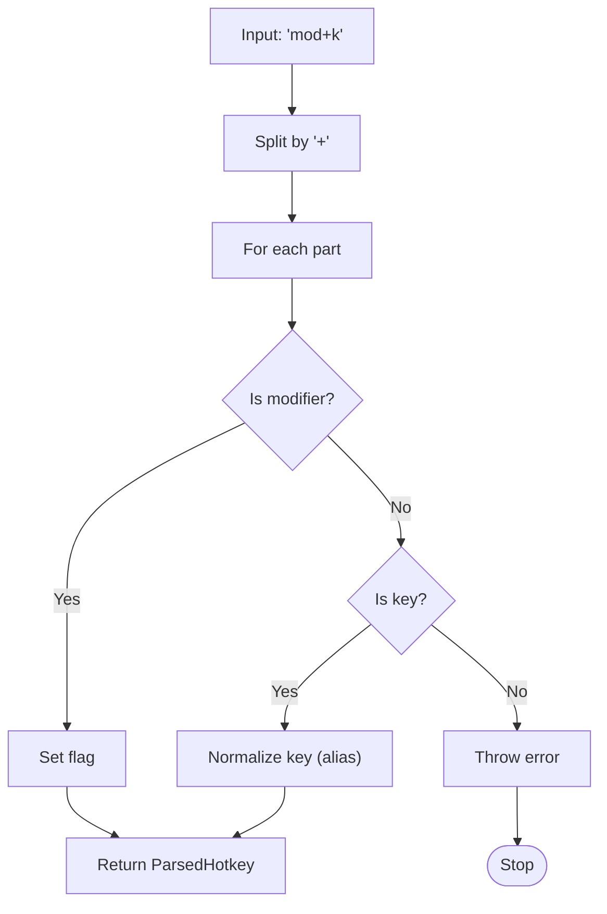
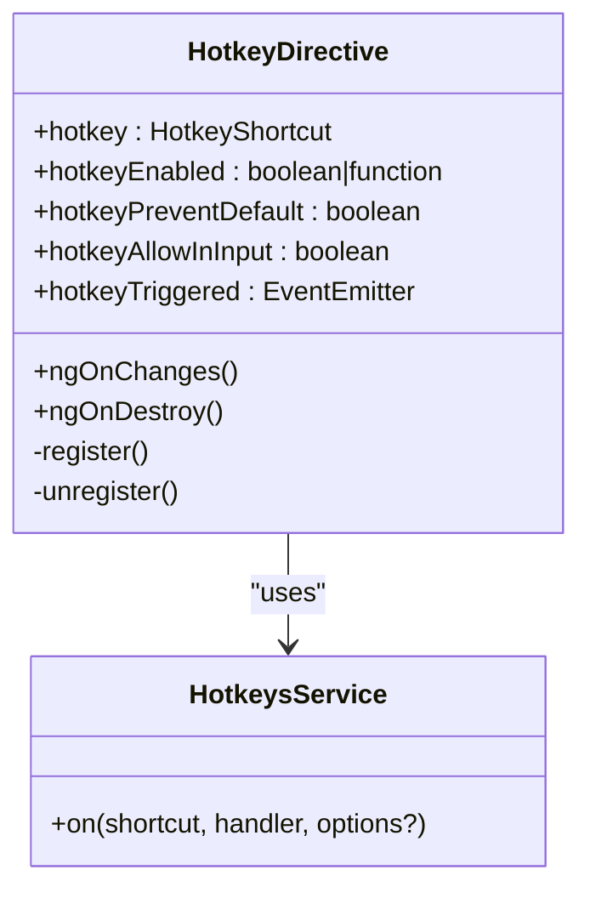
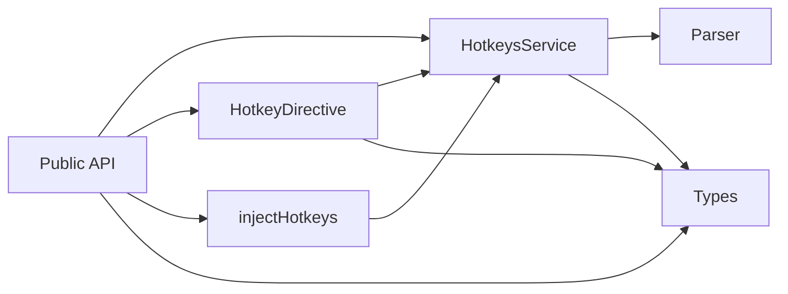

# Advanced Usage Patterns

<cite>
**Referenced Files in This Document**
- [hotkeys.service.ts](file://projects/ngx-hotkeys/src/lib/hotkeys.service.ts)
- [inject-hotkeys.ts](file://projects/ngx-hotkeys/src/lib/inject-hotkeys.ts)
- [parser.ts](file://projects/ngx-hotkeys/src/lib/parser.ts)
- [types.ts](file://projects/ngx-hotkeys/src/lib/types.ts)
- [hotkey.directive.ts](file://projects/ngx-hotkeys/src/lib/hotkey.directive.ts)
- [public-api.ts](file://projects/ngx-hotkeys/src/lib/public-api.ts)
- [app.component.ts](file://projects/demo-app/src/app/app.component.ts)
- [app.component.html](file://projects/demo-app/src/app/app.component.html)
- [README.md](file://README.md)
- [EXAMPLE.md](file://EXAMPLE.md)
- [package.json](file://projects/ngx-hotkeys/package.json)
</cite>

## Table of Contents
1. [Introduction](#introduction)
2. [Project Structure](#project-structure)
3. [Core Components](#core-components)
4. [Architecture Overview](#architecture-overview)
5. [Detailed Component Analysis](#detailed-component-analysis)
6. [Dependency Analysis](#dependency-analysis)
7. [Performance Considerations](#performance-considerations)
8. [Troubleshooting Guide](#troubleshooting-guide)
9. [Conclusion](#conclusion)
10. [Appendices](#appendices)

## Introduction
This document presents advanced usage patterns for ngx-hotkeys, focusing on sophisticated hotkey implementations beyond basic key bindings. It covers complex combinations, modifier key handling, platform-specific behavior, dynamic registration, conditional execution, state management, and integration patterns with Angular reactive forms, routing guards, and state management systems. It also addresses conflict resolution, priority handling, and graceful degradation strategies.

## Project Structure
The library is organized around a small set of cohesive modules:
- Service layer: central hotkey registration and dispatch
- Parser: converts human-readable shortcuts into normalized descriptors
- Types: shared interfaces and type definitions
- Directive: declarative hotkey binding for templates
- Public API: re-exported symbols for external consumption
- Demo application: practical examples of usage patterns

**Diagram sources**
- [hotkeys.service.ts:24-138](file://projects/ngx-hotkeys/src/lib/hotkeys.service.ts#L24-L138)
- [parser.ts:12-46](file://projects/ngx-hotkeys/src/lib/parser.ts#L12-L46)
- [types.ts:1-19](file://projects/ngx-hotkeys/src/lib/types.ts#L1-L19)
- [hotkey.directive.ts:13-58](file://projects/ngx-hotkeys/src/lib/hotkey.directive.ts#L13-L58)
- [inject-hotkeys.ts:4-6](file://projects/ngx-hotkeys/src/lib/inject-hotkeys.ts#L4-L6)
- [public-api.ts:1-5](file://projects/ngx-hotkeys/src/lib/public-api.ts#L1-L5)
- [app.component.ts:11-42](file://projects/demo-app/src/app/app.component.ts#L11-L42)
- [app.component.html:1-36](file://projects/demo-app/src/app/app.component.html#L1-L36)

**Section sources**
- [hotkeys.service.ts:1-138](file://projects/ngx-hotkeys/src/lib/hotkeys.service.ts#L1-L138)
- [parser.ts:1-46](file://projects/ngx-hotkeys/src/lib/parser.ts#L1-L46)
- [types.ts:1-19](file://projects/ngx-hotkeys/src/lib/types.ts#L1-L19)
- [hotkey.directive.ts:1-58](file://projects/ngx-hotkeys/src/lib/hotkey.directive.ts#L1-L58)
- [inject-hotkeys.ts:1-7](file://projects/ngx-hotkeys/src/lib/inject-hotkeys.ts#L1-L7)
- [public-api.ts:1-5](file://projects/ngx-hotkeys/src/lib/public-api.ts#L1-L5)
- [app.component.ts:1-43](file://projects/demo-app/src/app/app.component.ts#L1-L43)
- [app.component.html:1-36](file://projects/demo-app/src/app/app.component.html#L1-L36)

## Core Components
- HotkeysService: Central registry and dispatcher for keyboard events. Handles platform detection, input focus checks, and option-driven behavior.
- HotkeyDirective: Declarative binding for templates with inputs for enabling/disabling, preventing defaults, and allowing inputs.
- Parser: Normalizes shortcut strings into a structured descriptor with modifiers and keys.
- Types: Defines HotkeyOptions, HotkeyHandler, ParsedHotkey, and HotkeyShortcut.
- injectHotkeys: Injection utility returning the service instance.

Key capabilities:
- Dynamic registration and unregistration with returned cleanup functions
- Platform-aware modifier mapping (mod → meta on macOS, ctrl elsewhere)
- Conditional execution via enabled callbacks
- Input field control via allowInInput
- Event prevention via preventDefault

**Section sources**
- [hotkeys.service.ts:24-138](file://projects/ngx-hotkeys/src/lib/hotkeys.service.ts#L24-L138)
- [hotkey.directive.ts:13-58](file://projects/ngx-hotkeys/src/lib/hotkey.directive.ts#L13-L58)
- [parser.ts:12-46](file://projects/ngx-hotkeys/src/lib/parser.ts#L12-L46)
- [types.ts:1-19](file://projects/ngx-hotkeys/src/lib/types.ts#L1-L19)
- [inject-hotkeys.ts:4-6](file://projects/ngx-hotkeys/src/lib/inject-hotkeys.ts#L4-L6)

## Architecture Overview
The runtime architecture centers on a single keydown listener that iterates registered listeners and applies filters based on parsed shortcuts, platform modifiers, input focus, and enabled state.

**Diagram sources**
- [hotkeys.service.ts:83-100](file://projects/ngx-hotkeys/src/lib/hotkeys.service.ts#L83-L100)
- [hotkeys.service.ts:102-122](file://projects/ngx-hotkeys/src/lib/hotkeys.service.ts#L102-L122)

**Section sources**
- [hotkeys.service.ts:32-100](file://projects/ngx-hotkeys/src/lib/hotkeys.service.ts#L32-L100)

## Detailed Component Analysis

### HotkeysService: Registration, Matching, and Dispatch
- Registration: Supports single or multiple shortcuts; returns cleanup functions for manual removal and automatic cleanup on destroy.
- Matching: Compares normalized parsed shortcuts against the current KeyboardEvent, including platform-aware modifier mapping.
- Options: preventDefault, allowInInput, enabled (boolean or callback).
- Input focus detection: Ignores hotkeys when input-like elements are focused unless allowInInput is true.

Advanced patterns:
- Dynamic registration: Register/unregister based on component lifecycle or route changes.
- Conditional execution: Use enabled callbacks to gate hotkeys based on application state.
- Prevent default: Use preventDefault to suppress browser actions (e.g., save dialogs).
- Input control: Allow hotkeys while typing by setting allowInInput.

**Diagram sources**
- [hotkeys.service.ts:83-100](file://projects/ngx-hotkeys/src/lib/hotkeys.service.ts#L83-L100)
- [hotkeys.service.ts:102-122](file://projects/ngx-hotkeys/src/lib/hotkeys.service.ts#L102-L122)
- [hotkeys.service.ts:124-136](file://projects/ngx-hotkeys/src/lib/hotkeys.service.ts#L124-L136)

**Section sources**
- [hotkeys.service.ts:42-81](file://projects/ngx-hotkeys/src/lib/hotkeys.service.ts#L42-L81)
- [hotkeys.service.ts:83-136](file://projects/ngx-hotkeys/src/lib/hotkeys.service.ts#L83-L136)

### Parser: Shortcut Normalization
- Converts human-readable strings into a normalized descriptor with modifiers and key.
- Supports aliases for common keys (e.g., escape, space, arrows).
- Throws on invalid shortcuts (no key present).

**Diagram sources**
- [parser.ts:12-46](file://projects/ngx-hotkeys/src/lib/parser.ts#L12-L46)

**Section sources**
- [parser.ts:12-46](file://projects/ngx-hotkeys/src/lib/parser.ts#L12-L46)

### HotkeyDirective: Template-Based Binding
- Declarative binding with inputs for hotkey, enabled, preventDefault, and allowInInput.
- Emits an event on hotkey trigger for template-driven actions.
- Automatically registers/unregisters on changes and destruction.

**Diagram sources**
- [hotkey.directive.ts:17-58](file://projects/ngx-hotkeys/src/lib/hotkey.directive.ts#L17-L58)
- [hotkeys.service.ts:42-55](file://projects/ngx-hotkeys/src/lib/hotkeys.service.ts#L42-L55)

**Section sources**
- [hotkey.directive.ts:13-58](file://projects/ngx-hotkeys/src/lib/hotkey.directive.ts#L13-L58)

### Types and Public API
- HotkeyOptions: preventDefault, allowInInput, enabled (boolean or callback).
- HotkeyHandler: signature for handlers.
- ParsedHotkey: normalized representation of a shortcut.
- HotkeyShortcut: string or array of strings.
- Public API exports: service, directive, injection utility, and types.

**Section sources**
- [types.ts:1-19](file://projects/ngx-hotkeys/src/lib/types.ts#L1-L19)
- [public-api.ts:1-5](file://projects/ngx-hotkeys/src/lib/public-api.ts#L1-L5)

### Platform-Specific Behavior and Modifier Handling
- The mod modifier maps to meta on macOS and ctrl on other platforms.
- The matching logic compares expected vs actual modifier states accordingly.

Practical implications:
- Use mod for cross-platform convenience; rely on automatic mapping.
- For explicit control, specify meta or ctrl directly.

**Section sources**
- [hotkeys.service.ts:107-119](file://projects/ngx-hotkeys/src/lib/hotkeys.service.ts#L107-L119)
- [parser.ts:24-38](file://projects/ngx-hotkeys/src/lib/parser.ts#L24-L38)

### Dynamic Hotkey Registration and Cleanup
- Register multiple shortcuts at once; receive a combined cleanup function.
- Automatic cleanup on component/service destroy via DestroyRef.
- Manual cleanup via returned off functions.

Best practices:
- Store returned cleanup functions for later disposal.
- Use conditional registration based on route or feature flags.

**Section sources**
- [hotkeys.service.ts:42-55](file://projects/ngx-hotkeys/src/lib/hotkeys.service.ts#L42-L55)
- [hotkeys.service.ts:66-81](file://projects/ngx-hotkeys/src/lib/hotkeys.service.ts#L66-L81)

### Conditional Hotkey Execution
- enabled can be a boolean or a callback returning a boolean.
- Useful for disabling hotkeys during modal states, form edits, or feature flags.

**Section sources**
- [hotkeys.service.ts:20-22](file://projects/ngx-hotkeys/src/lib/hotkeys.service.ts#L20-L22)
- [hotkeys.service.ts:90-92](file://projects/ngx-hotkeys/src/lib/hotkeys.service.ts#L90-L92)

### Advanced Configuration Patterns
- preventDefault: Suppress browser defaults (e.g., save dialog).
- allowInInput: Enable hotkeys while typing in inputs.
- enabled: Gate hotkeys dynamically.

Examples from the demo app:
- Prevent default for save action.
- Allow hotkeys in inputs when necessary.

**Section sources**
- [app.component.ts:38-40](file://projects/demo-app/src/app/app.component.ts#L38-L40)
- [EXAMPLE.md:72-76](file://EXAMPLE.md#L72-L76)

### Integration Patterns

#### Reactive Forms Integration
- Disable hotkeys while editing form controls using enabled callbacks.
- Re-enable hotkeys when leaving edit mode.
- Use allowInInput selectively for specific actions (e.g., submit on mod+enter).

#### Routing Guards Integration
- Register hotkeys conditionally based on route guards.
- Unregister on navigation or guard deactivation.

#### State Management Systems
- Gate hotkeys based on state (e.g., disabled when loading).
- Emit actions from handlers to update state.

#### Hotkey Conflict Resolution and Priority Handling
- Prefer more specific combinations over generic ones.
- Use enabled callbacks to temporarily disable lower-priority hotkeys.
- Consider ordering registrations to influence precedence.

#### Graceful Degradation
- Detect unsupported environments and skip hotkey registration.
- Provide fallback UI affordances.

[No sources needed since this section provides general guidance]

## Dependency Analysis
The library maintains low coupling and clear boundaries:
- HotkeysService depends on DOM APIs, platform detection, and DestroyRef.
- Parser is pure and independent.
- Directive composes service and exposes a template-friendly API.
- Public API re-exports enable clean imports for consumers.

**Diagram sources**
- [hotkeys.service.ts:1-12](file://projects/ngx-hotkeys/src/lib/hotkeys.service.ts#L1-L12)
- [hotkey.directive.ts:1-11](file://projects/ngx-hotkeys/src/lib/hotkey.directive.ts#L1-L11)
- [public-api.ts:1-5](file://projects/ngx-hotkeys/src/lib/public-api.ts#L1-L5)

**Section sources**
- [hotkeys.service.ts:1-12](file://projects/ngx-hotkeys/src/lib/hotkeys.service.ts#L1-L12)
- [hotkey.directive.ts:1-11](file://projects/ngx-hotkeys/src/lib/hotkey.directive.ts#L1-L11)
- [public-api.ts:1-5](file://projects/ngx-hotkeys/src/lib/public-api.ts#L1-L5)

## Performance Considerations
- Single global keydown listener minimizes overhead.
- O(n) iteration over registered listeners; keep listener counts reasonable.
- Avoid heavy work in handlers; defer to microtasks if needed.
- Use enabled callbacks to short-circuit unnecessary processing.

[No sources needed since this section provides general guidance]

## Troubleshooting Guide
Common issues and resolutions:
- Hotkeys not firing in inputs: Set allowInInput to true for targeted shortcuts.
- Conflicts between hotkeys: Use more specific combinations or conditional gating.
- Hotkeys firing during modal editing: Use enabled callbacks to disable during modal states.
- Browser default actions interfering: Set preventDefault to true.
- Memory leaks: Ensure cleanup functions are called or rely on automatic cleanup.

**Section sources**
- [hotkeys.service.ts:87-96](file://projects/ngx-hotkeys/src/lib/hotkeys.service.ts#L87-L96)
- [hotkeys.service.ts:90-92](file://projects/ngx-hotkeys/src/lib/hotkeys.service.ts#L90-L92)
- [hotkeys.service.ts:124-136](file://projects/ngx-hotkeys/src/lib/hotkeys.service.ts#L124-L136)

## Conclusion
ngx-hotkeys provides a compact yet powerful foundation for advanced hotkey scenarios. By leveraging dynamic registration, conditional execution, platform-aware modifiers, and declarative directives, you can build robust keyboard-driven experiences. Combine these patterns with Angular’s reactive forms, routing guards, and state management to achieve seamless, accessible, and resilient keyboard interactions.

[No sources needed since this section summarizes without analyzing specific files]

## Appendices

### Quick Reference: Advanced Patterns
- Dynamic registration: Register/unregister based on route or feature flags.
- Conditional execution: Use enabled callbacks for state-dependent hotkeys.
- Input control: Allow hotkeys while typing selectively.
- Prevent default: Suppress browser actions for custom behavior.
- Directive binding: Use hotkeyTriggered for template-driven actions.
- Platform awareness: Rely on mod for cross-platform convenience.

**Section sources**
- [hotkeys.service.ts:42-81](file://projects/ngx-hotkeys/src/lib/hotkeys.service.ts#L42-L81)
- [hotkey.directive.ts:28-50](file://projects/ngx-hotkeys/src/lib/hotkey.directive.ts#L28-L50)
- [parser.ts:24-38](file://projects/ngx-hotkeys/src/lib/parser.ts#L24-L38)
- [app.component.ts:18-41](file://projects/demo-app/src/app/app.component.ts#L18-L41)