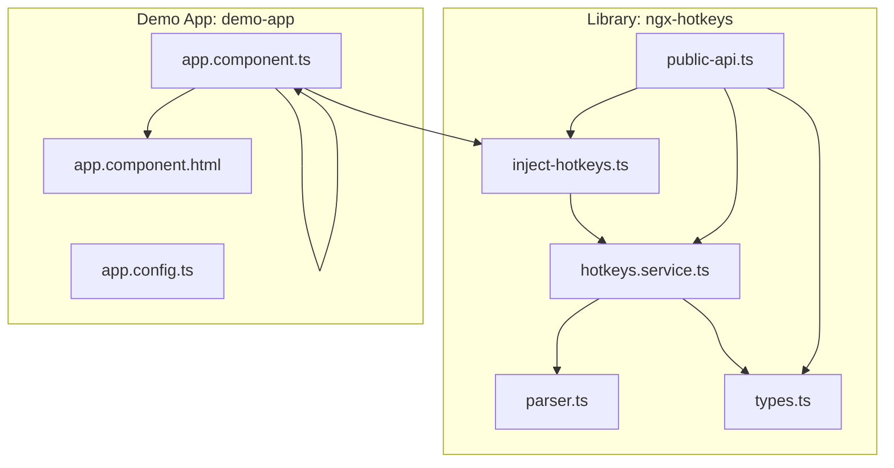
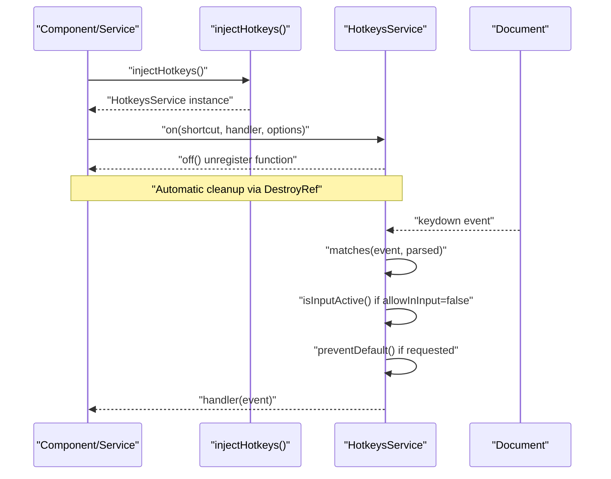
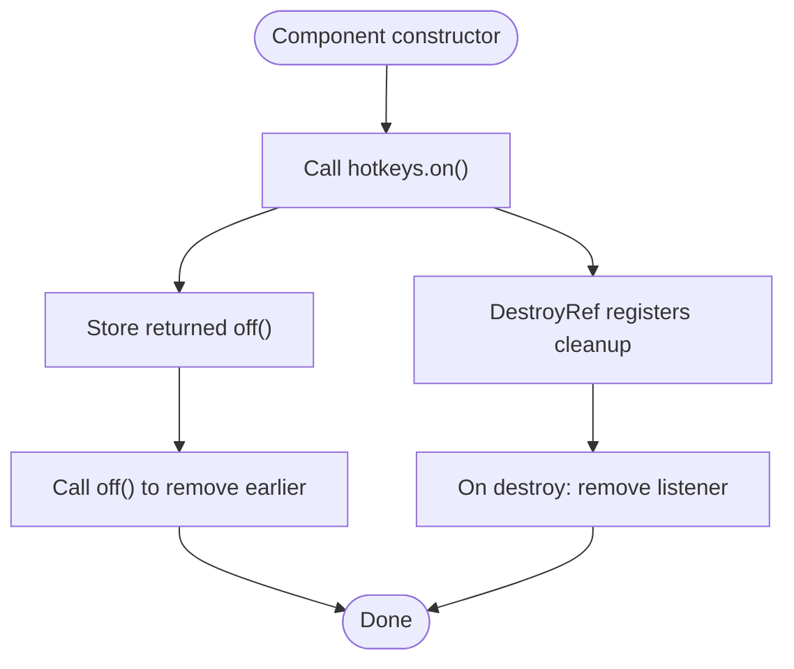
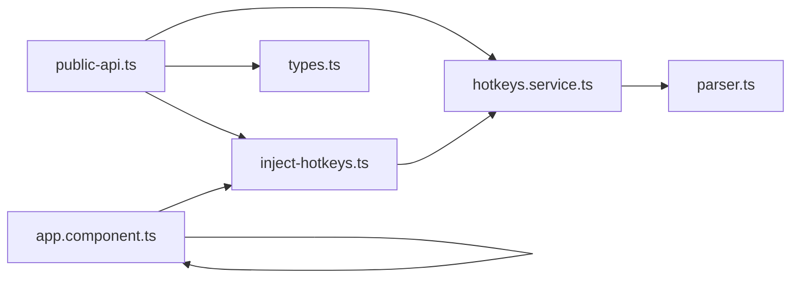

# Component Integration

<cite>
**Referenced Files in This Document**
- [README.md](file://README.md)
- [EXAMPLE.md](file://EXAMPLE.md)
- [hotkeys.service.ts](file://projects/ngx-hotkeys/src/lib/hotkeys.service.ts)
- [inject-hotkeys.ts](file://projects/ngx-hotkeys/src/lib/inject-hotkeys.ts)
- [parser.ts](file://projects/ngx-hotkeys/src/lib/parser.ts)
- [types.ts](file://projects/ngx-hotkeys/src/lib/types.ts)
- [public-api.ts](file://projects/ngx-hotkeys/src/lib/public-api.ts)
- [app.component.ts](file://projects/demo-app/src/app/app.component.ts)
- [app.component.html](file://projects/demo-app/src/app/app.component.html)
- [app.config.ts](file://projects/demo-app/src/app/app.config.ts)
- [angular.json](file://angular.json)
</cite>

## Table of Contents
1. [Introduction](#introduction)
2. [Project Structure](#project-structure)
3. [Core Components](#core-components)
4. [Architecture Overview](#architecture-overview)
5. [Detailed Component Analysis](#detailed-component-analysis)
6. [Dependency Analysis](#dependency-analysis)
7. [Performance Considerations](#performance-considerations)
8. [Troubleshooting Guide](#troubleshooting-guide)
9. [Conclusion](#conclusion)
10. [Appendices](#appendices)

## Introduction
This document provides practical, code-backed guidance for integrating ngx-hotkeys within Angular components. It focuses on:
- Standalone component integration with lifecycle-aware registration and cleanup
- Constructor-based hotkey registration and method-based handlers
- Reactive component state updates triggered by hotkeys
- Proper cleanup via the returned unregister function
- Component interaction patterns including focus management and conditional execution
- Best practices for organizing hotkeys at the component level

The examples and patterns shown are derived from the library’s implementation and the included demo application.

## Project Structure
The repository is organized as a dual-project workspace:
- Library: ngx-hotkeys (core implementation)
- Demo application: demo-app (usage examples)

**Diagram sources**
- [hotkeys.service.ts:1-114](file://projects/ngx-hotkeys/src/lib/hotkeys.service.ts#L1-L114)
- [inject-hotkeys.ts:1-7](file://projects/ngx-hotkeys/src/lib/inject-hotkeys.ts#L1-L7)
- [parser.ts:1-46](file://projects/ngx-hotkeys/src/lib/parser.ts#L1-L46)
- [types.ts:1-16](file://projects/ngx-hotkeys/src/lib/types.ts#L1-L16)
- [public-api.ts:1-4](file://projects/ngx-hotkeys/src/lib/public-api.ts#L1-L4)
- [app.component.ts:1-43](file://projects/demo-app/src/app/app.component.ts#L1-L43)
- [app.component.html:1-36](file://projects/demo-app/src/app/app.component.html#L1-L36)
- [app.config.ts:1-6](file://projects/demo-app/src/app/app.config.ts#L1-L6)

**Section sources**
- [angular.json:1-135](file://angular.json#L1-L135)

## Core Components
- HotkeysService: Centralized keyboard event listener registry with automatic cleanup on destroy. Provides on() to register hotkeys and returns an unregister function.
- injectHotkeys: Injection utility returning HotkeysService within an injection context.
- Parser: Parses human-friendly shortcut strings into normalized descriptors.
- Types: Defines HotkeyOptions, HotkeyHandler, and ParsedHotkey structures.
- Public API: Re-exports the primary symbols for consumers.

Key behaviors:
- Registration returns an off function to manually unregister.
- Automatic cleanup on component/service destruction via DestroyRef.
- Conditional execution based on allowInInput and input focus detection.
- Event-level control via preventDefault.

**Section sources**
- [hotkeys.service.ts:1-114](file://projects/ngx-hotkeys/src/lib/hotkeys.service.ts#L1-L114)
- [inject-hotkeys.ts:1-7](file://projects/ngx-hotkeys/src/lib/inject-hotkeys.ts#L1-L7)
- [parser.ts:1-46](file://projects/ngx-hotkeys/src/lib/parser.ts#L1-L46)
- [types.ts:1-16](file://projects/ngx-hotkeys/src/lib/types.ts#L1-L16)
- [public-api.ts:1-4](file://projects/ngx-hotkeys/src/lib/public-api.ts#L1-L4)

## Architecture Overview
The hotkey pipeline integrates at the component/service layer via injectHotkeys, which delegates to HotkeysService. The service listens to document-level keydown events, matches against registered shortcuts, and invokes handlers with optional event manipulation.

**Diagram sources**
- [inject-hotkeys.ts:1-7](file://projects/ngx-hotkeys/src/lib/inject-hotkeys.ts#L1-L7)
- [hotkeys.service.ts:26-76](file://projects/ngx-hotkeys/src/lib/hotkeys.service.ts#L26-L76)
- [parser.ts:12-45](file://projects/ngx-hotkeys/src/lib/parser.ts#L12-L45)

## Detailed Component Analysis

### Standalone Component Integration (Constructor Initialization)
- Inject the service in the component constructor using injectHotkeys.
- Register hotkeys with on(), binding to inline arrow functions or component methods.
- Use preventDefault to suppress browser defaults when necessary.
- Leverage reactive properties to update UI state in response to hotkeys.

Example reference:
- [app.component.ts:18-41](file://projects/demo-app/src/app/app.component.ts#L18-L41)

Best practices:
- Keep handler logic minimal; delegate to component methods for clarity.
- Use preventDefault judiciously to avoid interfering with native browser actions.
- Group related hotkeys in the constructor for discoverability.

**Section sources**
- [app.component.ts:18-41](file://projects/demo-app/src/app/app.component.ts#L18-L41)
- [README.md:19-43](file://README.md#L19-L43)

### Method-Based Handlers and Reactive State Updates
- Define component methods to encapsulate hotkey logic.
- Update component-bound properties to reflect state changes in templates.
- Combine hotkeys with structural templates to show/hide UI areas.

Example reference:
- [app.component.ts:18-41](file://projects/demo-app/src/app/app.component.ts#L18-L41)
- [app.component.html:26-34](file://projects/demo-app/src/app/app.component.html#L26-L34)

Patterns:
- Toggle flags (e.g., modal visibility) directly from handlers.
- Increment counters or set messages to provide immediate feedback.
- Conditionally render overlays or dialogs based on reactive state.

**Section sources**
- [app.component.ts:14-16](file://projects/demo-app/src/app/app.component.ts#L14-L16)
- [app.component.html:26-34](file://projects/demo-app/src/app/app.component.html#L26-L34)

### Lifecycle Management and Cleanup
- Manual cleanup: Store the off function returned by on() and call it when appropriate (e.g., before navigation or component teardown).
- Automatic cleanup: When used inside components/services, listeners are removed on destroy via DestroyRef.

Example reference:
- [README.md:45-54](file://README.md#L45-L54)

Lifecycle flow:

**Diagram sources**
- [hotkeys.service.ts:36-60](file://projects/ngx-hotkeys/src/lib/hotkeys.service.ts#L36-L60)

**Section sources**
- [hotkeys.service.ts:30-34](file://projects/ngx-hotkeys/src/lib/hotkeys.service.ts#L30-L34)
- [hotkeys.service.ts:58-59](file://projects/ngx-hotkeys/src/lib/hotkeys.service.ts#L58-L59)
- [README.md:45-54](file://README.md#L45-L54)

### Component Interaction Patterns: Focus Management and Conditional Execution
- Conditional execution: By default, hotkeys are ignored while input-like elements are focused unless allowInInput is enabled.
- Focus management: Open overlays and set autofocus to bring focus into actionable elements after a hotkey action.

Example reference:
- [app.component.html:20-24](file://projects/demo-app/src/app/app.component.html#L20-L24)
- [EXAMPLE.md:12-42](file://EXAMPLE.md#L12-L42)

Patterns:
- Open a modal and autofocus an input to capture subsequent actions.
- Allow global hotkeys inside inputs when needed (e.g., submit on Enter) by enabling allowInInput.

**Section sources**
- [hotkeys.service.ts:100-112](file://projects/ngx-hotkeys/src/lib/hotkeys.service.ts#L100-L112)
- [EXAMPLE.md:72-76](file://EXAMPLE.md#L72-L76)

### Best Practices for Component-Level Organization
- Separate concerns:
  - Keep hotkey registration in the component/service where the feature is used.
  - Encapsulate handler logic in component methods for testability.
- Group related shortcuts near each other in the constructor for maintainability.
- Prefer method-based handlers over anonymous functions to simplify testing and refactoring.
- Use preventDefault sparingly and document why it is needed.
- Avoid registering the same shortcut multiple times; reuse the off function if reconfiguration is required.

Reference examples:
- [app.component.ts:18-41](file://projects/demo-app/src/app/app.component.ts#L18-L41)
- [EXAMPLE.md:18-42](file://EXAMPLE.md#L18-L42)

**Section sources**
- [app.component.ts:18-41](file://projects/demo-app/src/app/app.component.ts#L18-L41)
- [EXAMPLE.md:18-42](file://EXAMPLE.md#L18-L42)

## Dependency Analysis
The library exports a concise public API, and the demo app consumes it directly.

**Diagram sources**
- [public-api.ts:1-4](file://projects/ngx-hotkeys/src/lib/public-api.ts#L1-L4)
- [hotkeys.service.ts:1-114](file://projects/ngx-hotkeys/src/lib/hotkeys.service.ts#L1-L114)
- [inject-hotkeys.ts:1-7](file://projects/ngx-hotkeys/src/lib/inject-hotkeys.ts#L1-L7)
- [parser.ts:1-46](file://projects/ngx-hotkeys/src/lib/parser.ts#L1-L46)
- [types.ts:1-16](file://projects/ngx-hotkeys/src/lib/types.ts#L1-L16)
- [app.component.ts:1-43](file://projects/demo-app/src/app/app.component.ts#L1-L43)

**Section sources**
- [public-api.ts:1-4](file://projects/ngx-hotkeys/src/lib/public-api.ts#L1-L4)
- [angular.json:39-132](file://angular.json#L39-L132)

## Performance Considerations
- Event handling cost: The service iterates registered listeners per keydown. Keep the number of registered hotkeys reasonable within a component to minimize overhead.
- Conditional checks: allowInInput and input focus detection add negligible overhead but should be considered when registering many global hotkeys.
- Prevent default: Use only when necessary to avoid unnecessary DOM interactions.

## Troubleshooting Guide
Common issues and resolutions:
- Hotkey not firing in inputs:
  - Ensure allowInInput is set to true when you want hotkeys to trigger while typing.
  - Reference: [hotkeys.service.ts:62-76](file://projects/ngx-hotkeys/src/lib/hotkeys.service.ts#L62-L76), [EXAMPLE.md:72-76](file://EXAMPLE.md#L72-L76)
- Hotkey fires in inputs unexpectedly:
  - Leave allowInInput as false (default) so that input focus suppresses hotkeys.
  - Reference: [hotkeys.service.ts:100-112](file://projects/ngx-hotkeys/src/lib/hotkeys.service.ts#L100-L112)
- Handler not called:
  - Verify shortcut syntax and modifier keys. The parser supports aliases and modifiers.
  - Reference: [parser.ts:12-45](file://projects/ngx-hotkeys/src/lib/parser.ts#L12-L45)
- Memory leak or stale listeners:
  - Use the returned off function to unregister or rely on automatic cleanup via DestroyRef.
  - Reference: [hotkeys.service.ts:36-60](file://projects/ngx-hotkeys/src/lib/hotkeys.service.ts#L36-L60), [README.md:45-54](file://README.md#L45-L54)
- Browser default still occurs:
  - Confirm preventDefault is set in options and that the handler is invoked.
  - Reference: [hotkeys.service.ts:69-72](file://projects/ngx-hotkeys/src/lib/hotkeys.service.ts#L69-L72), [app.component.ts:38-40](file://projects/demo-app/src/app/app.component.ts#L38-L40)

**Section sources**
- [hotkeys.service.ts:62-76](file://projects/ngx-hotkeys/src/lib/hotkeys.service.ts#L62-L76)
- [hotkeys.service.ts:100-112](file://projects/ngx-hotkeys/src/lib/hotkeys.service.ts#L100-L112)
- [parser.ts:12-45](file://projects/ngx-hotkeys/src/lib/parser.ts#L12-L45)
- [README.md:45-54](file://README.md#L45-L54)
- [app.component.ts:38-40](file://projects/demo-app/src/app/app.component.ts#L38-L40)

## Conclusion
ngx-hotkeys enables straightforward, lifecycle-aware hotkey integration in Angular components. By injecting the service in constructors, registering handlers with on(), and leveraging the returned unregister function, you can manage hotkeys cleanly and safely. Combine reactive state updates with conditional execution and focus management to deliver responsive, accessible keyboard interactions. Follow the best practices outlined here to keep component-level hotkeys organized, maintainable, and free of leaks.

## Appendices

### API Summary
- injectHotkeys(): Returns HotkeysService within an injection context.
- HotkeysService.on(shortcut, handler, options?): Registers a hotkey and returns off().
- HotkeyOptions: preventDefault, allowInInput.

References:
- [README.md:58-81](file://README.md#L58-L81)
- [public-api.ts:1-4](file://projects/ngx-hotkeys/src/lib/public-api.ts#L1-L4)

**Section sources**
- [README.md:58-81](file://README.md#L58-L81)
- [public-api.ts:1-4](file://projects/ngx-hotkeys/src/lib/public-api.ts#L1-L4)