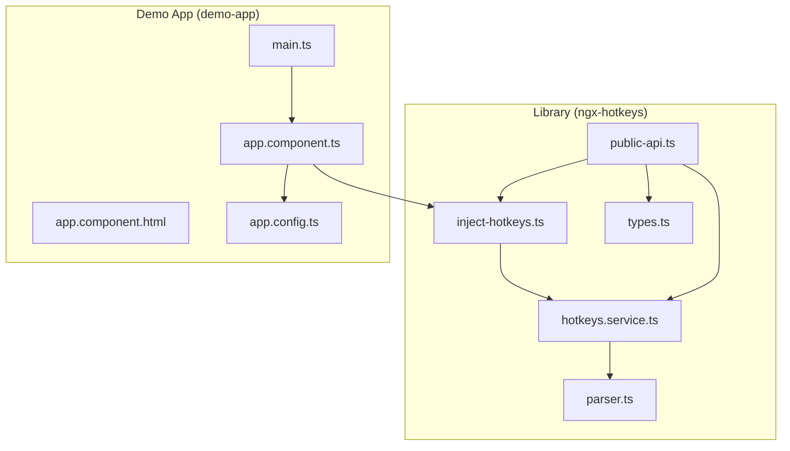
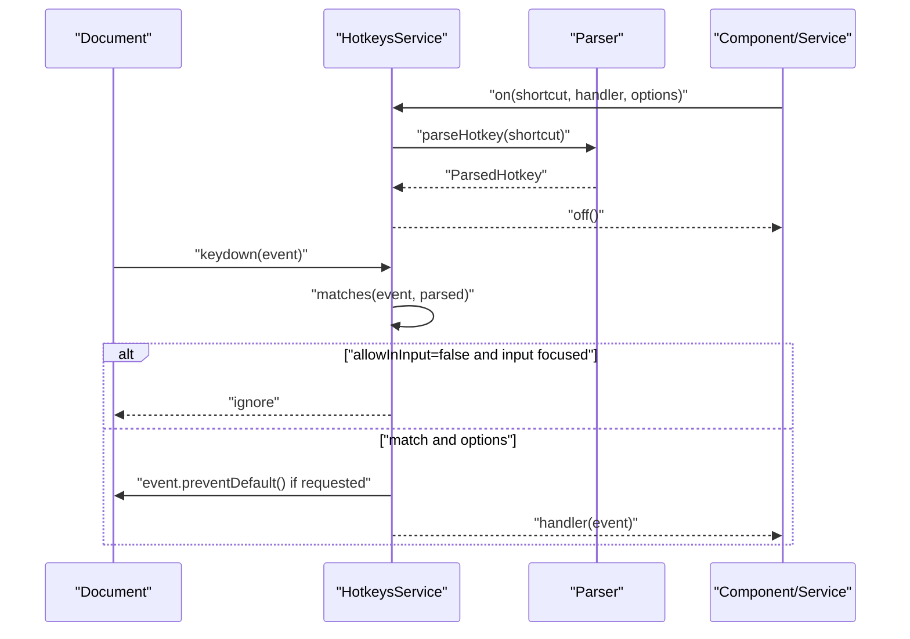
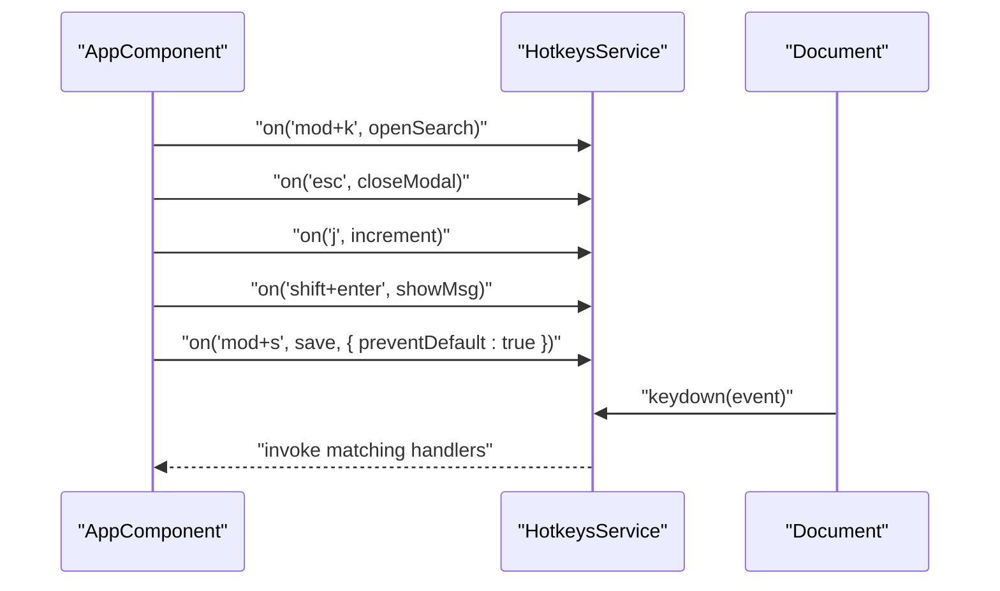
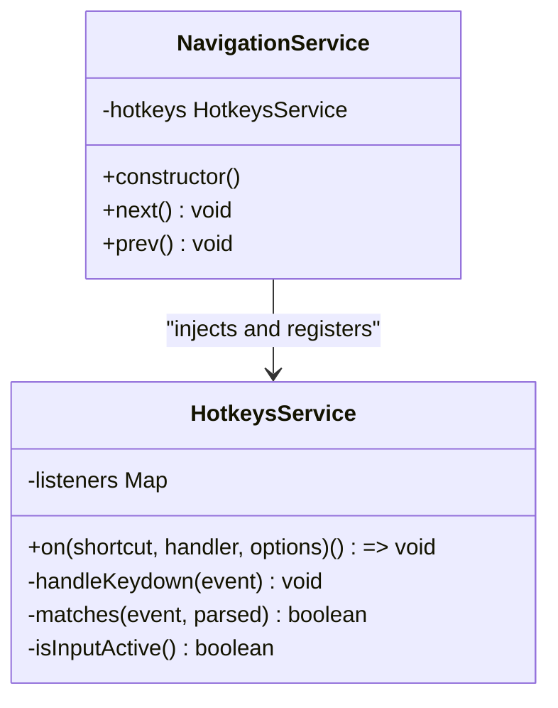
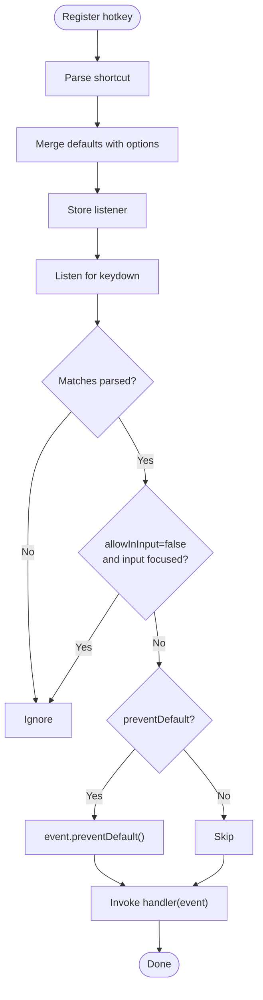
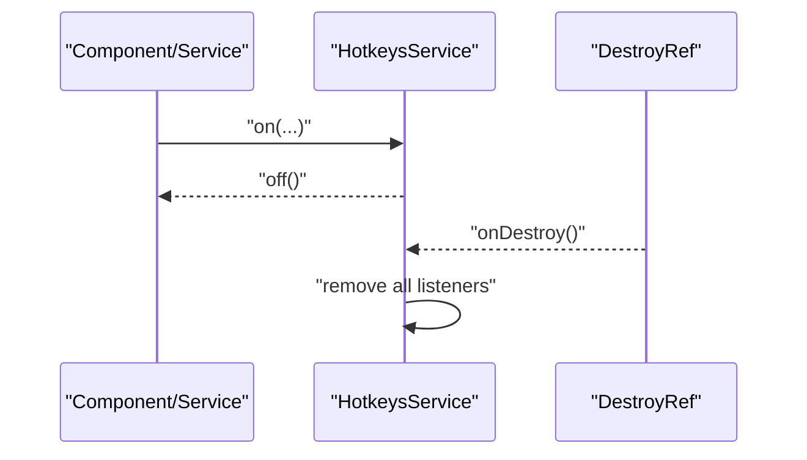
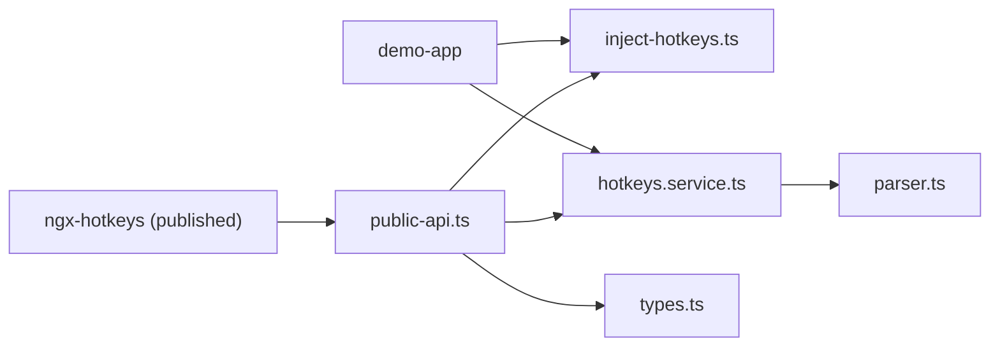
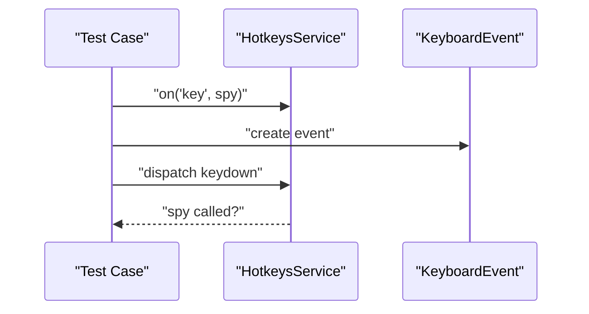

# Integration Examples

<cite>
**Referenced Files in This Document**
- [README.md](file://README.md)
- [EXAMPLE.md](file://EXAMPLE.md)
- [hotkeys.service.ts](file://projects/ngx-hotkeys/src/lib/hotkeys.service.ts)
- [inject-hotkeys.ts](file://projects/ngx-hotkeys/src/lib/inject-hotkeys.ts)
- [parser.ts](file://projects/ngx-hotkeys/src/lib/parser.ts)
- [types.ts](file://projects/ngx-hotkeys/src/lib/types.ts)
- [public-api.ts](file://projects/ngx-hotkeys/src/lib/public-api.ts)
- [app.component.ts](file://projects/demo-app/src/app/app.component.ts)
- [app.component.html](file://projects/demo-app/src/app/app.component.html)
- [main.ts](file://projects/demo-app/src/main.ts)
- [app.config.ts](file://projects/demo-app/src/app/app.config.ts)
- [app.component.spec.ts](file://projects/demo-app/src/app/app.component.spec.ts)
- [package.json](file://package.json)
</cite>

## Table of Contents
1. [Introduction](#introduction)
2. [Project Structure](#project-structure)
3. [Core Components](#core-components)
4. [Architecture Overview](#architecture-overview)
5. [Detailed Component Analysis](#detailed-component-analysis)
6. [Dependency Analysis](#dependency-analysis)
7. [Performance Considerations](#performance-considerations)
8. [Testing Examples](#testing-examples)
9. [Troubleshooting Guide](#troubleshooting-guide)
10. [Conclusion](#conclusion)

## Introduction
This document provides comprehensive integration examples for ngx-hotkeys across Angular contexts: standalone components, services, and global usage. It demonstrates practical patterns for lifecycle-aware hotkey registration, advanced configuration with custom handlers and event prevention, input field control, and testing strategies. It also outlines how to integrate with Angular patterns such as reactive forms, routing, and state management.

## Project Structure
The repository is organized into:
- Library module (ngx-hotkeys): core service, injection helper, parser, and types
- Demo application (demo-app): a minimal Angular standalone app showcasing runtime usage
- Top-level scripts and dependencies for building and testing

**Diagram sources**
- [hotkeys.service.ts:1-114](file://projects/ngx-hotkeys/src/lib/hotkeys.service.ts#L1-L114)
- [inject-hotkeys.ts:1-7](file://projects/ngx-hotkeys/src/lib/inject-hotkeys.ts#L1-L7)
- [parser.ts:1-46](file://projects/ngx-hotkeys/src/lib/parser.ts#L1-L46)
- [types.ts:1-16](file://projects/ngx-hotkeys/src/lib/types.ts#L1-L16)
- [public-api.ts:1-4](file://projects/ngx-hotkeys/src/lib/public-api.ts#L1-L4)
- [app.component.ts:1-43](file://projects/demo-app/src/app/app.component.ts#L1-L43)
- [app.component.html:1-36](file://projects/demo-app/src/app/app.component.html#L1-L36)
- [main.ts:1-7](file://projects/demo-app/src/main.ts#L1-L7)
- [app.config.ts:1-6](file://projects/demo-app/src/app/app.config.ts#L1-L6)

**Section sources**
- [README.md:1-127](file://README.md#L1-L127)
- [package.json:1-39](file://package.json#L1-L39)

## Core Components
- HotkeysService: central singleton managing keyboard listeners, platform detection, and automatic cleanup via DestroyRef.
- injectHotkeys: convenience injector returning the service instance.
- Parser: converts human-readable shortcut strings into normalized descriptors.
- Types: defines HotkeyOptions, HotkeyHandler, and ParsedHotkey structures.

Key capabilities:
- Register hotkeys with optional preventDefault and allowInInput flags
- Automatic cleanup on component/service destruction
- Cross-platform modifier mapping (mod → meta on macOS, ctrl elsewhere)
- Input focus detection to conditionally ignore hotkeys

**Section sources**
- [hotkeys.service.ts:1-114](file://projects/ngx-hotkeys/src/lib/hotkeys.service.ts#L1-L114)
- [inject-hotkeys.ts:1-7](file://projects/ngx-hotkeys/src/lib/inject-hotkeys.ts#L1-L7)
- [parser.ts:1-46](file://projects/ngx-hotkeys/src/lib/parser.ts#L1-L46)
- [types.ts:1-16](file://projects/ngx-hotkeys/src/lib/types.ts#L1-L16)
- [public-api.ts:1-4](file://projects/ngx-hotkeys/src/lib/public-api.ts#L1-L4)

## Architecture Overview
The library integrates at runtime via a root-scoped service that listens to document keydown events. Components and services inject the service to register handlers. The service stores multiple handlers per shortcut and dispatches to them on match, applying options such as preventing default behavior and allowing triggers inside inputs.

**Diagram sources**
- [hotkeys.service.ts:36-76](file://projects/ngx-hotkeys/src/lib/hotkeys.service.ts#L36-L76)
- [parser.ts:12-45](file://projects/ngx-hotkeys/src/lib/parser.ts#L12-L45)

## Detailed Component Analysis

### Standalone Component Integration
Pattern: Inject the service in a standalone component’s constructor and register hotkeys. Handlers update component state; optional preventDefault suppresses browser defaults.

- Registration and handler updates: see [app.component.ts:18-41](file://projects/demo-app/src/app/app.component.ts#L18-L41)
- Template usage and UI feedback: see [app.component.html:1-36](file://projects/demo-app/src/app/app.component.html#L1-L36)
- Bootstrapping: see [main.ts:1-7](file://projects/demo-app/src/main.ts#L1-L7) and [app.config.ts:1-6](file://projects/demo-app/src/app/app.config.ts#L1-L6)

**Diagram sources**
- [app.component.ts:18-41](file://projects/demo-app/src/app/app.component.ts#L18-L41)
- [hotkeys.service.ts:36-76](file://projects/ngx-hotkeys/src/lib/hotkeys.service.ts#L36-L76)

**Section sources**
- [app.component.ts:1-43](file://projects/demo-app/src/app/app.component.ts#L1-L43)
- [app.component.html:1-36](file://projects/demo-app/src/app/app.component.html#L1-L36)
- [main.ts:1-7](file://projects/demo-app/src/main.ts#L1-L7)
- [app.config.ts:1-6](file://projects/demo-app/src/app/app.config.ts#L1-L6)

### Service-Based Integration (Cross-Component Hotkey Management)
Pattern: Register global hotkeys in a root-provided service so multiple components can react to the same actions (e.g., navigation).

- Service registration: see [EXAMPLE.md:47-69](file://EXAMPLE.md#L47-L69)
- Behavior: handlers can trigger navigation, selection, or other shared logic

**Diagram sources**
- [hotkeys.service.ts:18-114](file://projects/ngx-hotkeys/src/lib/hotkeys.service.ts#L18-L114)
- [EXAMPLE.md:47-69](file://EXAMPLE.md#L47-L69)

**Section sources**
- [EXAMPLE.md:45-70](file://EXAMPLE.md#L45-L70)

### Advanced Configurations
- Prevent default behavior: pass { preventDefault: true } to override browser defaults (e.g., save dialogs).
  - See [app.component.ts:38-40](file://projects/demo-app/src/app/app.component.ts#L38-L40) and [EXAMPLE.md:74-76](file://EXAMPLE.md#L74-L76)
- Allow triggers inside inputs: pass { allowInInput: true } to enable hotkeys while typing.
  - See [EXAMPLE.md:74-76](file://EXAMPLE.md#L74-L76)
- Custom handlers: receive the KeyboardEvent to inspect modifiers or implement custom logic.
  - See [hotkeys.service.ts:62-76](file://projects/ngx-hotkeys/src/lib/hotkeys.service.ts#L62-L76)

**Diagram sources**
- [hotkeys.service.ts:36-76](file://projects/ngx-hotkeys/src/lib/hotkeys.service.ts#L36-L76)
- [parser.ts:12-45](file://projects/ngx-hotkeys/src/lib/parser.ts#L12-L45)

**Section sources**
- [app.component.ts:38-40](file://projects/demo-app/src/app/app.component.ts#L38-L40)
- [EXAMPLE.md:74-76](file://EXAMPLE.md#L74-L76)
- [hotkeys.service.ts:62-76](file://projects/ngx-hotkeys/src/lib/hotkeys.service.ts#L62-L76)

### Lifecycle Management
- Automatic cleanup: when used inside components/services, listeners are removed on destroy via DestroyRef.
  - See [hotkeys.service.ts:26-34](file://projects/ngx-hotkeys/src/lib/hotkeys.service.ts#L26-L34) and [hotkeys.service.ts:58-59](file://projects/ngx-hotkeys/src/lib/hotkeys.service.ts#L58-L59)
- Manual removal: the returned off() function detaches a listener immediately.
  - See [README.md:45-50](file://README.md#L45-L50)

**Diagram sources**
- [hotkeys.service.ts:26-34](file://projects/ngx-hotkeys/src/lib/hotkeys.service.ts#L26-L34)
- [hotkeys.service.ts:58-59](file://projects/ngx-hotkeys/src/lib/hotkeys.service.ts#L58-L59)

**Section sources**
- [hotkeys.service.ts:26-34](file://projects/ngx-hotkeys/src/lib/hotkeys.service.ts#L26-L34)
- [hotkeys.service.ts:58-59](file://projects/ngx-hotkeys/src/lib/hotkeys.service.ts#L58-L59)
- [README.md:52-54](file://README.md#L52-L54)

### Integration Patterns with Angular Ecosystem
- Reactive Forms: disable hotkeys while editing form controls by relying on default input filtering, or explicitly set allowInInput: true when appropriate.
- Routing: register navigation hotkeys in a service to support moving between routes or views.
- State Management: dispatch actions from handlers to update a centralized store (e.g., NgRx, Akita) without coupling UI components.

Note: These are conceptual integrations enabled by the library’s design and do not require changes to the library itself.

[No sources needed since this section doesn't analyze specific source files]

## Dependency Analysis
The library exports a concise public API surface and depends on Angular’s DI and DOM APIs. The demo app consumes the library as a published package.

**Diagram sources**
- [public-api.ts:1-4](file://projects/ngx-hotkeys/src/lib/public-api.ts#L1-L4)
- [inject-hotkeys.ts:1-7](file://projects/ngx-hotkeys/src/lib/inject-hotkeys.ts#L1-L7)
- [hotkeys.service.ts:1-114](file://projects/ngx-hotkeys/src/lib/hotkeys.service.ts#L1-L114)
- [parser.ts:1-46](file://projects/ngx-hotkeys/src/lib/parser.ts#L1-L46)
- [types.ts:1-16](file://projects/ngx-hotkeys/src/lib/types.ts#L1-L16)

**Section sources**
- [public-api.ts:1-4](file://projects/ngx-hotkeys/src/lib/public-api.ts#L1-L4)
- [package.json:1-39](file://package.json#L1-L39)

## Performance Considerations
- Event handling cost: O(N) over registered shortcuts per keydown; keep the number of registered hotkeys reasonable.
- Platform checks: modifier detection accounts for OS differences; avoid excessive re-parsing by reusing the service.
- Input focus detection: minimal overhead but can skip handler invocation when appropriate.

[No sources needed since this section provides general guidance]

## Testing Examples
- Component tests: verify component creation and basic rendering.
  - See [app.component.spec.ts:1-30](file://projects/demo-app/src/app/app.component.spec.ts#L1-L30)
- Hotkey behavior tests: simulate keydown events and assert handler invocation and side effects.
  - Strategy: inject the service, register a test handler, dispatch a KeyboardEvent programmatically, and assert expected outcomes.
  - Reference: [hotkeys.service.ts:62-76](file://projects/ngx-hotkeys/src/lib/hotkeys.service.ts#L62-L76)

**Diagram sources**
- [hotkeys.service.ts:62-76](file://projects/ngx-hotkeys/src/lib/hotkeys.service.ts#L62-L76)

**Section sources**
- [app.component.spec.ts:1-30](file://projects/demo-app/src/app/app.component.spec.ts#L1-L30)
- [hotkeys.service.ts:62-76](file://projects/ngx-hotkeys/src/lib/hotkeys.service.ts#L62-L76)

## Troubleshooting Guide
- Hotkeys not firing in inputs:
  - Cause: default behavior ignores inputs unless allowInInput is set.
  - Fix: register with { allowInInput: true }.
  - Reference: [hotkeys.service.ts:66-68](file://projects/ngx-hotkeys/src/lib/hotkeys.service.ts#L66-L68)
- Browser default still occurs:
  - Cause: preventDefault not set.
  - Fix: pass { preventDefault: true }.
  - Reference: [hotkeys.service.ts:69-71](file://projects/ngx-hotkeys/src/lib/hotkeys.service.ts#L69-L71)
- Hotkey registered but never invoked:
  - Verify shortcut parsing and key casing; ensure platform modifier mapping is correct.
  - References: [parser.ts:12-45](file://projects/ngx-hotkeys/src/lib/parser.ts#L12-L45), [hotkeys.service.ts:78-98](file://projects/ngx-hotkeys/src/lib/hotkeys.service.ts#L78-L98)
- Memory leak concerns:
  - Confirm usage inside components/services so DestroyRef auto-cleans up.
  - References: [hotkeys.service.ts:26-34](file://projects/ngx-hotkeys/src/lib/hotkeys.service.ts#L26-L34), [hotkeys.service.ts:58-59](file://projects/ngx-hotkeys/src/lib/hotkeys.service.ts#L58-L59)

**Section sources**
- [hotkeys.service.ts:62-76](file://projects/ngx-hotkeys/src/lib/hotkeys.service.ts#L62-L76)
- [parser.ts:12-45](file://projects/ngx-hotkeys/src/lib/parser.ts#L12-L45)

## Conclusion
ngx-hotkeys offers a minimal, Angular-native way to manage keyboard shortcuts with robust lifecycle handling and flexible configuration. By integrating via injectHotkeys in components or services, you can build responsive UIs with consistent hotkey behavior across inputs and platforms. Combine the library with Angular patterns like reactive forms, routing, and state management to deliver polished user experiences.