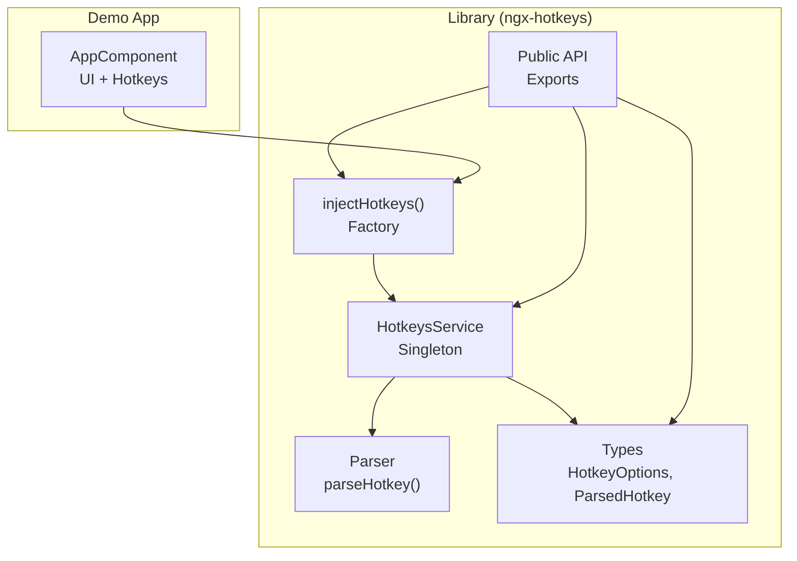
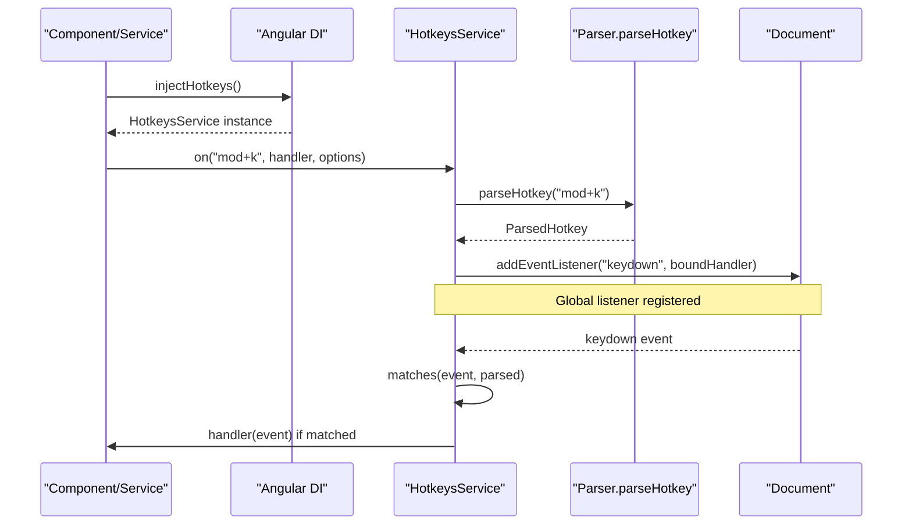
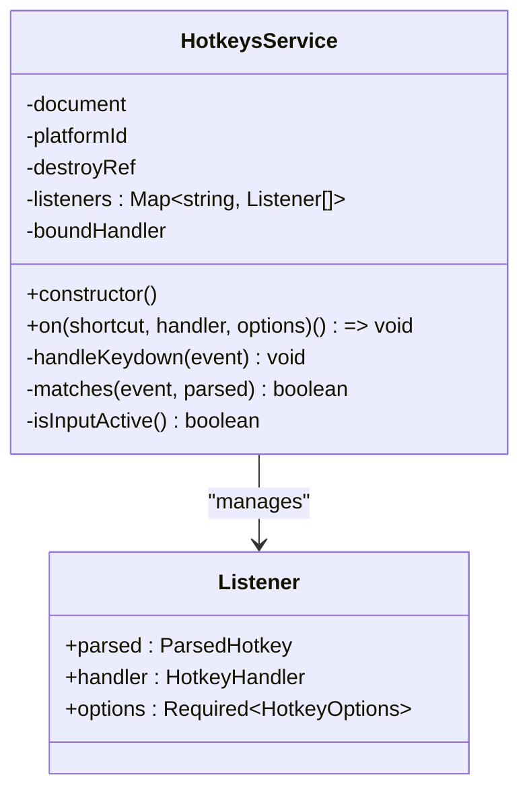
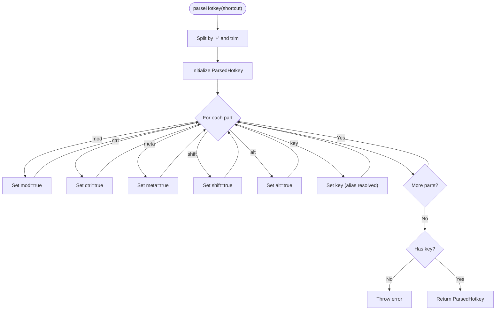
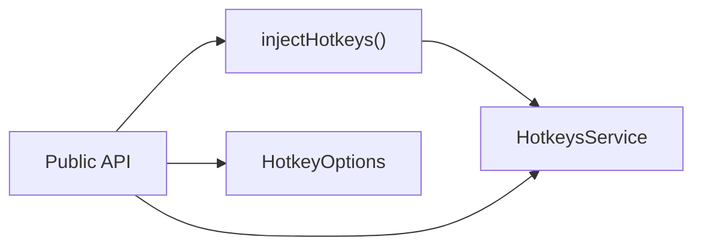
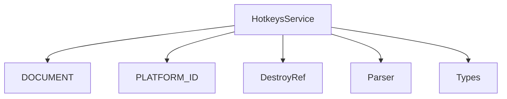

# Service Integration

<cite>
**Referenced Files in This Document**
- [hotkeys.service.ts](file://projects/ngx-hotkeys/src/lib/hotkeys.service.ts)
- [inject-hotkeys.ts](file://projects/ngx-hotkeys/src/lib/inject-hotkeys.ts)
- [parser.ts](file://projects/ngx-hotkeys/src/lib/parser.ts)
- [types.ts](file://projects/ngx-hotkeys/src/lib/types.ts)
- [public-api.ts](file://projects/ngx-hotkeys/src/lib/public-api.ts)
- [README.md](file://README.md)
- [EXAMPLE.md](file://EXAMPLE.md)
- [app.component.ts](file://projects/demo-app/src/app/app.component.ts)
</cite>

## Table of Contents
1. [Introduction](#introduction)
2. [Project Structure](#project-structure)
3. [Core Components](#core-components)
4. [Architecture Overview](#architecture-overview)
5. [Detailed Component Analysis](#detailed-component-analysis)
6. [Dependency Analysis](#dependency-analysis)
7. [Performance Considerations](#performance-considerations)
8. [Troubleshooting Guide](#troubleshooting-guide)
9. [Conclusion](#conclusion)

## Introduction
This document demonstrates comprehensive service integration patterns for ngx-hotkeys, focusing on Angular service-based hotkey management. It covers singleton behavior via Angular's dependency injection, global shortcuts, cross-component coordination through shared services, conditional activation, and dynamic registration. The examples show how to centralize hotkey logic in services for maintainability and reuse across an application.

## Project Structure
The ngx-hotkeys library exposes a root-scoped service and a convenience injector. The demo application illustrates usage in components and services.

**Diagram sources**
- [hotkeys.service.ts:18-34](file://projects/ngx-hotkeys/src/lib/hotkeys.service.ts#L18-L34)
- [inject-hotkeys.ts:4-6](file://projects/ngx-hotkeys/src/lib/inject-hotkeys.ts#L4-L6)
- [parser.ts:12-45](file://projects/ngx-hotkeys/src/lib/parser.ts#L12-L45)
- [types.ts:1-19](file://projects/ngx-hotkeys/src/lib/types.ts#L1-L19)
- [public-api.ts:1-4](file://projects/ngx-hotkeys/src/lib/public-api.ts#L1-L4)
- [app.component.ts:11-42](file://projects/demo-app/src/app/app.component.ts#L11-L42)

**Section sources**
- [public-api.ts:1-4](file://projects/ngx-hotkeys/src/lib/public-api.ts#L1-L4)
- [README.md:17-56](file://README.md#L17-L56)

## Core Components
- HotkeysService: Root-scoped singleton that listens to keydown events globally, parses shortcuts, and dispatches handlers. It supports manual unregistration and automatic cleanup via Angular's DestroyRef.
- injectHotkeys(): Convenience factory that returns the HotkeysService instance within an injection context.
- Parser: Converts string shortcuts into normalized ParsedHotkey structures, including modifier detection and key alias resolution.
- Types: Defines HotkeyOptions (including conditional enablement), HotkeyHandler signature, ParsedHotkey shape, and shortcut union types.

Key capabilities for service integration:
- Singleton behavior ensures centralized hotkey state and event handling.
- Dynamic registration/unregistration allows services to coordinate hotkeys across components.
- Conditional activation via HotkeyOptions.enabled enables feature flags or context-aware hotkeys.
- Global shortcuts that bypass input focus when configured.

**Section sources**
- [hotkeys.service.ts:18-60](file://projects/ngx-hotkeys/src/lib/hotkeys.service.ts#L18-L60)
- [inject-hotkeys.ts:4-6](file://projects/ngx-hotkeys/src/lib/inject-hotkeys.ts#L4-L6)
- [parser.ts:12-45](file://projects/ngx-hotkeys/src/lib/parser.ts#L12-L45)
- [types.ts:1-19](file://projects/ngx-hotkeys/src/lib/types.ts#L1-L19)

## Architecture Overview
The service architecture centers on a single HotkeysService instance injected via Angular's DI. Components and services obtain the service through injectHotkeys(), register hotkeys during construction, and receive automatic cleanup on destroy.

**Diagram sources**
- [hotkeys.service.ts:26-76](file://projects/ngx-hotkeys/src/lib/hotkeys.service.ts#L26-L76)
- [parser.ts:12-45](file://projects/ngx-hotkeys/src/lib/parser.ts#L12-L45)

## Detailed Component Analysis

### HotkeysService: Singleton Behavior and Lifecycle
- Singleton: Provided in root, ensuring one instance per application.
- Event binding: Adds a global keydown listener on platforms where the DOM is available; cleans up on destroy.
- Registration model: Stores multiple handlers per shortcut; returns an off function to remove a specific listener.
- Cleanup: Registers cleanup callbacks with DestroyRef so listeners are removed when the owning injection context is destroyed.

**Diagram sources**
- [hotkeys.service.ts:18-114](file://projects/ngx-hotkeys/src/lib/hotkeys.service.ts#L18-L114)

**Section sources**
- [hotkeys.service.ts:18-34](file://projects/ngx-hotkeys/src/lib/hotkeys.service.ts#L18-L34)
- [hotkeys.service.ts:36-60](file://projects/ngx-hotkeys/src/lib/hotkeys.service.ts#L36-L60)
- [hotkeys.service.ts:62-76](file://projects/ngx-hotkeys/src/lib/hotkeys.service.ts#L62-L76)

### Parser: Hotkey Parsing and Aliases
- Parses shortcuts like "mod+k", "shift+enter", "esc".
- Resolves aliases (e.g., "space", "arrowup") and sets modifier flags.
- Throws on invalid input (no key present).

**Diagram sources**
- [parser.ts:12-45](file://projects/ngx-hotkeys/src/lib/parser.ts#L12-L45)

**Section sources**
- [parser.ts:12-45](file://projects/ngx-hotkeys/src/lib/parser.ts#L12-L45)

### Service Injection Patterns and Public API
- injectHotkeys(): Returns the singleton HotkeysService instance within an injection context.
- Public API exports: HotkeysService, injectHotkeys, HotkeyOptions.

**Diagram sources**
- [inject-hotkeys.ts:4-6](file://projects/ngx-hotkeys/src/lib/inject-hotkeys.ts#L4-L6)
- [public-api.ts:1-4](file://projects/ngx-hotkeys/src/lib/public-api.ts#L1-L4)

**Section sources**
- [inject-hotkeys.ts:4-6](file://projects/ngx-hotkeys/src/lib/inject-hotkeys.ts#L4-L6)
- [public-api.ts:1-4](file://projects/ngx-hotkeys/src/lib/public-api.ts#L1-L4)

### Service-Based Hotkey Management Examples

#### Cross-Component Functionality via Shared Services
- Centralize navigation hotkeys in a service to coordinate actions across components.
- Register handlers in the service constructor; leverage the singleton for consistent behavior.

Example reference:
- [EXAMPLE.md:45-70](file://EXAMPLE.md#L45-L70)

#### Global Shortcuts That Work in Inputs
- Use allowInInput to trigger hotkeys even when focus is in inputs, textareas, selects, or contenteditable elements.

Example reference:
- [EXAMPLE.md:72-76](file://EXAMPLE.md#L72-L76)

#### Manual Unregistration and Auto Cleanup
- Store the returned off function to remove a listener programmatically.
- Listeners are automatically cleaned up when the owning injection context (component/service) is destroyed.

Example reference:
- [README.md:45-56](file://README.md#L45-L56)

#### Conditional Hotkey Activation
- Use HotkeyOptions.enabled as a boolean or function to enable/disable hotkeys based on runtime conditions.

Example reference:
- [types.ts:1-5](file://projects/ngx-hotkeys/src/lib/types.ts#L1-L5)

#### Dynamic Hotkey Registration
- Add or remove hotkeys at runtime by calling on() and off() as needed.

Example reference:
- [hotkeys.service.ts:36-60](file://projects/ngx-hotkeys/src/lib/hotkeys.service.ts#L36-L60)

### Advanced Patterns: Hotkey Groups and Inter-Component Coordination
While the library does not define explicit "groups," services can implement grouping semantics by:
- Naming conventions for shortcuts (e.g., "nav:j", "nav:k").
- Centralized registration in a service to coordinate related actions.
- Using preventDefault to suppress browser defaults for specific shortcuts.

Example reference:
- [README.md:19-43](file://README.md#L19-L43)

## Dependency Analysis
HotkeysService depends on Angular primitives and internal utilities. The public API re-exports the service and injector for consumer use.

**Diagram sources**
- [hotkeys.service.ts:18-34](file://projects/ngx-hotkeys/src/lib/hotkeys.service.ts#L18-L34)
- [parser.ts:12-45](file://projects/ngx-hotkeys/src/lib/parser.ts#L12-L45)
- [types.ts:1-19](file://projects/ngx-hotkeys/src/lib/types.ts#L1-L19)

**Section sources**
- [hotkeys.service.ts:18-34](file://projects/ngx-hotkeys/src/lib/hotkeys.service.ts#L18-L34)
- [public-api.ts:1-4](file://projects/ngx-hotkeys/src/lib/public-api.ts#L1-L4)

## Performance Considerations
- Single global listener: HotkeysService attaches one keydown listener and iterates registered handlers. This minimizes overhead while enabling flexible registration.
- Conditional checks: Matching logic evaluates modifiers and input focus efficiently; avoid excessive registrations to keep iteration cost low.
- Cleanup: Automatic removal of listeners prevents memory leaks and maintains performance over time.

## Troubleshooting Guide
- Hotkeys not firing:
  - Verify the shortcut string is valid and contains a key.
  - Confirm preventDefault usage if suppressing browser behavior is required.
  - Check allowInInput if shortcuts should work inside inputs.
- Conflicts with inputs:
  - Use allowInInput to enable hotkeys in inputs; otherwise, they are ignored when input elements are focused.
- Memory leaks:
  - Ensure long-lived services properly manage hotkey lifecycles; the service auto-cleans via DestroyRef, but custom contexts should still call returned off functions when appropriate.
- Platform differences:
  - mod maps to meta on macOS and ctrl on other platforms; test accordingly.

**Section sources**
- [hotkeys.service.ts:62-76](file://projects/ngx-hotkeys/src/lib/hotkeys.service.ts#L62-L76)
- [parser.ts:40-42](file://projects/ngx-hotkeys/src/lib/parser.ts#L40-L42)
- [README.md:52-56](file://README.md#L52-L56)

## Conclusion
By leveraging the root-provided HotkeysService and injectHotkeys(), developers can implement robust, centralized hotkey management in Angular applications. Services serve as ideal homes for cross-component coordination, global shortcuts, and dynamic registration. Combined with conditional activation and automatic cleanup, these patterns support scalable and maintainable keyboard-driven experiences.