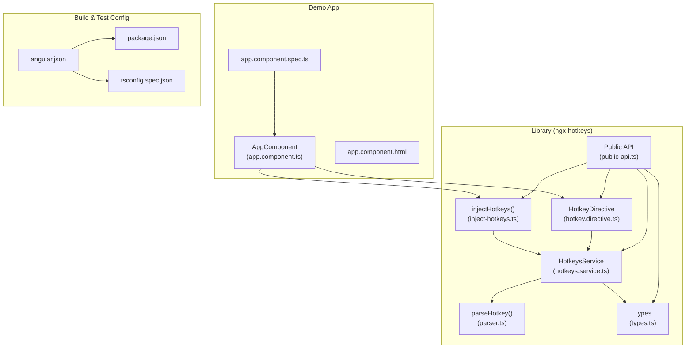
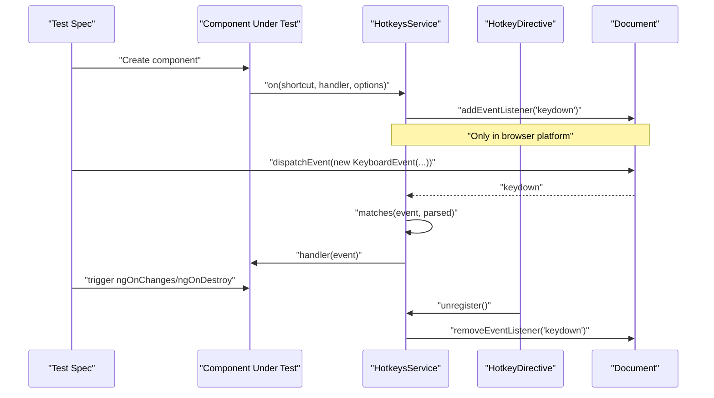
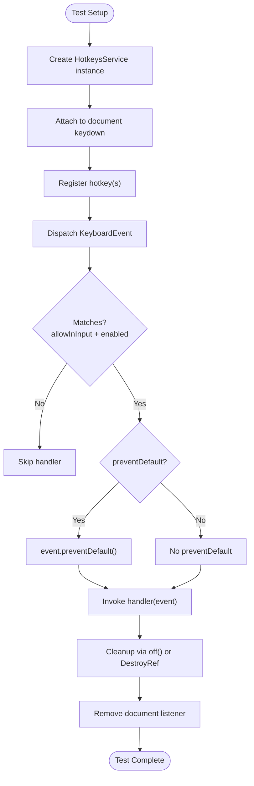
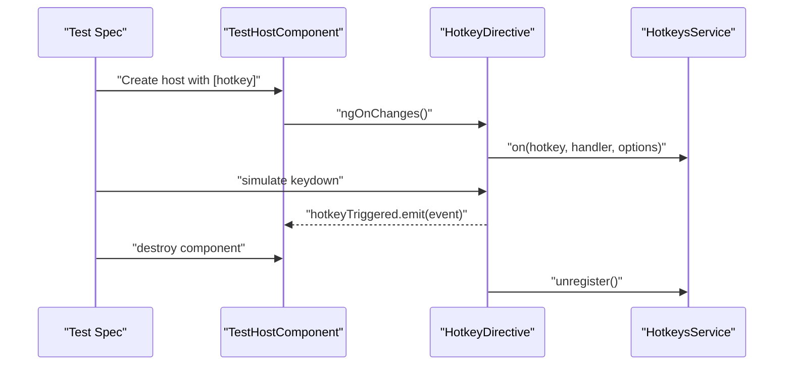
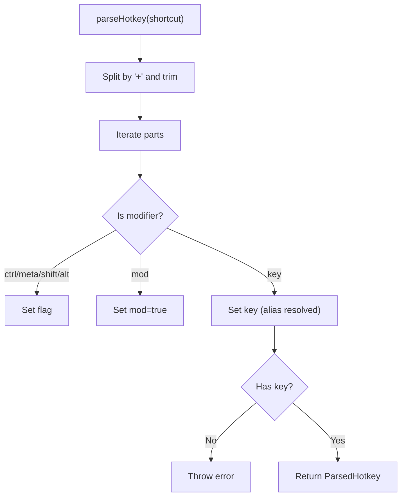
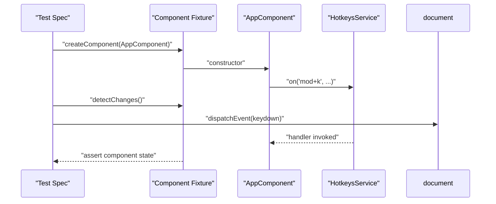
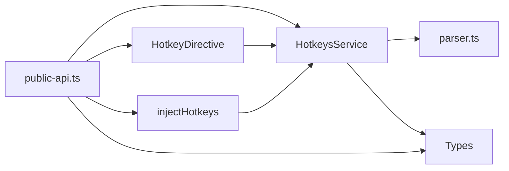

# Testing Examples

<cite>
**Referenced Files in This Document**
- [hotkeys.service.ts](file://projects/ngx-hotkeys/src/lib/hotkeys.service.ts)
- [hotkey.directive.ts](file://projects/ngx-hotkeys/src/lib/hotkey.directive.ts)
- [inject-hotkeys.ts](file://projects/ngx-hotkeys/src/lib/inject-hotkeys.ts)
- [parser.ts](file://projects/ngx-hotkeys/src/lib/parser.ts)
- [types.ts](file://projects/ngx-hotkeys/src/lib/types.ts)
- [public-api.ts](file://projects/ngx-hotkeys/src/lib/public-api.ts)
- [app.component.ts](file://projects/demo-app/src/app/app.component.ts)
- [app.component.html](file://projects/demo-app/src/app/app.component.html)
- [app.component.spec.ts](file://projects/demo-app/src/app/app.component.spec.ts)
- [angular.json](file://angular.json)
- [package.json](file://package.json)
- [tsconfig.spec.json](file://projects/ngx-hotkeys/tsconfig.spec.json)
- [README.md](file://README.md)
- [EXAMPLE.md](file://EXAMPLE.md)
</cite>

## Table of Contents
1. [Introduction](#introduction)
2. [Project Structure](#project-structure)
3. [Core Components](#core-components)
4. [Architecture Overview](#architecture-overview)
5. [Detailed Component Analysis](#detailed-component-analysis)
6. [Dependency Analysis](#dependency-analysis)
7. [Performance Considerations](#performance-considerations)
8. [Troubleshooting Guide](#troubleshooting-guide)
9. [Conclusion](#conclusion)
10. [Appendices](#appendices)

## Introduction
This document provides comprehensive testing examples for ngx-hotkeys functionality. It focuses on:
- Unit testing patterns for hotkey registration, handler execution, and cleanup
- Component-level hotkeys using Angular testing utilities
- Service-based hotkeys and global shortcut behavior
- Mocking techniques for hotkey service dependencies and platform-specific behavior
- Testing hotkey interactions with DOM events, keyboard simulation, and cross-browser compatibility
- Testing patterns for hotkey cleanup, memory leak prevention, and proper service lifecycle management

## Project Structure
The repository is organized as an Angular workspace containing:
- A library project (ngx-hotkeys) with the core hotkey service, directive, parser, and types
- A demo application showcasing usage patterns
- Angular CLI configuration for building and testing

**Diagram sources**
- [hotkeys.service.ts:1-138](file://projects/ngx-hotkeys/src/lib/hotkeys.service.ts#L1-L138)
- [hotkey.directive.ts:1-57](file://projects/ngx-hotkeys/src/lib/hotkey.directive.ts#L1-L57)
- [inject-hotkeys.ts:1-7](file://projects/ngx-hotkeys/src/lib/inject-hotkeys.ts#L1-L7)
- [parser.ts:1-46](file://projects/ngx-hotkeys/src/lib/parser.ts#L1-L46)
- [types.ts:1-19](file://projects/ngx-hotkeys/src/lib/types.ts#L1-L19)
- [public-api.ts:1-5](file://projects/ngx-hotkeys/src/lib/public-api.ts#L1-L5)
- [app.component.ts:1-63](file://projects/demo-app/src/app/app.component.ts#L1-L63)
- [app.component.html:1-76](file://projects/demo-app/src/app/app.component.html#L1-L76)
- [app.component.spec.ts:1-30](file://projects/demo-app/src/app/app.component.spec.ts#L1-L30)
- [angular.json:1-135](file://angular.json#L1-L135)
- [package.json:1-39](file://package.json#L1-L39)
- [tsconfig.spec.json:1-14](file://projects/ngx-hotkeys/tsconfig.spec.json#L1-L14)

**Section sources**
- [angular.json:1-135](file://angular.json#L1-L135)
- [package.json:1-39](file://package.json#L1-L39)
- [tsconfig.spec.json:1-14](file://projects/ngx-hotkeys/tsconfig.spec.json#L1-L14)

## Core Components
This section outlines the core APIs under test and their roles in Angular testing scenarios.

- HotkeysService
  - Registers hotkeys via on(shortcut, handler, options?)
  - Provides manual cleanup via returned off function
  - Automatically cleans up on component/service destroy using DestroyRef
  - Listens to global keydown events in the browser platform
  - Options include preventDefault, allowInInput, and enabled (boolean or function)
- HotkeyDirective
  - Declarative binding via [hotkey] with inputs hotkeyEnabled, hotkeyPreventDefault, hotkeyAllowInInput
  - Emits hotkeyTriggered output on match
  - Manages registration/unregistration lifecycle
- Parser
  - Parses shortcut strings into ParsedHotkey structures
  - Supports aliases and validation
- Types
  - Defines HotkeyOptions, HotkeyHandler, ParsedHotkey, HotkeyShortcut
- Public API
  - Re-exports for external consumption

Key testing areas:
- Registration and handler invocation
- Cleanup and lifecycle management
- Platform-specific behavior (browser vs server)
- Cross-browser modifier semantics (mod maps to meta on macOS, ctrl elsewhere)
- DOM-focused tests for input focus and contenteditable contexts

**Section sources**
- [hotkeys.service.ts:1-138](file://projects/ngx-hotkeys/src/lib/hotkeys.service.ts#L1-L138)
- [hotkey.directive.ts:1-57](file://projects/ngx-hotkeys/src/lib/hotkey.directive.ts#L1-L57)
- [parser.ts:1-46](file://projects/ngx-hotkeys/src/lib/parser.ts#L1-L46)
- [types.ts:1-19](file://projects/ngx-hotkeys/src/lib/types.ts#L1-L19)
- [public-api.ts:1-5](file://projects/ngx-hotkeys/src/lib/public-api.ts#L1-L5)

## Architecture Overview
The testing architecture centers around Angular’s DI and lifecycle hooks, with global event handling and directive-driven bindings.

**Diagram sources**
- [hotkeys.service.ts:32-40](file://projects/ngx-hotkeys/src/lib/hotkeys.service.ts#L32-L40)
- [hotkeys.service.ts:83-100](file://projects/ngx-hotkeys/src/lib/hotkeys.service.ts#L83-L100)
- [hotkeys.service.ts:102-122](file://projects/ngx-hotkeys/src/lib/hotkeys.service.ts#L102-L122)
- [hotkey.directive.ts:28-35](file://projects/ngx-hotkeys/src/lib/hotkey.directive.ts#L28-L35)
- [hotkey.directive.ts:53-56](file://projects/ngx-hotkeys/src/lib/hotkey.directive.ts#L53-L56)

## Detailed Component Analysis

### HotkeysService Unit Tests
Patterns to cover:
- Registration and handler execution
- Manual cleanup via returned off function
- Automatic cleanup via DestroyRef
- Platform detection and event listener attachment/removal
- Modifier matching across browsers (mod, ctrl/meta, shift, alt)
- Input focus gating via allowInInput
- Conditional enabling via enabled (boolean or function)
- preventDefault behavior

Recommended test scaffolding:
- Use TestBed.configureTestingModule with providers for platform mocking
- Inject HotkeysService via injectHotkeys or DI
- Simulate KeyboardEvent dispatch on the document
- Verify handler invocations and event.preventDefault calls
- Verify cleanup removes listeners and event listeners

**Diagram sources**
- [hotkeys.service.ts:42-55](file://projects/ngx-hotkeys/src/lib/hotkeys.service.ts#L42-L55)
- [hotkeys.service.ts:66-81](file://projects/ngx-hotkeys/src/lib/hotkeys.service.ts#L66-L81)
- [hotkeys.service.ts:32-40](file://projects/ngx-hotkeys/src/lib/hotkeys.service.ts#L32-L40)
- [hotkeys.service.ts:83-100](file://projects/ngx-hotkeys/src/lib/hotkeys.service.ts#L83-L100)
- [hotkeys.service.ts:102-122](file://projects/ngx-hotkeys/src/lib/hotkeys.service.ts#L102-L122)

**Section sources**
- [hotkeys.service.ts:1-138](file://projects/ngx-hotkeys/src/lib/hotkeys.service.ts#L1-L138)

### HotkeyDirective Unit Tests
Patterns to cover:
- Registration on ngOnChanges when inputs change
- Emission of hotkeyTriggered output
- Unregistration on ngOnDestroy
- Behavior with multiple shortcuts
- Options propagation (enabled, preventDefault, allowInInput)

Recommended test scaffolding:
- Create a minimal host component with [hotkey] binding
- Use TestHostComponent to expose outputs and inputs
- Trigger ngOnChanges programmatically
- Emit KeyboardEvent and assert output emission
- Verify cleanup on destroy

**Diagram sources**
- [hotkey.directive.ts:28-35](file://projects/ngx-hotkeys/src/lib/hotkey.directive.ts#L28-L35)
- [hotkey.directive.ts:48-50](file://projects/ngx-hotkeys/src/lib/hotkey.directive.ts#L48-L50)
- [hotkey.directive.ts:53-56](file://projects/ngx-hotkeys/src/lib/hotkey.directive.ts#L53-L56)

**Section sources**
- [hotkey.directive.ts:1-57](file://projects/ngx-hotkeys/src/lib/hotkey.directive.ts#L1-L57)

### Parser Unit Tests
Patterns to cover:
- Shortcut parsing into ParsedHotkey
- Alias resolution (esc, space, arrow keys)
- Validation errors for invalid shortcuts
- Modifier combinations

Recommended test scaffolding:
- Import parseHotkey
- Provide various shortcut strings and assert parsed structure
- Assert thrown errors for invalid inputs

**Diagram sources**
- [parser.ts:12-45](file://projects/ngx-hotkeys/src/lib/parser.ts#L12-L45)

**Section sources**
- [parser.ts:1-46](file://projects/ngx-hotkeys/src/lib/parser.ts#L1-L46)

### Component-Level Hotkeys with Angular Testing Utilities
Patterns to cover:
- Using injectHotkeys in component constructors
- Registering multiple shortcuts and verifying handler execution
- Verifying preventDefault and enabled options
- Testing input focus behavior with allowInInput

Recommended test scaffolding:
- ConfigureTestingModule with the component under test
- Use TestBed.createComponent to instantiate
- Access the component instance and simulate keydown events
- Assert component state changes and handler invocations

**Diagram sources**
- [app.component.ts:19-53](file://projects/demo-app/src/app/app.component.ts#L19-L53)
- [hotkeys.service.ts:83-100](file://projects/ngx-hotkeys/src/lib/hotkeys.service.ts#L83-L100)

**Section sources**
- [app.component.ts:1-63](file://projects/demo-app/src/app/app.component.ts#L1-L63)
- [app.component.html:1-76](file://projects/demo-app/src/app/app.component.html#L1-L76)
- [app.component.spec.ts:1-30](file://projects/demo-app/src/app/app.component.spec.ts#L1-L30)

### Service-Based Hotkeys and Global Shortcuts
Patterns to cover:
- Registering hotkeys in services and ensuring global scope
- Verifying preventDefault behavior for global shortcuts
- Testing conditional enabling via enabled function

Recommended test scaffolding:
- Create a test service that injects HotkeysService via injectHotkeys
- Register hotkeys in the service constructor
- Simulate keydown events and assert service-side handler execution
- Verify cleanup on service destruction

**Section sources**
- [inject-hotkeys.ts:1-7](file://projects/ngx-hotkeys/src/lib/inject-hotkeys.ts#L1-L7)
- [README.md:45-77](file://README.md#L45-L77)
- [EXAMPLE.md:45-77](file://EXAMPLE.md#L45-L77)

### Mocking Techniques for Dependencies and Platform-Specific Behavior
Patterns to cover:
- Mocking PLATFORM_ID to simulate browser/server environments
- Mocking DOCUMENT for event dispatch and activeElement queries
- Stubbing navigator.platform for cross-browser modifier behavior
- Providing mock DestroyRef for lifecycle cleanup verification

Recommended test scaffolding:
- Use Testbed.overrideProvider to supply mocks for PLATFORM_ID, DOCUMENT, DestroyRef
- Create spy handlers for event.preventDefault and document.activeElement
- Assert behavior differences between browser and non-browser platforms

**Section sources**
- [hotkeys.service.ts:26-28](file://projects/ngx-hotkeys/src/lib/hotkeys.service.ts#L26-L28)
- [hotkeys.service.ts:32-40](file://projects/ngx-hotkeys/src/lib/hotkeys.service.ts#L32-L40)
- [hotkeys.service.ts:107-109](file://projects/ngx-hotkeys/src/lib/hotkeys.service.ts#L107-L109)

### Keyboard Simulation and Cross-Browser Compatibility
Patterns to cover:
- Creating KeyboardEvent with appropriate key and modifiers
- Simulating input focus and contenteditable contexts
- Verifying allowInInput option behavior
- Testing modifier mapping differences (mod vs meta/ctrl)

Recommended test scaffolding:
- Construct KeyboardEvent with key and modifiers (ctrlKey, metaKey, shiftKey, altKey)
- Focus an input element and dispatch event, asserting handler bypass
- Change navigator.platform to simulate macOS and verify meta behavior

**Section sources**
- [hotkeys.service.ts:102-122](file://projects/ngx-hotkeys/src/lib/hotkeys.service.ts#L102-L122)
- [hotkeys.service.ts:124-136](file://projects/ngx-hotkeys/src/lib/hotkeys.service.ts#L124-L136)

### Cleanup, Memory Leak Prevention, and Lifecycle Management
Patterns to cover:
- Manual cleanup via returned off function
- Automatic cleanup via DestroyRef on component/service destroy
- Ensuring event listeners are removed during teardown
- Verifying cleanup does not leave dangling listeners

Recommended test scaffolding:
- Capture the off function from on() and call it
- After destroy, dispatch keydown and assert no handler invocation
- Verify document.removeEventListener is called

**Section sources**
- [hotkeys.service.ts:42-55](file://projects/ngx-hotkeys/src/lib/hotkeys.service.ts#L42-L55)
- [hotkeys.service.ts:66-81](file://projects/ngx-hotkeys/src/lib/hotkeys.service.ts#L66-L81)
- [hotkeys.service.ts:36-39](file://projects/ngx-hotkeys/src/lib/hotkeys.service.ts#L36-L39)

## Dependency Analysis
The library exposes a clean public API and integrates with Angular’s DI and lifecycle.

**Diagram sources**
- [public-api.ts:1-5](file://projects/ngx-hotkeys/src/lib/public-api.ts#L1-L5)
- [inject-hotkeys.ts:1-7](file://projects/ngx-hotkeys/src/lib/inject-hotkeys.ts#L1-L7)
- [hotkeys.service.ts:1-138](file://projects/ngx-hotkeys/src/lib/hotkeys.service.ts#L1-L138)
- [hotkey.directive.ts:1-57](file://projects/ngx-hotkeys/src/lib/hotkey.directive.ts#L1-L57)
- [parser.ts:1-46](file://projects/ngx-hotkeys/src/lib/parser.ts#L1-L46)
- [types.ts:1-19](file://projects/ngx-hotkeys/src/lib/types.ts#L1-L19)

**Section sources**
- [public-api.ts:1-5](file://projects/ngx-hotkeys/src/lib/public-api.ts#L1-L5)

## Performance Considerations
- Event listener is attached only in browser platform; avoid unnecessary work on server
- Handlers are stored per shortcut; ensure cleanup prevents accumulation
- Prefer declarative directive usage for component-scoped hotkeys to leverage automatic cleanup
- Minimize heavy work inside handlers to keep UI responsive

## Troubleshooting Guide
Common issues and resolutions:
- Hotkeys not firing in tests
  - Ensure KeyboardEvent is dispatched on document
  - Confirm platform is simulated as browser
- Handlers not invoked when typing
  - Verify allowInInput option or focus outside inputs
- Conditional hotkeys not working
  - Check enabled function returns expected boolean
- Memory leaks after destroy
  - Confirm off function is called or rely on DestroyRef cleanup
- Cross-browser modifier mismatch
  - Simulate navigator.platform to macOS and verify meta behavior

**Section sources**
- [hotkeys.service.ts:32-40](file://projects/ngx-hotkeys/src/lib/hotkeys.service.ts#L32-L40)
- [hotkeys.service.ts:83-100](file://projects/ngx-hotkeys/src/lib/hotkeys.service.ts#L83-L100)
- [hotkeys.service.ts:107-122](file://projects/ngx-hotkeys/src/lib/hotkeys.service.ts#L107-L122)

## Conclusion
The ngx-hotkeys library provides robust APIs for both imperative and declarative hotkey handling in Angular. Comprehensive unit tests should validate registration, handler execution, cleanup, platform behavior, and cross-browser compatibility. By leveraging Angular testing utilities and targeted mocks, teams can ensure reliable hotkey functionality across components and services while preventing memory leaks and maintaining performance.

## Appendices
- Angular testing configuration references:
  - [angular.json:27-36](file://angular.json#L27-L36)
  - [tsconfig.spec.json:1-14](file://projects/ngx-hotkeys/tsconfig.spec.json#L1-L14)
  - [package.json:9-9](file://package.json#L9-L9)