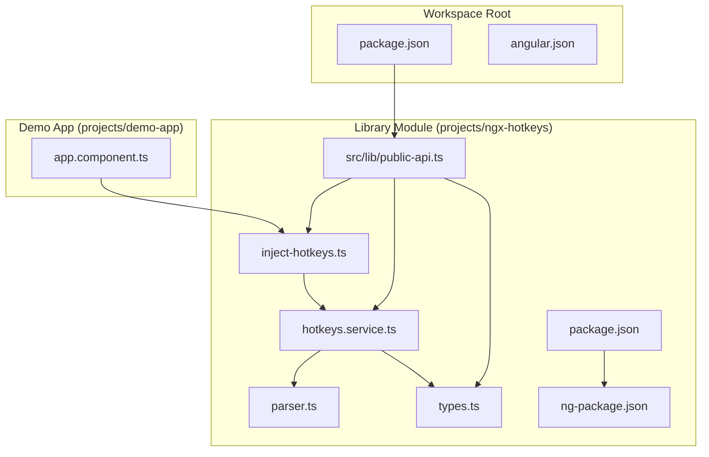
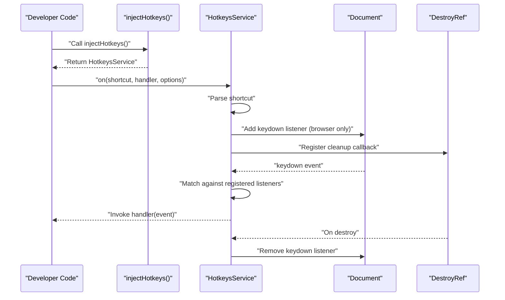
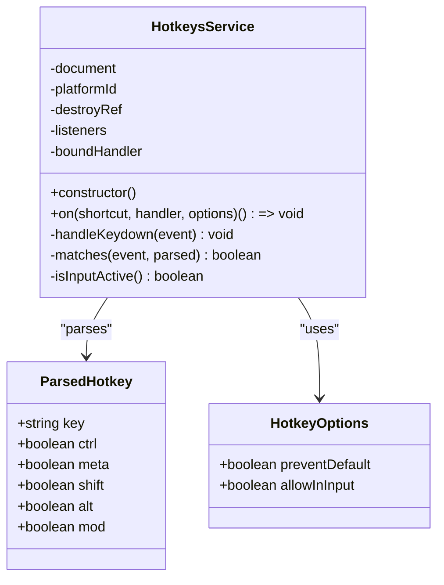
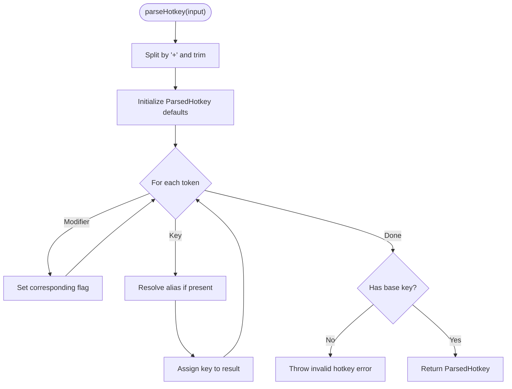
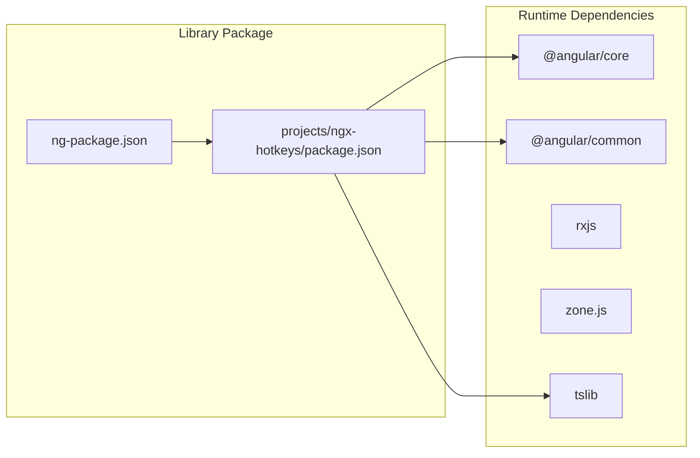

# Project Overview

<cite>
**Referenced Files in This Document**
- [README.md](file://README.md)
- [package.json](file://package.json)
- [projects/ngx-hotkeys/package.json](file://projects/ngx-hotkeys/package.json)
- [projects/ngx-hotkeys/ng-package.json](file://projects/ngx-hotkeys/ng-package.json)
- [projects/ngx-hotkeys/src/lib/public-api.ts](file://projects/ngx-hotkeys/src/lib/public-api.ts)
- [projects/ngx-hotkeys/src/lib/hotkeys.service.ts](file://projects/ngx-hotkeys/src/lib/hotkeys.service.ts)
- [projects/ngx-hotkeys/src/lib/inject-hotkeys.ts](file://projects/ngx-hotkeys/src/lib/inject-hotkeys.ts)
- [projects/ngx-hotkeys/src/lib/parser.ts](file://projects/ngx-hotkeys/src/lib/parser.ts)
- [projects/ngx-hotkeys/src/lib/types.ts](file://projects/ngx-hotkeys/src/lib/types.ts)
- [projects/demo-app/src/app/app.component.ts](file://projects/demo-app/src/app/app.component.ts)
</cite>

## Table of Contents
1. [Introduction](#introduction)
2. [Project Structure](#project-structure)
3. [Core Components](#core-components)
4. [Architecture Overview](#architecture-overview)
5. [Detailed Component Analysis](#detailed-component-analysis)
6. [Dependency Analysis](#dependency-analysis)
7. [Performance Considerations](#performance-considerations)
8. [Troubleshooting Guide](#troubleshooting-guide)
9. [Conclusion](#conclusion)

## Introduction
ngx-hotkeys is a tiny, elegant Angular-native hotkey library designed to bring keyboard shortcut management to Angular applications with zero boilerplate. Its core value proposition centers on one-line keyboard shortcut registration, enabling Angular developers to quickly wire up global hotkeys without manual event listener management or lifecycle concerns.

Key benefits include:
- Memory leak prevention through automatic cleanup when used within Angular components or services
- Cross-platform support for modifier keys (Cmd/Ctrl) and common key aliases
- Zero-dependency approach for minimal bundle impact
- Angular-native integration via a dedicated injectable service and a convenient injection helper

Primary use cases include:
- Application-wide shortcuts (e.g., open search, save, close modal)
- Editor-like workflows (e.g., navigation, actions, and content manipulation)
- Accessibility enhancements and power-user productivity features

The library targets Angular developers building interactive web applications who need reliable, lightweight keyboard shortcut handling with seamless integration into Angular's DI and lifecycle systems.

## Project Structure
The repository follows a classic Angular library layout with a demo application showcasing usage patterns. The library module is organized under projects/ngx-hotkeys, exposing a focused API surface through a public entry point.

**Diagram sources**
- [projects/ngx-hotkeys/src/lib/public-api.ts:1-4](file://projects/ngx-hotkeys/src/lib/public-api.ts#L1-L4)
- [projects/ngx-hotkeys/src/lib/hotkeys.service.ts:1-114](file://projects/ngx-hotkeys/src/lib/hotkeys.service.ts#L1-L114)
- [projects/ngx-hotkeys/src/lib/inject-hotkeys.ts:1-7](file://projects/ngx-hotkeys/src/lib/inject-hotkeys.ts#L1-L7)
- [projects/ngx-hotkeys/src/lib/parser.ts:1-46](file://projects/ngx-hotkeys/src/lib/parser.ts#L1-L46)
- [projects/ngx-hotkeys/src/lib/types.ts:1-16](file://projects/ngx-hotkeys/src/lib/types.ts#L1-L16)
- [projects/ngx-hotkeys/package.json:1-31](file://projects/ngx-hotkeys/package.json#L1-L31)
- [projects/ngx-hotkeys/ng-package.json:1-8](file://projects/ngx-hotkeys/ng-package.json#L1-L8)
- [projects/demo-app/src/app/app.component.ts:1-43](file://projects/demo-app/src/app/app.component.ts#L1-L43)

**Section sources**
- [README.md:1-127](file://README.md#L1-L127)
- [projects/ngx-hotkeys/src/lib/public-api.ts:1-4](file://projects/ngx-hotkeys/src/lib/public-api.ts#L1-L4)
- [projects/ngx-hotkeys/package.json:1-31](file://projects/ngx-hotkeys/package.json#L1-L31)
- [projects/ngx-hotkeys/ng-package.json:1-8](file://projects/ngx-hotkeys/ng-package.json#L1-L8)

## Core Components
The library exposes a minimal, cohesive API surface built around Angular’s native DI and lifecycle hooks:

- HotkeysService: The central orchestrator for registering, matching, and invoking hotkeys. It manages a registry of listeners, binds to the document’s keydown events, and ensures automatic cleanup during component/service destruction.
- injectHotkeys(): A convenience injection helper that returns the HotkeysService instance within an Angular injection context.
- Types and Parser: Strongly typed configuration options and a parser that transforms human-readable shortcut strings into normalized internal representations.

These components work together to deliver a frictionless developer experience while maintaining robust behavior across platforms and input contexts.

**Section sources**
- [projects/ngx-hotkeys/src/lib/hotkeys.service.ts:1-114](file://projects/ngx-hotkeys/src/lib/hotkeys.service.ts#L1-L114)
- [projects/ngx-hotkeys/src/lib/inject-hotkeys.ts:1-7](file://projects/ngx-hotkeys/src/lib/inject-hotkeys.ts#L1-L7)
- [projects/ngx-hotkeys/src/lib/types.ts:1-16](file://projects/ngx-hotkeys/src/lib/types.ts#L1-L16)
- [projects/ngx-hotkeys/src/lib/parser.ts:1-46](file://projects/ngx-hotkeys/src/lib/parser.ts#L1-L46)

## Architecture Overview
The library’s architecture emphasizes simplicity and Angular-native integration. At runtime, a single document-level keydown listener dispatches events to registered handlers. Listeners are stored per shortcut and cleaned up automatically when their owning injection context is destroyed.

**Diagram sources**
- [projects/ngx-hotkeys/src/lib/inject-hotkeys.ts:1-7](file://projects/ngx-hotkeys/src/lib/inject-hotkeys.ts#L1-L7)
- [projects/ngx-hotkeys/src/lib/hotkeys.service.ts:1-114](file://projects/ngx-hotkeys/src/lib/hotkeys.service.ts#L1-L114)

**Section sources**
- [projects/ngx-hotkeys/src/lib/hotkeys.service.ts:1-114](file://projects/ngx-hotkeys/src/lib/hotkeys.service.ts#L1-L114)
- [projects/ngx-hotkeys/src/lib/inject-hotkeys.ts:1-7](file://projects/ngx-hotkeys/src/lib/inject-hotkeys.ts#L1-L7)

## Detailed Component Analysis

### HotkeysService
HotkeysService is the core class responsible for:
- Managing a map of shortcut strings to arrays of listener descriptors
- Parsing shortcuts into normalized structures
- Matching incoming keydown events against registered listeners
- Respecting options such as preventing default behavior and allowing triggers in input fields
- Ensuring automatic cleanup via Angular’s DestroyRef

Key behaviors:
- One-line registration: The on method returns an off function for manual removal and registers automatic cleanup on destroy.
- Cross-platform modifier handling: The matches method accounts for platform differences (meta vs. ctrl) using navigator and platform detection.
- Input focus awareness: The isInputActive method checks whether the active element is an input-like control or contenteditable, respecting allowInInput option.

**Diagram sources**
- [projects/ngx-hotkeys/src/lib/hotkeys.service.ts:1-114](file://projects/ngx-hotkeys/src/lib/hotkeys.service.ts#L1-L114)
- [projects/ngx-hotkeys/src/lib/types.ts:1-16](file://projects/ngx-hotkeys/src/lib/types.ts#L1-L16)

**Section sources**
- [projects/ngx-hotkeys/src/lib/hotkeys.service.ts:1-114](file://projects/ngx-hotkeys/src/lib/hotkeys.service.ts#L1-L114)
- [projects/ngx-hotkeys/src/lib/types.ts:1-16](file://projects/ngx-hotkeys/src/lib/types.ts#L1-L16)

### Parser
The parser converts human-friendly shortcut strings (e.g., mod+k, shift+enter) into normalized ParsedHotkey structures. It supports aliases for common keys and validates that a base key is present.

Behavior highlights:
- Tokenization by splitting on '+' and trimming whitespace
- Recognition of modifier tokens (ctrl, meta, shift, alt, mod)
- Key alias resolution for commonly used keys
- Validation that a base key is specified

**Diagram sources**
- [projects/ngx-hotkeys/src/lib/parser.ts:1-46](file://projects/ngx-hotkeys/src/lib/parser.ts#L1-L46)
- [projects/ngx-hotkeys/src/lib/types.ts:8-15](file://projects/ngx-hotkeys/src/lib/types.ts#L8-L15)

**Section sources**
- [projects/ngx-hotkeys/src/lib/parser.ts:1-46](file://projects/ngx-hotkeys/src/lib/parser.ts#L1-L46)
- [projects/ngx-hotkeys/src/lib/types.ts:1-16](file://projects/ngx-hotkeys/src/lib/types.ts#L1-L16)

### Public API Surface
The library exports a minimal set of symbols through public-api.ts:
- HotkeysService: The primary class for managing hotkeys
- injectHotkeys: Helper to retrieve the service instance
- HotkeyOptions: Configuration interface for registration options

This focused export simplifies consumption and aligns with Angular’s best practices for library distribution.

**Section sources**
- [projects/ngx-hotkeys/src/lib/public-api.ts:1-4](file://projects/ngx-hotkeys/src/lib/public-api.ts#L1-L4)

### Demo App Integration
The demo application demonstrates typical usage patterns:
- Using injectHotkeys to obtain the service instance
- Registering multiple hotkeys with varying options
- Leveraging preventDefault for actions like saving
- Observing immediate feedback in the UI

This showcases the library’s ergonomics and practical applicability in real-world scenarios.

**Section sources**
- [projects/demo-app/src/app/app.component.ts:1-43](file://projects/demo-app/src/app/app.component.ts#L1-L43)

## Dependency Analysis
ngx-hotkeys maintains a zero-dependency stance, relying only on Angular’s core APIs and a small set of peer dependencies. The library’s peer dependencies require Angular core and common packages at version 17 or higher, ensuring compatibility with modern Angular applications.

Build and packaging:
- The library is packaged via ng-packagr with a straightforward entry point pointing to the public API.
- The compiled output is directed to the dist/ngx-hotkeys directory, ready for distribution.

**Diagram sources**
- [projects/ngx-hotkeys/package.json:22-30](file://projects/ngx-hotkeys/package.json#L22-L30)
- [projects/ngx-hotkeys/ng-package.json:1-8](file://projects/ngx-hotkeys/ng-package.json#L1-L8)
- [package.json:11-22](file://package.json#L11-L22)

**Section sources**
- [projects/ngx-hotkeys/package.json:1-31](file://projects/ngx-hotkeys/package.json#L1-L31)
- [projects/ngx-hotkeys/ng-package.json:1-8](file://projects/ngx-hotkeys/ng-package.json#L1-L8)
- [package.json:1-39](file://package.json#L1-L39)

## Performance Considerations
- Single event listener: The service attaches only one document-level keydown listener, minimizing overhead and avoiding listener proliferation.
- Efficient matching: Listeners are stored per shortcut string, enabling targeted iteration during keydown events.
- Platform-aware logic: Modifier key detection adapts to platform differences without additional libraries.
- Minimal footprint: Zero-dependency design keeps bundle size small and reduces potential conflicts.

[No sources needed since this section provides general guidance]

## Troubleshooting Guide
Common issues and resolutions:
- Shortcut not triggering in inputs: If a handler should run while typing, configure allowInInput to true when calling on.
- Preventing default behavior: Use preventDefault in options to suppress browser defaults for specific shortcuts (e.g., saving).
- Manual cleanup: If needed, call the off function returned by on to remove a listener immediately.
- Automatic cleanup: When used inside components or services, listeners are removed automatically on destroy, preventing memory leaks.
- Invalid shortcut syntax: Ensure the shortcut string includes a base key and valid modifiers; otherwise, parsing will fail.

**Section sources**
- [projects/ngx-hotkeys/src/lib/hotkeys.service.ts:36-60](file://projects/ngx-hotkeys/src/lib/hotkeys.service.ts#L36-L60)
- [projects/ngx-hotkeys/src/lib/types.ts:1-4](file://projects/ngx-hotkeys/src/lib/types.ts#L1-L4)
- [projects/ngx-hotkeys/src/lib/parser.ts:40-42](file://projects/ngx-hotkeys/src/lib/parser.ts#L40-L42)

## Conclusion
ngx-hotkeys delivers a streamlined, Angular-native solution for keyboard shortcuts with a focus on simplicity and reliability. By combining a minimal API surface, automatic lifecycle management, and cross-platform support, it enables Angular developers to add powerful keyboard-driven interactions with minimal effort. Its zero-dependency approach and efficient architecture make it an excellent choice for enhancing user productivity and accessibility in modern Angular applications.