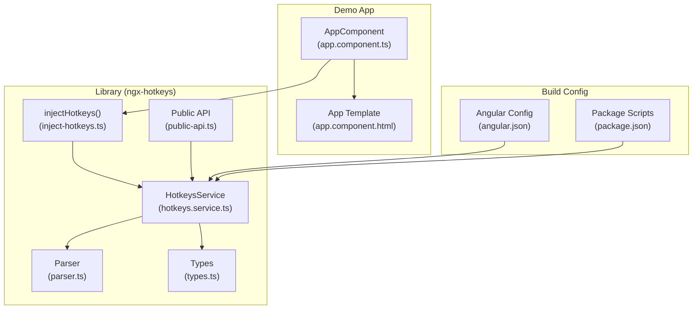
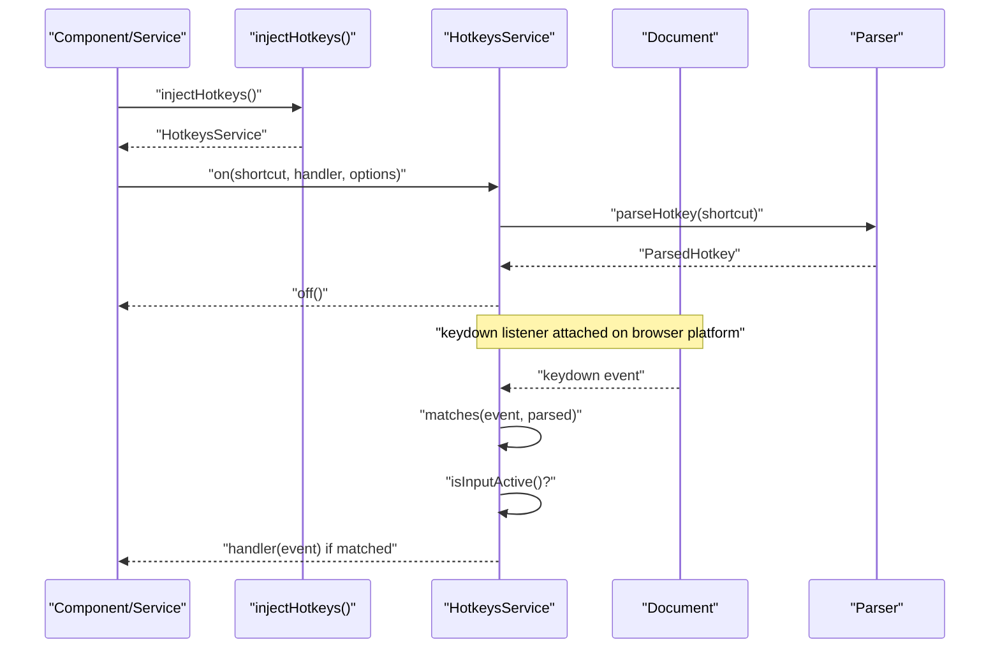
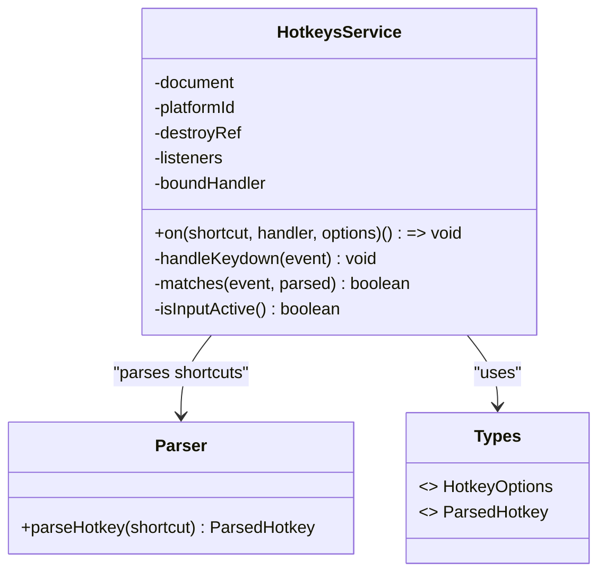
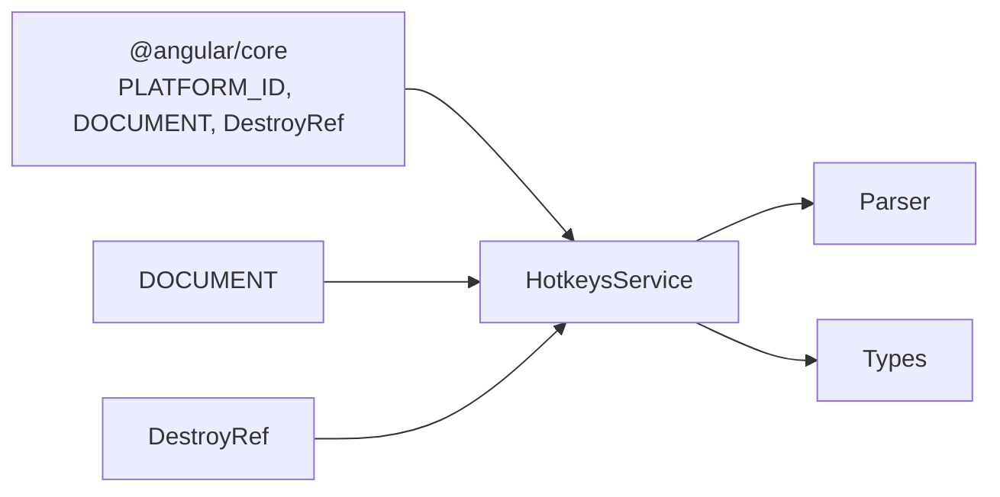

# Troubleshooting & FAQ

<cite>
**Referenced Files in This Document**
- [hotkeys.service.ts](file://projects/ngx-hotkeys/src/lib/hotkeys.service.ts)
- [inject-hotkeys.ts](file://projects/ngx-hotkeys/src/lib/inject-hotkeys.ts)
- [parser.ts](file://projects/ngx-hotkeys/src/lib/parser.ts)
- [types.ts](file://projects/ngx-hotkeys/src/lib/types.ts)
- [public-api.ts](file://projects/ngx-hotkeys/src/lib/public-api.ts)
- [app.component.ts](file://projects/demo-app/src/app/app.component.ts)
- [app.component.html](file://projects/demo-app/src/app/app.component.html)
- [README.md](file://README.md)
- [EXAMPLE.md](file://EXAMPLE.md)
- [angular.json](file://angular.json)
- [package.json](file://package.json)
</cite>

## Table of Contents
1. [Introduction](#introduction)
2. [Project Structure](#project-structure)
3. [Core Components](#core-components)
4. [Architecture Overview](#architecture-overview)
5. [Detailed Component Analysis](#detailed-component-analysis)
6. [Dependency Analysis](#dependency-analysis)
7. [Performance Considerations](#performance-considerations)
8. [Troubleshooting Guide](#troubleshooting-guide)
9. [Conclusion](#conclusion)
10. [Appendices](#appendices)

## Introduction
This document provides a comprehensive troubleshooting and FAQ guide for ngx-hotkeys. It focuses on diagnosing and resolving common issues such as hotkeys not firing, conflicts with browser shortcuts, problems in input fields, and cross-platform inconsistencies. It also covers debugging techniques, performance troubleshooting (including memory leak detection and cleanup verification), integration challenges with Angular routing/lazy loading/component lifecycle, browser-specific compatibility, and practical diagnostic steps to verify proper functionality.

## Project Structure
The repository is organized as an Angular workspace containing:
- A library package (ngx-hotkeys) with the core hotkey service and utilities
- A demo application showcasing usage patterns
- Build and configuration files for Angular CLI and packaging

**Diagram sources**
- [hotkeys.service.ts:1-114](file://projects/ngx-hotkeys/src/lib/hotkeys.service.ts#L1-L114)
- [inject-hotkeys.ts:1-7](file://projects/ngx-hotkeys/src/lib/inject-hotkeys.ts#L1-L7)
- [parser.ts:1-46](file://projects/ngx-hotkeys/src/lib/parser.ts#L1-L46)
- [types.ts:1-16](file://projects/ngx-hotkeys/src/lib/types.ts#L1-L16)
- [public-api.ts:1-4](file://projects/ngx-hotkeys/src/lib/public-api.ts#L1-L4)
- [app.component.ts:1-43](file://projects/demo-app/src/app/app.component.ts#L1-L43)
- [app.component.html:1-36](file://projects/demo-app/src/app/app.component.html#L1-L36)
- [angular.json:1-135](file://angular.json#L1-L135)
- [package.json:1-39](file://package.json#L1-L39)

**Section sources**
- [angular.json:1-135](file://angular.json#L1-L135)
- [package.json:1-39](file://package.json#L1-L39)

## Core Components
- HotkeysService: Central service that registers hotkeys, listens to keydown events, and dispatches handlers. It manages listener registration/unregistration and integrates with Angular’s lifecycle via DestroyRef.
- Parser: Parses human-friendly shortcut strings (e.g., mod+k, shift+enter) into normalized structures with modifier flags.
- Types: Defines HotkeyOptions and ParsedHotkey interfaces used by the service and parser.
- Public API: Exports HotkeysService, injectHotkeys, and HotkeyOptions for external consumption.
- Demo App: Demonstrates typical usage patterns, including registering hotkeys in a component and toggling UI state.

Key behaviors impacting troubleshooting:
- Event listener attached to document keydown during browser platform initialization.
- Automatic cleanup on component/service destroy via DestroyRef.
- Cross-platform modifier mapping via navigator.platform sniffing.
- Input focus detection to conditionally ignore hotkeys in form controls.

**Section sources**
- [hotkeys.service.ts:1-114](file://projects/ngx-hotkeys/src/lib/hotkeys.service.ts#L1-L114)
- [parser.ts:1-46](file://projects/ngx-hotkeys/src/lib/parser.ts#L1-L46)
- [types.ts:1-16](file://projects/ngx-hotkeys/src/lib/types.ts#L1-L16)
- [public-api.ts:1-4](file://projects/ngx-hotkeys/src/lib/public-api.ts#L1-L4)
- [app.component.ts:1-43](file://projects/demo-app/src/app/app.component.ts#L1-L43)

## Architecture Overview
The hotkey system operates as follows:
- Components/services inject HotkeysService via injectHotkeys().
- They register hotkeys via on(shortcut, handler, options).
- The service stores listeners keyed by the original shortcut string.
- On keydown, the service iterates registered listeners and checks whether the event matches the parsed modifiers and key.
- If matched and conditions permit (e.g., allowInInput), it invokes the handler and optionally prevents default behavior.

**Diagram sources**
- [hotkeys.service.ts:36-76](file://projects/ngx-hotkeys/src/lib/hotkeys.service.ts#L36-L76)
- [parser.ts:12-45](file://projects/ngx-hotkeys/src/lib/parser.ts#L12-L45)
- [inject-hotkeys.ts:4-6](file://projects/ngx-hotkeys/src/lib/inject-hotkeys.ts#L4-L6)

## Detailed Component Analysis

### HotkeysService
Responsibilities:
- Registers hotkeys and returns an off() function to unregister.
- Attaches a single document-level keydown listener and removes it on destroy.
- Matches keyboard events against parsed hotkeys, considering platform-specific modifiers.
- Respects allowInInput and preventDefault options.

Common pitfalls and diagnostics:
- If off() is not called and component is destroyed, automatic cleanup via DestroyRef should remove the listener. Verify that the component/service is injected in a context that participates in Angular’s lifecycle.
- If hotkeys fire in inputs unexpectedly, ensure allowInInput is not set to true unintentionally.
- If preventDefault does not take effect, confirm the option is passed when calling on().

**Diagram sources**
- [hotkeys.service.ts:1-114](file://projects/ngx-hotkeys/src/lib/hotkeys.service.ts#L1-L114)
- [parser.ts:1-46](file://projects/ngx-hotkeys/src/lib/parser.ts#L1-L46)
- [types.ts:1-16](file://projects/ngx-hotkeys/src/lib/types.ts#L1-L16)

**Section sources**
- [hotkeys.service.ts:18-114](file://projects/ngx-hotkeys/src/lib/hotkeys.service.ts#L18-L114)

### Parser
Responsibilities:
- Normalizes shortcut strings into a structured representation with modifier flags and a normalized key.
- Supports aliases for common keys and the special mod token.

Common issues:
- Invalid hotkey strings (no key present) will throw an error. Ensure the shortcut contains a valid key.
- Using uppercase vs lowercase keys generally works due to normalization, but ensure the intended key is correct.

**Section sources**
- [parser.ts:12-46](file://projects/ngx-hotkeys/src/lib/parser.ts#L12-L46)

### Types
Defines the contract for options and parsed hotkey structures. Misusing these types can lead to runtime errors or unexpected behavior.

**Section sources**
- [types.ts:1-16](file://projects/ngx-hotkeys/src/lib/types.ts#L1-L16)

### Public API
Exports the primary entry points consumed by applications.

**Section sources**
- [public-api.ts:1-4](file://projects/ngx-hotkeys/src/lib/public-api.ts#L1-L4)

### Demo App
Demonstrates:
- Registering multiple hotkeys in a component.
- Using preventDefault to intercept browser actions.
- Conditional behavior based on UI state.

Use the demo app to reproduce issues and verify fixes.

**Section sources**
- [app.component.ts:18-41](file://projects/demo-app/src/app/app.component.ts#L18-L41)
- [app.component.html:10-24](file://projects/demo-app/src/app/app.component.html#L10-L24)

## Dependency Analysis
- Angular core: PLATFORM_ID, DOCUMENT, DestroyRef are used for platform detection, DOM access, and lifecycle cleanup.
- The service depends on the parser for shortcut parsing and on types for contracts.
- The demo app consumes the public API to register hotkeys.

Potential circular dependencies: None apparent given the straightforward dependency chain.

External integrations:
- Browser keydown events and navigator.platform for cross-platform modifier mapping.
- Angular DI and lifecycle hooks for automatic cleanup.

**Diagram sources**
- [hotkeys.service.ts:1-34](file://projects/ngx-hotkeys/src/lib/hotkeys.service.ts#L1-L34)
- [parser.ts:1-46](file://projects/ngx-hotkeys/src/lib/parser.ts#L1-L46)
- [types.ts:1-16](file://projects/ngx-hotkeys/src/lib/types.ts#L1-L16)

**Section sources**
- [hotkeys.service.ts:1-34](file://projects/ngx-hotkeys/src/lib/hotkeys.service.ts#L1-L34)

## Performance Considerations
- Single event listener: The service attaches only one keydown listener to the document, minimizing overhead.
- Cleanup: DestroyRef ensures listeners are removed on component/service destruction, preventing memory leaks.
- Matching cost: Matching is O(N) over registered listeners per keydown; keep the number of hotkeys reasonable for large apps.
- Prevent default: Using preventDefault can reduce unnecessary browser actions, improving perceived responsiveness.

Best practices:
- Prefer registering hotkeys in components/services that align with lifecycle boundaries to leverage automatic cleanup.
- Avoid registering excessive hotkeys; group them by feature areas.
- Use allowInInput sparingly to avoid unintended behavior in forms.

[No sources needed since this section provides general guidance]

## Troubleshooting Guide

### 1) Hotkeys Not Firing
Symptoms:
- Registered hotkeys do nothing when pressed.

Diagnostic steps:
- Confirm the component/service is constructed and on() is called before the keydown event occurs.
- Verify the shortcut string is valid and contains a key (parser throws on invalid input).
- Check that the component/service is in a DI context that participates in Angular’s lifecycle so DestroyRef cleanup runs.
- Ensure the page has focus and the keydown event reaches the document.

Verification:
- Use the demo app to reproduce the issue and toggle UI state to confirm handler invocation.
- Temporarily enable preventDefault to see if the event is intercepted.

Common causes:
- Shortcut string missing a key or malformed.
- Component destroyed before the handler fires.
- Page not focused or event captured elsewhere.

**Section sources**
- [parser.ts:40-42](file://projects/ngx-hotkeys/src/lib/parser.ts#L40-L42)
- [hotkeys.service.ts:30-34](file://projects/ngx-hotkeys/src/lib/hotkeys.service.ts#L30-L34)
- [app.component.ts:18-41](file://projects/demo-app/src/app/app.component.ts#L18-L41)

### 2) Conflicts with Browser Shortcuts
Symptoms:
- Pressing mod+s triggers the browser save dialog instead of your handler.

Solution:
- Pass preventDefault: true when registering the hotkey to intercept the browser action.

Testing:
- Use the demo app to press mod+s and observe the message indicating preventDefault took effect.

**Section sources**
- [hotkeys.service.ts:69-72](file://projects/ngx-hotkeys/src/lib/hotkeys.service.ts#L69-L72)
- [app.component.ts:38-40](file://projects/demo-app/src/app/app.component.ts#L38-L40)

### 3) Problems in Input Fields
Symptoms:
- Hotkeys fire while typing in inputs, textareas, selects, or contenteditable elements.

Causes:
- Default behavior ignores allowInInput; hotkeys are skipped when an input-like element is active.

Solutions:
- If you need hotkeys to work in inputs, pass allowInInput: true when registering.
- Alternatively, move the hotkey to a non-input context (e.g., global overlay).

Verification:
- Focus the input in the demo app and press j; it should not increment the counter by default.

**Section sources**
- [hotkeys.service.ts:66-68](file://projects/ngx-hotkeys/src/lib/hotkeys.service.ts#L66-L68)
- [hotkeys.service.ts:100-112](file://projects/ngx-hotkeys/src/lib/hotkeys.service.ts#L100-L112)
- [app.component.html:20-24](file://projects/demo-app/src/app/app.component.html#L20-L24)

### 4) Cross-Platform Inconsistencies (macOS vs Windows/Linux)
Symptoms:
- mod behaves differently on macOS vs other platforms.

Explanation:
- The service maps mod to meta on macOS and ctrl on Windows/Linux using navigator.platform sniffing.

Verification:
- Test on macOS and Windows/Linux with mod+k to ensure consistent behavior.

**Section sources**
- [hotkeys.service.ts:83-95](file://projects/ngx-hotkeys/src/lib/hotkeys.service.ts#L83-L95)

### 5) Debugging Techniques
Techniques:
- Inspect the internal listeners map to verify registration.
- Add logging in the handler to confirm invocation.
- Temporarily simplify the shortcut to a single key (e.g., j) to isolate issues.
- Use the demo app to validate behavior in isolation.

Tools:
- Use browser devtools to monitor keydown events and confirm they reach the document.
- Check that the component is alive and not destroyed prematurely.

**Section sources**
- [hotkeys.service.ts:36-60](file://projects/ngx-hotkeys/src/lib/hotkeys.service.ts#L36-L60)
- [app.component.ts:18-41](file://projects/demo-app/src/app/app.component.ts#L18-L41)

### 6) Performance Troubleshooting (Memory Leaks and Cleanup)
Symptoms:
- Memory increases over time or handlers continue firing after navigation.

Checks:
- Ensure you rely on Angular’s lifecycle cleanup (DestroyRef). Avoid manual DOM manipulation that bypasses Angular.
- If you manually attach/detach listeners elsewhere, pair each attachment with removal.

Verification:
- After navigating away from a route/component, confirm the off() function returned by on() is called or that the component’s onDestroy runs.

**Section sources**
- [hotkeys.service.ts:30-34](file://projects/ngx-hotkeys/src/lib/hotkeys.service.ts#L30-L34)
- [hotkeys.service.ts:45-58](file://projects/ngx-hotkeys/src/lib/hotkeys.service.ts#L45-L58)

### 7) Integration with Angular Routing, Lazy Loading, and Lifecycle
Symptoms:
- Hotkeys stop working after lazy-loaded routes or component destruction.

Solutions:
- Register hotkeys in components/services that live for the duration of the feature area.
- For route-level hotkeys, register in a route’s component or a shared service injected at the route level.
- Avoid registering hotkeys in constructors of short-lived services; prefer ngOnInit or equivalent lifecycle hooks.

Verification:
- Use the demo app’s component to register hotkeys and confirm they remain active across navigation.

**Section sources**
- [README.md:52-54](file://README.md#L52-L54)
- [app.component.ts:18-41](file://projects/demo-app/src/app/app.component.ts#L18-L41)

### 8) Browser-Specific Issues and Compatibility
Issues:
- Different modifier keys on macOS vs Windows/Linux.
- Some browsers may suppress certain key combinations in inputs.

Compatibility:
- Use mod to abstract platform differences.
- For global shortcuts that must work in inputs, explicitly set allowInInput: true.

**Section sources**
- [hotkeys.service.ts:83-95](file://projects/ngx-hotkeys/src/lib/hotkeys.service.ts#L83-L95)
- [EXAMPLE.md:72-77](file://EXAMPLE.md#L72-L77)

### 9) Verifying Proper Functionality and Testing Fixes
Steps:
- Reproduce in the demo app by pressing documented shortcuts (mod+k, esc, j, shift+enter, mod+s).
- Toggle UI state to confirm handlers execute.
- For preventDefault, verify browser actions are suppressed.
- For input behavior, test with allowInInput true/false.

Testing approaches:
- Unit-style checks: Confirm on() returns an off() function and that calling off() removes the listener.
- Integration tests: Navigate across routes and verify hotkeys remain active or are cleaned up as expected.

**Section sources**
- [app.component.html:10-18](file://projects/demo-app/src/app/app.component.html#L10-L18)
- [app.component.ts:18-41](file://projects/demo-app/src/app/app.component.ts#L18-L41)
- [EXAMPLE.md:1-77](file://EXAMPLE.md#L1-L77)

### 10) Best Practices and Optimization Tips
- Use injectHotkeys() inside a DI context (constructor, component field, or runInInjectionContext).
- Keep the number of hotkeys manageable; group by feature.
- Prefer preventDefault only when necessary to avoid interfering with browser defaults.
- Use allowInInput selectively and document why a hotkey must work in inputs.
- Register hotkeys near where they are used (route/component) to simplify cleanup.

**Section sources**
- [inject-hotkeys.ts:4-6](file://projects/ngx-hotkeys/src/lib/inject-hotkeys.ts#L4-L6)
- [README.md:52-54](file://README.md#L52-L54)

## Conclusion
By understanding how ngx-hotkeys registers and dispatches hotkeys, you can quickly diagnose and resolve most issues. Focus on lifecycle cleanup, input handling, preventDefault usage, and cross-platform modifier mapping. Use the demo app to reproduce and verify fixes, and apply the best practices to prevent regressions in complex applications.

[No sources needed since this section summarizes without analyzing specific files]

## Appendices

### A) Quick Diagnostic Checklist
- Is the component/service constructed and on() called?
- Is the shortcut valid and contains a key?
- Are preventDefault and allowInInput set appropriately?
- Does the component live long enough for cleanup?
- Are hotkeys tested in the demo app?

**Section sources**
- [parser.ts:40-42](file://projects/ngx-hotkeys/src/lib/parser.ts#L40-L42)
- [hotkeys.service.ts:30-34](file://projects/ngx-hotkeys/src/lib/hotkeys.service.ts#L30-L34)
- [app.component.ts:18-41](file://projects/demo-app/src/app/app.component.ts#L18-L41)